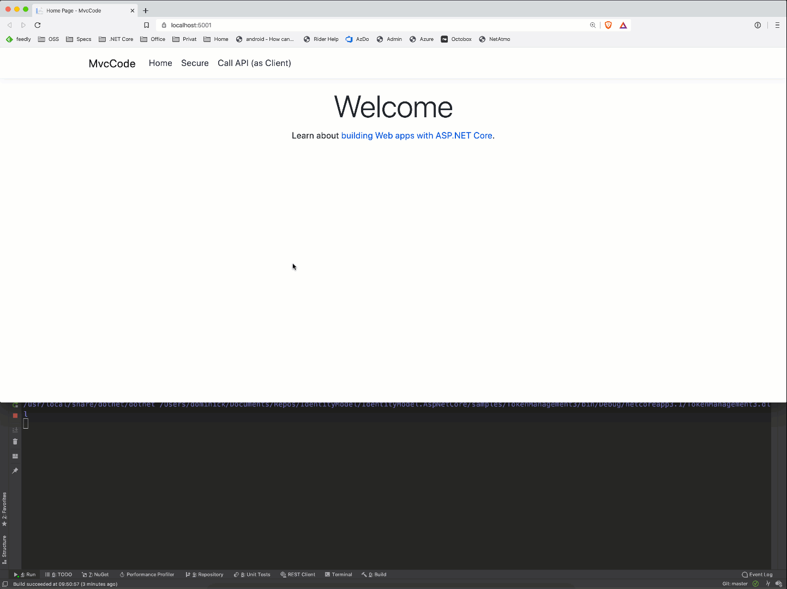

Web Applications
================

In web applications you might either want to call APIs using the client
identity or the user identity. The client identity scenario is exactly
the same as the previous section that covered service workers.

For user centric scenarios, this library operates under a couple of
assumptions by default:

-   you are using the OpenID Connect to authenticate the user
-   the OpenID Connect provider is also your token service for access
```
tokens
```
-   you are requesting access and refresh tokens and are using a flow
```
that allows to refresh tokens (e.g. code flow)
```
-   you use the *SaveTokens* option to store the access and refresh
```
token in the authentication session
```

If all these pre-conditions are met, the token management plumbing will
infer server endpoints, client ID and secret and other configuration
settings from the OpenID Connect handler, and all you need to add is:

```
services.AddAccessTokenManagement();
```

To interact with the underlying services, this library adds two
extension methods for *HttpContext*:

-   *GetUserAccessTokenAsync* - retrieves current access token for user
```
and refreshes it if it is expired (or expiring soon - can be
configured)
```
-   *RevokeUserRefreshTokenAsync* - revokes the refresh token when it is
```
not needed anymore
```

Same as with the client access token, you can also wire up an HTTP
client that automatically uses the token management library:

```
services.AddUserAccessTokenClient("user_client", client =>
{
    client.BaseAddress = new Uri("https://demo.duendesoftware.com/api/");
});
```

This registers an Http client with the factory, that you can use in your
business code to make API calls. A more complete configuration could
look like this:

```
services.AddAuthentication(options =>
{
    options.DefaultScheme = "cookie";
    options.DefaultChallengeScheme = "oidc";
})
    .AddCookie("cookie", options =>
    {
        options.Cookie.Name = "mvccode";

        options.Events.OnSigningOut = async e =>
        {
            // revoke refresh token on sign-out
            await e.HttpContext.RevokeUserRefreshTokenAsync();
        };
    })
    .AddOpenIdConnect("oidc", options =>
    {
        options.Authority = "https://demo.duendesoftware.com";

        options.ClientId = "interactive.confidential.short";
        options.ClientSecret = "secret";

        // code flow + PKCE (PKCE is turned on by default)
        options.ResponseType = "code";

        options.Scope.Clear();
        options.Scope.Add("openid");
        options.Scope.Add("profile");
        options.Scope.Add("email");
        options.Scope.Add("offline_access");
        options.Scope.Add("api");

        // keeps id_token smaller
        options.GetClaimsFromUserInfoEndpoint = true;
        options.SaveTokens = true;

        options.TokenValidationParameters = new TokenValidationParameters
        {
            NameClaimType = "name",
            RoleClaimType = "role"
        };
    });

// adds user and client access token management
services.AddAccessTokenManagement(options =>
{
    // client config is inferred from OpenID Connect settings
    // if you want to specify scopes explicitly, do it here, otherwise the scope parameter will not be sent
    options.Client.Scope = "api";
})
    .ConfigureBackchannelHttpClient()
        .AddTransientHttpErrorPolicy(policy => policy.WaitAndRetryAsync(new[]
        {
            TimeSpan.FromSeconds(1),
            TimeSpan.FromSeconds(2),
            TimeSpan.FromSeconds(3)
        }));

// registers HTTP client that uses the managed user access token
services.AddUserAccessTokenClient("user_client", client =>
{
    client.BaseAddress = new Uri("https://demo.duendesoftware.com/api/");
});

// registers HTTP client that uses the managed client access token
services.AddClientAccessTokenClient("client", configureClient: client =>
{
    client.BaseAddress = new Uri("https://demo.duendesoftware.com/api/");
});
```



Full sample can be found in the
[samples](https://github.com/DuendeArchive/IdentityModel.AspNetCore).

