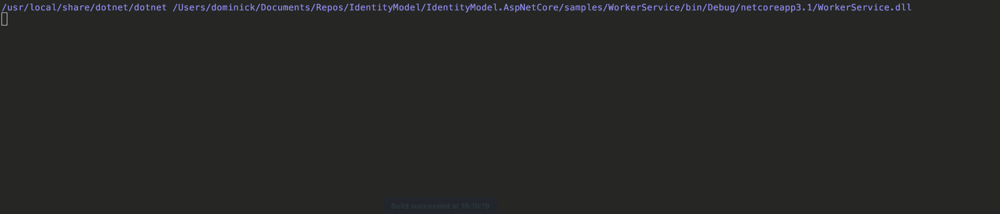

Worker Applications
===================

Workers use the client credentials grant type to request tokens from an
OAuth 2.0 compatible token service.

You register the token service, client ID and secret in
*ConfigureServices*, e.g.:

```
var host = Host.CreateDefaultBuilder(args)
    .ConfigureServices((hostContext, services) =>
    {
        services.AddAccessTokenManagement(options =>
        {
            options.Client.Clients.Add("identityserver", new ClientCredentialsTokenRequest
            {
                Address = "https://demo.identityserver.io/connect/token",
                ClientId = "m2m.short",
                ClientSecret = "secret",
                Scope = "api" // optional
            });
        });
    });
```

You can register multiple clients for one or more token services if you
like. Just make sure you give every client a unique name.

You can also customize the HTTP client that is used for requesting the
tokens by calling the *ConfigureBackchannelHttpClient* extension method,
e.g.:

```
services.AddAccessTokenManagement()
    .ConfigureBackchannelHttpClient()
        .AddTransientHttpErrorPolicy(policy => policy.WaitAndRetryAsync(new[]
        {
            TimeSpan.FromSeconds(1),
            TimeSpan.FromSeconds(2),
            TimeSpan.FromSeconds(3)
        }));
```

The above code wires up the *AccessTokenManagementService* and the
*ClientAccessTokenCache* in the DI system. The service is the main entry
point, and features a method called *GetClientAccessTokenAsync* (which
you can also access via the HTTP context using
*HttpContext.GetClientAccessTokenAsync*). This method checks if a token
for the client is cached, and if not requests one and caches it. The
cache implementation can be replaced.

One piece of plumbing that automatically uses the token management
service is the *ClientAccessTokenHandler*, which is a delegating handler
to plug-in to *HttpClient*.

The easiest way to register an HTTP client that uses the token
management is by calling *AddClientAccessTokenHttpClient*:

```
services.AddClientAccessTokenHttpClient("client", configureClient: client =>
{
    client.BaseAddress = new Uri("https://demo.identityserver.io/api/");
});
```

You can pass in the name of your HTTP client, the name of the token
service configuration (you can omit this if you only have one token
client) and additional customization. This returns the typical builder
for the HTTP client factory to add aditional handlers.

It is also possible to add the handler to any HTTP client registration
using the *AddClientAccessTokenHandler* extension method (which
optionally also takes a token client name), e.g. a typed client:

```
services.AddHttpClient<MyClient>(client =>
{
    client.BaseAddress = new Uri("https://demo.identityserver.io/api/");
})
    .AddClientAccessTokenHandler();
```

Usage
-----

You can use use one of the various ways to obtain an HTTP client with
the handler set up, e.g. using the HTTP client factory:

```
public Worker(IHttpClientFactory factory)
{
    _client = factory.CreateClient("client");
}
```

..and then use that client to make API calls - all token management will
be done under the covers:

```
protected override async Task ExecuteAsync(CancellationToken stoppingToken)
{
    while (!stoppingToken.IsCancellationRequested)
    {
        Console.WriteLine("\n\n");
        _logger.LogInformation("Worker running at: {time}", DateTimeOffset.Now);

        var response = await _client.GetStringAsync("test");
        _logger.LogInformation("API response: {response}", response);

        await Task.Delay(5000, stoppingToken);
    }
}
```



Full sample can be found in the
[samples](https://github.com/IdentityModel/IdentityModel.AspNetCore).

