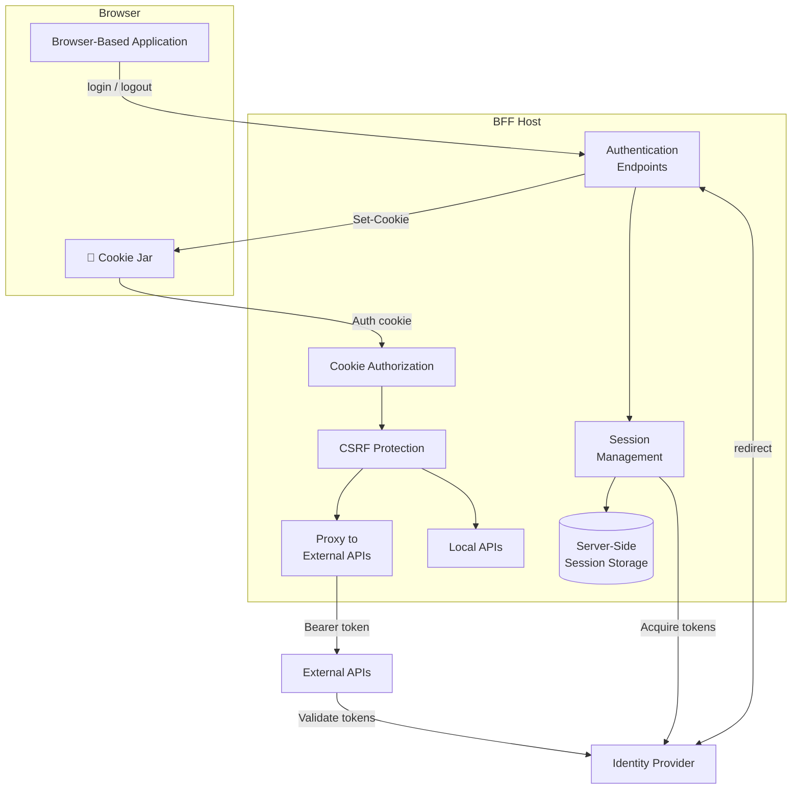
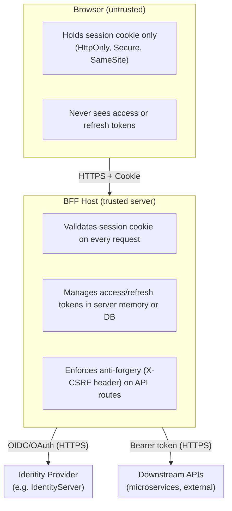

import { CardGrid, LinkCard } from "@astrojs/starlight/components";

A BFF host is an ASP.NET Core application that acts as a security proxy between the browser and your backend APIs. Understanding the key architectural decisions up front will save you significant rework later.

:::tip[New to BFF?]
If you haven't yet decided whether to use BFF, start with the [overview](/bff/) which covers the threat model and the BFF-vs-token-in-browser comparison.
:::

## How the BFF Fits Into Your System

The following diagram shows how the BFF protects browser-based applications:

The BFF sits between the browser and everything else. The browser only ever holds a **session cookie** — it never sees tokens. The BFF exchanges that cookie for bearer tokens when forwarding requests to downstream APIs.

## Architectural Decisions

### Decision 1: Where Does Your UI Live?

The simplest setup hosts both the UI assets and the BFF from the **same origin**. This makes cookies same-site, eliminates CORS, and avoids [third-party cookie blocking](/bff/architecture/third-party-cookies.md).

You can also run the frontend on a **separate origin** (e.g. a Vite dev server, a CDN) and point it at the BFF via CORS. This is more complex but enables independent deployment.

<LinkCard
  href="/bff/architecture/ui-hosting/"
  title="UI Hosting"
  description="Full comparison of same-origin vs. separate-origin hosting"
/>

### Decision 2: Cookie-Only vs. Server-Side Sessions

By default, the BFF stores the entire session in the cookie. This is simple and stateless but has limits: cookie size, no server-side revocation.

With **server-side sessions**, the cookie holds only a session ID. The server stores the session state (typically in a database or distributed cache). This enables:
- Forced logout across all sessions
- Back-channel logout from the identity provider
- Querying active sessions

<LinkCard
  href="/bff/fundamentals/session/server-side-sessions/"
  title="Server-Side Sessions"
  description="Configure server-side session storage for scalability and revocation"
/>

### Decision 3: How Do You Expose APIs?

| API Pattern | When to Use |
|---|---|
| **Local API** | Business logic hosted inside the BFF process itself. Lowest latency, no token forwarding needed. |
| **Remote API (direct)** | External microservice. BFF forwards the request with a bearer token attached. |
| **Remote API (YARP)** | External microservice with complex routing rules. BFF uses YARP as the reverse proxy. |

<LinkCard
  href="/bff/fundamentals/apis/"
  title="API Types"
  description="Decision flowchart for choosing the right API pattern"
/>

### Decision 4: Single Frontend vs. Multi-Frontend

Each BFF instance is tied to **one** browser-based application and **one** OIDC client registration. If you have multiple frontends (e.g. a customer portal and an admin app), run separate BFF instances with separate client IDs. They can share infrastructure (same process, different routes) but should not share session state or token storage.

<LinkCard
  href="/bff/fundamentals/options/#common-configurations"
  title="Common Configurations"
  description="Multi-frontend configuration example"
/>

### Decision 5: Blazor or JavaScript?

Both are supported, but have different integration patterns:

- **JavaScript SPAs** interact with the BFF via `/bff/user`, `/bff/login`, `/bff/logout`, and API endpoints
- **Blazor** uses built-in `AuthenticationStateProvider` integration and can call APIs server-side (no token forwarding from browser)

<LinkCard
  href="/bff/fundamentals/blazor/"
  title="Blazor Fundamentals"
  description="Blazor-specific guidance for rendering modes, data access, and auth state"
/>

## Trust Boundaries

The critical security property: **tokens never cross the trust boundary into the browser**. All token operations happen server-to-server.

## Internals

Duende.BFF is built on top of:

| Component | Role | Details |
|---|---|---|
| ASP.NET OIDC handler | Protocol processing (auth code + PKCE, token exchange) | Standard ASP.NET middleware |
| ASP.NET Cookie handler | Session management and cookie issuance | Extended by BFF for server-side sessions |
| Duende.AccessTokenManagement | Token storage, refresh, revocation | [Docs](/accesstokenmanagement/index.mdx) |
| YARP | Reverse proxy for remote APIs | [BFF YARP integration](/bff/fundamentals/apis/yarp.md) |

## See Also

<CardGrid>
  <LinkCard
    href="/identityserver/fundamentals/clients/"
    title="IdentityServer Client Configuration"
    description="Register your BFF as a confidential OIDC client"
  />
  <LinkCard
    href="/bff/architecture/third-party-cookies/"
    title="Third-Party Cookies"
    description="How browser cookie restrictions affect BFF architecture"
  />
  <LinkCard
    href="/bff/architecture/ui-hosting/"
    title="UI Hosting"
    description="Options for hosting the frontend alongside the BFF"
  />
  <LinkCard
    href="/bff/fundamentals/middleware-pipeline/"
    title="Middleware Pipeline"
    description="Canonical middleware order reference"
  />
</CardGrid>

