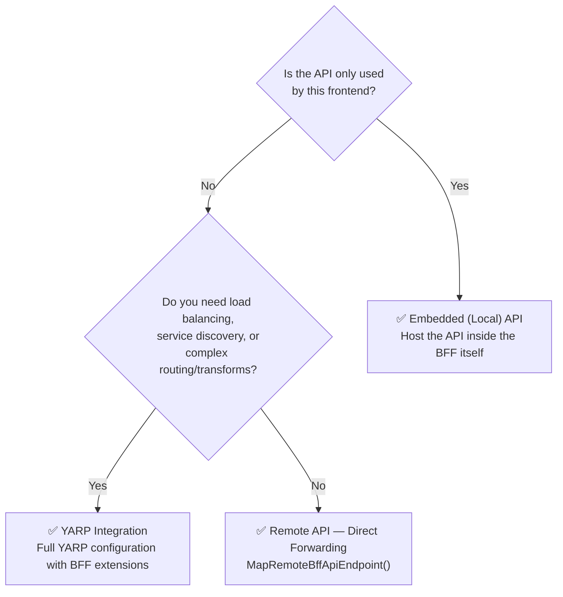

A frontend application using the BFF pattern can call two types of APIs: embedded (local) APIs, and proxied remote APIs.

## Choosing an API Approach

Use the table below for additional guidance on token requirements:

| Scenario | Recommended approach |
|---|---|
| API is only used by this frontend | [Embedded (Local) API](local.mdx) |
| API is shared by multiple clients or deployed separately | [Remote API — Direct Forwarding](remote.mdx) |
| Complex routing, load balancing, or transforms are needed | [YARP](yarp.md) |
| API requires the logged-in user's token | Remote or YARP with `RequiredTokenType.User` |
| API uses machine-to-machine (client credentials) auth | Remote or YARP with `RequiredTokenType.Client` |
| API is publicly accessible (no auth required) | Remote with `RequiredTokenType.None` |
| API should use user token if logged in, anonymous otherwise | Remote or YARP with `RequiredTokenType.UserOrNone` |

:::tip[Start with local APIs when in doubt]
If the API only serves this one frontend and doesn't need to be independently deployed or versioned, embed it directly in the BFF host as a local API. It's the simplest approach and benefits from full CSRF protection with minimal configuration.
:::

## Embedded (Local) APIs

These APIs are embedded inside the BFF and typically exist to support the BFF's frontend; they are not shared with other frontends or services. 

See [Embedded APIs](local.mdx) for more information. 

## Proxying Remote APIs

These APIs are deployed on a different host than the BFF, which allows them to be shared between multiple frontends or (more generally speaking) multiple clients. These APIs can only be called via the BFF host acting as a proxy.

You can use [Direct Forwarding](remote.mdx) for most scenarios. If you have more complex requirements, you can also directly interact with [YARP](yarp.md).

## See Also

- [Token Management](/bff/fundamentals/tokens/) — How BFF attaches access tokens to outgoing API calls
- [Access Token Management](/accesstokenmanagement/) — The underlying token lifecycle library
- [IdentityServer API Resources](/identityserver/fundamentals/resources/api-resources/) — Configuring scopes for your APIs

