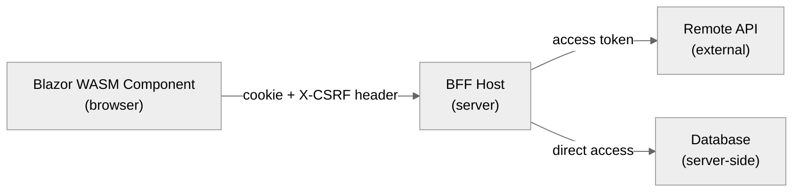
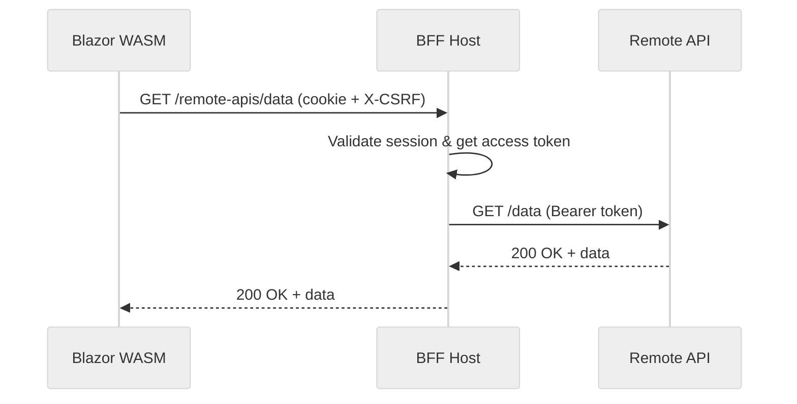

import { CardGrid, LinkCard } from "@astrojs/starlight/components";

Depending on your Blazor rendering mode, you need different strategies for accessing data from components. The BFF security framework provides a consistent model: tokens never leave the server, and browser components access data through BFF-hosted endpoints secured with the authentication cookie.

## Overview



For server-side rendering, components access data directly (database, services). For WASM rendering, components make HTTP calls to BFF-hosted endpoints which handle token attachment.

## Embedded (Local) APIs

An Embedded API is hosted within the BFF itself. It lives within the server's security boundary, so no token needs to be passed to the browser.

### Defining the abstraction

Use an interface to abstract between server and client implementations:

```csharp
// Shared/IDataAccessor.cs
public interface IDataAccessor
{
    Task<Data[]> GetData();
}

public record Data(string Value);
```

### Server implementation

```csharp
// Server/ServerDataAccessor.cs
internal class ServerDataAccessor : IDataAccessor
{
    public Task<Data[]> GetData()
    {
        // Access data directly (database, cache, etc.)
        return Task.FromResult(new[] { new Data("example") });
    }
}
```

Register the server implementation and expose it as a BFF endpoint:

```csharp
// Server/Program.cs
builder.Services.AddSingleton<IDataAccessor, ServerDataAccessor>();

// ...

app.MapGet("/some_data", async (IDataAccessor dataAccessor) => await dataAccessor.GetData())
    .RequireAuthorization()
    .AsBffApiEndpoint();
```

### Client (WASM) implementation

On the client, use an `HttpClient` that routes through the BFF host:

```csharp
// Client/Program.cs
builder.Services.AddBffBlazorClient()
    .AddLocalApiHttpClient<HttpClientDataAccessor>();

// Register the concrete implementation with the abstraction
builder.Services.AddSingleton<IDataAccessor>(sp =>
    sp.GetRequiredService<HttpClientDataAccessor>());
```

```csharp
// Client/HttpClientDataAccessor.cs
internal class HttpClientDataAccessor(HttpClient client) : IDataAccessor
{
    public async Task<Data[]> GetData() =>
        await client.GetFromJsonAsync<Data[]>("/some_data")
        ?? throw new JsonException("Failed to deserialize");
}
```

:::note
When using `AddLocalApiHttpClient<T>()`, the `HttpClient` is pre-configured to include the authentication cookie and `X-CSRF` header automatically. You do not need to set these manually.
:::

## Secured Remote APIs

If your BFF needs to proxy requests to a remote API (one that requires a bearer token), configure a remote endpoint on the server and access it from the client via the BFF proxy.

### Server-side proxy setup

```csharp
// Server/Program.cs
app.MapRemoteBffApiEndpoint("/remote-apis/data", new Uri("https://api.example.com/data"))
    .WithAccessToken(RequiredTokenType.User);
```

Also register an `HttpClient` that attaches the user access token for use in Embedded API endpoints:

```csharp
builder.Services.AddUserAccessTokenHttpClient("backend",
    configureClient: client => client.BaseAddress = new Uri("https://api.example.com/"));
```

### Client-side access

```csharp
// Client/Program.cs
builder.Services.AddBffBlazorClient();
builder.Services.AddRemoteApiHttpClient("backend");
builder.Services.AddTransient(sp =>
    sp.GetRequiredService<IHttpClientFactory>().CreateClient("backend"));
```

The diagram below shows the full flow:



## Auto-Rendering Mode

In Interactive Auto mode, a component may render on the server first, then transition to WASM. Use the interface-based abstraction pattern from above: inject `IDataAccessor` in your component, and register both `ServerDataAccessor` (for server rendering) and `HttpClientDataAccessor` (for WASM rendering).

```razor
@* Component works identically in server and WASM rendering modes *@
@inject IDataAccessor DataAccessor

@if (items == null)
{
    <p>Loading...</p>
}
else
{
    @foreach (var item in items)
    {
        <p>@item.Value</p>
    }
}

@code {
    private Data[]? items;

    protected override async Task OnInitializedAsync()
    {
        items = await DataAccessor.GetData();
    }
}
```

## See Also

<CardGrid>
  <LinkCard
    href="/bff/fundamentals/apis/local/"
    title="Embedded (Local) APIs"
    description="Full reference for BFF-hosted endpoints"
  />
  <LinkCard
    href="/bff/fundamentals/apis/remote/"
    title="Proxying Remote APIs"
    description="Direct forwarding to upstream services"
  />
  <LinkCard
    href="/bff/fundamentals/apis/yarp/"
    title="YARP Integration"
    description="Advanced reverse proxy configuration"
  />
  <LinkCard
    href="/bff/fundamentals/blazor/rendering-modes/"
    title="Rendering Modes & BFF"
    description="Which Blazor modes need BFF"
  />
  <LinkCard
    href="/bff/getting-started/blazor/"
    title="Getting Started: Blazor"
    description="Full setup walkthrough"
  />
</CardGrid>
