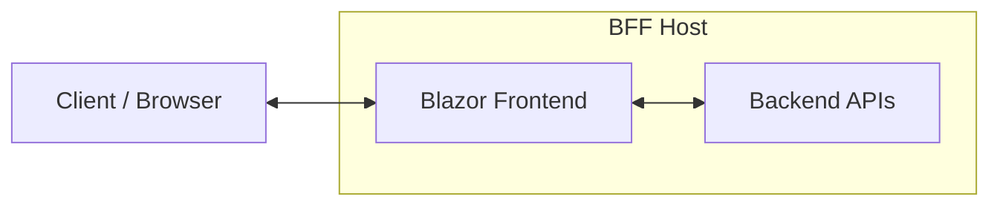

Microsoft's Blazor framework helps developers build rich, interactive web applications using C# and .NET. While Blazor is well-suited for rich web UIs, it introduces unique challenges around secure authentication and authorization — especially when rendering happens both on the server and in the browser.

The Duende BFF Security Framework addresses these challenges by keeping access tokens on the server and providing a unified authentication state across Blazor's rendering modes.

## Architecture

A BFF-backed Blazor app has three elements: the **backend** (server-side logic and APIs), the **frontend** (the Blazor application), and the **client** (the browser). The BFF host acts as the combined backend and frontend host:

For a detailed architecture diagram and explanation, see the [Architecture overview](/bff/architecture/).

## Where to Go Next

| Topic | Description |
|-------|-------------|
| [Rendering Modes & BFF](/bff/fundamentals/blazor/rendering-modes/) | Which Blazor rendering modes work with BFF and why |
| [Data Access Patterns](/bff/fundamentals/blazor/data-access/) | How to securely call APIs from Blazor components |
| [Getting Started: Blazor](/bff/getting-started/blazor/) | Step-by-step setup guide for a Blazor BFF app |
| [Server-Side Sessions](/bff/fundamentals/session/server-side-sessions/) | Persistent session storage for Blazor apps |
| [Token Management](/bff/fundamentals/tokens/) | How BFF manages access tokens for Blazor |

## See Also

- [Access Token Management](/accesstokenmanagement/index.mdx)
- [Blazor Server token management](/accesstokenmanagement/blazor-server.md)
- [IdentityServer Quickstarts](/identityserver/quickstarts/0-overview.md)
