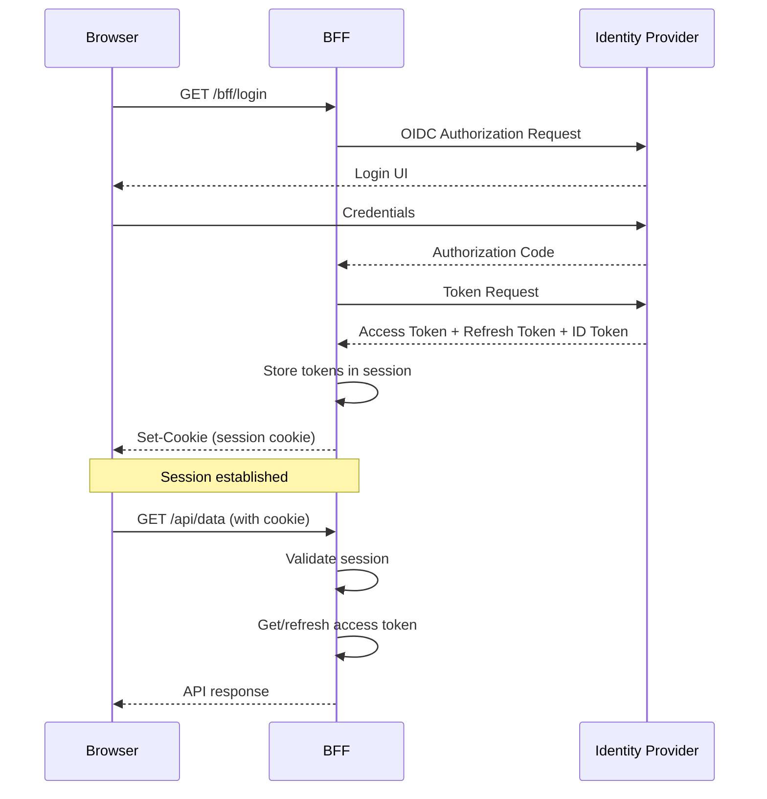

import { CardGrid, LinkCard } from "@astrojs/starlight/components";

Authentication in a BFF application flows through several layers. Understanding how these layers connect helps you configure sessions correctly and debug problems when they arise.

## How Sessions Work

### The Session Cookie

After a successful login, BFF sets an **HttpOnly, Secure, SameSite** cookie in the browser. This cookie is the browser's proof of session — it is sent automatically on every subsequent request to the BFF host. The cookie itself is signed and encrypted by ASP.NET Core's data protection stack.

The browser never has access to the access token or refresh token. These are stored server-side.

### Cookie-Based vs. Server-Side Sessions

By default, BFF stores session state (including tokens) inside the encrypted cookie. This works but has limitations:

| | Cookie-Based (default) | Server-Side Sessions |
|--|------------------------|----------------------|
| **Token storage** | Inside the encrypted cookie | Server-side store (DB, memory) |
| **Cookie size** | Grows with claims/tokens — can hit browser 4KB limit | Fixed small size (session ID only) |
| **Server-initiated logout** | Not possible | ✅ Possible |
| **Back-channel logout** | Not supported | ✅ Supported |
| **Session visibility** | None | ✅ Query all active sessions |
| **Scale-out** | Cookie encryption keys must be shared | Session store must be shared |

:::tip[Recommended for production]
Use server-side sessions for any production deployment. They enable back-channel logout support, avoid cookie size issues with large claim sets, and allow the server to forcibly end user sessions.
:::

### Token Lifecycle

Tokens stored in the session are managed automatically:

1. **Access token** — When an API call is made through the BFF, the access token is retrieved from the session. If it is expired or close to expiring, BFF automatically refreshes it using the refresh token.
2. **Refresh token** — Stored server-side (in the session). Revoked automatically at logout.
3. **ID token** — Used during logout to send a `id_token_hint` to the identity provider.

See [Token Management](/bff/fundamentals/tokens/) for how to access tokens programmatically.

## Management Endpoints

The BFF exposes several HTTP endpoints for managing the user's session. These endpoints are called by the frontend to trigger authentication flows or query session state.

| Endpoint | Default Path | Purpose |
|----------|-------------|---------|
| Login | `/bff/login` | Start the OIDC authentication flow |
| Logout | `/bff/logout` | End the session and sign out |
| User | `/bff/user` | Return current user claims and session state |
| Silent Login | `/bff/silent-login` | Non-interactive login (deprecated in v4) |
| Back-Channel Logout | `/bff/backchannel` | Receive server-to-server logout notifications |
| Diagnostics | `/bff/diagnostics` | Show current tokens (development only) |

## In This Section

| Page | Description |
|------|-------------|
| [Authentication Handlers](/bff/fundamentals/session/handlers/) | OIDC and cookie handler configuration |
| [Server-Side Sessions](/bff/fundamentals/session/server-side-sessions/) | Persistent session storage with Entity Framework or custom stores |
| [OIDC Prompts](/bff/fundamentals/session/oidc-prompts/) | Controlling interactive vs. silent authentication |
| [Login Endpoint](/bff/fundamentals/session/management/login/) | How to trigger login from the frontend |
| [Logout Endpoint](/bff/fundamentals/session/management/logout/) | How to trigger logout and CSRF protection |
| [User Endpoint](/bff/fundamentals/session/management/user/) | Reading user claims and session state |
| [Back-Channel Logout](/bff/fundamentals/session/management/back-channel-logout/) | Server-initiated session termination |
| [Silent Login](/bff/fundamentals/session/management/silent-login/) | Non-interactive login (deprecated) |
| [Diagnostics](/bff/fundamentals/session/management/diagnostics/) | Development-time token inspection |

## See Also

<CardGrid>
  <LinkCard
    href="/identityserver/configuration/"
    title="IdentityServer Configuration"
    description="Configure the identity provider your BFF authenticates against"
  />
  <LinkCard
    href="/identityserver/fundamentals/clients/"
    title="IdentityServer Clients"
    description="Register your BFF as a confidential client"
  />
  <LinkCard
    href="/identityserver/ui/server-side-sessions/"
    title="IdentityServer Server-Side Sessions"
    description="Coordinate logout across all components"
  />
  <LinkCard
    href="/accesstokenmanagement/"
    title="Access Token Management"
    description="How tokens are refreshed when sessions are active"
  />
  <LinkCard
    href="/bff/troubleshooting/"
    title="Troubleshooting"
    description="Common session and authentication issues"
  />
</CardGrid>
