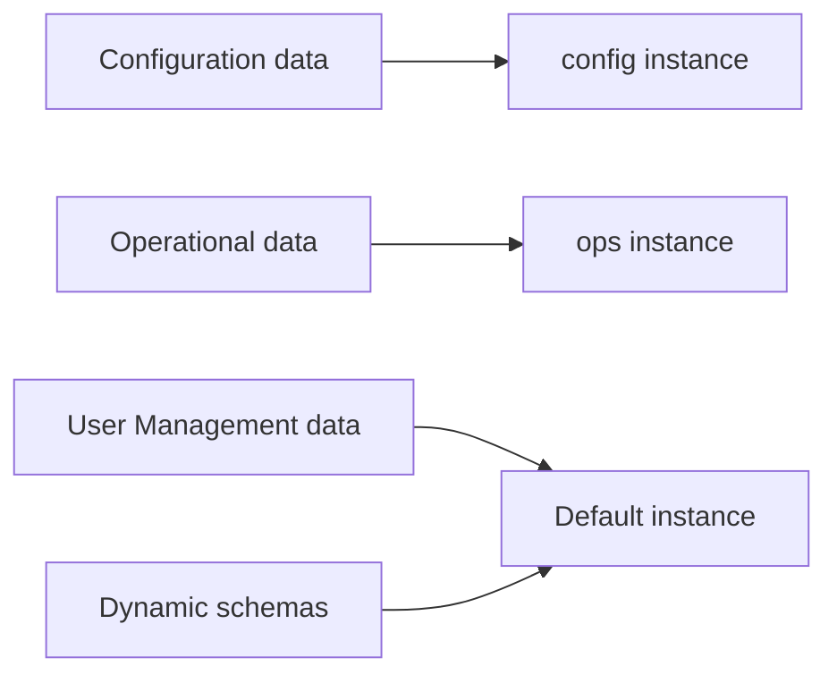

:::caution[Preview documentation]
This page describes preview packages and APIs that are subject to change. Start with the
[Duende Storage overview](/identityserver/data/providers/duende-storage/index.mdx) for the preview scope.
:::

Duende Storage registers one database per *storage instance*. By default, every data category maps to one instance and
your application uses a single database, as shown in [Getting Started](/identityserver/data/providers/duende-storage/getting-started.md).
This page covers routing categories, such as configuration and operational data, to separate databases.

## Storage Instances and Data Categories

A *data category* identifies a kind of data, such as `configuration` or `operational`. A *storage instance* identifies a
registered database. `IStorageInstanceRouter` maps each category to the instance that stores it. Categories that are not
explicitly mapped fall back to the default instance (`StorageInstanceId.Default`).



Call `AddStorage(...)` to select a database provider for an instance. Call a category-specific method, such as
`AddConfigurationStorage(...)` or `AddOperationalStorage(...)`, to map a category to an instance and register the stores
that read and write it:

| Method                                   | Category            | Default instance when called without an ID |
| ----------------------------------------- | ------------------- | -------------------------------------------- |
| `AddConfigurationStorage(...)`            | `configuration`      | `StorageInstanceId.Default`                   |
| `AddOperationalStorage(...)`              | `operational`        | `StorageInstanceId.Default`                   |
| `AddDynamicSchemas(...)`                  | `dynamic-schemas`    | `StorageInstanceId.Default`                   |
| `AddUserManagement(...)` (User Management) | `user-management`   | `StorageInstanceId.Default`                   |

Each category can be mapped to only one instance per application. Calling the same category's registration method twice
with different instance IDs throws an `InvalidOperationException`, including when two different products (for example
IdentityServer and User Management) try to map the same category to different instances.

Selecting a second database provider for the same instance, whether in one `AddStorage(...)` call or a later one, also
throws an `InvalidOperationException`. This catches accidental double registration instead of silently replacing the
first provider.

## Register a Second Instance

Give the instance an explicit ID, register a provider for it, then map a category to it:

```csharp
// Program.cs
using Duende.IdentityServer;
using Duende.Storage;
using Duende.Storage.Schema;
using Duende.Storage.Sqlite;

var builder = WebApplication.CreateBuilder(args);

var operationalInstanceId = StorageInstanceId.Create("operational");

builder.Services
    .AddIdentityServer()
    // Default instance: configuration data.
    .AddStorage(storage =>
        storage.AddSqlite(options =>
            options.ConnectionString =
                builder.Configuration.GetConnectionString("IdentityServerConfiguration")
                ?? throw new InvalidOperationException("Configuration connection string is missing.")))
    .AddConfigurationStorage()
    // Named instance: operational data.
    .AddStorage(operationalInstanceId, storage =>
        storage.AddSqlite(options =>
            options.ConnectionString =
                builder.Configuration.GetConnectionString("IdentityServerOperational")
                ?? throw new InvalidOperationException("Operational connection string is missing.")))
    .AddOperationalStorage(operationalInstanceId);

var app = builder.Build();

if (app.Environment.IsDevelopment())
{
    var schemaFactory = app.Services.GetRequiredService<IStorageInstanceSchemaFactory>();

    await (await schemaFactory.GetStorageInstanceSchema(StorageInstanceId.Default, CancellationToken.None))
        .MigrateAsync(CancellationToken.None);
    await (await schemaFactory.GetStorageInstanceSchema(operationalInstanceId, CancellationToken.None))
        .MigrateAsync(CancellationToken.None);
}

app.UseIdentityServer();
app.Run();
```

Migrate every instance you register. `IStorageInstanceSchema.MigrateAsync` resolves the default instance only;
use `IStorageInstanceSchemaFactory.GetStorageInstanceSchema(storageInstanceId, ct)` to resolve and migrate a named
instance, as shown above.

## Cross-Product Example: IdentityServer, User Management and Spaces

Each Duende product maps its own categories, so you can give each product (or even each kind of data within a
product) its own database. For example, keep IdentityServer's configuration and Spaces' management data together, route
IdentityServer's operational data to a separate database, and use a dedicated database for User Management:

```csharp
// Program.cs
using Duende.IdentityServer;
using Duende.Spaces;
using Duende.Storage;
using Duende.Storage.Schema;
using Duende.Storage.Sqlite;
using Duende.UserManagement;

var builder = WebApplication.CreateBuilder(args);

var operationalInstanceId = StorageInstanceId.Create("operational");
var userManagementInstanceId = StorageInstanceId.Create("user-management");

builder.Services
    .AddIdentityServer()
    .AddServerSideSessions()
    // Default instance: IdentityServer configuration and Spaces management data.
    .AddStorage(storage =>
        storage.AddSqlite(options =>
            options.ConnectionString = builder.Configuration.GetConnectionString("Configuration")!))
    .AddConfigurationStorage()
    // Named instance: IdentityServer operational data (grants, sessions, keys).
    .AddStorage(operationalInstanceId, storage =>
        storage.AddSqlite(options =>
            options.ConnectionString = builder.Configuration.GetConnectionString("Operational")!))
    .AddOperationalStorage(operationalInstanceId)
    // Named instance: User Management data (profiles, authenticators, roles, groups).
    .AddStorage(userManagementInstanceId, storage =>
        storage.AddSqlite(options =>
            options.ConnectionString = builder.Configuration.GetConnectionString("UserManagement")!))
    .AddUserManagement(userManagementInstanceId, _ => { });

builder.Services.AddSpaces();

var app = builder.Build();

var schemaFactory = app.Services.GetRequiredService<IStorageInstanceSchemaFactory>();

foreach (var instanceId in new[] { StorageInstanceId.Default, operationalInstanceId, userManagementInstanceId })
{
    await (await schemaFactory.GetStorageInstanceSchema(instanceId, CancellationToken.None))
        .MigrateAsync(CancellationToken.None);
}

app.UseIdentityServer();
app.Run();
```

`AddUserManagement(storageInstanceId, configure)` maps the `user-management` category the same way
`AddConfigurationStorage(storageInstanceId)` maps `configuration`. When [Spaces](/identityserver/spaces/index.mdx) is
enabled, every category still resolves to its mapped instance first, then to the resolved space's storage pool within
that instance's database.

## Fallback to the Default Instance

A category that is never mapped resolves to the default instance automatically. This lets you introduce a named instance
for one category (for example operational data) while every other category, including ones added by other products later,
keeps using the default database without extra configuration.

## Outbox Processing and Purge Run Against Every Instance

The outbox processor and the background purge of expired data are registered once per application, not once per instance.
Both discover every registered storage instance at startup and process each one. You do not need to register them again
for a named instance; registering a category against that instance (`AddOperationalStorage(instanceId)`) is enough to
bring its data into scope for both.

## Migrations Are Per Instance

Each storage instance has its own schema and is migrated independently. Running `IStorageInstanceSchema.MigrateAsync` only
migrates the default instance. Resolve and migrate every other instance explicitly with
`IStorageInstanceSchemaFactory.GetStorageInstanceSchema(storageInstanceId, ct)`, as shown in the examples above. The
[Duende CLI](/identityserver/data/providers/duende-storage/getting-started.md#deploy-the-database-schema) migrates one
connection string at a time, so run it once per instance's connection string in a multi-instance deployment.
