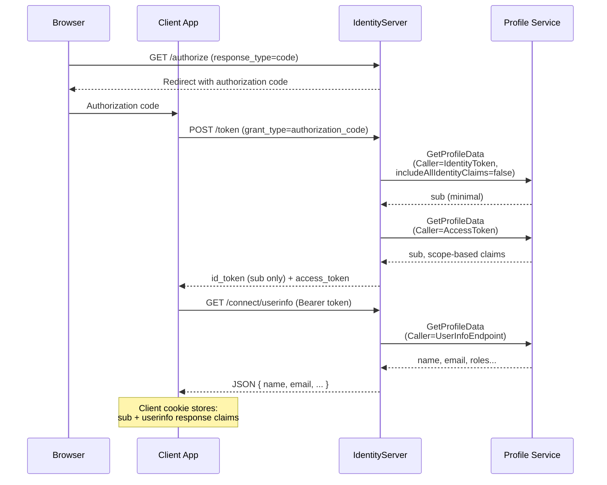
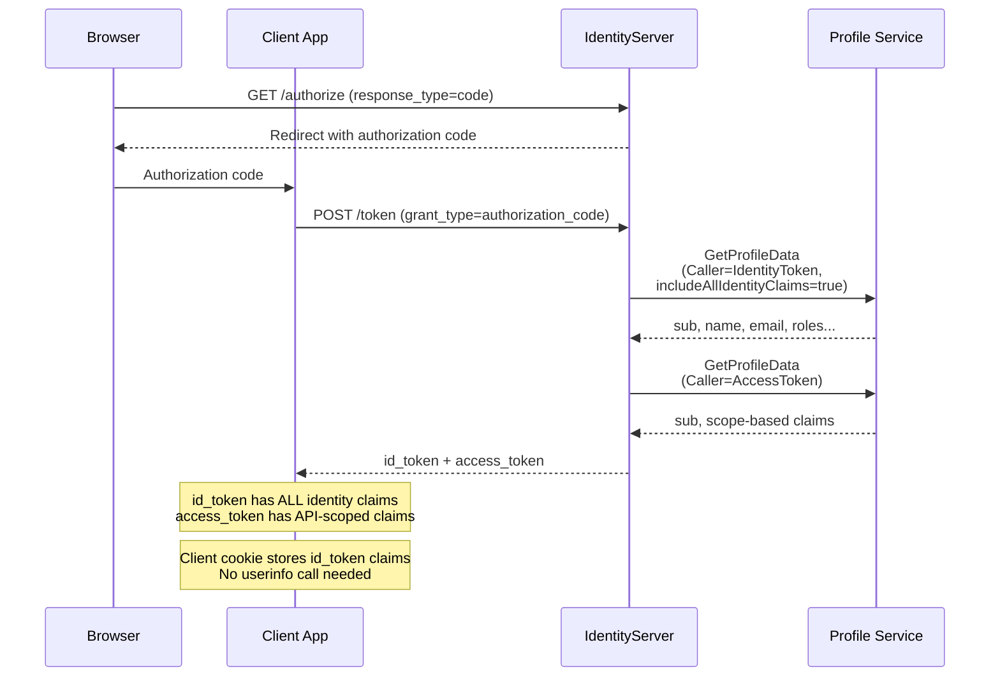
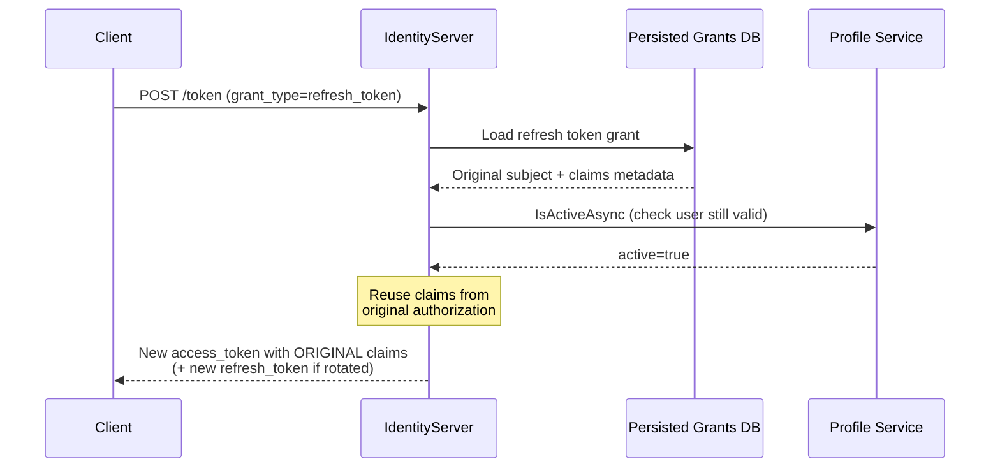
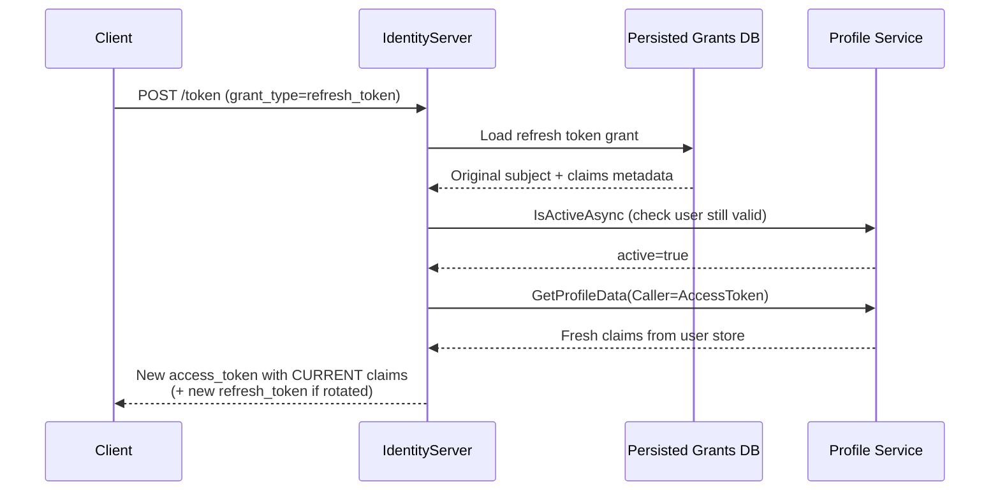
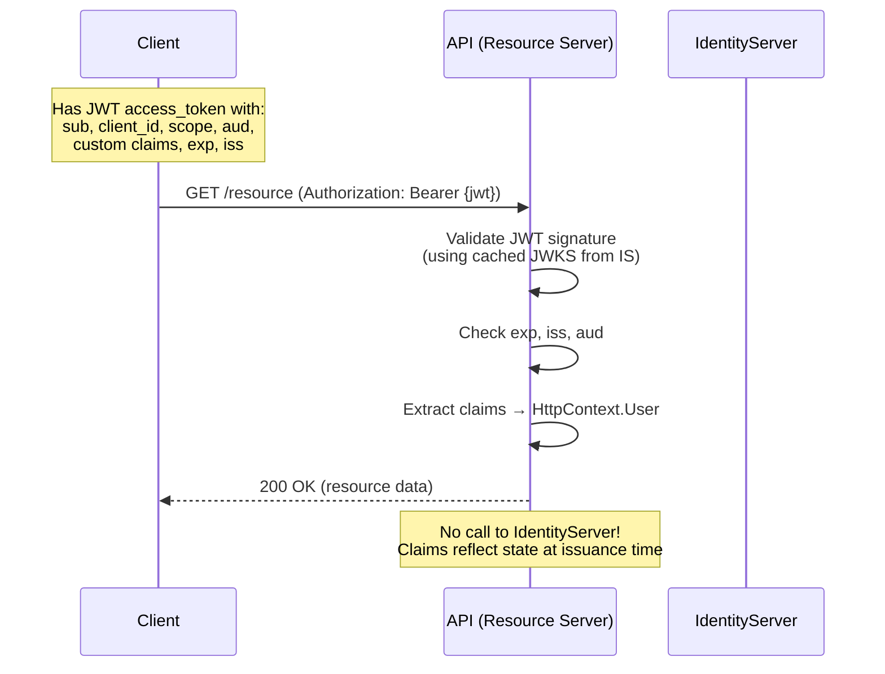
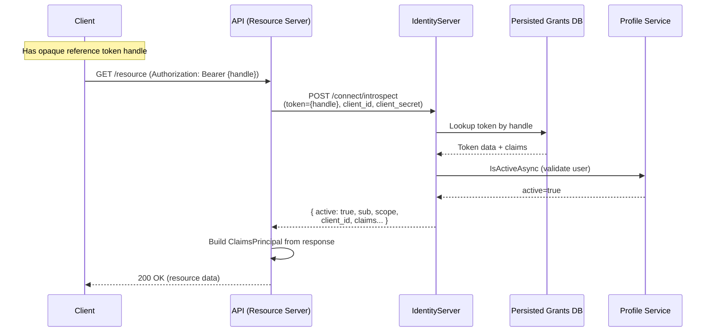
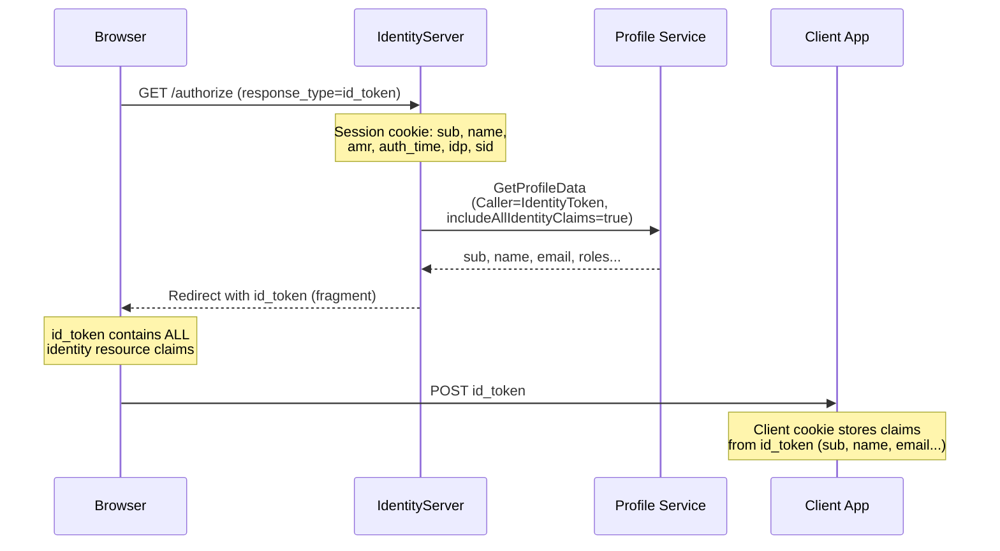

import { Badge, CardGrid, LinkCard, Tabs, TabItem } from "@astrojs/starlight/components";

Understanding where claims live at each step of a protocol flow is essential for configuring IdentityServer correctly. This page provides sequence diagrams for each major flow, showing:

- **Where** claims are stored (session cookie, persisted grants DB, tokens, client cookie, API context)
- **When** the [Profile Service](/identityserver/reference/v8/services/profile-service/) is invoked
- **How** configuration options change claim placement

## Claim Locations

| Location | Description |
|----------|-------------|
| **IdentityServer Session** | Cookie storing `sub`, `name`, `amr`, `auth_time`, `idp`, `sid` after login |
| **Persisted Grants DB** | Stores authorization codes, refresh tokens, and reference access tokens with associated claims |
| **Identity Token** | JWT sent to the client describing the authentication event |
| **Access Token** | JWT or reference token authorizing API access, contains scope-based claims |
| **UserInfo Endpoint** | Returns identity claims on demand when presented with a valid access token |
| **Client Session (Cookie)** | ASP.NET Core auth cookie storing claims the client chose to persist |
| **API HttpContext** | Claims principal populated from the validated access token |

---

## Authorization Code with UserInfo <Badge text="Recommended" variant="success" />

This is the recommended default. The id_token is minimal (just `sub`), and the client retrieves full identity claims from the userinfo endpoint. This keeps tokens small and is the standard behavior for confidential clients.

**Key points:**
- Profile Service is called **3 times** with different `Caller` values
- The id_token is small (reduces redirect URL size)
- Identity claims come from userinfo, not the id_token
- The ASP.NET Core OIDC handler does this automatically when `GetClaimsFromUserInfoEndpoint = true`

---

## Authorization Code without UserInfo

When `AlwaysIncludeUserClaimsInIdToken = true` on the client, identity claims are placed directly in the id_token even though an access token is available. This avoids the extra round-trip to userinfo.

**Configuration:** Set `AlwaysIncludeUserClaimsInIdToken = true` on the [Client](/identityserver/reference/v8/models/client/) to enable this behavior.

**When to use:** When your client doesn't want to make an extra HTTP call to userinfo, or when you need claims immediately available at sign-in without a round-trip.

---

## Refresh Token Renewal

When a client refreshes an access token, claims may be reloaded from the Profile Service or reused from the original grant. The behavior depends on the `UpdateAccessTokenClaimsOnRefresh` client setting.

<Tabs>
<TabItem label="Default (reuse claims)">

The new access token reuses claims from the original authorization. The Profile Service is only called to verify the user is still active.

This is the default behavior when `UpdateAccessTokenClaimsOnRefresh = false`.

</TabItem>
<TabItem label="Fresh claims">

The Profile Service is re-invoked to load the latest claims from your user store. Use this when tokens need to reflect current user state (e.g., role changes, email updates).

Set `UpdateAccessTokenClaimsOnRefresh = true` on the [Client](/identityserver/reference/v8/models/client/) to enable this.

**Trade-off:** This adds a Profile Service call on every refresh, which may increase load on your user store.

</TabItem>
</Tabs>

---

## API with JWT Access Token

With JWT access tokens, the API validates the token locally. There is no backchannel call to IdentityServer. Claims are frozen at the time the token was issued.

**Key points:**
- The API never contacts IdentityServer during request processing
- Claims are **frozen** at token issuance. If a user's role changes, the old token still has the old claims until it expires
- Keep JWT lifetimes short (5-15 min) and use refresh tokens for longevity
- The API gets its JWKS keys from the discovery document (cached)

---

## API with Reference Token + Introspection

With reference tokens, the API must call IdentityServer's introspection endpoint on every request to resolve the opaque token handle.

**Key points:**
- Every API request triggers an introspection call (cache where appropriate)
- Reference tokens can be **revoked immediately** by deleting from the grants DB
- The API must have an `ApiSecret` configured on its `ApiResource` for introspection
- Claims reflect the stored state (from original issuance unless updated)

---

## Implicit Flow <Badge text="Legacy" variant="caution" />

:::caution
The implicit flow is **no longer recommended** for new applications. It exposes tokens in the browser URL fragment and lacks the security benefits of PKCE. Use the authorization code flow with PKCE instead. This flow is documented here for reference, as it is still supported.
:::

In the implicit flow, ALL identity claims go directly into the `id_token` because no access token is issued (so no userinfo endpoint is available).

**Key points:**
- `includeAllIdentityClaims` is `true` because there's no access token to use at the userinfo endpoint
- The Profile Service is called once
- All identity resource claims are packed into the id_token
- Tokens in URL fragments are visible in browser history and logs. Prefer authorization code flow with PKCE

---

## Configuration Options Summary

| Option | Default | Effect | Relevant Flows |
|--------|---------|--------|----------------|
| `AlwaysIncludeUserClaimsInIdToken` | `false` | When true, all identity claims go in id_token (skips userinfo) | Code flow |
| `UpdateAccessTokenClaimsOnRefresh` | `false` | When true, Profile Service is re-invoked on refresh | Refresh |
| `AccessTokenType` | `Jwt` | `Jwt` = self-contained, `Reference` = opaque + introspection | API calls |
| `AlwaysSendClientClaims` | `false` | Include client claims in all flows (not just client credentials) | All flows |
| `ClientClaimsPrefix` | `"client_"` | Prefix added to client claims in access tokens | All flows |

## See Also

<CardGrid>
  <LinkCard title="Claims Emission Strategies" href="/identityserver/fundamentals/claims/" description="How to control which claims the Profile Service returns" />
  <LinkCard title="Profile Service Reference" href="/identityserver/reference/v8/services/profile-service/" description="The IProfileService API" />
  <LinkCard title="Refreshing Tokens" href="/identityserver/tokens/refresh/" description="Refresh token configuration and lifecycle" />
  <LinkCard title="Claims Service" href="/identityserver/reference/v8/services/claims-service/" description="IClaimsService for token-level claim filtering" />
</CardGrid>
