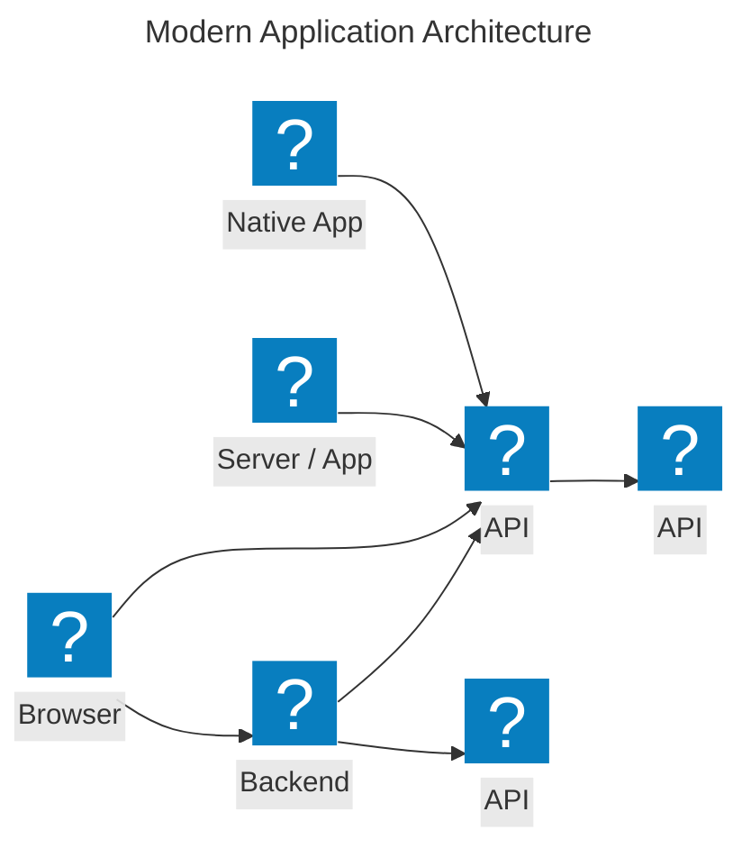
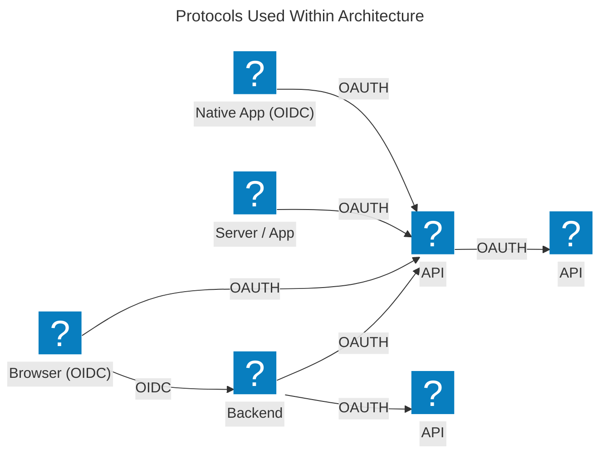
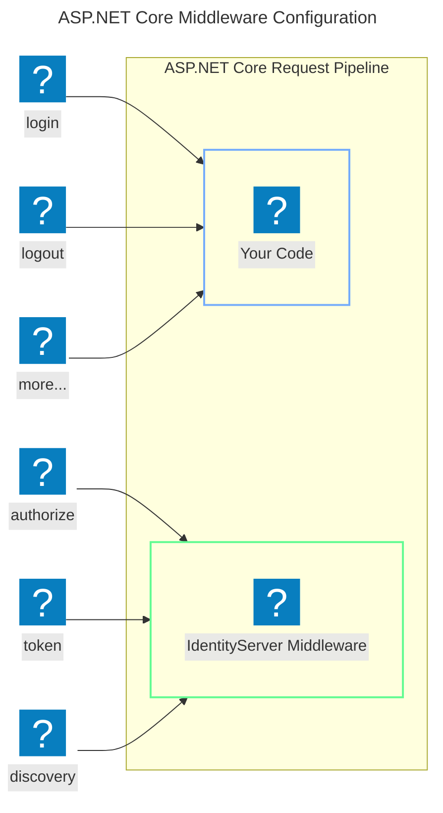

Most modern applications look more or less like this:

The most common interactions are:

* Browsers communicate with web applications
* Web applications communicate with web APIs (sometimes on their own, sometimes on behalf of a user)
* Browser-based applications communicate with web APIs
* Native applications communicate with web APIs
* Server-based applications communicate with web APIs
* Web APIs communicate with web APIs (sometimes on their own, sometimes on behalf of a user)

Typically, each and every layer (front-end, middle-tier and back-end) has to protect resources and
implement authentication and/or authorization – often against the same user store.

Outsourcing these fundamental security functions to a security token service prevents duplicating that functionality
across those applications and endpoints.

Restructuring the application to support a security token service leads to the following architecture and protocols:

Such a design divides security concerns into two parts:

## Authentication

Authentication is needed when an application needs to know the identity of the current user.
Typically, these applications manage data on behalf of that user and need to make sure that this user can only
access the data for which they are allowed. The most common example for that is (classic) web applications –
but native and JS-based applications also have a need for authentication.

The most common authentication protocols are SAML2p, WS-Federation and OpenID Connect – SAML2p being the
most popular and the most widely deployed.

OpenID Connect is the newest of the three, but is considered to be the future because it has the
most potential for modern applications. It was built for mobile application scenarios right from the start
and is designed to be API friendly.

## API Access

Applications have two fundamental ways with which they communicate with APIs – using the application identity,
or delegating the user’s identity. Sometimes both methods need to be combined.

OAuth 2.0 is a protocol that allows applications to request access tokens from a security token service and use them
to communicate with APIs. This delegation reduces complexity in both the client applications and the APIs since
authentication and authorization can be centralized.

## OpenID Connect And OAuth 2.0 – Better Together!

OpenID Connect and OAuth 2.0 are very similar – in fact OpenID Connect is an extension on top of OAuth 2.0.
The two fundamental security concerns, authentication and API access, are combined into a single protocol - often with a
single round trip to the security token service.

We believe that the combination of OpenID Connect and OAuth 2.0 is the best approach to secure modern
applications for the foreseeable future. Duende IdentityServer is an implementation of these two protocols and is
highly optimized to solve the typical security problems of today’s mobile, native and web applications.

## How Duende IdentityServer Can Help

Duende IdentityServer is middleware that adds spec-compliant OpenID Connect and OAuth 2.0 endpoints to an arbitrary
ASP.NET Core host.

Typically, you build (or re-use) an application that contains login and logout pages (and optionally a consent page,
depending on your needs)
and add the IdentityServer middleware to that application. The middleware adds the necessary protocol heads to the
application so that clients can talk to it using those standard protocols.

The hosting application can be as complex as you want, but we typically recommend to keep the attack surface as small as
possible by including
authentication/federation related UI only.
