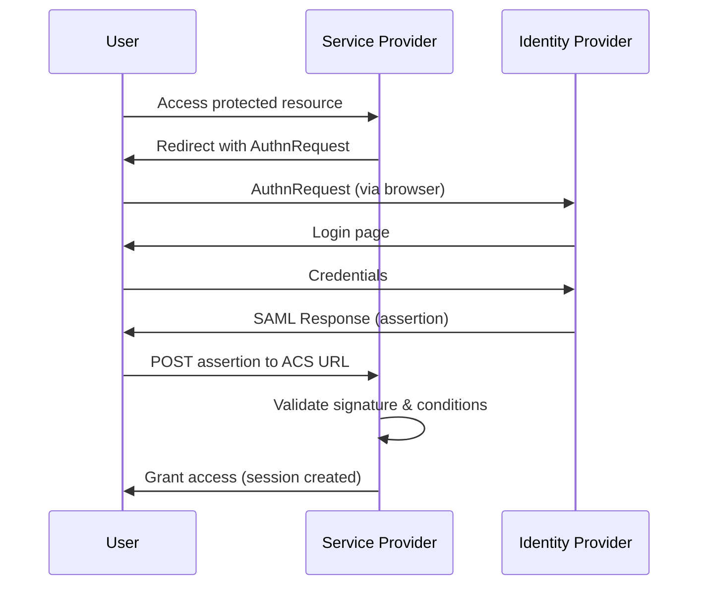
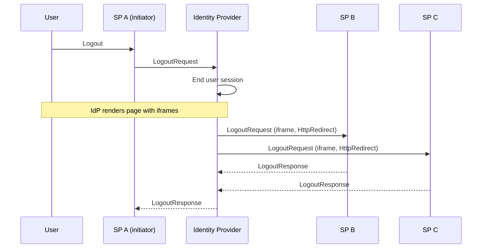

SAML 2.0 is an XML-based federation protocol widely used in enterprise, government, healthcare, and education environments. It predates OpenID Connect and is often found in legacy applications and organizations that adopted federated identity early. This page covers the core concepts you need when working with SAML 2.0 federation. Where relevant, each section links to the corresponding IdentityServer [configuration](/identityserver/saml/configuration.md) so you can put these concepts into practice.

## Assertions

An assertion is the central data structure in SAML. It is an XML document that carries information about a user from the Identity Provider to the Service Provider. The assertion, the response, or both, can be digitally signed but aren't always.

Think of it as the SAML equivalent of an ID token in OpenID Connect.

An assertion contains three key parts:

* **Authentication Statement**: declares that the user authenticated, when they did so, and by what means (password, MFA, certificate).
* **Attribute Statement**: carries user attributes such as email address, roles, group memberships, and department.
* **Conditions**: constrain where and when the assertion is valid. `NotBefore` and `NotOnOrAfter` define a time window (typically minutes), and `AudienceRestriction` limits which recipients can accept it.

The Identity Provider signs the assertion with its private key. The Service Provider validates the signature before trusting any information inside.

In IdentityServer, you control what attributes appear in assertions through a chain of settings on `SamlServiceProvider`:

* `AllowedScopes` determines which identity resources (and their claim types) are available
* `RequestedClaimTypes` narrows that set to specific claims the SP expects
* [Claim mappings](/identityserver/saml/configuration.md#default-claim-mappings) control how those claim types are translated to SAML attribute names
* You configure signing via [`SamlSigningBehavior`](/identityserver/saml/configuration.md#samlsigningbehavior)

## Identity Provider

The Identity Provider (IdP) is the system that authenticates users and issues assertions. It is the authority: the entity that knows who a user is and can prove it to other parties.

When a user needs access to a protected application, they authenticate at the IdP. The IdP verifies the user's identity using whatever mechanism is configured (password, multi-factor authentication, smart card), then constructs a signed assertion and delivers it to the requesting application.

**IdentityServer acts as the IdP** when you enable SAML 2.0 support via `AddSaml()`. It publishes its capabilities through a [metadata document](/identityserver/saml/endpoints.md#metadata-endpoint) that Service Providers can import to configure trust. Most SPs use hard-coded configuration instead of metadata import, but publishing metadata makes initial setup easier.

## Service Provider

The Service Provider (SP) is the application the user wants to access. Rather than managing credentials itself, it delegates authentication to the IdP and relies on the assertions it receives.

When an unauthenticated user arrives, the SP sends an `AuthnRequest` to the IdP. After the IdP authenticates the user and returns an assertion, the SP validates the signature, checks the conditions, extracts identity and attributes, and establishes a local session. The SP never handles the user's credentials. It trusts the IdP because the two parties have established a federation agreement backed by exchanged metadata and certificates.



In IdentityServer, you register each SP using a `SamlServiceProvider` configuration object. This tells IdentityServer the SP's entity identifier, where to deliver assertions (the Assertion Consumer Service URL) and how to communicate. See the [Service Provider Store](/identityserver/saml/service-providers.md) and the [SamlServiceProvider model](/identityserver/saml/configuration.md#samlserviceprovider-model) for details.

Duende IdentityServer can also act as a SAML Service Provider itself, consuming assertions from an external SAML IdP. See [Identity Provider and Service Provider](/identityserver/saml/idp-and-sp.mdx) for an overview of both roles.

## Entity Identifiers

Every participant in a SAML federation (both IdPs and SPs) has an entity identifier (also called entity ID). This is a globally unique name that identifies the entity across all interactions. Entity identifiers are absolute URIs (typically HTTPS URLs), though they're used as identifiers, not necessarily as resolvable addresses.

In IdentityServer, the IdP entity identifier defaults to `{host}/Saml2` and doubles as the URL where metadata is published (see [Metadata](#metadata)). You can customize it via `SamlOptions.EntityId` or `SamlOptions.EntityIdPath`.
Each registered Service Provider has its own entity identifier set via `SamlServiceProvider.EntityId`.

## Metadata

SAML metadata is an XML document that describes an entity's capabilities: its endpoints, supported bindings, and the certificates it uses for signing and encryption. Both IdPs and SPs publish metadata documents.

Metadata makes federation scalable. Instead of manually exchanging certificates and endpoint URLs out-of-band, parties import each other's metadata and configure trust automatically.

IdentityServer publishes its IdP metadata at the entity ID URL (a well-known location per the SAML metadata specification), which defaults to `/Saml2`. Share this URL with each Service Provider during federation setup so they can discover your signing certificates, NameID formats, and endpoint locations. See the [metadata endpoint](/identityserver/saml/endpoints.md#metadata-endpoint) for more details.

## Bindings

SAML bindings define how SAML messages physically travel over HTTP. The protocol payload (the XML message) is the same regardless of binding; the binding determines the transport mechanism.

IdentityServer supports two bindings:

* **HTTP-Redirect**: the SAML message is deflated, Base64-encoded, and appended to the URL as a query parameter. This is the standard binding for `AuthnRequest` messages, which are typically small. However, URL length constraints make it unsuitable for large assertions with many attributes.
* **HTTP-POST**: the SAML message is Base64-encoded and submitted in a hidden HTML form field that auto-submits to the destination. This handles larger payloads (such as assertions with many attributes) and keeps message content out of server access logs.

The SAML specification also defines **HTTP-Artifact** binding, which sends a short reference token through the browser and resolves the full assertion via a back-channel SOAP call. IdentityServer doesn't currently support Artifact binding.

You configure the binding per SP via the `Binding` property on each [`IndexedEndpoint`](/identityserver/saml/configuration.md#indexedendpoint) in `AssertionConsumerServiceUrls`:

```csharp
AssertionConsumerServiceUrls = new List<IndexedEndpoint>
{
    new IndexedEndpoint
    {
        Location = "https://sp.example.com/saml/acs",
        Binding = SamlBinding.HttpPost,
        Index = 0,
        IsDefault = true
    }
}
```

The [`SamlBinding` enum](/identityserver/saml/configuration.md#samlbinding) defines the available binding values.

## Profiles

SAML profiles are predefined recipes that combine assertions, protocol messages, and bindings into complete workflows for specific use cases. Following a profile is what makes SAML implementations interoperable. Without it, a system can produce syntactically valid SAML messages that no other implementation will accept.

The two profiles most relevant to IdentityServer are:

* **Web Browser SSO Profile**: defines the exact sequence of redirects, requests, assertions, and validations for browser-based single sign-on. IdentityServer's [sign-in endpoints](/identityserver/saml/endpoints.md#sign-in-endpoint) implement this profile.
* **Single Logout Profile**: coordinates session termination across all SPs in a federation when a user logs out. See [Single Logout](#single-logout-slo) below.

## Name Identifiers

The Name Identifier (NameID) is the value inside an assertion that identifies the user to the Service Provider. The NameID format determines the type of identifier used and how stable it is across sessions.

Common formats include:

* **emailAddress**: the user's email address. Human-readable and easy to work with, but it exposes personally identifiable information (PII) and couples the identifier to a value that can change.
* **Unspecified**: leaves the format to the IdP's discretion. In IdentityServer, this uses the user's `sub` claim value.
* **Persistent**: a stable, opaque identifier that remains the same for a given user-SP pair across all sessions. Useful when the SP needs to correlate the user over time without revealing the user's real identity.
* **Transient**: a session-scoped, one-time identifier that changes with every SSO session. Useful when the SP does not need to recognize the user across sessions.

IdentityServer supports `emailAddress` and `unspecified` NameID formats out of the box. For other formats (persistent, transient, or custom), implement [`ISamlNameIdGenerator`](/identityserver/saml/extensibility.md#isamlnameidgenerator).

Inbound `AuthnRequest` messages are validated against the formats configured in `SamlOptions.SupportedNameIdFormats`. Requests specifying an unsupported format are rejected. If you implement a custom NameID format via `ISamlNameIdGenerator`, add it to this list so that validation passes.

## RelayState

RelayState is an opaque string parameter that an SP includes in its `AuthnRequest`. IdentityServer echoes it back unchanged in the SAML response after authentication completes, and the SP uses it to resume the user's original request.

The most common use of RelayState is deep linking: the SP encodes the URL the user originally requested (before the SSO redirect) into RelayState, so after authentication it can redirect the user directly to that page rather than to the application's home page. Without RelayState, every SSO flow deposits the user at the same landing page regardless of where they were trying to go.

IdentityServer preserves RelayState automatically through the authentication flow. The maximum permitted length is controlled by `SamlOptions.MaxRelayStateLength` (default: `80` bytes, which is the limit recommended by the SAML specification). See [SamlOptions](/identityserver/saml/configuration.md#samloptions).

## Single Logout (SLO)

SAML Single Logout (SLO) is a profile for coordinating session termination across an entire federation.

When using SSO, a user establishes a session at the IdP and a separate local session at each SP they visit. Logging out of one application ends only that application's local session. Without SLO, the user still has active sessions at every other SP they visited. Ending the IdP session is especially important: without it, users can immediately re-authenticate via SSO and bounce right back in. SLO solves this by letting a single logout action propagate to all participants in the federation.

### SP-Initiated SLO

The most common flow starts at an SP. When the user clicks "Log out" in an application, the SP sends a `LogoutRequest` to the IdP. The IdP ends the user's session, then sends `LogoutRequest` messages to every other SP where the user has an active session. Each SP terminates its local session and responds with a `LogoutResponse`. Once all SPs have responded (or timed out), the IdP sends a final `LogoutResponse` back to the originating SP.



### IdP-Initiated SLO

Any session participant can initiate logout. When the IdP initiates (for example, due to a session timeout or an administrative action), it sends `LogoutRequest` messages directly to all SPs with active sessions for that user. There is no originating SP to return a final `LogoutResponse` to.

### Front-Channel Logout

The SAML specification mandates a redirect chain for front-channel logout, where the browser is redirected sequentially to each SP's SLO endpoint. IdentityServer deliberately deviates from this approach and instead uses iframes (the same mechanism used for OIDC front-channel logout). This keeps SAML and OIDC SPs compatible within the same session and is more resilient: a single unresponsive SP does not block logout at other SPs.

Only the `HttpRedirect` binding is supported for SLO. HTTP-Redirect works with session cookies that use `SameSite=Lax`, while HTTP-POST would require `SameSite=None` which introduces security concerns in cross-site iframe scenarios.

The user must remain on the logout page while the iframes load. If the user navigates away before all SPs have responded, some sessions may remain active, resulting in a partial logout.

### Partial Logout

Not all SPs may respond successfully. An SP may be unreachable, slow to respond, or the user may navigate away from the logout page before everything completes. IdentityServer tracks which SPs are expected to respond and can return a "partial logout" status when some SPs don't confirm. This is a normal outcome in real-world deployments, not an error condition.

### Session Tracking

For SLO to work, the IdP must know which SPs have active sessions for a given user. IdentityServer tracks this automatically as users authenticate at each SP. You can customize the storage backend by implementing [`ISamlLogoutSessionStore`](/identityserver/saml/extensibility.md#isamllogoutsessionstore).

### Timeouts and Edge Cases

The biggest factor in SLO reliability is how long the user stays on the logout page where the iframes are rendered. If the user navigates away before all SPs respond, the result is the same as if the logout sequence did not complete: some SPs retain active sessions. The `ISamlLogoutSessionStore` TTL (controlled via `SamlOptions.LogoutSessionLifetime`) determines how long logout session records are retained for SPs that have not yet responded.

In IdentityServer, you configure SLO per SP by setting `SamlServiceProvider.SingleLogoutServiceUrls`. IdentityServer then sends front-channel logout notifications to all SPs with a configured SLO endpoint when a user's session ends. See the [logout endpoint](/identityserver/saml/endpoints.md#logout-endpoint) and [`ISamlLogoutNotificationService`](/identityserver/saml/extensibility.md#isamllogoutnotificationservice) for customization options.
