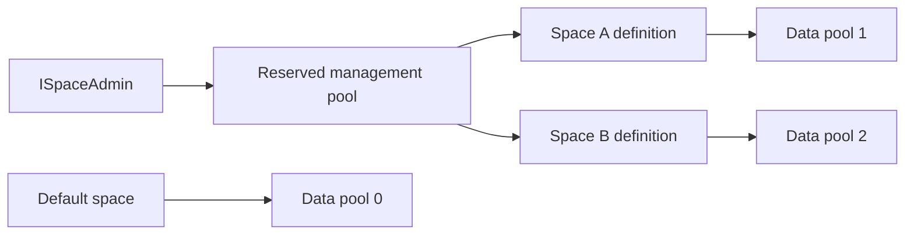

import { CardGrid, LinkCard } from "@astrojs/starlight/components";

A space is an isolated IdentityServer environment within one application deployment. Each space has its own configuration
and operational data, while the application shares the same process, code and database infrastructure.

Use Spaces when you need to host multiple security domains without operating a separate IdentityServer deployment for
each one. Examples include software-as-a-service tenants, regional environments or independently administered business
units.

## How Spaces Isolate Data

Spaces build on the pooled storage model in
[Duende Storage](/identityserver/data/providers/duende-storage/index.mdx). Each space maps to a storage pool, a logical
partition within the same database identified by a numeric pool ID. This isolates all configuration and operational data
for that space. IdentityServer resolves the current space at the start of a request and routes all subsequent store
operations to that pool.

The reserved management pool is separate from every pool that holds IdentityServer data. It stores each space definition,
including its matching rules and assigned data pool. The default space uses data pool `0`, while configured spaces normally
use positive pool IDs. Normal IdentityServer requests never use the management pool as their data pool.

Use `ISpaceAdmin` from a protected administration path to create spaces or change their pool assignments. Moving a space
to another pool changes which data it sees, so authorize and audit these operations as changes to a security boundary.

## How Spaces Resolve Incoming Requests

A space can match an incoming request by:

* Origin, such as `https://tenant.example.com`
* Path segment, such as `/acme` under the default `/t` prefix
* Both origin and path

Origin claims take precedence so a path cannot route a request away from a space that owns the host. With the default
prefix, a space whose path is `/acme` receives requests under `/t/acme`. Middleware moves `/t/acme` to `PathBase` before
ASP.NET Core routing, leaving the remaining path for IdentityServer endpoints.

Requests that explicitly use the space path prefix but do not match a space receive `404 Not Found`. By default, other
unmatched requests also receive `404 Not Found`; you can opt into the default space with `FallbackToDefault`.

:::caution
Only enable `FallbackToDefault` when serving an unmatched host or path from the default space is an intentional part of
your isolation model. A strict `404 Not Found` response is safer for multi-tenant deployments.
:::

## UI and Application Services

Spaces use the same login, consent, logout and error page implementations. Space resolution runs before ASP.NET Core
routing and path-based resolution moves the matched prefix into `PathBase`. The shared UI routes therefore run within the
resolved space and read that space's configuration and operational stores.

Spaces do not add per-space UI code or branding. To vary UI behavior, inject `ISpaceContextAccessor` into a scoped UI
service, read the resolved `SpaceId` and load your own space-aware settings. Apply the same pattern to custom services that
need space-specific behavior.

User databases and other application-level services are not made space-aware automatically. You must isolate or partition
them separately when users, profile data, email delivery or other dependencies belong to a specific space.

## What Spaces Does Not Isolate

:::caution[Spaces Do Not Isolate Process-Level Dependencies]
Spaces isolate persisted data, but they do not automatically isolate every process-level dependency. Review signing
credentials, ASP.NET Core Data Protection, external caches, telemetry, rate limits and custom services to decide whether
they also need space-aware configuration.

For example, sharing signing credentials reduces cryptographic separation between spaces. Token validation still checks
the issuer, audience and other constraints, but each space should use deliberately scoped credentials when your security
model requires independent trust boundaries.
:::

Your administration system must authorize operators for the specific spaces they manage. Never trust a space identifier
supplied by a client without allowing the resolution middleware to validate it against a configured match pattern.

<CardGrid>
  <LinkCard
    href="/identityserver/spaces/getting-started/"
    title="Getting Started"
    description="Configure storage, add space resolution and create an initial space."
  />
  <LinkCard
    href="/identityserver/data/providers/duende-storage/"
    title="Duende Storage"
    description="Understand the storage provider and its preview status."
  />
</CardGrid>
