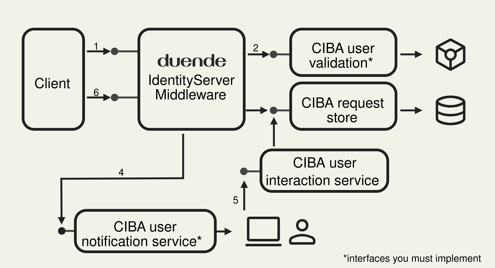

Duende IdentityServer supports the [Client-Initiated Backchannel Authentication Flow](https://openid.net/specs/openid-client-initiated-backchannel-authentication-core-1_0.html) (also known as CIBA).
CIBA is one of the requirements to support the [Financial-grade API](https://openid.net/wg/fapi/) compliance.

:::note
This feature is part of the [Duende IdentityServer Enterprise (legacy), Standard, Advanced, and Custom Edition](https://duendesoftware.com/products/identityserver).
:::

Normally when using OpenID Connect, a user accesses a client application on the same device they use to login to the OpenID Connect provider.
For example, a user (via the browser) uses a web app (the client) and that same browser is redirected for the user to login at IdentityServer (the OpenID Connect provider), and this all takes place on the user's device (e.g. their computer). Another example would be that a user uses a mobile app (the client), and it launches the browser for the user to login at IdentityServer (the OpenID Connect provider), and this all takes place on the user's device (e.g. their mobile phone).

CIBA allows the user to interact with the client application on a different device than the one they use to log in.
For example, the user can use a kiosk at the public library to access their data, but they perform the actual login on their mobile phone. Another example would be a user is at the bank and the bank teller wishes to access the user's account, so the user logs into mobile phone to grant that access.

The user does not enter credentials on the device running the client application. Authentication happens on a separate,
trusted device instead.

## CIBA Workflow In IdentityServer

Below is a diagram that shows the high level steps involved with the CIBA workflow and the supporting services involved.



:::note
Duende IdentityServer supports the [`poll`](https://openid.net/specs/openid-client-initiated-backchannel-authentication-core-1_0.html#rfc.section.5) mode to allow a client to obtain the results of a backchannel login request.
:::

* **Step 1**: IdentityServer exposes a [backchannel authentication request endpoint](/identityserver/reference/v8/endpoints/ciba.md) that the client uses to initiate the CIBA workflow.

* **Step 2**: Once client authentication and basic request parameter validation is performed, the user for which the request is being made must be identified.
This is done by using the [IBackchannelAuthenticationUserValidator](/identityserver/reference/v8/validators/ciba-user-validator.md) service in DI, **which you are required to implement and register in the ASP.NET Core service provider**.
The `ValidateRequestAsync` method will validate the request parameters and return a result which will contain the user's `sub` (subject identifier) claim.

* **Step 3**: Once a user has successfully been identified, then a record representing the pending login request is created in the [Backchannel Authentication Request Store](/identityserver/reference/v8/stores/backchannel-auth-request-store.md).

* **Step 4**: Next, the user needs to be notified of the login request. This is done by using the [IBackchannelAuthenticationUserNotificationService](/identityserver/reference/v8/services/ciba-user-notification.md) service in DI, **which you are required to implement and register in the ASP.NET Core service provider**.
  The `SendLoginRequestAsync` method should contact the user with whatever mechanism is appropriate (e.g. email, text message, push notification, etc.), and presumably provide the user with instructions (perhaps via a link, but other approaches are conceivable) to start the login and consent process. 
  This method is passed a [BackchannelUserLoginRequest](/identityserver/reference/v8/models/ciba-login-request.md) which will contain all the contextual information needed to send to the user (the `InternalId` being the identifier for this login request which is needed when completing the request -- see below).

* **Step 5**: Next, the user should be presented with the information for the login request (e.g. via a web page at IdentityServer, or via any other means appropriate).
  The [IBackchannelAuthenticationInteractionService](/identityserver/reference/v8/services/ciba-interaction-service.md) can be used to access an indivdual [BackchannelUserLoginRequest](/identityserver/reference/v8/models/ciba-login-request.md) by its `InternalId`. Once the user has consented and allows the login, then the `CompleteLoginRequestAsync` method should be used to record the result (including which scopes the user has granted).

* **Step 6**: Finally, the client, after polling for the result, will finally be issued the tokens it's requested (or a suitable error if the user has denied the request, or it has timed out).

## How To Configure A CIBA Client

This configuration runs in the **IdentityServer host**. Add `GrantTypes.Ciba` to the client and allow only the scopes the
client needs:

```csharp
// Config.cs in the IdentityServer host
new Client
{
    ClientId = "ciba-client",
    ClientSecrets = { new Secret("secret".Sha256()) },
    AllowedGrantTypes = GrantTypes.Ciba,
    RequireConsent = true,
    AllowedScopes = { "openid", "profile", "orders.write" }
};
```

The client authenticates at the backchannel authentication endpoint, receives an `auth_req_id`, and polls the token
endpoint until the user approves or denies the request. It must follow the polling interval returned by IdentityServer
and handle `authorization_pending`, `slow_down`, expiration, and denial responses.

## How To Notify The User

Notifications are an application responsibility. In the **IdentityServer host**, implement
[`IBackchannelAuthenticationUserNotificationService`](/identityserver/reference/v8/services/ciba-user-notification.md)
to send a push notification, SMS, email, or another out-of-band message after IdentityServer creates a pending request.

```csharp
// UserNotificationService.cs in the IdentityServer host
public class UserNotificationService : IBackchannelAuthenticationUserNotificationService
{
    public Task SendLoginRequestAsync(
        BackchannelUserLoginRequest request,
        CancellationToken cancellationToken)
    {
        return SendNotificationAsync(
            subjectId: request.Subject.GetSubjectId(),
            requestId: request.InternalId,
            bindingMessage: request.BindingMessage,
            cancellationToken: cancellationToken);
    }
}
```

Register the implementation in the **IdentityServer host**:

```csharp
// Program.cs in the IdentityServer host
builder.Services.AddIdentityServer()
    .AddBackchannelAuthenticationUserNotificationService<UserNotificationService>();
```

The built-in no-op implementation logs a URL for testing. Replace it in production. Do not put credentials, tokens, or
personal data in the notification. Treat `InternalId` as sensitive and use a short-lived HTTPS link when you include it.
The user should see the `BindingMessage` on both devices and confirm that the values match before approving the request.
Use a value with enough entropy or transaction context to make that comparison meaningful; a generic message such as
"Confirm login" does not help the user detect a mismatched request.

## How To Display Pending CIBA Requests

This code runs in an authenticated page in the **IdentityServer host**. Use
`IBackchannelAuthenticationInteractionService` to retrieve requests for the currently signed-in user:

```csharp
// PendingRequests.cshtml.cs in the IdentityServer host
public async Task OnGetAsync()
{
    Requests = await _interaction.GetPendingLoginRequestsForCurrentUserAsync(
        HttpContext.RequestAborted);
}
```

Show the requesting client's name, requested scopes, and binding message before asking the user to approve or deny the
request. Do not load a request by `InternalId` and display it without also checking that its subject matches the signed-in
user.

## How To Complete A CIBA Request

This code runs in the approval POST handler in the **IdentityServer host**. Reload the request, verify that it belongs to
the signed-in user, and pass only scopes the user approved from the original request:

```csharp
// Consent.cshtml.cs in the IdentityServer host
var request = await _interaction.GetLoginRequestByInternalIdAsync(
    Input.Id,
    HttpContext.RequestAborted);

if (request is null || request.Subject.GetSubjectId() != User.GetSubjectId())
{
    _logger.LogWarning("CIBA request {RequestId} does not belong to the current user", Input.Id);
    return BadRequest();
}

var completion = new CompleteBackchannelLoginRequest(Input.Id)
{
    ScopesValuesConsented = Input.ScopesConsented
};

await _interaction.CompleteLoginRequestAsync(
    completion,
    HttpContext.RequestAborted);
```

Leave `ScopesValuesConsented` empty to deny the request. IdentityServer also rejects scopes that were not part of the
original CIBA request. Protect the approval POST with antiforgery validation and require the user to make an explicit
choice for each request.

Raise `ConsentGrantedEvent` or `ConsentDeniedEvent` from the approval page so the decision is included in your
[IdentityServer audit events](/identityserver/diagnostics/events.md#built-in-identityserver-events).

:::note
The [CIBA sample](/identityserver/samples/ui.mdx#client-initiated-backchannel-login-ciba) includes the IdentityServer
host, approval pages, polling client, and API used in a complete flow.
:::
