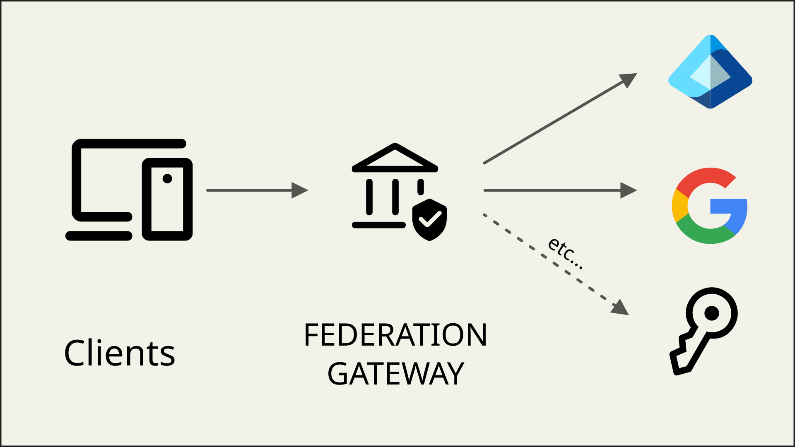

Federation means that your IdentityServer offers authentication methods that use external authentication providers.
When you offer a number of these external authentication methods, often the term *Federation Gateway* is used to describe
this architectural approach.



## Benefits Of A Federation Gateway

A federation gateway architecture shields your client applications from the complexities of your authentication
workflows and business requirements that go along with them.

Your clients only need to trust the gateway, and the gateway coordinates all the communication and trust relationships
with the external providers. This might involve switching between different protocols, token types, claim types etc.

You may federate with other enterprise identity systems like Active Directory, Azure AD, or with
commercial providers like Google, GitHub, or LinkedIn. Federation can bridge protocols, and use OpenID Connect (OIDC),
OAuth 2, SAML, WS-Federation, or any other protocol.

Also, the gateway can make sure that all claims and identities that ultimately arrive at the client applications are
trustworthy and in a format that the client expects.

## Multiple Authentication Methods For Users

With a federation gateway, you can offer your users flexible sign-in options based on their context or preference:

* **Consumer applications**: Username/password or commercial providers like Google or Microsoft Account
* **Hybrid applications**: Username/password or commercial providers for customers, and Active Directory or Azure AD for employees

## Integration Of On-premise Products With Customer Identity Systems

When building on-premise products, you have to integrate with a multitude of customer authentication systems.
Maintaining variations of your business software for each product you have to integrate with, makes your software hard
to maintain.

With a federation gateway, you only need to adapt to these external systems at the gateway level, all of your business
applications are shielded from the technical details.

## Software-as-a-Service (SaaS)

Federation is a common requirement in SaaS scenarios. It allows your customers' users to access your applications with
single sign-on, using their existing corporate credentials without explicitly creating new accounts in your identity system.

## Support For External Authentication Methods

IdentityServer leverages the ASP.NET Core authentication infrastructure for communicating with external providers. This
means any authentication system supported by ASP.NET Core can be used with IdentityServer, including:

* Commercial providers like Google, GitHub, and LinkedIn ([and many more](https://github.com/aspnet-contrib/AspNet.Security.OAuth.Providers))
* OpenID Connect providers
* SAML 2.0 systems
* WS-Federation systems

See the [Integrating with External Providers](/identityserver/ui/login/external.md) section for more details.

## Home Realm Discovery

Home Realm Discovery (HRD) is the process of selecting the most appropriate authentication workflow for a user,
especially when multiple authentication methods are available.

Since users are typically anonymous when they arrive at the federation gateway, you need some sort of hint to optimize
the login workflow. Such hint can come in many forms:

* You present a list of available authentication methods to the user. This works for simpler scenarios, but
  probably not if you have a lot of choices or if this would reveal your customers' authentication systems.
* You ask the user for an identifier, such as their email address. Based on that, you infer the external authentication
  method . This is a common technique for SaaS systems.
* The client application can give a hint to the gateway via a custom protocol parameter of IdentityServer's built-in
  support for the `idp` parameter on `acr_values`. In some cases, the client already knows the appropriate authentication
  method. For example, when your customers access your software via a customer-specific URL
  (see [here](/identityserver/reference/v8/endpoints/authorize.md#optional-parameters)), you can present a subset of
  available authentication methods to the user, or even redirect to a single option. See
  [Selecting An Identity Provider From The Client](#selecting-an-identity-provider-from-the-client-idp-acr_values) below
  for details.
* You restrict the available authentication methods per client in the client configuration using the
  `IdentityProviderRestrictions` property (see [here](/identityserver/reference/v8/models/client.md#authentication--session-management)).

Every system has unique requirements. Always start by designing the desired user experience, then select and combine
the appropriate HRD strategies to implement your required flow.

### Selecting An Identity Provider From The Client (idp: acr_values)

A client application can skip the login page and redirect directly to an external provider by passing the `idp`
value on `acr_values` in the authorize request. This lets a client bypass home realm discovery (HRD) entirely when it
already knows which authentication method the user needs.

#### Client (Application) Side

If you use the ASP.NET Core OpenID Connect handler to start the authentication request, you can set the `idp` value
by handling the `OnRedirectToIdentityProvider` event:

```csharp
options.Events.OnRedirectToIdentityProvider = ctx =>
{
    ctx.ProtocolMessage.AcrValues = "idp:Google";
    return Task.CompletedTask;
};
```

To make this dynamic, start the challenge from your application with the desired `idp` stashed on
`AuthenticationProperties`, for example in a controller action or minimal API endpoint:

```csharp
await HttpContext.ChallengeAsync(OpenIdConnectDefaults.AuthenticationScheme, new AuthenticationProperties
{
    RedirectUri = "/",
    Items = { ["idp"] = "Google" }
});
```

Then read that value back in `OnRedirectToIdentityProvider` and copy it onto the `acr_values` sent to IdentityServer:

```csharp
options.Events.OnRedirectToIdentityProvider = ctx =>
{
    if (ctx.Properties.Items.TryGetValue("idp", out var idp) && !string.IsNullOrEmpty(idp))
    {
        ctx.ProtocolMessage.AcrValues = $"idp:{idp}";
    }
    return Task.CompletedTask;
};
```

If you construct a raw authorize URL yourself instead of using the OIDC handler, add the URL-encoded value directly,
for example `&acr_values=idp%3AGoogle`.

If you use [Duende.BFF](/bff/index.mdx), the same `OnRedirectToIdentityProvider` event applies, since Duende.BFF uses
the standard ASP.NET Core OpenID Connect handler under the hood to talk to IdentityServer.

#### IdentityServer Login Page

On the login page, you can inspect the incoming authorization request to see whether an `idp` value was requested,
and if so, challenge that external scheme directly instead of showing the local login form:

```csharp
var context = await _interaction.GetAuthorizationContextAsync(returnUrl);

if (context?.IdP != null
    && context.IdP != IdentityServerConstants.LocalIdentityProvider
    && await _schemeProvider.GetSchemeAsync(context.IdP) != null)
{
    return Challenge(context.IdP, new AuthenticationProperties
    {
        RedirectUri = "/externallogin/callback",
        Items =
        {
            { "scheme", context.IdP },
            { "returnUrl", returnUrl }
        }
    });
}
```

`_interaction` is an instance of
[`IIdentityServerInteractionService`](/identityserver/reference/v8/services/interaction-service.md), `context` is
the `AuthorizationRequest` returned by `GetAuthorizationContextAsync`, and `_schemeProvider` is an
`IAuthenticationSchemeProvider` used to confirm the requested idp actually resolves to a registered scheme before
challenging it. The [Quickstart UI's Login page](https://github.com/DuendeSoftware/products/tree/main/identity-server/templates/src/UI/Pages/Account/Login/Index.cshtml.cs) already implements this automatically: when `context.IdP` resolves to
a single external provider, the page marks itself as external-login-only and redirects straight to that scheme,
skipping the login form.

#### Rules

The following rules are enforced by IdentityServer:

* The authorize request validator parses `acr_values` as a space-separated list, so `idp:` can be combined with
  `tenant:`, for example `acr_values=idp:Google tenant:acme`. The values are exposed as `AuthorizationRequest.IdP` and
  `AuthorizationRequest.Tenant`.
* If the client has `IdentityProviderRestrictions` and the requested idp isn't in the list, the validator logs a
  warning and removes the idp. `context.IdP` is then null, and no error is returned.
* If the user already has a session from a different idp than the one requested, the authorize interaction response
  generator shows the login page again (`IsLogin`), so the existing session isn't silently reused.

Your login page can implement some additional rules (included in the [Quickstart UI](/identityserver/quickstarts/2-interactive.md#add-the-ui)):

* IdentityServer does not redirect to the external provider by itself. It only exposes the value through
  `IIdentityServerInteractionService.GetAuthorizationContextAsync`. Your login page must read `context.IdP` and
  challenge that scheme, as in the snippet above.
* IdentityServer does not check that the idp value matches a registered authentication scheme. The quickstart login
  page resolves it with `IAuthenticationSchemeProvider.GetSchemeAsync(context.IdP)`. That also resolves dynamic
  provider schemes, because IdentityServer's dynamic scheme provider falls back to `IIdentityProviderStore`. If the
  scheme isn't found, the quickstart shows the regular login page. Custom login pages should do the same kind of
  check.
* `local` (`IdentityServerConstants.LocalIdentityProvider`) is a reserved value. The quickstart login page responds
  to `idp:local` by showing only the local login form and hiding external providers.