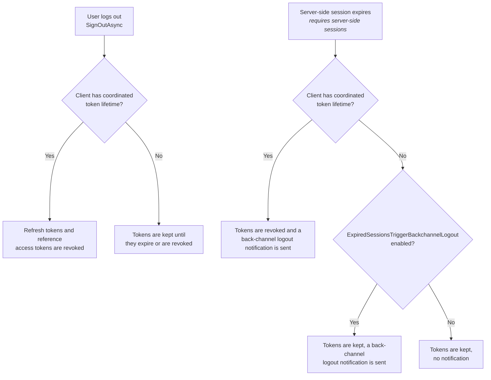

Learn how to correctly end a session in ASP.NET Core, including handling cookies and token revocation.

## Removing The Authentication Cookie

To remove the authentication cookie, use the ASP.NET Core `SignOutAsync` extension method on the `HttpContext`.
You will need to pass the scheme used (which is provided by `IdentityServerConstants.DefaultCookieAuthenticationScheme`
unless you have changed it):

```csharp
// LogOut.cshtml.cs
await HttpContext.SignOutAsync(
    Duende
        .IdentityServer
        .IdentityServerConstants
        .DefaultCookieAuthenticationScheme
);
```

Or you can use the overload that will sign out of the default authentication scheme:

```csharp
// LogOut.cshtml.cs
await HttpContext.SignOutAsync();
```

If you are integrating with ASP.NET Identity, sign out using its `SignInManager` instead:

```csharp
// LogOut.cshtml.cs
await _signInManager.SignOutAsync();
```

### Prompting The User To Logout

Typically, you should prompt the user to logout which requires a POST to remove the cookie.
Otherwise, an attacker could hotlink to your logout page causing the user to be automatically logged out.
This means you will need a page to prompt the user to logout.

If a `logoutId` is passed to the logout page and the returned `LogoutRequest`'s `ShowSignoutPrompt` is `false` then it
is safe to skip the prompt.
This would occur when the logout page is requested due to a validated client initiated logout via
the [end session endpoint](/identityserver/reference/v8/endpoints/end-session.md).
Your logout page process can continue as if the user submitted the post back to log out, in essence calling
`SignOutAsync`.

### External Logins

If your user has signed in with an external login, then it's likely that they should perform
an [external logout](/identityserver/ui/logout/external.md) of the external provider as well.

### Revoking Client Tokens At Logout

During a user's session, long-lived tokens (e.g. refresh tokens) might have been created for client applications.
If at logout time you would like to have those tokens revoked, then this can be done automatically by setting the
`CoordinateLifetimeWithUserSession` property on
the [client configuration](/identityserver/reference/v8/models/client.md#authentication--session-management), or globally
on the [IdentityServer Authentication Options](/identityserver/reference/v8/options.md#authentication).

When coordination is enabled for a client, IdentityServer removes that client's refresh tokens and reference access
tokens for the session that is ending. JWT access tokens cannot be revoked and remain valid until they expire.

`Authentication.CoordinateClientLifetimesWithUserSession` enables coordination for all clients. A client's own
`CoordinateLifetimeWithUserSession` value takes precedence over the global option.

Coordination does not require [server-side sessions](/identityserver/ui/server-side-sessions/index.md). Tokens are
revoked whenever `HttpContext.SignOutAsync` is called for the cookie scheme. With server-side sessions enabled,
tokens are also revoked when a session expires, and the client receives a back-channel logout notification. See
[Sessions that end without an explicit logout](/identityserver/ui/logout/cleanup-overview.md#sessions-that-end-without-an-explicit-logout).

The diagram below summarizes both paths:



Coordination does not revoke consents. To remove consents or other persisted grants, use the
[session management service](/identityserver/reference/v8/services/session-management-service.md)
or the [persisted grant service](/identityserver/reference/v8/services/persisted-grant-service.md).

A client can also revoke its own refresh tokens and reference access tokens by calling the
[revocation endpoint](/identityserver/reference/v8/endpoints/revocation.md). For an overview of what remains after
logout, see [What gets cleaned up at logout](/identityserver/ui/logout/cleanup-overview.md).
