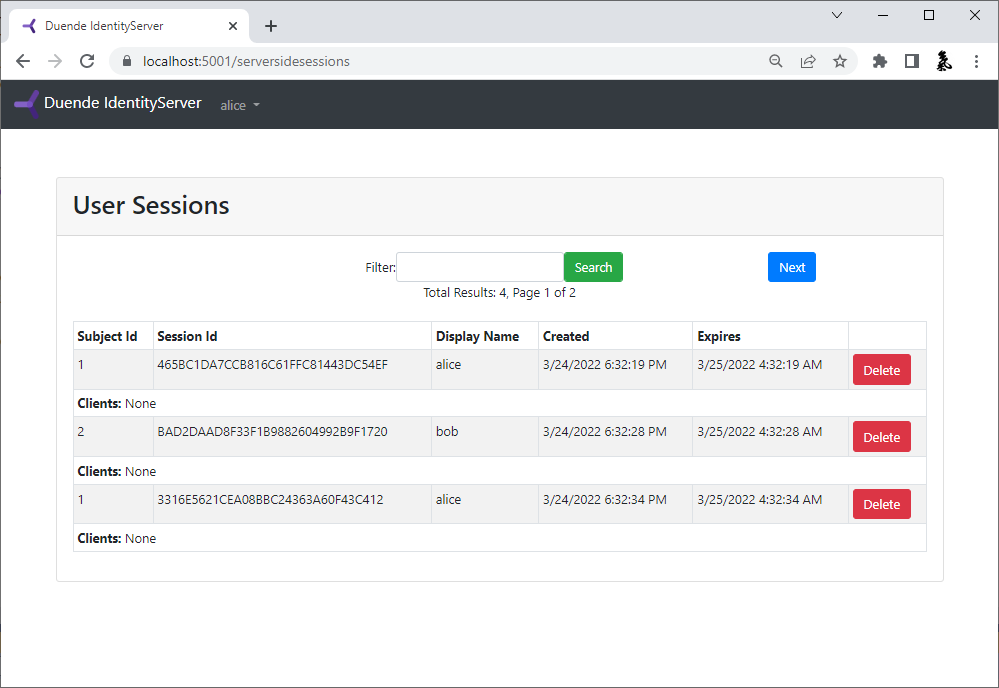

When using server-side sessions, there is a record of the user's authentication activity at IdentityServer.
This allows administrative and management tooling to be built on top of that data to query those sessions, and terminate them.
In addition, since the session data has its own unique id and tracks clients that a user has used, then some types of tokens issued to these clients can be revoked.
Finally, if clients support back-channel logout, then they can be notified that a user's session has been terminated, which allows them to also terminate the user's session within the client application.

These features are all provided via the `ISessionManagementService` service.

## ISessionManagementService

The [session management service](/identityserver/reference/v8/services/session-management-service.md) provides administrative operations for querying and revoking the server-side sessions.

### Quickstart UI

The Quickstart UI contains a simple administrative page (under the "ServerSideSessions" folder) that uses the `ISessionManagementService` API.

:::note
The Quickstart session administrative page requires a logged-in user to manage sessions. We strongly recommend that you add additional authorization suitable to your organization by adding an authorization policy.
:::

The session management page looks like this by default, but of course you are free to customize or change it as needed:




### Querying Sessions

Use the `QuerySessionsAsync` API to access a paged list of user sessions.
You can optionally filter on a user's claims mentioned above (subject identifier, session identifier, and/or display name).

For example:

```csharp
// Sessions.cshtml.cs
var userSessions = await _sessionManagementService.QuerySessionsAsync(new SessionQuery
{
    CountRequested = 10,
    SubjectId = "12345",
    DisplayName = "Bob",
}, HttpContext.RequestAborted);
```

The results returned contains the matching users' session data, and paging information (depending on if the store and backing database supports certain features such as total count and current page number).

This paging information contains a `ResultsToken` and allows subsequent requests for next or previous pages (set `RequestPriorResults` to true for the previous page, otherwise the next page is assumed):

```csharp
// Sessions.cshtml.cs
// this requests the first page
var userSessions = await _sessionManagementService.QuerySessionsAsync(new SessionQuery
{
    CountRequested = 10,
}, HttpContext.RequestAborted);

// this requests the next page relative to the previous results
userSessions = await _sessionManagementService.QuerySessionsAsync(new SessionQuery
{
    ResultsToken = userSessions.ResultsToken,
    CountRequested = 10,
}, HttpContext.RequestAborted);

// this requests the prior page relative to the previous results
userSessions = await _sessionManagementService.QuerySessionsAsync(new SessionQuery
{
    ResultsToken = userSessions.ResultsToken,
    RequestPriorResults = true,
    CountRequested = 10,
}, HttpContext.RequestAborted);
```

## How To Add Custom Session Metadata

The server-side session stores the user's `AuthenticationTicket`, including claims and the string values in
`AuthenticationProperties.Items`. Use `Items` for data that describes a specific sign-in, such as a device name,
authentication method, or region. This data stays inside IdentityServer and is not issued to clients as claims.

When using the standard IdentityServer UI, add the values to the `AuthenticationProperties` passed to `SignInAsync`:

```csharp
// Login.cshtml.cs
var properties = new AuthenticationProperties();
properties.Items["device_name"] = "Work laptop";
properties.Items["region"] = "eu-west";

var identityServerUser = new IdentityServerUser(user.SubjectId)
{
    DisplayName = user.Username
};

await HttpContext.SignInAsync(identityServerUser, properties);
```

When using ASP.NET Identity, pass the same properties to `SignInManager.SignInWithClaimsAsync`:

```csharp
// Login.cshtml.cs
var properties = new AuthenticationProperties();
properties.Items["device_name"] = "Work laptop";
properties.Items["region"] = "eu-west";

await _signInManager.SignInWithClaimsAsync(
    user,
    properties,
    additionalClaims: []);
```

If your login flow calls another `SignInManager` method, such as `PasswordSignInAsync`, use a custom `SignInManager`
and add the metadata in an override of `SignInWithClaimsAsync` so it is applied consistently to every sign-in.

:::caution
Session metadata is protected at rest with [ASP.NET Core Data Protection](/general/data-protection.md#data-protection-keys),
but it is still available to IdentityServer and session administration code. Do not store secrets, tokens, or data the
session does not need. Keep values small because the complete authentication ticket must be serialized and loaded when
the session is used. Treat metadata as informational, especially when a value came from the user or request. Do not use
it as the only input to an authorization decision.
:::

## Reading Custom Session Metadata

`QuerySessionsAsync` returns a `UserSession` for each matching session. Its `AuthenticationTicket` contains the
`AuthenticationProperties.Items` values saved at sign-in:

```csharp
// Sessions.cshtml.cs
var result = await _sessionManagementService.QuerySessionsAsync(
    new SessionQuery { SubjectId = "12345" },
    HttpContext.RequestAborted);

foreach (var session in result.Results)
{
    session.AuthenticationTicket.Properties.Items.TryGetValue(
        "device_name",
        out var deviceName);

    // Use deviceName in authorized session management or audit tooling.
}
```

Custom metadata is not indexed by the built-in session store, so you cannot filter `SessionQuery` by these values. Query
by subject ID, session ID, or display name first, then inspect the returned authentication tickets.

Use claims for identity data that must be evaluated by IdentityServer or issued to clients. Use session metadata for
values that belong to one sign-in, and keep durable profile data in your user store.


## Terminating Sessions

To terminate session(s) for a user, use the `RemoveSessionsAsync` API.
This accepts a `RemoveSessionsContext` which can filter on the subject and/or the session identifier to terminate.
It then also has flags for what to terminate or revoke.
This allows deleting a user's session record in the store, any associated tokens or consents in the [operational database](/identityserver/data/operational.md#grants), and/or notifying any clients via [back-channel logout](/identityserver/ui/logout/notification.md#back-channel-server-side-clients) that the user's session has ended.
There is also a list of client identifiers to control which clients are affected.

An example to revoke everything for current sessions for subject id `12345` might be:

```csharp
// Sessions.cshtml.cs
await _sessionManagementService.RemoveSessionsAsync(new RemoveSessionsContext { 
    SubjectId = "12345"
}, HttpContext.RequestAborted);
```

Or to just revoke all refresh tokens for current sessions for subject id `12345` might be:

```csharp
// Sessions.cshtml.cs
await _sessionManagementService.RemoveSessionsAsync(new RemoveSessionsContext { 
    SubjectId = "12345",
    RevokeTokens = true,
    RemoveServerSideSession = false,
    RevokeConsents = false,
    SendBackchannelLogoutNotification = false,
}, HttpContext.RequestAborted);
```

Internally this uses the `IServerSideTicketStore`, `IPersistedGrantStore` and `IBackChannelLogoutService` features from IdentityServer.

## Orphaned Grant Revocation on Session Overwrite

When a session cookie key is reused by a different user or a new session (that is, the subject ID or session ID stored in the cookie
no longer matches what is in the server-side store), IdentityServer automatically revokes the grants that belonged to the previous
session before writing the new one. The grants revoked are:

* refresh tokens
* reference tokens
* authorization codes
* backchannel authentication requests

This prevents tokens from a previous user's session from remaining valid after the session is overwritten. Without this cleanup,
a user whose session was silently replaced could retain working tokens even though their session no longer exists in the store.
