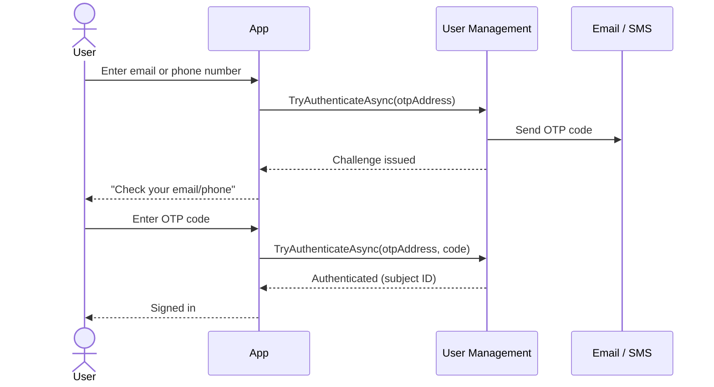

import { Steps } from "@astrojs/starlight/components";

OTP (One-Time Password) authentication is a passwordless flow where users receive a temporary verification code via email or SMS. No passwords to manage, and the code itself proves ownership of the delivery address.

## When to Use OTP Authentication

**Good for:**

* Consumer applications where users prefer passwordless options.
* Infrequent logins where users are unlikely to remember a password.
* Quick onboarding flows that require no registration form.
* Email or phone ownership verification.
* Low-to-moderate security requirements.

**Not ideal for:**

* High-security applications where channel interception is a concern.
* Offline scenarios that require no network connectivity.
* High-frequency logins where the context switch to email or SMS creates too much friction.
* Regulated industries where OTP may not satisfy compliance requirements.

For a comparison of all authentication methods, see [Choosing an Authentication Method](/identityserver/usermanagement/authentication/overview#choosing-an-authentication-method).

## How It Works

The OTP authentication flow has two main steps.

### Step 1: Code Generation and Delivery

<Steps>
1. **User enters identifier** - The user provides their email address or phone number.

2. **Code generation** - User Management generates a cryptographically secure random code (8 characters, alphanumeric base32 by default).

3. **Code delivery** - The code is sent to the user via the configured channel (email or SMS).

4. **Token creation** - User Management creates an `OtpToken` that links the code to the authentication attempt.

5. **Token storage** - The application stores the token (typically in an encrypted cookie) for use during verification.
</Steps>

### Step 2: Code Verification

<Steps>
1. **User enters code** - The user retrieves the code from their email or SMS and enters it.

2. **Code validation** - User Management verifies the code matches the stored token and has not expired.

3. **User lookup or creation** - The user is automatically created if this is their first authentication with this address.

4. **Session establishment** - A local authentication session is created.
</Steps>

The One-Time Password (OTP) login flow sends a code to the user's email or phone, then verifies it:



## Key Components

### IOtpAuthenticator Interface

`IOtpAuthenticator` is the primary interface for OTP send and verify operations:

```csharp
public interface IOtpAuthenticator
{
    // Generate and send an OTP code to the given address
    Task<SendOtpResult?> TrySendOtpAsync(OtpAddress address, CancellationToken ct);

    // Verify an OTP code; returns an OtpAuthenticationResult discriminated union
    Task<OtpAuthenticationResult> TryAuthenticateAsync(PlainTextOtp otp, OtpToken token, CancellationToken ct);
}
```

`TrySendOtpAsync` returns a `SendOtpResult` that carries the token and expiry information when the code was sent, or rate-limit information when sending was blocked.

`TryAuthenticateAsync` returns an `OtpAuthenticationResult`, which is a discriminated union with two subtypes:
* `OtpAuthenticationResult.Success` (containing the `Address` and the `UserSubjectId`)
* `OtpAuthenticationResult.Failure` on failure

### Supporting Types

`OtpAddress` - Combines a channel and a subject identifier (e.g., an email address):

```csharp
public sealed record OtpAddress(OtpChannel Channel, SubjectId SubjectId);
```

`OtpChannel` - The delivery mechanism:

```csharp
public record OtpChannel
{
    public static OtpChannel Email { get; }  // Deliver via email
    public static OtpChannel Sms { get; }    // Deliver via SMS
}
```

`OtpToken` - Opaque token linking a code to an authentication attempt:

```csharp
public record OtpToken
{
    public static OtpToken Create(string input);
    public override string ToString();
}
```

`PlainTextOtp` - The verification code entered by the user:

```csharp
public record PlainTextOtp
{
    public static PlainTextOtp Create(string value);
    public static bool TryCreate(string? input, [NotNullWhen(true)] out PlainTextOtp? result);
}
```

`SendOtpResult` - The result of a send attempt:

```csharp
public sealed record SendOtpResult
{
    public bool Sent { get; }                        // True when the code was sent
    public OtpToken? Token { get; }                  // Set when Sent is true
    public TimeSpan? ExpiresAfter { get; }           // Set when Sent is true
    public DateTimeOffset? ExpiresAtUtc { get; }     // Set when Sent is true
    public TimeSpan SendingBlockedFor { get; }       // How long until sending is allowed again
    public DateTimeOffset SendingBlockedUntilUtc { get; }
}
```

### IUserAuthenticatorsSelfService Interface

`IUserAuthenticatorsSelfService` handles user lookup, registration, and OTP address management:

```csharp
public interface IUserAuthenticatorsSelfService
{
    // Look up a user by their subject ID
    Task<UserAuthenticators?> TryGetAsync(UserSubjectId subjectId, CancellationToken ct);

    // OTP address management
    Task<bool> TryAddOtpAddressAsync(UserSubjectId subjectId, OtpAddress address, CancellationToken ct);
    Task<bool> TryReplaceOtpAddressAsync(UserSubjectId subjectId, OtpAddress oldAddress, OtpAddress newAddress, CancellationToken ct);
    Task<bool> TryRemoveOtpAddressAsync(UserSubjectId subjectId, OtpAddress address, CancellationToken ct);
}
```

## Configuration

### Registering the SMTP OTP Sender

OTP delivery requires configuring a sender. Use `UseSmtpOtpSender` on the authentication builder to configure the built-in SMTP sender:

```csharp title="Program.cs"
using Duende.UserManagement;

builder.Services
    .AddIdentityServer()
    .AddUserManagement(um => um
        .EnableAuthentication(auth =>
        {
            auth.UseSmtpOtpSender(options =>
            {
                options.Host = "smtp.example.com";
                options.Port = 587;
                options.EnableSsl = true;
                options.FromEmail = "noreply@example.com";
                options.FromName = "My Application";
                options.Domain = "example.com";
            });
        })
    );
```

### Custom OTP Sender

Implement `IOtpSender` to deliver codes via a custom channel (e.g., an SMS gateway or a transactional email service):

```csharp
public interface IOtpSender
{
    bool CanSend(OtpAddress address);

    Task SendAsync(OtpAddress address, PlainTextOtp otp, TimeSpan expiresAfter, Ct ct);
}
```

Register the custom sender using `UseOtpSender<T>`:

```csharp title="Program.cs"
using Duende.UserManagement;

builder.Services
    .AddIdentityServer()
    .AddUserManagement(um => um
        .EnableAuthentication(auth =>
        {
            auth.UseOtpSender<MyCustomOtpSender>();
        })
    );
```

## Implementation Patterns

The following examples show common OTP workflows using Razor Pages and Duende User Management.

### Basic OTP Login

The following example shows a two-step OTP login using Razor Pages. Inject `IOtpAuthenticator` into your page model.

<Steps>
1. **Send the OTP:**

   ```csharp
   public async Task<IActionResult> OnPostSendOtpAsync(string email)
   {
       if (!EmailAddress.TryCreate(email, out var emailAddress))
           return Error("Invalid email address");

       var address = new OtpAddress(OtpChannel.Email, emailAddress);

       var result = await otpAuthenticator.TrySendOtpAsync(
           address,
           HttpContext.RequestAborted);

       if (result == null || !result.Sent)
           return Error("Failed to send verification code. Please try again later.");

       // Store the token and address in an encrypted cookie for the verify step
       StoreCookie("otp_token", result.Token.Value.ToString());
       StoreCookie("otp_email", email);

       return RedirectToPage("/Verify");
   }
   ```

2. **Verify the OTP:**

   ```csharp
   public async Task<IActionResult> OnPostVerifyAsync(string code)
   {
       var tokenValue = GetCookie("otp_token");
       var email = GetCookie("otp_email");

       if (!PlainTextOtp.TryCreate(code, out var otp))
           return Error("Invalid code format");

       var authResult = await otpAuthenticator.TryAuthenticateAsync(
            otp,
           OtpToken.Create(tokenValue),
           HttpContext.RequestAborted);

       if (authResult is not OtpAuthenticationResult.Success otpSuccess)
           return Error("Invalid or expired code");

       var claims = new List<Claim>
       {
           new(ClaimTypes.NameIdentifier, otpSuccess.UserSubjectId.Value),
           new(ClaimTypes.Name, otpSuccess.Address.Value),
       };

       await SignIn(new ClaimsPrincipal(
           new ClaimsIdentity(claims, CookieAuthenticationDefaults.AuthenticationScheme)));
       ClearCookies();

       return RedirectToPage("/Index");
   }
   ```
</Steps>

### Auto-Registration

When a user authenticates via OTP for the first time, User Management automatically creates a `UserAuthenticators` record
and a user profile. The profile is initialized with the email attribute from the OTP address. You do not need a separate sign-up flow.

`TryRegisterAsync` on `IUserAuthenticatorsSelfService` is still available for programmatic registration scenarios,
such as importing users from an external system or linking an external authenticator to an existing account.

:::note[Skipping auto-registration]
There is no built-in configuration flag to disable automatic user creation. If you need to control this behavior,
for example to require an explicit invitation before a user can sign in, you can provide a custom `IOtpAuthenticator`
implementation and register it with the service provider:

```csharp title="Program.cs"
builder.Services.AddTransient<IOtpAuthenticator, MyCustomOtpAuthenticator>();
```

Your implementation can check whether the user already exists before completing authentication
and return `OtpAuthenticationResult.Failure.Instance` for unknown addresses.
:::

### Managing OTP Addresses

Users can have multiple OTP addresses (e.g., both an email and a phone number). Use the address management methods on `IUserAuthenticatorsSelfService` to add, replace, or remove addresses:

```csharp
// Add a second OTP address (e.g., a phone number) to an existing user
var phoneAddress = new OtpAddress(OtpChannel.Sms, PhoneNumber.Create("+15551234567"));
await userAuthenticatorsSelfService.TryAddOtpAddressAsync(
    subjectId,
    phoneAddress,
    HttpContext.RequestAborted);

// Replace an existing OTP address (e.g., after an email change)
var oldAddress = new OtpAddress(OtpChannel.Email, EmailAddress.Create("old@example.com"));
var newAddress = new OtpAddress(OtpChannel.Email, EmailAddress.Create("new@example.com"));
await userAuthenticatorsSelfService.TryReplaceOtpAddressAsync(
    subjectId,
    oldAddress,
    newAddress,
    HttpContext.RequestAborted);

// Remove an OTP address
await userAuthenticatorsSelfService.TryRemoveOtpAddressAsync(
    subjectId,
    phoneAddress,
    HttpContext.RequestAborted);
```

### Handling Rate Limiting

User Management enforces a minimum interval between OTP sends. When sending is blocked, `SendOtpResult.Sent` is `false` and `SendingBlockedUntilUtc` indicates when the user may request a new code:

```csharp
var result = await otpAuthenticator.TrySendOtpAsync(address, HttpContext.RequestAborted);

if (result == null)
    return Error("OTP send failed unexpectedly");

if (!result.Sent)
{
    var retryAt = result.SendingBlockedUntilUtc.ToLocalTime();
    return Error($"Please wait until {retryAt:t} before requesting a new code.");
}

// result.Sent == true; proceed with storing the token
StoreCookie("otp_token", result.Token.Value.ToString());
```

## Security

OTP is a good default for consumer applications: passwordless, and requires no app install. The trade-off is that its security depends entirely on the delivery channel. If someone can read your email or intercept your SMS, they can log in as you.

### What User Management Does for You

The OTP workflow enforces limits that are not configurable but are deliberately conservative: a maximum of 5 verification attempts per token (a 6-digit code has a million possible values, so 5 guesses is not a meaningful attack surface), a minimum of 1 minute between sends to prevent flooding, and a 5-minute code expiry to limit the window during which an intercepted code is useful. Codes are stored as PBKDF2 hashes, so a stolen database row is useless to an attacker. Verification uses constant-time comparison to prevent timing-based enumeration.

### What You Need to Think About

The delivery channel is outside User Management's control. Email is generally more secure than SMS. SIM-swapping attacks, where an attacker convinces a carrier to transfer a phone number to a new SIM, are a real and documented threat. For sensitive applications, prefer email and consider adding a warning in your OTP email template asking users not to forward it. Users who auto-forward all email to a secondary account are effectively sharing their OTP codes with whoever controls that account.

OTP is a single factor. For high-value accounts, pair it with TOTP or a passkey. A user who can receive an OTP email is authenticated, but that is a lower bar than you might want for a financial application.

Reflect the built-in rate limits in your UI: show a countdown timer for code expiry, disable the "Resend" button during the cooldown period, and display the number of remaining verification attempts.

For cross-cutting security topics (data protection key persistence, throttling configuration, and password hashing) see [Security Considerations](/identityserver/usermanagement/fundamentals/security.md).
