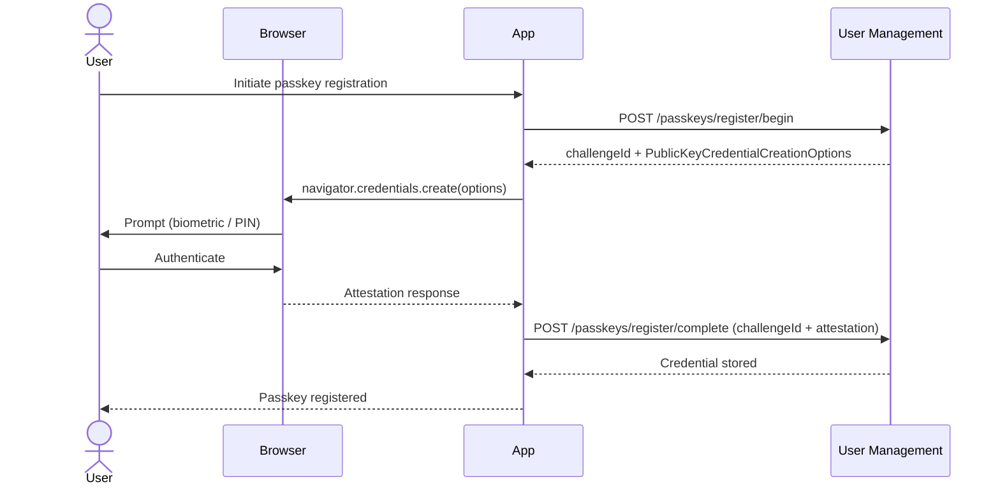
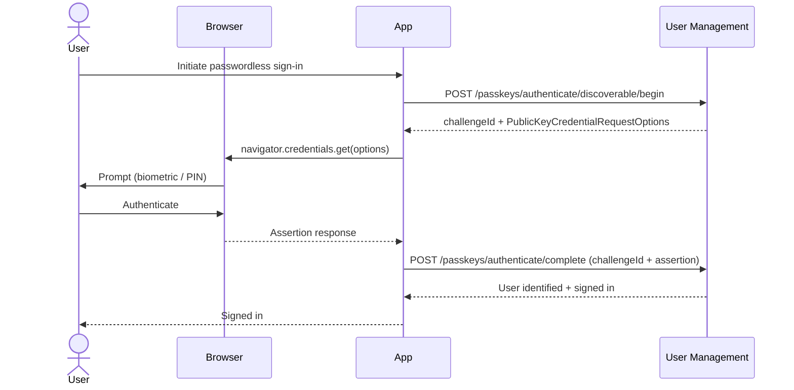
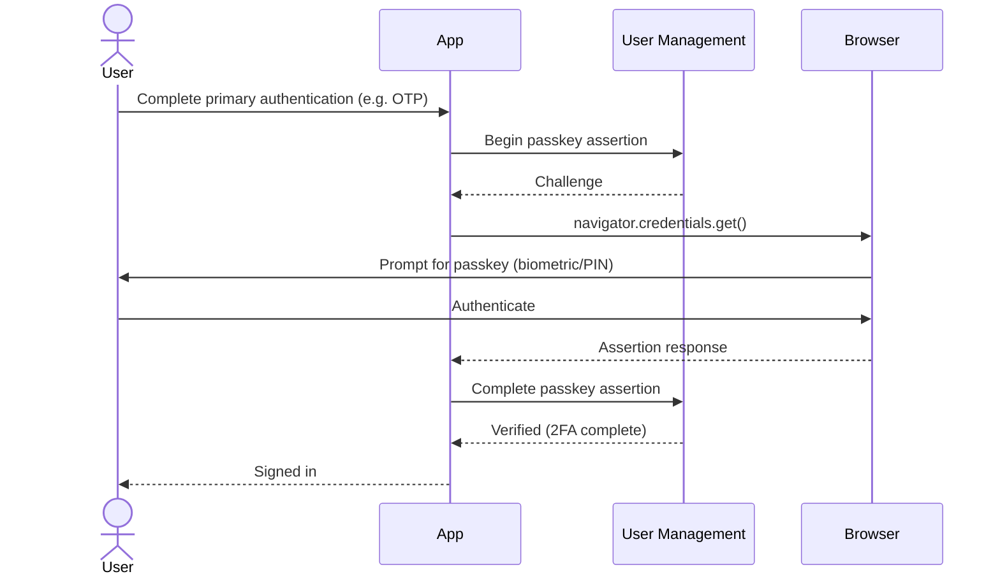

Passkeys provide phishing-resistant, passwordless authentication using the WebAuthn/FIDO2 standard. Authentication can use biometrics (fingerprint, face recognition), a device PIN, or a hardware security key. Credentials are cryptographically bound to the origin, so they cannot be used on a different site.

**Learn more:** [passkeys.dev](https://passkeys.dev/) (FIDO Alliance resource site) · [WebAuthn specification](https://www.w3.org/TR/webauthn-3/) (W3C) · [FIDO Alliance](https://fidoalliance.org/) (standards body)

## When to Use Passkeys

**Strongly recommended for:**

* High-security applications (financial services, healthcare, government)
* Any application where phishing resistance is a priority
* Applications targeting modern devices and browsers

:::tip[FAPI Conformance]
For applications requiring FAPI (Financial-grade API) compliance, Duende offers [FAPI 2.0 support](/identityserver/tokens/fapi-2-0-specification.md) for IdentityServer, which extends security with additional requirements aligned to financial-grade standards. See also the [conformance report](/identityserver/diagnostics/conformance-report.md).
:::

**Good for:**

* Consumer applications (passkeys are natively supported on modern iOS, Android, macOS, and Windows)
* Enterprise applications replacing hardware tokens
* Applications looking to eliminate password management overhead

**Considerations:**

* Requires browser and device support for WebAuthn (broadly available in all modern browsers and operating systems)
* Users need a fallback authentication method if they lose access to their device
* Discoverable credentials require authenticator support for resident keys

## Passkeys vs Other Authentication Methods

| Aspect                  | Passkeys       | Time-Based One-Time Password (TOTP) | Password   |
|-------------------------|----------------|-------------------------------------|------------|
| **Phishing resistance** | Excellent      | High                                | None       |
| **User experience**     | Excellent      | Moderate                            | Moderate   |
| **Device dependency**   | Yes            | Yes (app)                           | No         |
| **Offline support**     | Yes            | Yes                                 | Yes        |
| **Shared secret**       | No             | Yes                                 | Yes        |
| **Replay attacks**      | Not vulnerable | Not vulnerable                      | Vulnerable |
| **Setup complexity**    | Low            | Moderate                            | Low        |

## How It Works

WebAuthn calls its two main protocol flows *ceremonies*. The **registration ceremony** creates a new credential on the user's device and registers the public key with your server. The **authentication ceremony** proves the user still controls the device by signing a server challenge with the stored private key.

### Registration Ceremony

1. **User initiates passkey creation** - From account settings or during sign-up
2. **Challenge generation** - The server generates a cryptographic challenge
3. **Authenticator interaction** - The user's device creates a public/private key pair
4. **Credential storage** - The public key and credential ID are stored server-side
5. **Private key retention** - The private key never leaves the user's device

### Authentication Ceremony

1. **Challenge generation** - The server generates a cryptographic challenge
2. **Authenticator interaction** - The user's device signs the challenge with the private key
3. **Signature verification** - The server verifies the signature using the stored public key
4. **Session establishment** - Authentication is complete

### Discoverable Credentials

Discoverable credentials (also called resident keys) allow passwordless login without entering a username first. The authenticator stores the credential and can present it automatically when the relying party requests authentication.

## Authenticator Types

* **Platform authenticators** - Built into the device (Touch ID, Face ID, Windows Hello). Convenient but tied to a specific device.
* **Cross-platform authenticators** - Separate hardware security keys (YubiKey, Titan Security Key). Work across devices but require carrying the key.

## Security Properties

Passkeys are the strongest authentication option in User Management, and the one with the fewest caveats. The private key never leaves the device, credentials are bound to your specific origin so they cannot be phished, and every authentication uses a unique challenge so replaying a captured response does not work. If you can use passkeys, you should.

### What User Management Does for You

Credentials are cryptographically bound to the relying party ID and origin. A passkey registered at `auth.example.com` cannot be used at `evil.example.com`, even if an attacker controls a subdomain. The server stores only the public key, so a database breach gives an attacker nothing useful. Challenges are 32 bytes (256 bits) of random data, expire after 5 minutes, and are single-use. There is no shared secret to steal, no code to intercept, and no password to guess.

### What You Need to Think About

Most passkey security issues come from misconfiguration rather than protocol weaknesses.

`AllowedOrigins` is required and must be set explicitly. An overly broad list weakens origin binding, which is the core security property of passkeys. List only the exact origins your application uses.

If you want a passkey registered at `auth.example.com` to work at `app.example.com`, set `ServerDomain` to `"example.com"`. Without it, each subdomain is treated as a separate relying party and the passkey will not work across them.

The default `UserVerificationRequirement` is `"preferred"`, which means authentication can succeed without a PIN or biometric if the authenticator does not support user verification. For high-assurance scenarios (financial applications, admin interfaces, anything sensitive) set it to `"required"`.

For regulated environments where you need to know exactly what kind of authenticator your users are using, set `AttestationConveyancePreference` to `"direct"` and verify the attestation statement. This lets you enforce an allowlist of approved authenticator models.

For cross-cutting security topics (data protection key persistence and throttling configuration) see [Security Considerations](/identityserver/usermanagement/fundamentals/security.md).

## Configuration

### Service Registration

Passkey support involves two registration steps:

1. **`AddUserManagement()`** automatically registers the core passkey services: cryptographic signature verification (ES256, ES384, ES512, RS256, RS384, RS512, PS256, PS384, PS512, RS1), WebAuthn registration and authentication ceremonies, credential storage, and challenge management. Use `Authentication(configure => ...)` to configure options when you want to drive the passkey flow yourself without the built-in HTTP endpoints.
2. **`MapUserManagement()`** maps the web layer, including the passkey HTTP endpoints (`/passkeys/register/begin`, `/passkeys/register/complete`, `/passkeys/authenticate/begin`, `/passkeys/authenticate/complete`) and the JavaScript helper (`/passkeys/js`).

Using `Authentication(configure => ...)` to configure passkey options:

```csharp title="Program.cs"
using Duende.IdentityServer;
using Duende.UserManagement;

builder.Services
    .AddIdentityServer()
    .AddUserManagement(um => um
        .Authentication(auth =>
        {
            auth.Configure(options =>
            {
                options.Passkeys.RelyingPartyName = "My Application";
                options.Passkeys.ServerDomain = "example.com";
            });
        })
    );
```

This gives you access to `IPasskeyCeremonies`, `IUserAuthenticatorsSelfService`, and the other core services via dependency injection, but does not expose any HTTP endpoints. This is useful if you want to build your own API layer or integrate passkeys into an existing controller/endpoint structure.

If you are building a web application and want the ready-to-use passkey endpoints, call `MapUserManagement()` on your endpoint route builder:

```csharp title="Program.cs"
using Duende.IdentityServer;
using Duende.UserManagement;

builder.Services
    .AddIdentityServer()
    .AddUserManagement();

// After building the app:
var app = builder.Build();
app.MapUserManagement();
```

:::note
`MapUserManagement()` maps all User Management HTTP endpoints, including passkey registration and authentication ceremonies.
:::

### Passkey Options

Configure passkey behavior using `PasskeyOptions`, accessible via `UserAuthenticationOptions.Passkeys`. Use the `Configure` method on the authentication builder:

```csharp title="Program.cs"
using Duende.IdentityServer;
using Duende.UserManagement;

builder.Services
    .AddIdentityServer()
    .AddUserManagement(um => um
        .Authentication(auth =>
        {
            auth.Configure(options =>
            {
                options.Passkeys.RelyingPartyName = "My Application";
                options.Passkeys.ServerDomain = "example.com";
            });
        })
    );
```

All `PasskeyOptions` properties and their defaults:

| Property                          | Type                     | Default       | Description                                                        |
|-----------------------------------|--------------------------|---------------|--------------------------------------------------------------------|
| `RelyingPartyName`                | `string`                 | Assembly name | Human-readable name shown during registration                      |
| `ServerDomain`                    | `string?`                | `null`        | Relying party ID (domain). Set to share passkeys across subdomains |
| `AllowedOrigins`                  | `IReadOnlyList<string>?` | `null`        | Fully-qualified origins permitted to use passkeys                  |
| `UserVerificationRequirement`     | `string`                 | `"preferred"` | Whether user verification (PIN/biometric) is required              |
| `AttestationConveyancePreference` | `string`                 | `"none"`      | Whether attestation statements are requested                       |
| `AuthenticatorAttachment`         | `string?`                | `null`        | Restrict to `"platform"` or `"cross-platform"` authenticators      |
| `ResidentKeyRequirement`          | `string`                 | `"preferred"` | Whether discoverable credentials are required                      |
| `ChallengeSize`                   | `int`                    | `32`          | Challenge size in bytes                                            |
| `ChallengeTimeout`                | `TimeSpan`               | 5 minutes     | How long a challenge remains valid                                 |
| `SupportedAlgorithms`             | `IReadOnlyList<int>`     | `[]` (all)    | COSE algorithm identifiers, in preference order                    |

## Core Passkey Management

Passkey credentials are managed through `IUserAuthenticatorsSelfService`. This interface handles the persistence of credentials after the WebAuthn ceremony completes.

### Adding a Passkey

After a successful registration ceremony, persist the credential:

```csharp
Task<bool> TryAddPasskeyAsync(
    UserSubjectId subjectId,
    PasskeyCredentialData credential,
    CancellationToken ct);
```

`PasskeyCredentialData` is returned from a completed registration ceremony and contains:

* `CredentialId` - Strongly-typed `PasskeyCredentialId` (byte array, max 1023 bytes)
* `PublicKeyCose` - The COSE-encoded public key
* `Algorithm` - COSE algorithm identifier
* `SignCount` - Initial signature counter value
* `BackupEligible` - Whether the credential can be backed up
* `BackedUp` - Whether the credential is currently backed up
* `Aaguid` - Authenticator AAGUID (identifies the authenticator model)
* `CreatedAt` - Registration timestamp
* `Name` - Display name for the credential

Returns `true` if the credential was stored successfully, `false` if the user was not found or the credential already exists.

### Removing a Passkey

Remove a specific passkey by its credential ID:

```csharp
Task<bool> TryRemovePasskeyAsync(
    UserSubjectId subjectId,
    PasskeyCredentialId credentialId,
    CancellationToken ct);
```

Returns `true` if the credential was removed, `false` if the user or credential was not found.

### Listing Registered Passkeys

Retrieve a user's registered passkeys via `TryGetAsync`:

```csharp
var authenticators = await selfService.TryGetAsync(userId, ct);

// authenticators.Passkeys is IReadOnlyCollection<UserPasskey>
foreach (var passkey in authenticators?.Passkeys ?? [])
{
    Console.WriteLine($"Credential: {passkey.Name}, registered: {passkey.CreatedAt}");
    Console.WriteLine($"Credential ID: {passkey.CredentialId}");
}
```

`UserPasskey` exposes:

* `CredentialId` - The `PasskeyCredentialId` for removal operations
* `Name` - Display name for the credential
* `CreatedAt` - When the credential was registered

## Web Endpoints

When `AddUserManagement()` is called, the following HTTP endpoints are registered automatically to handle the WebAuthn ceremony protocol:

| Endpoint                          | Method | Default Path                                | Description                                                        |
|-----------------------------------|--------|---------------------------------------------|--------------------------------------------------------------------|
| Begin Registration                | `POST` | `/passkeys/register/begin`                  | Starts a registration ceremony for the authenticated user          |
| Complete Registration             | `POST` | `/passkeys/register/complete`               | Validates the attestation response and stores the credential       |
| Begin Authentication (2nd factor) | `POST` | `/passkeys/authenticate/begin`              | Starts an authentication ceremony for a known user (second-factor) |
| Begin Discoverable Authentication | `POST` | `/passkeys/authenticate/discoverable/begin` | Starts a usernameless authentication ceremony                      |
| Complete Authentication           | `POST` | `/passkeys/authenticate/complete`           | Validates the assertion response and signs the user in             |
| JavaScript Helper                 | `GET`  | `/passkeys/js`                              | Serves the built-in passkeys JavaScript helper                     |

The Begin Registration and Complete Registration endpoints require an authenticated user (they use `RequireAuthorization()`). The authentication endpoints are unauthenticated; they establish the session.

### Configuring Endpoint Routes

Customize endpoint paths using `UserAuthenticationEndpointOptions` and `PasskeysRouteOptions`:

```csharp title="Program.cs"
using Duende.IdentityServer;
using Duende.UserManagement;

builder.Services
    .AddIdentityServer()
    .AddUserManagement(um => um
        .Authentication(auth =>
        {
            auth.ConfigureEndpoints(options =>
            {
                // Base route prefix for all passkey endpoints (default: "/passkeys")
                options.Passkeys.Route = "/passkeys";

                // Registration endpoints (relative to Route)
                options.Passkeys.BeginRegistration = "/register/begin";
                options.Passkeys.CompleteRegistration = "/register/complete";

                // Authentication endpoints (relative to Route)
                options.Passkeys.BeginAuthentication = "/authenticate/begin";
                options.Passkeys.BeginDiscoverableAuthentication = "/authenticate/discoverable/begin";
                options.Passkeys.CompleteAuthentication = "/authenticate/complete";

                // JavaScript helper endpoint (relative to Route)
                options.Passkeys.PasskeysJavaScript = "/js";
            });
        })
    );
```

Configuration can also be loaded from `appsettings.json`:

```csharp title="Program.cs"
using Duende.IdentityServer;
using Duende.UserManagement;

builder.Services
    .AddIdentityServer()
    .AddUserManagement(um => um
        .Authentication(auth =>
        {
            auth.ConfigureEndpoints(
                builder.Configuration.GetSection("UserAuthentication:Endpoints"));
        })
    );
```

`PasskeysRouteOptions` properties:

| Property                          | Default                            | Description                                                |
|-----------------------------------|------------------------------------|------------------------------------------------------------|
| `Route`                           | `/passkeys`                        | Base route prefix for all passkey endpoints                |
| `BeginRegistration`               | `/register/begin`                  | Path for the begin registration endpoint                   |
| `CompleteRegistration`            | `/register/complete`               | Path for the complete registration endpoint                |
| `BeginAuthentication`             | `/authenticate/begin`              | Path for the begin authentication endpoint (second-factor) |
| `BeginDiscoverableAuthentication` | `/authenticate/discoverable/begin` | Path for the begin discoverable authentication endpoint    |
| `CompleteAuthentication`          | `/authenticate/complete`           | Path for the complete authentication endpoint              |
| `PasskeysJavaScript`              | `/js`                              | Path for the JavaScript helper endpoint                    |

### Ceremony Protocol

The endpoints implement the WebAuthn ceremony protocol:

**Registration:**

1. Client calls `POST /passkeys/register/begin` - receives a `challengeId` and `PublicKeyCredentialCreationOptions`
2. Client passes the options to `navigator.credentials.create()`
3. Client calls `POST /passkeys/register/complete` with the `challengeId` and the authenticator's attestation response
4. Server validates the attestation and stores the credential

Here's how the registration ceremony flows between the browser, your application, and User Management:



**Authentication (discoverable):**

1. Client calls `POST /passkeys/authenticate/discoverable/begin` - receives a `challengeId` and `PublicKeyCredentialRequestOptions`
2. Client passes the options to `navigator.credentials.get()`
3. Client calls `POST /passkeys/authenticate/complete` with the `challengeId` and the authenticator's assertion response
4. Server validates the assertion, looks up the user, and signs them in

The discoverable authentication ceremony lets users sign in without entering a username first:



## JavaScript Helper

The built-in JavaScript helper is served at `/passkeys/js` (configurable via `PasskeysJavaScript`). It provides browser-side utilities for interacting with the WebAuthn API and the ceremony endpoints.

:::note
Passkey routes (including `/passkeys/js`) are only available when `AddUserManagement()` has been called during service registration and `app.MapUserManagement()` has been called on the endpoint route builder.
:::

Include it in your HTML:

```html
<script src="/passkeys/js" asp-append-version="true"></script>
```

The default path is `/passkeys/js`, but this can be customized via `PasskeysRouteOptions`. If you have overridden the route, update the `src` attribute accordingly or read the path from the options.

:::tip
The `asp-append-version="true"` attribute appends a content-based version hash to the URL (e.g., `/passkeys/js?v=abc123`), ensuring browsers fetch the latest version after updates.
This is an ASP.NET Core [Tag Helper](https://learn.microsoft.com/aspnet/core/mvc/views/tag-helpers/built-in/script-tag-helper) feature and requires the Razor view or its layout to include `@addTagHelper *, Microsoft.AspNetCore.Mvc.TagHelpers`.
:::

The JavaScript helper handles:

* Calling the begin/complete endpoints
* Invoking `navigator.credentials.create()` and `navigator.credentials.get()`
* Encoding and decoding Base64URL values required by the WebAuthn API
* Routing requests to the correct endpoint URLs (injected at build time from `PasskeysRouteOptions`)

## Second-Factor Passkey Authentication

By default, passkeys are used as the **primary authenticator**: the user proves their identity with a passkey alone, and the ceremony establishes the session. This is the recommended flow for most applications because it is phishing-resistant and requires no password.

However, some applications need a **layered authentication model** where a passkey is used as a *second factor* on top of an existing first factor (password, OTP, smart card, etc.). Common reasons include:

* **Regulatory requirements**: certain compliance frameworks mandate two distinct authentication factors, each from a different category (knowledge, possession, inherence).
* **Gradual migration**: you want to add passkey step-up to an existing password-based login without replacing it entirely.
* **High-assurance flows**: admin consoles or financial transactions where you want both a password and a biometric confirmation.

In this mode, the user first completes their primary authentication step. Your application stores the partially-authenticated user's identity in a temporary store (session, distributed cache, etc.). The client then calls the second-factor begin endpoint, which scopes the WebAuthn challenge to that specific user's registered passkeys. The user completes the passkey ceremony, and the server signs them in.

The key difference from primary passkey auth is that the server already knows *who* is authenticating before the WebAuthn ceremony starts. This is why a resolver interface is required: User Management needs your application to hand it the user identity that was established in the first factor.

The second-factor begin endpoint (`PasskeyBeginAuthenticationForSecondFactorEndpoint`) is only registered when you configure a resolver; it is not active by default. This prevents the endpoint from being called without a first-factor context in place.

Passkeys can be used as a second factor after a primary authentication step (for example, after password or One-Time Password (OTP) verification). This requires implementing `ISecondFactorPasskeyAuthenticationResolver` to identify the partially-authenticated user.

### ISecondFactorPasskeyAuthenticationResolver

```csharp
public interface ISecondFactorPasskeyAuthenticationResolver
{
    /// <summary>
    /// Resolves the user that completed the first factor and is participating
    /// in the passkey second-factor ceremony.
    /// </summary>
    Task<UserSubjectId?> ResolveAsync(CancellationToken ct);
}
```

Implement this interface to retrieve the user's `UserSubjectId` from your intermediate authentication state (for example, from a session, cookie, or distributed cache):

```csharp
public class CustomSecondFactorResolver : ISecondFactorPasskeyAuthenticationResolver
{
    // Note: In a real application, use a distributed cache or database
    // to persist pending user IDs across requests.
    private static readonly ConcurrentDictionary<string, string> PendingUsers = new();

    private readonly IHttpContextAccessor _httpContextAccessor;

    public CustomSecondFactorResolver(IHttpContextAccessor httpContextAccessor)
    {
        _httpContextAccessor = httpContextAccessor;
    }

    public Task<UserSubjectId?> ResolveAsync(CancellationToken ct)
    {
        // Retrieve the user ID stored after the first factor completed
        var stateKey = _httpContextAccessor.HttpContext?.Session.GetString("PendingUserId");
        if (stateKey is null || !PendingUsers.TryGetValue(stateKey, out var userId))
        {
            return Task.FromResult<UserSubjectId?>(null);
        }

        return Task.FromResult<UserSubjectId?>(UserSubjectId.Create(userId));
    }
}
```

### Enabling Second-Factor Passkeys

Register the resolver using `EnablePasskeyForSecondFactor<T>()`:

```csharp title="Program.cs"
using Duende.IdentityServer;
using Duende.UserManagement;

builder.Services
    .AddIdentityServer()
    .AddUserManagement(um => um
        .Authentication(auth =>
        {
            auth.EnablePasskeyForSecondFactor<CustomSecondFactorResolver>();
        })
    );
```

When a resolver is registered, the `POST /passkeys/authenticate/begin` endpoint becomes active. It calls `ResolveAsync()` to identify the user and begins an authentication ceremony scoped to that user's registered credentials. Without a resolver, this endpoint is not registered.

An instance overload is also available for singleton resolvers:

```csharp title="Program.cs"
using Duende.IdentityServer;
using Duende.UserManagement;

builder.Services
    .AddIdentityServer()
    .AddUserManagement(um => um
        .Authentication(auth =>
        {
            auth.EnablePasskeyForSecondFactor(new CustomSecondFactorResolver(...));
        })
    );
```

### Second-Factor Flow

1. **Primary authentication** - User signs in with password, OTP, or another first factor
2. **State storage** - Store the user's `UserSubjectId` in session or a temporary store
3. **Passkey challenge** - Client calls `POST /passkeys/authenticate/begin`; the resolver retrieves the user and the server returns a challenge scoped to that user's passkeys
4. **Authenticator interaction** - Client calls `navigator.credentials.get()` with the challenge
5. **Completion** - Client calls `POST /passkeys/authenticate/complete`; the server validates the assertion and signs the user in

When passkeys are used as a second factor, the flow looks like this:



In code: (note an email address is used here to identify the user, this could also be a username or another attribute)

```csharp
// After primary authentication succeeds, store the user ID for the second factor
public async Task<IActionResult> OnPostLogin(string email, string password, CancellationToken ct)
{
    var result = await passwordAuth.TryAuthenticateAsync(
        AttributeCode.Create("email"),
        email,
        NonValidatedPassword.Create(password),
        ct);

    if (result is not PasswordAuthenticationResult.Success success)
    {
        return Error("Invalid credentials.");
    }

    var authenticators = await selfService.TryGetAsync(success.UserSubjectId, ct);

    if (authenticators?.Passkeys.Count > 0)
    {
        // Store the user ID for the second-factor resolver to retrieve
        HttpContext.Session.SetString("PendingUserId", success.UserSubjectId.Value);
        return RedirectToPage("/LoginWithPasskey");
    }

    await CompleteSignIn(success.UserSubjectId);
    return Redirect(returnUrl ?? "/");
}
```

## Customizing Sign-In Behavior

After a successful passkey authentication ceremony, User Management signs the user in and returns a JSON response to the client. The `IPasskeySignInHandler` interface controls how this sign-in happens. You can replace the default implementation to customize claims, session properties, or integrate with an external session system.

### IPasskeySignInHandler

```csharp
// IPasskeySignInHandler.cs
public interface IPasskeySignInHandler
{
    Task<IResult> SignInAsync(
        HttpContext context,
        UserAuthenticators user,
        bool userVerified,
        bool backedUp,
        CancellationToken ct);
}
```

The parameters provide everything you need to establish the session:

* `context` - the current HTTP context for issuing cookies or interacting with authentication middleware.
* `user` - the authenticated user's authenticator information, including their `SubjectId` and registered OTP addresses.
* `userVerified` - whether the authenticator performed user verification (biometric or PIN) during the ceremony.
* `backedUp` - whether the passkey credential is backed up (synced across devices).
* `ct` - cancellation token.

Your implementation must return an `IResult` that writes the HTTP response. Use `PasskeyCompleteAuthenticationResult` to return the standard JSON response after signing in:

```csharp
return new PasskeyCompleteAuthenticationResult(userVerified, backedUp);
```

### Default behavior

The built-in handler creates a `ClaimsPrincipal` with the user's subject ID, authentication method (`passkey`), authentication time, and email (if available), then calls `HttpContext.SignInAsync` with an 8-hour persistent cookie.

When using the IdentityServer integration, the sign-in handler is automatically configured for proper session management. You do not need to register anything extra.

### Custom implementation

Register your own handler to customize the sign-in behavior. Because the default is registered with `TryAddScoped`, your registration takes priority:

```csharp
builder.Services.AddScoped<IPasskeySignInHandler, MyPasskeySignInHandler>();
```

Example: adding custom claims and adjusting session lifetime:

```csharp
using System.Security.Claims;
using Duende.UserManagement.Authentication;
using Duende.UserManagement.Authentication.Passkeys;
using Microsoft.AspNetCore.Authentication;
using Microsoft.AspNetCore.Http;

public class MyPasskeySignInHandler : IPasskeySignInHandler
{
    public async Task<IResult> SignInAsync(
        HttpContext context,
        UserAuthenticators user,
        bool userVerified,
        bool backedUp,
        CancellationToken ct)
    {
        var claims = new List<Claim>
        {
            new Claim("sub", user.SubjectId.Value),
            new Claim("amr", "passkey"),
            new Claim("auth_time", DateTimeOffset.UtcNow.ToUnixTimeSeconds().ToString())
        };

        // Add custom claims based on ceremony results
        if (userVerified)
        {
            claims.Add(new Claim("user_verified", "true"));
        }

        var identity = new ClaimsIdentity(claims, "passkey");
        var principal = new ClaimsPrincipal(identity);

        var properties = new AuthenticationProperties
        {
            IsPersistent = true,
            ExpiresUtc = DateTimeOffset.UtcNow.AddHours(4),
            IssuedUtc = DateTimeOffset.UtcNow,
            AllowRefresh = true
        };

        await context.SignInAsync(principal, properties);

        return new PasskeyCompleteAuthenticationResult(userVerified, backedUp);
    }
}
```

## Passkey Management UI

### Registering a New Passkey

The registration flow is driven by the browser's WebAuthn API. The server endpoints handle the ceremony; your UI initiates it:

```csharp
// Server-side: the begin and complete endpoints handle the ceremony.
// Your page only needs to trigger the JavaScript helper.
public class ManagePasskeysModel : PageModel
{
    private readonly IUserAuthenticatorsSelfService _selfService;

    public ManagePasskeysModel(IUserAuthenticatorsSelfService selfService)
    {
        _selfService = selfService;
    }

    public IReadOnlyCollection<UserPasskey> RegisteredPasskeys { get; private set; } = [];

    public async Task OnGetAsync(CancellationToken ct)
    {
        var userId = GetCurrentUserId();
        var authenticators = await _selfService.TryGetAsync(userId, ct);
        RegisteredPasskeys = authenticators?.Passkeys ?? [];
    }
}
```

### Removing a Passkey

```csharp
public async Task<IActionResult> OnPostRemovePasskey(
    string credentialIdBase64,
    CancellationToken ct)
{
    var userId = GetCurrentUserId();

    if (!Convert.TryFromBase64String(credentialIdBase64, out var credentialIdBytes))
    {
        return Error("Invalid credential ID.");
    }

    var credentialId = PasskeyCredentialId.From(credentialIdBytes);

    var removed = await _selfService.TryRemovePasskeyAsync(userId, credentialId, ct);

    if (!removed)
    {
        return Error("Passkey not found.");
    }

    return RedirectToPage();
}
```

## WebAuthn Enhancements

User Management includes several improvements to the underlying WebAuthn implementation. These are active by default and no additional configuration is required, but understanding what they do helps you reason about the security posture of your passkey deployment.

### TPM Attestation Validation

Attestation is the mechanism by which an authenticator proves its provenance: it cryptographically signs the new credential with a key that is specific to the authenticator model, allowing the server to verify that the credential was created by a genuine, known device.

TPM (Trusted Platform Module) attestation is the format used by Windows Hello and other platform authenticators backed by a hardware security chip. User Management validates TPM attestation statements, which means that when `AttestationConveyancePreference` is set to `"direct"` or `"enterprise"`, TPM-attested credentials are fully verified rather than accepted without attestation checks.

This matters when you need to enforce an allowlist of approved authenticator models, for example in enterprise environments where only corporate-managed devices with a TPM should be permitted to register passkeys.

### RS1 Signature Verifier Support

WebAuthn credentials can use different cryptographic algorithms, identified by COSE algorithm identifiers. RS1 (`RSASSA-PKCS1-v1_5` with SHA-1) is an older RSA signature algorithm that some legacy authenticators and security keys use.

User Management includes a verifier for RS1 signatures. This broadens compatibility with older hardware security keys that do not support the preferred ES256 (ECDSA with P-256) or RS256 (RSASSA-PKCS1-v1_5 with SHA-256) algorithms.

:::note
RS1 uses SHA-1, which is considered cryptographically weak for new designs. If your security policy requires strong algorithms only, restrict `SupportedAlgorithms` to exclude RS1:

```csharp
options.Passkeys.SupportedAlgorithms = [CoseAlgorithms.Es256, CoseAlgorithms.Rs256];
```

Omitting RS1 from `SupportedAlgorithms` prevents registration of RS1-based credentials while still allowing RS1 verification for credentials already registered before the restriction was applied.
:::

### Expired Challenge Cleanup

Each WebAuthn ceremony begins with the server issuing a cryptographic challenge. Challenges are stored server-side and expire after `ChallengeTimeout` (default: 5 minutes). Expired challenges that were never completed (for example, because the user abandoned the browser prompt) previously accumulated in the challenge store.

User Management automatically removes expired challenges. This keeps the challenge store lean and prevents unbounded growth in long-running applications with high registration or authentication traffic.

No configuration is required. Cleanup runs as part of normal challenge lifecycle management.

### Constant-Time Challenge Comparison

When the server validates a completed WebAuthn ceremony, it compares the challenge returned by the authenticator against the challenge it originally issued. A naive string or byte comparison can leak timing information: an attacker who can measure response times precisely might infer how many bytes matched before the comparison failed.

User Management uses a constant-time comparison for challenge validation. The comparison always takes the same amount of time regardless of how many bytes match, eliminating this timing side-channel.

This is a defense-in-depth measure. WebAuthn challenges are already large (32 bytes of random data by default) and single-use, so the practical exploitability of a timing side-channel is very low. Constant-time comparison removes it entirely.

## Attestation Trust Policies

By default, User Management accepts any authenticator during passkey registration. If you need to restrict which authenticators are allowed, you can implement `IAttestationTrustPolicy`. Common reasons to do this include:

* Enforcing enterprise security policies that permit only corporate-managed hardware
* Requiring FIDO-certified authenticators for regulated environments
* Allowlisting specific authenticator models by their AAGUID

### IAttestationTrustPolicy

Implement `IAttestationTrustPolicy` (in `Duende.UserManagement.Authentication.Passkeys`) to evaluate each authenticator at registration time:

```csharp
// IAttestationTrustPolicy.cs
public interface IAttestationTrustPolicy
{
    ValueTask<AttestationTrustPolicyResult> EvaluateAsync(AttestationTrustContext context, CancellationToken ct);
}
```

Your implementation receives an `AttestationTrustContext` and returns either `Accept()` or `Reject(reason)`.

### AttestationTrustContext

`AttestationTrustContext` carries all the information you need to make a trust decision:

```csharp
// AttestationTrustContext.cs
public sealed record AttestationTrustContext
{
    public required UserSubjectId UserSubjectId { get; init; }
    public required Guid Aaguid { get; init; }
    public required string AttestationFormat { get; init; }
    public IReadOnlyList<byte[]>? CertificateChain { get; init; }
}
```

* `UserSubjectId`: the user registering the credential, so you can make per-user trust decisions if needed
* `Aaguid`: the authenticator model identifier from the attested credential data; use this to allowlist or blocklist specific models
* `AttestationFormat`: the attestation format string (for example, `"none"`, `"packed"`, `"tpm"`)
* `CertificateChain`: DER-encoded certificate bytes from the attestation statement, if present. Index 0 is the attestation certificate. This is `null` when the format carries no certificates (for example, `"none"` or self-attestation)

### AttestationTrustPolicyResult

Return `Accept()` to allow the registration to proceed, or `Reject(reason)` to block it:

```csharp
// Accept the authenticator
return AttestationTrustPolicyResult.Accept();

// Reject with a reason
return AttestationTrustPolicyResult.Reject("Authenticator not in allowlist.");
```

### Registering a Custom Policy

Register your policy using `AddAttestationTrustPolicy<T>()` on the authentication builder:

```csharp
// Program.cs
using Duende.IdentityServer;
using Duende.UserManagement;

builder.Services
    .AddIdentityServer()
    .AddUserManagement(um => um
        .Authentication(auth =>
        {
            auth.AddAttestationTrustPolicy<MyAttestationTrustPolicy>();
        })
    );
```

### Example: AAGUID Allowlist

The following example shows a complete policy that only accepts authenticators whose AAGUID appears in a known-good list:

```csharp
// MyAttestationTrustPolicy.cs
using Duende.UserManagement.Authentication.Passkeys;

public class MyAttestationTrustPolicy : IAttestationTrustPolicy
{
    // Known-good authenticator AAGUIDs (e.g. YubiKey 5 series)
    private static readonly HashSet<Guid> AllowedAaguids =
    [
        Guid.Parse("2fc0579f-8113-47ea-b116-bb5a8db9202a"), // YubiKey 5 NFC
        Guid.Parse("c1f9a0bc-1dd2-404a-b27f-8e29047a43fd"), // YubiKey 5C
    ];

    public ValueTask<AttestationTrustPolicyResult> EvaluateAsync(
        AttestationTrustContext context,
        CancellationToken ct)
    {
        if (AllowedAaguids.Contains(context.Aaguid))
            return ValueTask.FromResult(AttestationTrustPolicyResult.Accept());

        return ValueTask.FromResult(
            AttestationTrustPolicyResult.Reject($"Authenticator {context.Aaguid} is not in the allowlist."));
    }
}
```

:::tip
`AAGUID` values for well-known authenticators are published by the FIDO Alliance in the [FIDO Metadata Service](https://fidoalliance.org/metadata/). You can use the metadata service to look up AAGUIDs for specific authenticator models and build your allowlist from there.
:::
