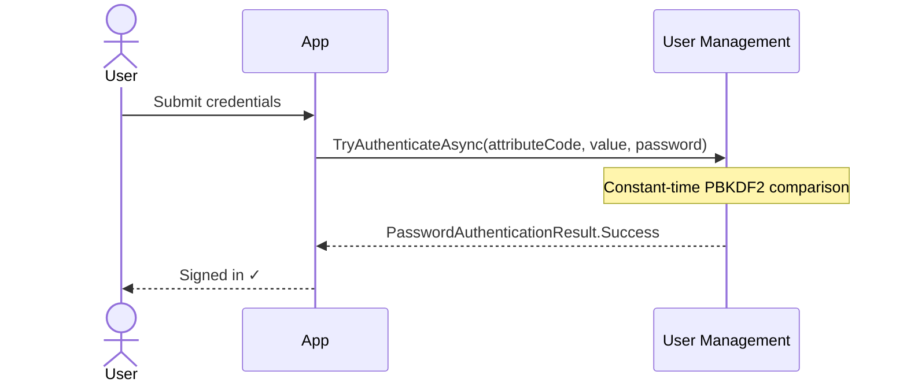
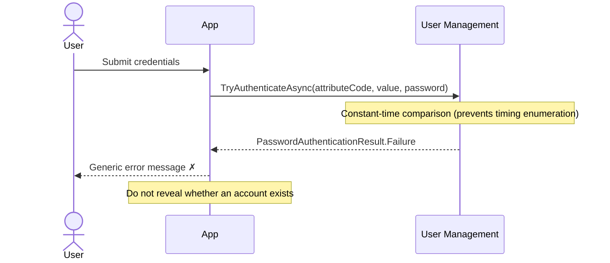

:::caution[Security warning]
Password-only authentication carries significant risks including phishing attacks, credential stuffing, and password reuse. Passkey-based authentication is strongly recommended for the strongest security posture. If you must use passwords, extend them with an additional factor such as [OTP](/identityserver/usermanagement/authentication/otp.mdx) or [TOTP](/identityserver/usermanagement/authentication/totp.mdx).
:::

Password authentication is the traditional credential-based flow where users create and manage a password tied to their account. Duende User Management supports passwords as one of several authentication flows, with built-in PBKDF2 hashing, timing-attack protection, configurable complexity rules, and extensible validation.

## Account Recovery Considerations

A fundamental challenge with standalone password authentication is self-service account recovery: there is no way to deliver a password reset token without first verifying that the user controls the delivery channel (email or SMS).

User Management addresses this by design. Creating a user without first verifying a One-Time Password (OTP) channel is not possible via the `IUserSelfService` interface. By default, a user verifies ownership of their email address via OTP, then creates a password. Whether to allow password-only login or to always require an additional OTP factor during login is a decision left to your application.

:::tip[Password policy configuration]
Password policies (minimum/maximum length, complexity requirements) are configured via `PasswordOptions` in the service provider registration. See the [configuration reference](/identityserver/usermanagement/reference/configuration.md) for all available options.
:::

## Key Interfaces

### IPasswordAuth

`IPasswordAuth` is the primary interface for verifying a user's password during login. Inject it into your login page or controller to authenticate a user by a unique attribute (like an email address, username, ...) and password. Its single method returns a `PasswordAuthenticationResult` discriminated union indicating success or failure:

```csharp
public interface IPasswordAuth
{
    Task<PasswordAuthenticationResult> TryAuthenticateAsync(
        AttributeCode code,
        object value,
        NonValidatedPassword password,
        CancellationToken ct);
}
```

`TryAuthenticateAsync` returns a `PasswordAuthenticationResult`, which is a discriminated union with three subtypes:

* `PasswordAuthenticationResult.Success` -- contains the user's `UserSubjectId`. The credentials are valid.
* `PasswordAuthenticationResult.Failure` -- the credentials are invalid.
* `PasswordAuthenticationResult.Expired` -- contains the user's `UserSubjectId`. The credentials are correct, but the password has passed its maximum age and must be changed.

The comparison runs in constant time to prevent account enumeration via timing attacks.

### Creating Passwords

`PlainTextPassword` is a validated value type that cannot be constructed directly. When you need to create or change a password, use `IUserAuthenticatorsSelfService`, which applies the full set of validation rules configured in [`PasswordOptions`](#passwordoptions) before returning a value. Both methods take the `UserSubjectId` of the user setting the password as their first argument, so custom validators can apply per-user policy if needed. These async creation methods are available:

```csharp
// IUserAuthenticatorsSelfService.cs
public interface IUserAuthenticatorsSelfService
{
    // ...

    // Throws FormatException if the password does not meet requirements.
    Task<PlainTextPassword> CreatePasswordAsync(UserSubjectId userId, string passwordString, CancellationToken ct);

    // Returns a PasswordCreationResult indicating success or failure.
    Task<PasswordCreationResult> TryCreatePasswordAsync(UserSubjectId userId, string passwordString, CancellationToken ct);

    // ...
}
```

`PasswordCreationResult` is a discriminated union with two cases:

```csharp
// PasswordCreationResult.cs
public abstract record PasswordCreationResult
{
    // The password passed all validation rules.
    public sealed record Success(PlainTextPassword Password) : PasswordCreationResult;

    // The password failed one or more validation rules.
    // Errors contains human-readable reasons suitable for display to the user.
    public sealed record Failed(IReadOnlyList<string> Errors) : PasswordCreationResult;
}
```

Use `TryCreatePasswordAsync` in user-facing flows where you want to return a validation error rather than catch an exception. Pattern match on `PasswordCreationResult.Success` to extract the validated password, or on `PasswordCreationResult.Failed` to surface the specific failure reasons to the user, such as "Password must contain at least 2 uppercase letters."

The key distinction between `PlainTextPassword` and `NonValidatedPassword` is *when* you use each one:

* Use `IUserAuthenticatorsSelfService.CreatePasswordAsync(userId, ...)` or `TryCreatePasswordAsync(userId, ...)` when the user is **setting or changing** a password. Full validation runs, including length, character class requirements, and any registered `IPasswordValidator` implementations.
* Use `NonValidatedPassword.Create()` when the user is **logging in** with an existing password. Validation rules are intentionally skipped because the rules may have changed since the password was created. For example, if the minimum length increased from 8 to 16 characters after a user set a 12-character password, that password would never pass the new validation and the user could never log in.

#### NonValidatedPassword

When logging in, use `NonValidatedPassword` rather than `PlainTextPassword`. Validation rules are intentionally skipped at authentication time because those rules may have changed since the password was created. For example, a user whose password was valid when they set it should always be able to log in, even if the policy has since tightened.

`NonValidatedPassword` still performs basic sanity checks (not null, not empty) to catch invalid input. Use `TryCreate` in user-facing flows where you want to return a validation error rather than catch an exception.

```csharp
public record NonValidatedPassword
{
    public static NonValidatedPassword Create(string passwordString);
    public static bool TryCreate(string? passwordString, [NotNullWhen(true)] out NonValidatedPassword? result);
    public static bool TryCreate(string? passwordString, [NotNullWhen(true)] out NonValidatedPassword? result, [NotNullWhen(false)] out IReadOnlyList<string>? errors);
}
```

## Password Lifecycle Methods

Password lifecycle operations (setting, changing, and resetting passwords) are available on `IUserAuthenticatorsSelfService`. These methods manage the stored credential rather than verifying it.

```csharp
public interface IUserAuthenticatorsSelfService
{
    // Sets a password for a user who does not yet have one.
    Task<bool> TrySetPasswordAsync(
        UserSubjectId subjectId,
        PlainTextPassword password,
        CancellationToken ct);

    // Changes a password by verifying the current password first.
    Task<bool> TryChangePasswordAsync(
        UserSubjectId subjectId,
        NonValidatedPassword oldPassword,
        PlainTextPassword newPassword,
        CancellationToken ct);

    // Resets a password without requiring the current password.
    // Use only after verifying the user's identity via another channel (e.g., OTP).
    Task<bool> TryResetPasswordAsync(
        UserSubjectId subjectId,
        PlainTextPassword password,
        CancellationToken ct);

    // ... other authenticator management methods
}
```

* `TrySetPasswordAsync` - Use during initial account setup when the user does not yet have a password.
* `TryChangePasswordAsync` - Use for authenticated password changes; requires the current password to be provided and verified.
* `TryResetPasswordAsync` - Use for password reset flows after the user's identity has been verified via a separate channel such as OTP. Does not require the current password.

All three methods return `true` on success and `false` if the operation could not be completed (for example, `TryChangePasswordAsync` returns `false` if the current password is incorrect).

## Configuration

### PasswordOptions

Password complexity requirements are configured via `PasswordOptions`, accessible through the top-level options object when registering User Management services.

```csharp title="Program.cs"
using Duende.IdentityServer;
using Duende.UserManagement;

builder.Services
    .AddIdentityServer()
    .AddUserManagement(um => um
        .Authentication(auth =>
        {
            auth.Configure(options =>
            {
                options.Passwords.MinLength = 12;
                // other PasswordOptions...
            });
        })
    );
```

| Property                 | Default    | Description                                                                                                                                                                 |
|--------------------------|------------|-----------------------------------------------------------------------------------------------------------------------------------------------------------------------------|
| `MinLength`              | `8`        | Minimum password length in characters.                                                                                                                                      |
| `MaxLength`              | `64`       | Maximum password length; capped at 64 to avoid PBKDF2 pre-hashing vulnerabilities with SHA-512.                                                                             |
| `MinLower`               | `2`        | Minimum number of lowercase letters required.                                                                                                                               |
| `MinUpper`               | `2`        | Minimum number of uppercase letters required.                                                                                                                               |
| `MinDigits`              | `2`        | Minimum number of numeric digit characters required.                                                                                                                        |
| `MinSymbols`             | `2`        | Minimum number of symbol (non-alphanumeric) characters required.                                                                                                            |
| `HistoryCount`           | `0`        | Number of previous passwords to remember and reject on change or reset; `0` disables history.                                                                               |
| `MaxAgeDays`             | `null`     | Maximum password age in days before the password is considered expired; `null` disables expiration.                                                                         |
| `PreferredHashAlgorithm` | `"pbkdf2"` | Algorithm ID used when hashing new passwords and when re-hashing on login. See [Password Hashing Algorithms](/identityserver/usermanagement/reference/password-hashing.md). |

The `MaxLength` default of 64 comes from the PBKDF2/SHA-512 security limit. Passwords longer than 128 bytes (64 UTF-16 characters) can trigger pre-hashing behavior in PBKDF2 that weakens the key derivation. See the [OWASP Password Storage Cheat Sheet](https://cheatsheetseries.owasp.org/cheatsheets/Password_Storage_Cheat_Sheet.html#pbkdf2-pre-hashing) for background.

## Password History

When `HistoryCount` is set to a value greater than 0, password history validation is automatically enforced. The system retains the hashes of the user's most recent passwords (up to `HistoryCount` entries) and rejects any new password that matches one of them. This prevents users from cycling back to a recently used password.

Both `TryChangePasswordAsync` and `TryResetPasswordAsync` check the candidate password against the stored history and return `false` if it matches any of the retained entries.

```csharp
// Program.cs
options.Passwords.HistoryCount = 5;
```

The default value of `0` disables history checking entirely, so no previous passwords are stored or compared.

## Password Expiration

When `MaxAgeDays` is set to a positive integer, `TryAuthenticateAsync` checks whether the user's password is older than that many days. If it is, the method returns `PasswordAuthenticationResult.Expired` instead of `PasswordAuthenticationResult.Success`. The credentials are correct, but the user must change their password before continuing.

If the system does not know when the password was set (for example, for accounts migrated from an external store without a creation timestamp), the password is treated as expired immediately.

A value of `null` (the default) disables expiration entirely.

Because `TryAuthenticateAsync` can return distinct results, your login handler should pattern-match on all three:

```csharp
// LoginPage.cshtml.cs
public async Task<IActionResult> OnPostLogin(string email, string password)
{
    var result = await passwordAuth.TryAuthenticateAsync(
        AttributeCode.Create("email"),
        email,
        NonValidatedPassword.Create(password),
        ct);

    return result switch
    {
        PasswordAuthenticationResult.Success success => await CompleteSignIn(success.UserSubjectId),
        PasswordAuthenticationResult.Expired expired => RedirectToPage("/ChangePassword", new { userId = expired.UserSubjectId }),
        PasswordAuthenticationResult.Failure => Error("Invalid username or password"),
        _ => Error("Unexpected authentication result")
    };
}
```

## Custom Password Validation

Beyond the built-in complexity rules, you can implement `IPasswordValidator` to add custom policy checks such as blocklist enforcement, breach database lookups (e.g., Have I Been Pwned), or dictionary word rejection. The `ValidateAsync` method receives the `UserSubjectId` of the user setting the password, the candidate password string, and a cancellation token.

```csharp
public interface IPasswordValidator
{
    Task<PasswordValidationResult> ValidateAsync(UserSubjectId userId, string password, CancellationToken ct);
}
```

`PasswordValidationResult` is a discriminated union with two cases:

```csharp
public abstract record PasswordValidationResult
{
    // The password passed validation.
    public sealed record Accepted : PasswordValidationResult;

    // The password failed validation.
    // Reason is a human-readable explanation suitable for display to the user.
    public sealed record Rejected(string Reason) : PasswordValidationResult;
}
```

### Implementing a Custom Validator

You can implement a custom validator by inheriting from the `IPasswordValidator` interface. The `userId` parameter lets you apply per-user logic, such as rejecting passwords that contain the user's own identifier. The following example rejects passwords found in a common-password blocklist:

```csharp
using Duende.UserManagement.Authentication.Passwords;

public class BlocklistPasswordValidator : IPasswordValidator
{
    private static readonly HashSet<string> CommonPasswords =
    [
        "Password1!", "Welcome1!", "Summer2024!"
    ];

    public Task<PasswordValidationResult> ValidateAsync(UserSubjectId userId, string password, CancellationToken ct)
    {
        if (CommonPasswords.Contains(password))
        {
            return Task.FromResult<PasswordValidationResult>(
                new PasswordValidationResult.Rejected(
                    "This password is too common. Please choose a more unique password."));
        }

        return Task.FromResult<PasswordValidationResult>(
            new PasswordValidationResult.Accepted());
    }
}
```

Register the custom validator with the service provider. Multiple `IPasswordValidator` implementations can be registered. You can register the validator directly with:

```csharp
services.AddTransient<IPasswordValidator, BlocklistPasswordValidator>();
```

Or you can use the helper method when configuring user authentication:

```csharp
using Duende.IdentityServer;

builder.Services
    .AddIdentityServer()
    .AddUserManagement(um => um
        .Authentication(auth =>
        {
            auth.AddPasswordValidator<BlocklistPasswordValidator>();
        })
    );
```
### When Password Validation Runs

Validations run in registration order, and the first rejection stops further evaluation. Both the built-in complexity checks (length, character class requirements from [`PasswordOptions`](#passwordoptions)) and any registered `IPasswordValidator` implementations run inside `TryCreatePasswordAsync` at creation time. This means validation happens when you call `TryCreatePasswordAsync`, before the password is passed to any lifecycle method. The [password lifecycle methods](#password-lifecycle-methods) accept an already-validated `PlainTextPassword` and do not re-run the validators.

## Security

Passwords are the most attacked credential type on the internet: reused, guessed, phished, and leaked constantly. User Management supports them because some applications need them, but the defaults are designed to make the worst outcomes less likely.

### What User Management Does for You

Passwords are hashed with PBKDF2-HMAC-SHA-512 at 210000 iterations, following the [OWASP recommendation](https://cheatsheetseries.owasp.org/cheatsheets/Password_Storage_Cheat_Sheet.html#pbkdf2). Each password gets a unique salt, so two users with the same password have different hashes and rainbow table attacks are useless. The `MaxLength` is capped at 64 characters to avoid a PBKDF2 pre-hashing vulnerability that appears when passwords exceed the HMAC-SHA-512 block size. `TryAuthenticateAsync` uses constant-time comparison throughout, so an attacker cannot determine whether an account exists by measuring response times. `PlainTextPassword` and `NonValidatedPassword` intentionally return the type name from `ToString()` to prevent accidental logging.

### What You Need to Think About

The default minimum password length of 8 characters is a floor, not a recommendation. For new applications, 12-16 characters is a more defensible baseline. Consider plugging in an `IPasswordValidator` that checks submitted passwords against the [Have I Been Pwned](https://haveibeenpwned.com/API/v3#searchingPwnedPasswordsByRange) k-anonymity API. Rejecting passwords that appear in known breach datasets is one of the highest-value things you can do to reduce credential stuffing risk.

Never use passwords as the only factor. They are phishable, reused across services, and leaked regularly. Pair them with TOTP at minimum, or push users toward passkeys for sensitive operations.

One thing that catches people out: `TryResetPasswordAsync` does not require the current password. That is intentional; it is for password reset flows where the user has already proved their identity via OTP. But it means your application is responsible for that identity verification step. Calling `TryResetPasswordAsync` without first confirming who the user is would be a serious security hole.

For cross-cutting security topics (data protection key persistence, throttling configuration, and password hashing parameters) see [Security Considerations](/identityserver/usermanagement/fundamentals/security.md).

## Authentication Flow

The password authentication flow has two paths: a success path where valid credentials produce a subject ID, and a failure path where invalid credentials, throttling, or lockout prevent access.

### Success Path

The user submits valid credentials and is authenticated in constant time:



### Failure Path

When credentials are wrong, the system returns a `PasswordAuthenticationResult.Failure` without revealing whether an account exists. Repeated failures may trigger throttling or account lockout depending on your security configuration:



### Login

Inject `IPasswordAuth` into your login handler. Use `NonValidatedPassword.Create(password)` when calling `TryAuthenticateAsync`. This skips policy validation so that users whose passwords predate a rule change can still log in. Pattern-match on all three result types: redirect to a password-change page on `Expired`, and show a generic error on `Failure` to avoid revealing whether an account exists. After a successful password check, optionally redirect to a second-factor page if the user has TOTP configured:

```csharp
// LoginPage.cshtml.cs
public async Task<IActionResult> OnPostLogin(string email, string password)
{
    var result = await passwordAuth.TryAuthenticateAsync(
        AttributeCode.Create("email"),
        email,
        NonValidatedPassword.Create(password),
        ct);

    if (result is PasswordAuthenticationResult.Failure)
        return Error("Invalid username or password");

    if (result is PasswordAuthenticationResult.Expired expired)
        return RedirectToPage("/ChangePassword", new { userId = expired.UserSubjectId });

    var success = (PasswordAuthenticationResult.Success)result;
    var user = await userAuthenticatorsSelfService.TryGetAsync(success.UserSubjectId, ct);

    // Optionally check for a second factor before completing sign-in.
    if (user?.TotpAuthenticatorNames.Count > 0)
    {
        StoreAuthState(success.UserSubjectId);
        return RedirectToPage("/LoginWith2FA");
    }

    await SignIn(user);
    return RedirectToPage("/Index");
}
```

### Password Change (Authenticated User)

Use `TryChangePasswordAsync` when the user is already signed in and wants to update their password. Use `NonValidatedPassword.Create` for the current password (authentication path) and `authenticatorsSelfService.TryCreatePasswordAsync` for the new password (applies full validation rules):

```csharp
public async Task<IActionResult> OnPostChangePassword(
    string currentPassword,
    string newPassword,
    string confirmNewPassword,
    CancellationToken ct)
{
    if (newPassword != confirmNewPassword)
        return Error("New passwords do not match");

    var creationResult = await authenticatorsSelfService.TryCreatePasswordAsync(GetCurrentUserId(), newPassword, ct);
    if (creationResult is not PasswordCreationResult.Success { Password: var validatedNewPassword })
        return Error("New password does not meet requirements");

    var success = await authenticatorsSelfService.TryChangePasswordAsync(
        GetCurrentUserId(),
        NonValidatedPassword.Create(currentPassword),
        validatedNewPassword,
        ct);

    if (!success)
        return Error("Current password is incorrect");

    return Success("Password changed successfully");
}
```

### Password Reset (After OTP Verification)

Use `TryResetPasswordAsync` at the end of a forgot-password flow, after the user's identity has been confirmed via OTP. This method does not require the current password:

```csharp
// Step 1: Verify user identity via OTP (see OTP flow documentation).
// Step 2: Once identity is confirmed, reset the password directly.
public async Task<IActionResult> OnPostCompleteReset(string newPassword, CancellationToken ct)
{
    var creationResult = await authenticatorsSelfService.TryCreatePasswordAsync(GetVerifiedUserId(), newPassword, ct);
    if (creationResult is not PasswordCreationResult.Success { Password: var validatedPassword })
        return Error("Password does not meet requirements");

    var success = await authenticatorsSelfService.TryResetPasswordAsync(
        GetVerifiedUserId(),
        validatedPassword,
        ct);

    if (!success)
        return Error("Password reset failed");

    return RedirectToPage("/Login");
}
```

## Combining Passwords with a Second Factor

The recommended pattern when using passwords is to combine them with Time-Based One-Time Password (TOTP) for two-factor authentication:

* **First Factor** -- Password (something you know)
* **Second Factor** -- TOTP code (something you have)
* **Backup** -- Recovery codes (something you saved)

See [TOTP Authentication Flow](/identityserver/usermanagement/authentication/totp.mdx) for the second-factor implementation, [Passkeys as Second Factor](/identityserver/usermanagement/authentication/passkeys#second-factor-passkey-authentication) for using passkeys as a second step, and [Recovery Codes](/identityserver/usermanagement/authentication/recovery-codes.mdx) for backup access.

## Multi-Algorithm Password Hashing

User Management supports multiple password hashing algorithms simultaneously, enabling transparent migration from legacy hashes to stronger algorithms. Each stored hash carries an algorithm identifier, and the system automatically re-hashes passwords on successful login when a stronger algorithm is available. The `PreferredHashAlgorithm` option in `PasswordOptions` controls which algorithm is used for new password hashes and for re-hashing on login. See [Password Hashing Algorithms](/identityserver/usermanagement/reference/password-hashing.md) for the full list of built-in algorithms and how to register custom ones.
