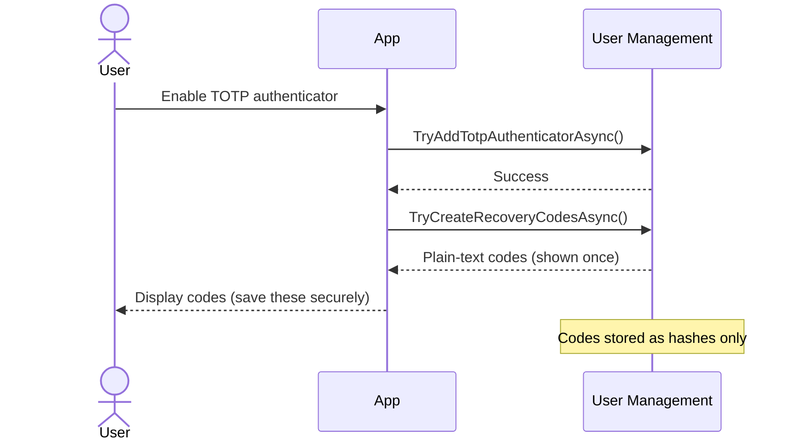
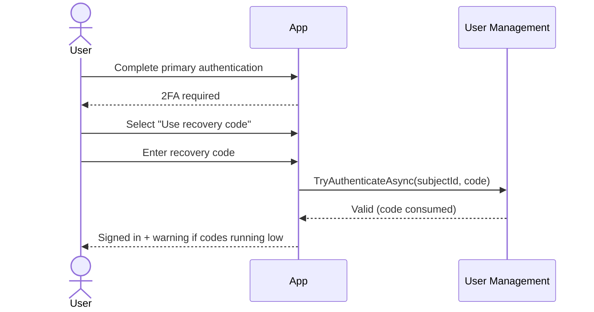

Recovery codes are a backup authentication method for when the primary two-factor mechanism (typically Time-Based One-Time Password (TOTP)) is unavailable. Each code is single-use, so a user who loses their device or breaks their authenticator app can still get back in.

## Comparison With Other Authentication Methods

| Aspect              | Recovery Codes   | TOTP              | Password Reset  |
|---------------------|------------------|-------------------|-----------------|
| **Use Case**        | Emergency backup | Primary 2FA       | Lost password   |
| **Frequency**       | Rare             | Every login       | Occasional      |
| **Device Required** | None             | Authenticator app | Email access    |
| **Security Model**  | Single-use       | Time-based        | Email dependent |
| **User Burden**     | Must save codes  | Install app       | Email access    |

## How It Works

### Generation Flow

When a user enables 2FA, the system generates a set of recovery codes (typically 10), displays them once for the user to save securely, and stores only their hashes. Codes remain valid until used or regenerated.



### Authentication Flow

When a user can't access their authenticator app, they enter a saved recovery code instead. The system verifies it against stored hashes, consumes it immediately (single-use), and issues an MFA claim. The user is warned if their remaining code count is low.



## Key Interfaces

### IRecoveryCodeAuth

`IRecoveryCodeAuth` is the primary interface for verifying and consuming recovery codes during authentication:

```csharp
public interface IRecoveryCodeAuth
{
    Task<bool> TryAuthenticateAsync(
        UserSubjectId subjectId,
        PlainTextRecoveryCode recoveryCode,
        CancellationToken ct);
}
```

The method verifies the supplied code against stored hashes and, if valid, marks it as consumed so it cannot be reused.

### IUserAuthenticatorsSelfService

`IUserAuthenticatorsSelfService` exposes recovery code management for authenticated users:

```csharp
// Generate new recovery codes. Invalidates all existing codes
Task<IReadOnlyCollection<PlainTextRecoveryCode>?> TryCreateRecoveryCodesAsync(
    UserSubjectId subjectId,
    CancellationToken ct);
```

Returns `null` if code generation fails (for example, when 2FA is not enabled for the user).

### PlainTextRecoveryCode

`PlainTextRecoveryCode` represents a recovery code value and provides parsing and display helpers:

```csharp
public record PlainTextRecoveryCode
{
    // Create from a user-supplied string into a recovery code
    public static bool TryCreate(string? input, [NotNullWhen(true)] out PlainTextRecoveryCode? result);

    // Create or throw on invalid input
    public static PlainTextRecoveryCode Create(string input);

    // Format into groups for display, e.g. ["7e8a", "9b2c", "4d1f"]
    public IReadOnlyCollection<string> ToTextGroups();
}
```

### User Properties

The `User` object exposes the count of remaining unused recovery codes:

```csharp
var user = await userSelfService.TryGetUserAsync(subjectId, ct);

// Number of unused recovery codes remaining
int remaining = user.RecoveryCodeCount;
```

## Implementation Patterns

### Generating Recovery Codes

Recovery codes are typically generated when the user enables TOTP. Call `TryCreateRecoveryCodesAsync` after successfully activating the authenticator:

```csharp
public async Task<IActionResult> OnPostEnableTotpAsync(string verificationCode)
{
    var subjectId = GetCurrentUserId();

    var success = await userAuthenticatorsSelfService.TryAddTotpAuthenticatorAsync(
        subjectId,
        TotpAuthenticatorName.Default,
        totpKey,
        PlainTextTotp.Create(verificationCode),
        ct);

    if (!success)
    {
        return Error("Invalid verification code");
    }

    // Generate recovery codes after enabling TOTP
    var recoveryCodes = await userAuthenticatorsSelfService.TryCreateRecoveryCodesAsync(
        subjectId, ct);

    if (recoveryCodes == null)
    {
        return Error("Failed to generate recovery codes");
    }

    // Format codes for display
    var formattedCodes = recoveryCodes
        .Select(code => string.Join("-", code.ToTextGroups()))
        .ToArray();

    TempData["RecoveryCodes"] = formattedCodes;

    return RedirectToPage("/ShowRecoveryCodes");
}
```

### Authenticating With a Recovery Code

After the user completes primary authentication and selects the recovery code option, verify and consume the code:

```csharp
public async Task<IActionResult> OnPostLoginWithRecoveryCodeAsync(string recoveryCode)
{
    var authState = GetAuthState();
    if (authState == null)
    {
        return RedirectToPage("/Login");
    }

    // Strip spaces and dashes. Accept flexible input formats
    var cleanCode = recoveryCode
        .Replace(" ", string.Empty)
        .Replace("-", string.Empty);

    if (!PlainTextRecoveryCode.TryCreate(cleanCode, out var code))
    {
        return Error("Invalid recovery code format");
    }

    // Verify and consume the recovery code
    var success = await recoveryCodeAuth.TryAuthenticateAsync(
        authState.UserId, code, ct);

    if (!success)
    {
        return Error("Invalid recovery code");
    }

    ClearAuthState();

    var user = await userSelfService.TryGetUserAsync(authState.UserId, ct);
    await SignInWithMfaAsync(user, authState.RememberMe);

    // Warn the user if they are running low on codes
    if (user.RecoveryCodeCount < 3)
    {
        TempData["Warning"] =
            $"You have {user.RecoveryCodeCount} recovery codes remaining. " +
            "Consider generating new ones.";
    }

    return RedirectToPage("/Index");
}
```

### Regenerating Recovery Codes

Users can regenerate codes at any time from their account settings. Regeneration invalidates all existing codes:

```csharp
public async Task<IActionResult> OnPostRegenerateCodesAsync()
{
    var subjectId = GetCurrentUserId();
    var user = await userSelfService.TryGetUserAsync(subjectId, ct);

    // Verify 2FA is enabled before generating codes
    if (user.TotpAuthenticatorNames.Count == 0)
    {
        return Error("Two-factor authentication is not enabled");
    }

    // Generate new codes. All old codes are immediately invalidated
    var recoveryCodes = await userAuthenticatorsSelfService.TryCreateRecoveryCodesAsync(
        subjectId, ct);

    if (recoveryCodes == null)
    {
        return Error("Failed to generate recovery codes");
    }

    var formattedCodes = recoveryCodes
        .Select(code => string.Join("-", code.ToTextGroups()))
        .ToArray();

    TempData["RecoveryCodes"] = formattedCodes;
    TempData["Message"] = "New recovery codes generated. Old codes are no longer valid.";

    return RedirectToPage("/ShowRecoveryCodes");
}
```

### Displaying Recovery Code Status

Show the user how many codes they have remaining and prompt them to regenerate when running low:

```csharp
public async Task<IActionResult> OnGetAsync()
{
    var subjectId = GetCurrentUserId();
    var user = await userSelfService.TryGetUserAsync(subjectId, ct);

    if (user.TotpAuthenticatorNames.Count == 0)
    {
        return RedirectToPage("/EnableAuthenticator");
    }

    ViewData["RecoveryCodesRemaining"] = user.RecoveryCodeCount;

    return Page();
}
```

## Configuration

You can control how recovery codes are generated and whether they are enabled at all.

### RecoveryCodeOptions

Recovery code behavior is configured via `RecoveryCodeOptions`, accessible through the top-level options object when registering User Management services.

```csharp
// Program.cs
using Duende.IdentityServer;

builder.Services
    .AddIdentityServer()
    .AddUserManagement(um => um
        .Authentication(auth =>
        {
            auth.Configure(options =>
            {
                options.RecoveryCodes.Count = 8;
                options.RecoveryCodes.Enabled = true;
            });
        })
    );
```

| Property  | Type   | Default | Description                                                                                                                                                                        |
|-----------|--------|---------|------------------------------------------------------------------------------------------------------------------------------------------------------------------------------------|
| `Count`   | `int`  | `10`    | Number of recovery codes generated per call to `TryCreateRecoveryCodesAsync`. Valid range is 1 to 50.                                                                              |
| `Enabled` | `bool` | `true`  | When set to `false`, recovery codes are disabled entirely. `TryCreateRecoveryCodesAsync` returns `null` and `TryAuthenticateAsync` returns `false` for all recovery code attempts. |

### Disabling recovery codes

You may want to set `Enabled = false` if your application only supports TOTP or passkeys as second factors and you don't want recovery codes as a fallback. For example, some high-security applications prefer to require users to contact support for account recovery rather than relying on stored codes.

```csharp
// Program.cs - disable recovery codes entirely
auth.Configure(options =>
{
    options.RecoveryCodes.Enabled = false;
});
```

When `Enabled` is `false`, any call to `TryCreateRecoveryCodesAsync` returns `null`, and any call to `TryAuthenticateAsync` returns `false`, regardless of what codes the user may have stored.

## Security

Recovery codes are the safety net for two-factor authentication. They exist for the moment when a user loses their phone, breaks their authenticator app, or otherwise cannot use their primary second factor. That makes them valuable, and it makes them a target.

### What User Management Does for You

Codes are hashed with PBKDF2 before storage, so a stolen database row cannot be used to recover the plaintext. Each code is single-use and invalidated immediately on successful verification. Codes are generated with a cryptographically secure random number generator using Base32 Crockford encoding for readability and case-insensitivity.

### What You Need to Think About

The security of recovery codes depends almost entirely on what users do with them after generation. A code stored in a plain text file on the desktop, or in an unencrypted notes app, is effectively public. Your UI should tell users clearly where to store them. A password manager or printed and kept somewhere physically secure are the standard recommendations.

Show a warning when a user is running low. A user who uses their last recovery code and does not generate new ones has no fallback if they lose their second factor. Prompt regeneration when fewer than 2–3 codes remain.

Treat the code display screen as a sensitive operation. Never show recovery codes without first confirming the user's session is authenticated. And make it easy to regenerate. A user who has used a code should be encouraged to generate a fresh set immediately, so the old set is fully invalidated.

For cross-cutting security topics (data protection key persistence and throttling configuration) see [Security Considerations](/identityserver/usermanagement/fundamentals/security.md).

## Post-Recovery Guidance

After a user authenticates with a recovery code, guide them to restore their normal 2FA setup:

```csharp
if (usedRecoveryCode)
{
    TempData["PostRecoveryMessage"] =
        "You signed in with a recovery code. " +
        "Set up your authenticator app and generate new recovery codes " +
        "to keep your account secure.";
}
```
