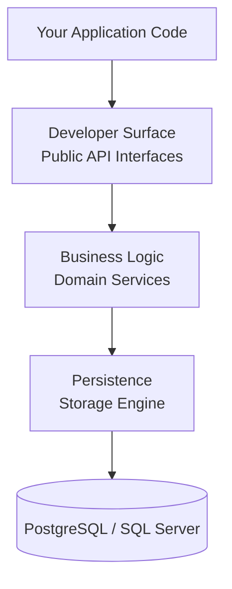

Duende User Management is built on a layered architecture that separates concerns and provides clean extension points. The public API is exposed through scenario-based interfaces that are registered with the ASP.NET Core service provider, backed by an internal domain layer and a document-based storage engine.

## Architectural Layers



### Developer Surface (Public API)

The top layer exposes scenario-based interfaces that represent distinct use cases. Application code interacts exclusively with these interfaces; the internal implementation details are hidden behind them.

Interfaces are grouped into three categories: self-service (user-facing operations), admin (back-office and management operations), and authentication (verifying credentials).

### Business Logic (Domain)

The middle layer contains the business logic and domain models. It enforces invariants, coordinates between domain concepts, and applies security rules such as throttling, hashing, and code expiry. This layer is internal and not directly accessible from application code.

### Persistence (Storage Engine)

The bottom layer persists data through the Duende Storage Engine, a document-based storage abstraction built around the `IStore` interface. It supports PostgreSQL, SQL Server, and in-memory backends. Schema is managed automatically; no Entity Framework migrations are required.

See [Storage](/usermanagement/fundamentals/storage.md) for details on the storage engine.

## Unified User Record

Every user in Duende User Management is anchored by a single root record that ties together all user aspects: their authenticators, their profile, and their membership links. When you perform a coordinated operation, such as updating a username, the change propagates atomically to all aspects because they all reference this shared record. You never have to synchronize separate stores manually.

The root record holds:

* **SubjectId**: the stable, unique identifier for the user across all aspects
* **UserName**: the optional human-readable name used for credential lookup
* **References to aspects**: links to the user's authenticators, profile, and membership data, kept consistent as a unit

## Public API Interfaces

### Self-Service Interfaces

Self-service interfaces are intended for user-facing operations: actions a user performs on their own account.

| Interface                        | Purpose                                                                                                                                                                                                                                                                                                                                       |
|----------------------------------|-----------------------------------------------------------------------------------------------------------------------------------------------------------------------------------------------------------------------------------------------------------------------------------------------------------------------------------------------|
| `IUserSelfService`               | Set or remove a username; deregister (delete) the user's own account                                                                                                                                                                                                                                                                          |
| `IUserAuthenticatorsSelfService` | All authenticator management: register by One-Time Password (OTP) address or external authenticator; look up authenticators; add/replace/remove OTP addresses; add/remove external authenticators; add/remove Time-Based One-Time Password (TOTP) authenticators; add/remove passkeys; create recovery codes; set, change, and reset password |
| `IUserProfileSelfService`        | User profile operations: get the attribute schema; register a profile; get the current profile; update profile attributes                                                                                                                                                                                                                     |

#### IUserSelfService

```csharp
Task<bool> TrySetUserNameAsync(UserSubjectId subjectId, UserName userName, CancellationToken ct);
Task<bool> TryRemoveUserNameAsync(UserSubjectId subjectId, CancellationToken ct);
Task<bool> TryDeregisterAsync(UserSubjectId subjectId, CancellationToken ct);
```

#### IUserAuthenticatorsSelfService

```csharp
// Register a new user with an external authenticator
Task<UserAuthenticators?> TryRegisterAsync(UserSubjectId subjectId, ExternalAuthenticator authenticator, CancellationToken ct);

// Look up authenticators
Task<UserAuthenticators?> TryGetAsync(UserSubjectId subjectId, CancellationToken ct);
Task<UserAuthenticators?> TryGetAsync(ExternalAuthenticator authenticator, CancellationToken ct);

// OTP address management
Task<bool> TryAddOtpAddressAsync(UserSubjectId subjectId, OtpAddress address, CancellationToken ct);
Task<bool> TryReplaceOtpAddressAsync(UserSubjectId subjectId, OtpAddress oldAddress, OtpAddress newAddress, CancellationToken ct);
Task<bool> TryRemoveOtpAddressAsync(UserSubjectId subjectId, OtpAddress address, CancellationToken ct);

// External authenticator management
Task<bool> TryAddExternalAuthenticatorAsync(UserSubjectId subjectId, ExternalAuthenticator authenticator, CancellationToken ct);
Task<bool> TryRemoveExternalAuthenticatorAsync(UserSubjectId subjectId, ExternalAuthenticator authenticator, CancellationToken ct);

// TOTP authenticator management
Task<bool> TryAddTotpAuthenticatorAsync(UserSubjectId subjectId, TotpAuthenticatorName authenticatorName, PlainBytesTotpKey key, PlainTextTotp totp, CancellationToken ct);
Task<bool> TryRemoveTotpAuthenticatorAsync(UserSubjectId subjectId, TotpAuthenticatorName authenticatorName, CancellationToken ct);

// Passkey management
Task<bool> TryAddPasskeyAsync(UserSubjectId subjectId, PasskeyCredentialData credential, CancellationToken ct);
Task<bool> TryRemovePasskeyAsync(UserSubjectId subjectId, PasskeyCredentialId credentialId, CancellationToken ct);

// Recovery codes
Task<IReadOnlyCollection<PlainTextRecoveryCode>?> TryCreateRecoveryCodesAsync(UserSubjectId subjectId, CancellationToken ct);

// Password management
Task<bool> TrySetPasswordAsync(UserSubjectId subjectId, PlainTextPassword password, CancellationToken ct);
Task<bool> TryChangePasswordAsync(UserSubjectId subjectId, PlainTextPassword oldPassword, PlainTextPassword newPassword, CancellationToken ct);
Task<bool> TryResetPasswordAsync(UserSubjectId subjectId, PlainTextPassword password, CancellationToken ct);
```

#### IUserProfileSelfService

```csharp
Task<IReadOnlyAttributeSchema> GetSchemaAsync(CancellationToken);
Task<UserProfile?> TryRegisterAsync(UserSubjectId subjectId, AttributeValueCollection attributes, CancellationToken ct);
Task<UserProfile?> TryGetAsync(UserSubjectId subjectId, CancellationToken ct);
Task<UserProfile?> TryUpdateAsync(UserSubjectId subjectId, UserProfileUpdate update, CancellationToken ct);
```

### Admin Interfaces

Admin interfaces are intended for back-office and management operations: actions performed by administrators or background services.

| Interface                  | Purpose                                                                                                                                                                                          |
|----------------------------|--------------------------------------------------------------------------------------------------------------------------------------------------------------------------------------------------|
| `IUserAdmin`               | Set or remove a username; remove a user entirely                                                                                                                                                 |
| `IUserAuthenticatorsAdmin` | Admin-level authenticator management: create user with OTP addresses and external authenticators; look up authenticators; bulk add/remove OTP addresses; bulk add/remove external authenticators |
| `IUserProfileAdmin`        | Admin profile operations: get the attribute schema; add a profile; get a profile by subject ID or by attribute value                                                                             |
| `IUserProfileSchemaAdmin`  | Manage attribute definitions: get all definitions; add a definition; remove a definition                                                                                                         |
| `IRoleAdmin`               | Role CRUD: create, get, update, delete, and query roles with filtering, sorting, and pagination                                                                                                  |
| `IGroupAdmin`              | Group CRUD: create, get, update, delete, and query groups with filtering, sorting, and pagination                                                                                                |
| `IMembershipAdmin`         | Role and group assignment, and query operations for users and groups                                                                                                                             |

#### IUserAdmin

```csharp
Task<bool> TrySetUserNameAsync(UserSubjectId subjectId, UserName userName, CancellationToken ct);
Task<bool> TryRemoveUserNameAsync(UserSubjectId subjectId, CancellationToken ct);
Task<bool> TryRemoveAsync(UserSubjectId subjectId, CancellationToken ct);
```

#### IUserAuthenticatorsAdmin

```csharp
// Create a user with initial authenticators
Task<UserAuthenticators?> TryAddAsync(
    UserSubjectId subjectId,
    IEnumerable<OtpAddress> otpAddresses,
    IEnumerable<ExternalAuthenticator> externalAuthenticators,
    CancellationToken ct);

// Look up authenticators
Task<UserAuthenticators?> TryGetAsync(UserSubjectId subjectId, CancellationToken ct);
Task<UserAuthenticators?> TryGetAsync(UserName userName, CancellationToken ct);

// Bulk OTP address management
Task<bool> TryAddOtpAddressesAsync(UserSubjectId subjectId, IEnumerable<OtpAddress> addresses, CancellationToken ct);
Task<bool> TryRemoveOtpAddressesAsync(UserSubjectId subjectId, IEnumerable<OtpAddress> addresses, CancellationToken ct);

// Bulk external authenticator management
Task<bool> TryAddExternalAuthenticatorsAsync(UserSubjectId subjectId, IEnumerable<ExternalAuthenticator> authenticators, CancellationToken ct);
Task<bool> TryRemoveExternalAuthenticatorsAsync(UserSubjectId subjectId, IEnumerable<ExternalAuthenticator> authenticators, CancellationToken ct);

// Query user authenticators
Task<QueryResult<UserAuthenticators>> QueryAsync(QueryRequest request, CancellationToken ct);
```

#### IUserProfileAdmin

```csharp
Task<IReadOnlyAttributeSchema> GetSchemaAsync(CancellationToken ct);
Task<UserProfile?> TryAddAsync(UserSubjectId subjectId, AttributeValueCollection attributes, CancellationToken ct);
Task<UserProfile?> TryGetAsync(UserSubjectId subjectId, CancellationToken ct);
Task<UserProfile?> TryGetAsync(AttributeCode attributeCode, object value, CancellationToken ct);

// Query profiles
Task<QueryResult<UserProfile>> QueryAsync(QueryRequest request, CancellationToken ct);
Task<QueryResult<UserProfileAttributeProjection>> QueryAsync(QueryRequest request, HashSet<AttributeCode> attributes, CancellationToken ct);
```

#### IUserProfileSchemaAdmin

```csharp
Task<IReadOnlyDictionary<AttributeCode, AttributeDefinition>> GetAllAttributeDefinitionsAsync(CancellationToken ct);
Task<bool> TryAddAttributeDefinitionAsync(AttributeDefinition definition, CancellationToken ct);
Task<bool> TryRemoveAttributeDefinitionAsync(AttributeCode code, CancellationToken ct);

// Attribute grouping and ordering
Task<IReadOnlyList<AttributeGroup>> GetAllGroupsAsync(CancellationToken ct);
Task<bool> TryAddGroupAsync(AttributeGroup group, CancellationToken ct);
Task<bool> TryRemoveGroupAsync(AttributeGroupCode code, CancellationToken ct);
Task ReorderAttributesAsync(AttributeGroupCode? groupCode, IReadOnlyList<AttributeCode> orderedCodes, CancellationToken ct);
Task ReorderGroupsAsync(IReadOnlyList<AttributeGroupCode> orderedGroupCodes, CancellationToken ct);
```

#### IRoleAdmin

```csharp
Task<SaveResult<RoleId>> CreateAsync(RoleDto role, CancellationToken ct);
Task<GetResult<RoleDto>> GetAsync(RoleId id, CancellationToken ct);
Task<SaveResult<RoleId>> UpdateAsync(RoleId id, RoleDto role, Version expectedVersion, CancellationToken ct);
Task<SaveResult<RoleId>> DeleteAsync(RoleId id, CancellationToken ct);
Task<QueryResult<RoleListDto>> QueryAsync(
    QueryRequest<RoleFilter, RoleSortField> request,
    CancellationToken ct);
```

#### IGroupAdmin

```csharp
Task<SaveResult<GroupId>> CreateAsync(GroupDto group, CancellationToken ct);
Task<GetResult<GroupDto>> GetAsync(GroupId id, CancellationToken ct);
Task<SaveResult<GroupId>> UpdateAsync(GroupId id, GroupDto group, Version expectedVersion, CancellationToken ct);
Task<SaveResult<GroupId>> DeleteAsync(GroupId id, CancellationToken ct);
Task<QueryResult<GroupListDto>> QueryAsync(
    QueryRequest<GroupFilter, GroupSortField> request,
    CancellationToken ct);
```

#### IMembershipAdmin

```csharp
// Direct role assignment
Task<SaveResult<RoleId>> AssignRoleAsync(UserSubjectId subjectId, RoleId roleId, CancellationToken ct);
Task<SaveResult<RoleId>> RemoveRoleAsync(UserSubjectId subjectId, RoleId roleId, CancellationToken ct);

// Group role assignment
Task<SaveResult<RoleId>> AssignRoleToGroupAsync(RoleId roleId, GroupId groupId, CancellationToken ct);
Task<SaveResult<RoleId>> RemoveRoleFromGroupAsync(RoleId roleId, GroupId groupId, CancellationToken ct);

// Group membership
Task<SaveResult<GroupId>> AssignGroupAsync(UserSubjectId subjectId, GroupId groupId, CancellationToken ct);
Task<SaveResult<GroupId>> RemoveGroupAsync(UserSubjectId subjectId, GroupId groupId, CancellationToken ct);

// Query operations
Task<QueryResult<RoleListDto>> GetDirectRolesAsync(UserSubjectId subjectId, DataRange? range, CancellationToken ct);
Task<QueryResult<RoleListDto>> GetTransitiveRolesAsync(UserSubjectId subjectId, DataRange? range, CancellationToken ct);
Task<QueryResult<RoleListDto>> GetRolesForGroupAsync(GroupId groupId, DataRange? range, CancellationToken ct);
Task<QueryResult<GroupListDto>> GetGroupsAsync(UserSubjectId subjectId, DataRange? range, CancellationToken ct);
Task<QueryResult<MembershipRoleMemberListDto>> GetMembersInRoleAsync(RoleId roleId, DataRange? range, CancellationToken ct);
Task<QueryResult<GroupRoleMemberListDto>> GetGroupsInRoleAsync(RoleId roleId, DataRange? range, CancellationToken ct);
Task<QueryResult<MembershipGroupMemberListDto>> GetMembersInGroupAsync(GroupId groupId, DataRange? range, CancellationToken ct);
```

### Authentication Interfaces

Authentication interfaces verify credentials during sign-in flows.

| Interface           | Purpose                                                                                                                      |
|---------------------|------------------------------------------------------------------------------------------------------------------------------|
| `IPasswordAuth`     | Verify a username and password; returns a discriminated union result indicating success or failure                           |
| `IOtpAuthenticator` | Send a one-time password to an OTP address; verify a one-time password against a token; returns a discriminated union result |
| `ITotpAuth`         | Verify a TOTP code from an authenticator app                                                                                 |
| `IRecoveryCodeAuth` | Verify and consume a single-use recovery code                                                                                |

#### IPasswordAuth

```csharp
Task<PasswordAuthenticationResult> TryAuthenticateAsync(UserName userName, PlainTextPassword password, CancellationToken ct);
```

#### IOtpAuthenticator

```csharp
Task<SendOtpResult?> TrySendOtpAsync(OtpAddress address, CancellationToken ct);
Task<OtpAuthenticationResult> TryAuthenticateAsync(PlainTextOtp otp, OtpToken token, CancellationToken ct);
```

#### ITotpAuth

```csharp
Task<bool> TryAuthenticateAsync(UserSubjectId subjectId, TotpAuthenticatorName authenticatorName, PlainTextTotp totp, CancellationToken ct);
```

#### IRecoveryCodeAuth

```csharp
Task<bool> TryAuthenticateAsync(UserSubjectId subjectId, PlainTextRecoveryCode recoveryCode, CancellationToken ct);
```

## DI Registration

User Management is registered through `AddUserManagement()` on the service collection. The three primary modules are `EnableAuthentication()`, `EnableProfiles()`, and `EnableMembership()`.

### Registering Authentication

`EnableAuthentication()` registers all authentication-related services, including `IUserAuthenticatorsSelfService`, `IUserAuthenticatorsAdmin`, `IPasswordAuth`, `IOtpAuthenticator`, `ITotpAuth`, and `IRecoveryCodeAuth`.

```csharp title="Program.cs"
using Duende.UserManagement;

builder.Services.AddUserManagement(um => um
    .EnableAuthentication()
);
```

You can configure authentication options and sub-features using the builder overload:

```csharp title="Program.cs"
using Duende.UserManagement;

builder.Services.AddUserManagement(um => um
    .EnableAuthentication(auth =>
    {
        // Configure throttling, TOTP window, etc.
        auth.Configure(options =>
        {
            // Configure throttling, TOTP window, etc.
        });

        // Register a custom OTP sender
        auth.UseOtpSender<MyOtpSender>();

        // Or use the built-in SMTP sender
        auth.UseSmtpOtpSender(smtp =>
        {
            smtp.Host = "smtp.example.com";
            smtp.Port = 587;
        });

        // Register a custom password validator
        auth.AddPasswordValidator<MyPasswordValidator>();
    })
);
```

### Registering Profiles, Roles, and Groups

`EnableProfiles()` registers all profile-related services, including `IUserProfileSelfService`, `IUserProfileAdmin`, and `IUserProfileSchemaAdmin`.

```csharp title="Program.cs"
using Duende.UserManagement;

builder.Services.AddUserManagement(um => um
    .EnableProfiles()
);
```

### Registering Membership (Roles and Groups)

The Membership module is the part of Duende User Management that manages how users are organized into roles and groups, and how those relationships evolve over time. It is registered by calling `EnableMembership()` through `AddUserManagement()` and lives in the `Duende.UserManagement.Membership` namespace. Use this module whenever your application needs to assign roles to users, organize users into groups, or query transitive role assignments, for example to drive authorization decisions or to build an admin UI for managing access.

`EnableMembership()` registers the three membership admin interfaces: `IRoleAdmin`, `IGroupAdmin`, and `IMembershipAdmin`.

* **`IRoleAdmin`**: Create, read, update, delete, and query roles with filtering, sorting, and pagination.
* **`IGroupAdmin`**: Create, read, update, delete, and query groups with filtering, sorting, and pagination.
* **`IMembershipAdmin`**: Role and group assignment, and query operations for direct roles, transitive roles, group membership, and role membership.

```csharp title="Program.cs"
using Duende.UserManagement;

builder.Services.AddUserManagement(um => um
    .EnableMembership()
);
```

### Registering All Modules

Most applications register all three modules together:

```csharp title="Program.cs"
using Duende.UserManagement;

builder.Services.AddUserManagement(um => um
    .EnableAuthentication()
    .EnableProfiles()
    .EnableMembership()
);
```

`IUserSelfService` and `IUserAdmin` are registered as part of the core platform and do not require a separate module call.

## Query Request Type

Several admin interfaces provide `QueryAsync` methods for searching and filtering records with pagination. Depending on the interface, these methods use either the generic `QueryRequest<TFilter, TSortField>` type (with filtering and sorting support) or the non-generic `QueryRequest` type (pagination only).

### QueryRequest<TFilter, TSortField>

Used by `IRoleAdmin.QueryAsync` and `IGroupAdmin.QueryAsync`, this type supports filtering, sorting, and pagination:

```csharp
public class QueryRequest<TFilter, TSortField>
    where TFilter : class
    where TSortField : struct, Enum
{
    public TFilter? Filter { get; set; }
    public SortBy.SortByField<TSortField>? Sort { get; set; }
    public DataRange? Range { get; set; }

    public static QueryRequest<TFilter, TSortField> Create(
        TFilter? filter = null,
        SortBy.SortByField<TSortField>? sort = null,
        DataRange? range = null);
}
```

* **`Filter`**: Optional filter criteria. Omit to return all records.
* **`Sort`**: Optional sort specification. Omit to use the default ordering.
* **`Range`**: Optional pagination range (offset and limit). Omit to return the first page with the default page size.
* **`Create`**: Factory method to construct a `QueryRequest` with optional parameters.

### Usage

The following interfaces use `QueryRequest<TFilter, TSortField>` and support filtering, sorting, and pagination:

* **`IRoleAdmin.QueryAsync`**: Query roles with filtering, sorting, and pagination.
* **`IGroupAdmin.QueryAsync`**: Query groups with filtering, sorting, and pagination.

The following interfaces use the non-generic `QueryRequest` and support pagination only (filtering and sorting are not supported):

* **`IUserProfileAdmin.QueryAsync`**: Query user profiles with pagination.
* **`IUserAuthenticatorsAdmin.QueryAsync`**: Query user authenticators with pagination.

### Example

```csharp
using Duende.Storage;
using Duende.Storage.Querying;
using Duende.UserManagement.Membership;

var filter = new RoleFilter { Name = "editor" };
var sort = SortBy.Ascending(RoleSortField.Name);
var range = new DataRange(Offset: 0, Limit: 20);

// Construct the request using the factory method
var request = QueryRequest.Create(filter, sort, range);

// Pass to QueryAsync
var roles = await roleAdmin.QueryAsync(request, ct);

foreach (var role in roles.Items)
{
    Console.WriteLine($"{role.Id}: {role.Name}");
}
```

## Design Principles

* **Scenario-Based Interfaces**: Each interface represents a distinct use case (self-service, admin, authentication) rather than a generic CRUD surface. This makes it clear which interface to inject for a given scenario and limits the blast radius of changes.
* **Try-Pattern Returns**: Methods return `null` or `false` on expected failures (user not found, wrong password) rather than throwing exceptions. Exceptions are reserved for unexpected infrastructure failures.
* **Idempotent Mutations**: Membership operations (`AssignRoleAsync`, `AssignGroupAsync`, etc.) are idempotent: calling them when the relationship already exists succeeds without error.
* **Optimistic Concurrency**: Update operations on roles and groups accept an `expectedVersion` parameter to detect and reject conflicting concurrent writes.
