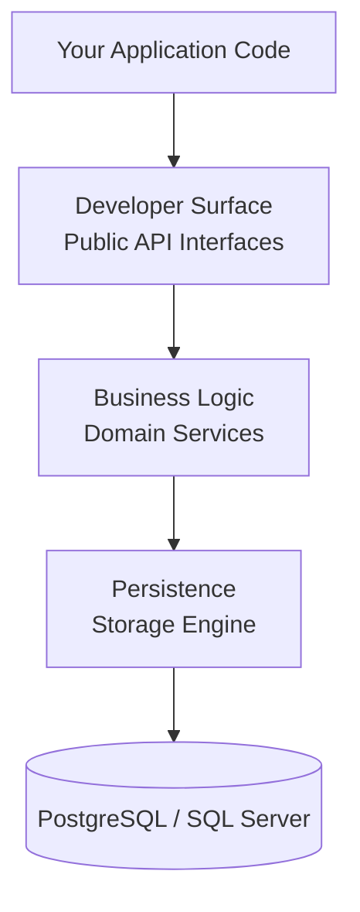

Duende User Management is built on a layered architecture that separates concerns and provides clean extension points. The public API is exposed through scenario-based interfaces that are registered in the ASP.NET Core dependency injection container, backed by an internal domain layer and a document-based storage engine.

## Architectural Layers



### Developer Surface (Public API)

The top layer exposes scenario-based interfaces that represent distinct use cases. Application code interacts exclusively with these interfaces; the internal implementation details are hidden behind them.

Interfaces are grouped into three categories: self-service (user-facing operations), admin (back-office and management operations), and authentication (verifying credentials).

### Business Logic (Domain)

The middle layer contains the business logic and domain models. It enforces invariants, coordinates between domain concepts, and applies security rules such as throttling, hashing, and code expiry. This layer is internal and not directly accessible from application code.

### Persistence (Storage Engine)

The bottom layer persists data through the Duende Storage Engine, a document-based storage abstraction built around the `IStore` interface. It supports PostgreSQL, SQL Server, and in-memory backends. Schema is managed automatically; no Entity Framework migrations are required.

See [Storage](/usermanagement/fundamentals/storage.md) for details on the storage engine.

## Public API Interfaces

### Self-Service Interfaces

Self-service interfaces are intended for user-facing operations: actions a user performs on their own account.

| Interface | Purpose |
|-----------|---------|
| `IUserSelfService` | Set or remove a username; deregister (delete) the user's own account |
| `IUserAuthenticatorsSelfService` | All authenticator management: register by One-Time Password (OTP) address or external authenticator; look up authenticators; add/replace/remove OTP addresses; add/remove external authenticators; add/remove Time-Based One-Time Password (TOTP) authenticators; add/remove passkeys; create recovery codes; set, change, and reset password |
| `IUserProfileSelfService` | User profile operations: get the attribute schema; register a profile; get the current profile; update profile attributes |

#### IUserSelfService

```csharp
Task<bool> TrySetUserNameAsync(UserSubjectId subjectId, UserName userName, CancellationToken ct);
Task<bool> TryRemoveUserNameAsync(UserSubjectId subjectId, CancellationToken ct);
Task<bool> TryDeregisterAsync(UserSubjectId subjectId, CancellationToken ct);
```

#### IUserAuthenticatorsSelfService

```csharp
// Register a new user by OTP address or external authenticator
Task<UserAuthenticators?> TryRegisterAsync(UserSubjectId subjectId, OtpAddress address, CancellationToken ct);
Task<UserAuthenticators?> TryRegisterAsync(UserSubjectId subjectId, ExternalAuthenticator authenticator, CancellationToken ct);

// Look up authenticators
Task<UserAuthenticators?> TryGetAsync(UserSubjectId subjectId, CancellationToken ct);
Task<UserAuthenticators?> TryGetAsync(OtpAddress address, CancellationToken ct);
Task<UserAuthenticators?> TryGetAsync(ExternalAuthenticator authenticator, CancellationToken ct);
Task<UserAuthenticators?> TryGetAsync(UserName userName, CancellationToken ct);

// OTP address management
Task<bool> TryAddOtpAddressAsync(UserSubjectId subjectId, OtpAddress address, CancellationToken ct);
Task<bool> TryReplaceOtpAddressAsync(UserSubjectId subjectId, OtpAddress oldAddress, OtpAddress newAddress, CancellationToken ct);
Task<bool> TryRemoveOtpAddressAsync(UserSubjectId subjectId, OtpAddress address, CancellationToken ct);

// External authenticator management
Task<bool> TryAddExternalAuthenticatorAsync(UserSubjectId subjectId, ExternalAuthenticator authenticator, CancellationToken ct);
Task<bool> TryRemoveExternalAuthenticatorAsync(UserSubjectId subjectId, ExternalAuthenticator authenticator, CancellationToken ct);

// TOTP authenticator management
Task<bool> TryAddTotpAuthenticatorAsync(UserSubjectId subjectId, TotpAuthenticatorName authenticatorName, PlainBytesTotpKey key, PlainTextTotp totp, CancellationToken ct);
Task<bool> TryRemoveTotpAuthenticatorAsync(UserSubjectId subjectId, TotpAuthenticatorName authenticatorName, CancellationToken ct);

// Passkey management
Task<bool> TryAddPasskeyAsync(UserSubjectId subjectId, PasskeyCredentialData credential, CancellationToken ct);
Task<bool> TryRemovePasskeyAsync(UserSubjectId subjectId, PasskeyCredentialId credentialId, CancellationToken ct);

// Recovery codes
Task<IReadOnlyCollection<PlainTextRecoveryCode>?> TryCreateRecoveryCodesAsync(UserSubjectId subjectId, CancellationToken ct);

// Password management
Task<bool> TrySetPasswordAsync(UserSubjectId subjectId, PlainTextPassword password, CancellationToken ct);
Task<bool> TryChangePasswordAsync(UserSubjectId subjectId, PlainTextPassword oldPassword, PlainTextPassword newPassword, CancellationToken ct);
Task<bool> TryResetPasswordAsync(UserSubjectId subjectId, PlainTextPassword password, CancellationToken ct);
```

#### IUserProfileSelfService

```csharp
Task<IReadOnlyAttributeSchema> GetSchemaAsync(CancellationToken);
Task<UserProfile?> TryRegisterAsync(UserSubjectId subjectId, AttributeValueCollection attributes, CancellationToken ct);
Task<UserProfile?> TryGetAsync(UserSubjectId subjectId, CancellationToken ct);
Task<UserProfile?> TryUpdateAsync(UserSubjectId subjectId, UserProfileUpdate update, CancellationToken ct);
```

### Admin Interfaces

Admin interfaces are intended for back-office and management operations: actions performed by administrators or background services.

| Interface | Purpose |
|-----------|---------|
| `IUserAdmin` | Set or remove a username; remove a user entirely |
| `IUserAuthenticatorsAdmin` | Admin-level authenticator management: create user with OTP addresses and external authenticators; look up authenticators; bulk add/remove OTP addresses; bulk add/remove external authenticators |
| `IUserProfileAdmin` | Admin profile operations: get the attribute schema; add a profile; get a profile by subject ID or by attribute value |
| `IUserProfileSchemaAdmin` | Manage attribute definitions: get all definitions; add a definition; remove a definition |
| `IRoleAdmin` | Role CRUD: create, get, update, delete, and query roles with filtering, sorting, and pagination |
| `IGroupAdmin` | Group CRUD: create, get, update, delete, and query groups with filtering, sorting, and pagination |
| `IRoleMembershipAdmin` | Assign roles to users and groups; query direct and transitive role assignments |
| `IGroupMembershipAdmin` | Add and remove users from groups; query group membership with offset-based and cursor-based pagination |

#### IUserAdmin

```csharp
Task<bool> TrySetUserNameAsync(UserSubjectId subjectId, UserName userName, CancellationToken ct);
Task<bool> TryRemoveUserNameAsync(UserSubjectId subjectId, CancellationToken ct);
Task<bool> TryRemoveAsync(UserSubjectId subjectId, CancellationToken ct);
```

#### IUserAuthenticatorsAdmin

```csharp
// Create a user with initial authenticators
Task<UserAuthenticators?> TryAddAsync(
    UserSubjectId subjectId,
    IEnumerable<OtpAddress> otpAddresses,
    IEnumerable<ExternalAuthenticator> externalAuthenticators,
    CancellationToken ct);

// Look up authenticators
Task<UserAuthenticators?> TryGetAsync(UserSubjectId subjectId, CancellationToken ct);
Task<UserAuthenticators?> TryGetAsync(UserName userName, CancellationToken ct);

// Bulk OTP address management
Task<bool> TryAddOtpAddressesAsync(UserSubjectId subjectId, IEnumerable<OtpAddress> addresses, CancellationToken ct);
Task<bool> TryRemoveOtpAddressesAsync(UserSubjectId subjectId, IEnumerable<OtpAddress> addresses, CancellationToken ct);

// Bulk external authenticator management
Task<bool> TryAddExternalAuthenticatorsAsync(UserSubjectId subjectId, IEnumerable<ExternalAuthenticator> authenticators, CancellationToken ct);
Task<bool> TryRemoveExternalAuthenticatorsAsync(UserSubjectId subjectId, IEnumerable<ExternalAuthenticator> authenticators, CancellationToken ct);
```

#### IUserProfileAdmin

```csharp
Task<IReadOnlyAttributeSchema> GetSchemaAsync(CancellationToken ct);
Task<UserProfile?> TryAddAsync(UserSubjectId subjectId, AttributeValueCollection attributes, CancellationToken ct);
Task<UserProfile?> TryGetAsync(UserSubjectId subjectId, CancellationToken ct);
Task<UserProfile?> TryGetAsync(AttributeName attributeName, object value, CancellationToken ct);
```

#### IUserProfileSchemaAdmin

```csharp
Task<IReadOnlyDictionary<AttributeName, AttributeDefinition>> GetAllAttributeDefinitionsAsync(CancellationToken ct);
Task<bool> TryAddAttributeDefinitionAsync(AttributeDefinition definition, CancellationToken ct);
Task<bool> TryRemoveAttributeDefinitionAsync(AttributeName name, CancellationToken ct);
```

#### IRoleAdmin

```csharp
Task<SaveResult<RoleId>> CreateAsync(RoleDto role, CancellationToken ct);
Task<GetResult<RoleDto>> GetAsync(RoleId id, CancellationToken ct);
Task<SaveResult<RoleId>> UpdateAsync(RoleId id, RoleDto role, Version expectedVersion, CancellationToken ct);
Task<SaveResult<RoleId>> DeleteAsync(RoleId id, CancellationToken ct);
Task<QueryResult<RoleListDto>> QueryAsync(
    RoleFilter? filter,
    SortBy.SortByField<RoleSortField>? sort,
    DataRange? range,
    CancellationToken ct);
```

#### IGroupAdmin

```csharp
Task<SaveResult<GroupId>> CreateAsync(GroupDto group, CancellationToken ct);
Task<GetResult<GroupDto>> GetAsync(GroupId id, CancellationToken ct);
Task<SaveResult<GroupId>> UpdateAsync(GroupId id, GroupDto group, Version expectedVersion, CancellationToken ct);
Task<SaveResult<GroupId>> DeleteAsync(GroupId id, CancellationToken ct);
Task<QueryResult<GroupListDto>> QueryAsync(
    GroupFilter? filter,
    SortBy.SortByField<GroupSortField>? sort,
    DataRange? range,
    CancellationToken ct);
```

#### IRoleMembershipAdmin

```csharp
// Assign and remove roles for users and groups
Task<SaveResult<RoleId>> AssignRoleToUserProfileAsync(RoleId roleId, UserSubjectId subjectId, CancellationToken ct);
Task<SaveResult<RoleId>> RemoveRoleFromUserProfileAsync(RoleId roleId, UserSubjectId subjectId, CancellationToken ct);
Task<SaveResult<RoleId>> AssignRoleToGroupAsync(RoleId roleId, GroupId groupId, CancellationToken ct);
Task<SaveResult<RoleId>> RemoveRoleFromGroupAsync(RoleId roleId, GroupId groupId, CancellationToken ct);

// Query role membership
Task<QueryResult<UserProfileRoleMemberListDto>> GetUserProfilesInRoleAsync(RoleId roleId, DataRange? range, CancellationToken ct);
Task<QueryResult<GroupRoleMemberListDto>> GetGroupsInRoleAsync(RoleId roleId, DataRange? range, CancellationToken ct);
Task<QueryResult<RoleListDto>> GetDirectRolesForUserProfileAsync(UserSubjectId subjectId, DataRange? range, CancellationToken ct);
Task<QueryResult<RoleListDto>> GetTransitiveRolesForUserProfileAsync(UserSubjectId subjectId, DataRange? range, CancellationToken ct);
Task<QueryResult<RoleListDto>> GetRolesForGroupAsync(GroupId groupId, DataRange? range, CancellationToken ct);
```

#### IGroupMembershipAdmin

```csharp
// Add and remove users from groups
Task<SaveResult<GroupId>> AddUserProfileToGroupAsync(GroupId groupId, UserSubjectId subjectId, CancellationToken ct);
Task<SaveResult<GroupId>> RemoveUserProfileFromGroupAsync(GroupId groupId, UserSubjectId subjectId, CancellationToken ct);

// Query group membership (offset-based pagination)
Task<QueryResult<UserProfileGroupMemberListDto>> GetUserProfilesInGroupAsync(GroupId groupId, Page? page, CancellationToken ct);

// Query group membership (cursor-based pagination)
Task<QueryResult<UserProfileGroupMemberListDto>> GetUserProfilesInGroupAsync(
    GroupId groupId, DataRange? range, CancellationToken ct);

// Query groups for a user
Task<QueryResult<GroupListDto>> GetGroupsForUserProfileAsync(UserSubjectId subjectId, DataRange? range, CancellationToken ct);
```

### Authentication Interfaces

Authentication interfaces verify credentials during sign-in flows.

| Interface | Purpose |
|-----------|---------|
| `IPasswordAuth` | Verify a username and password; returns the subject ID on success |
| `IOtpAuthenticator` | Send a one-time password to an OTP address; verify a one-time password against a token |
| `ITotpAuth` | Verify a TOTP code from an authenticator app |
| `IRecoveryCodeAuth` | Verify and consume a single-use recovery code |

#### IPasswordAuth

```csharp
Task<UserSubjectId?> TryAuthenticateAsync(UserName userName, PlainTextPassword password, CancellationToken ct);
```

#### IOtpAuthenticator

```csharp
Task<SendOtpResult?> TrySendOtpAsync(OtpAddress address, CancellationToken ct);
Task<OtpAddress?> TryAuthenticateAsync(PlainTextOtp otp, OtpToken token, CancellationToken ct);
```

#### ITotpAuth

```csharp
Task<bool> TryAuthenticateAsync(UserSubjectId subjectId, TotpAuthenticatorName authenticatorName, PlainTextTotp totp, CancellationToken ct);
```

#### IRecoveryCodeAuth

```csharp
Task<bool> TryAuthenticateAsync(UserSubjectId subjectId, PlainTextRecoveryCode recoveryCode, CancellationToken ct);
```

## DI Registration

User Management is registered as a set of modules on the `IDuendePlatformBuilder`. The two primary modules are `AddUserAuthentication()` and `AddUserProfiles()`.

### Registering Authentication

`AddUserAuthentication()` registers all authentication-related services, including `IUserAuthenticatorsSelfService`, `IUserAuthenticatorsAdmin`, `IPasswordAuth`, `IOtpAuthenticator`, `ITotpAuth`, and `IRecoveryCodeAuth`.

```csharp title="Program.cs"
builder.Services
    .AddDuendePlatform()
    .AddUserAuthentication();
```

You can configure authentication options and sub-features using the builder overload:

```csharp title="Program.cs"
builder.Services
    .AddDuendePlatform()
    .AddUserAuthentication(options =>
    {
        // Configure throttling, TOTP window, etc.
    }, auth =>
    {
        // Register a custom OTP sender
        auth.UseOtpSender<MyOtpSender>();

        // Or use the built-in SMTP sender
        auth.UseSmtpOtpSender(smtp =>
        {
            smtp.Host = "smtp.example.com";
            smtp.Port = 587;
        });

        // Register a custom password validator
        auth.AddPasswordValidator<MyPasswordValidator>();
    });
```

### Registering Profiles, Roles, and Groups

`AddUserProfiles()` registers all profile-related services, including `IUserProfileSelfService`, `IUserProfileAdmin`, `IUserProfileSchemaAdmin`, `IRoleAdmin`, `IGroupAdmin`, `IRoleMembershipAdmin`, and `IGroupMembershipAdmin`.

```csharp title="Program.cs"
builder.Services
    .AddDuendePlatform()
    .AddUserProfiles();
```

### Registering Both Modules

Most applications register both modules together:

```csharp title="Program.cs"
builder.Services
    .AddDuendePlatform()
    .AddUserAuthentication()
    .AddUserProfiles();
```

`IUserSelfService` and `IUserAdmin` are registered as part of the core platform and do not require a separate module call.

## Design Principles

* **Scenario-Based Interfaces**: Each interface represents a distinct use case (self-service, admin, authentication) rather than a generic CRUD surface. This makes it clear which interface to inject for a given scenario and limits the blast radius of changes.
* **Try-Pattern Returns**: Methods return `null` or `false` on expected failures (user not found, wrong password) rather than throwing exceptions. Exceptions are reserved for unexpected infrastructure failures.
* **Idempotent Mutations**: Membership operations (`AssignRoleToUserProfileAsync`, `AddUserProfileToGroupAsync`, etc.) are idempotent: calling them when the relationship already exists succeeds without error.
* **Optimistic Concurrency**: Update operations on roles and groups accept an `expectedVersion` parameter to detect and reject conflicting concurrent writes.
* **Cursor-Based Pagination**: `IGroupMembershipAdmin` supports both offset-based and cursor-based pagination. Cursor-based pagination is preferred for large groups where offset queries become expensive.
