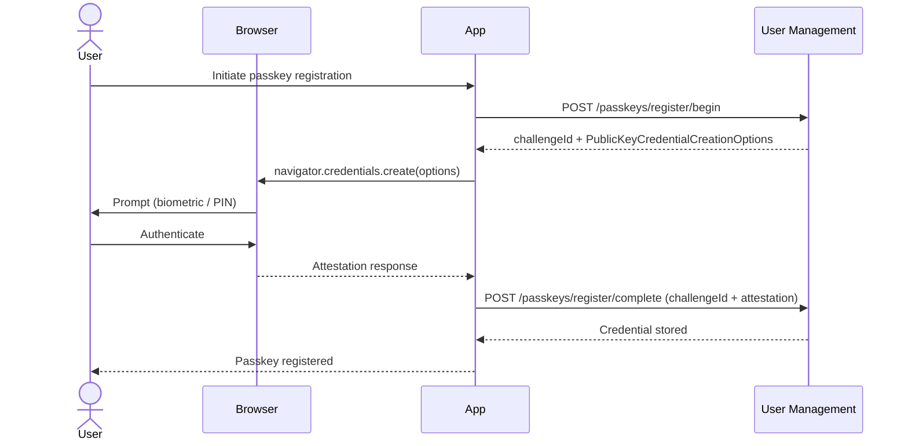
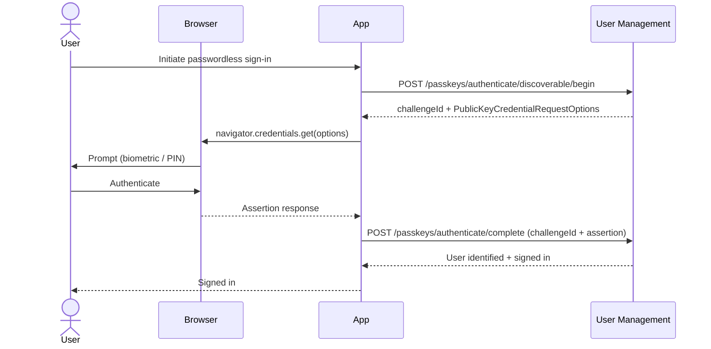
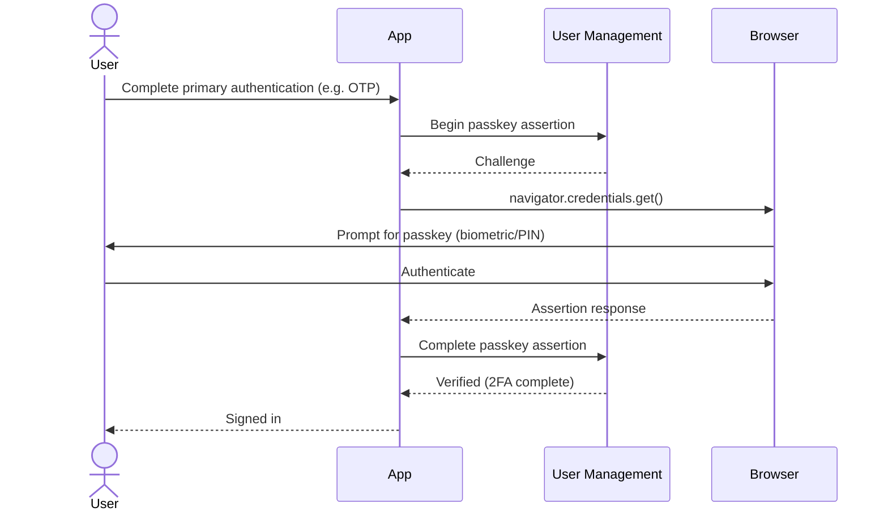

Passkeys provide phishing-resistant, passwordless authentication using the WebAuthn/FIDO2 standard. Authentication can use biometrics (fingerprint, face recognition), a device PIN, or a hardware security key. Credentials are cryptographically bound to the origin, so they cannot be used on a different site.

**Learn more:** [passkeys.dev](https://passkeys.dev/) (FIDO Alliance resource site) · [WebAuthn specification](https://www.w3.org/TR/webauthn-3/) (W3C) · [FIDO Alliance](https://fidoalliance.org/) (standards body)

## When to Use Passkeys

**Strongly recommended for:**

* High-security applications (financial services, healthcare, government)
* Any application where phishing resistance is a priority
* Applications targeting modern devices and browsers

:::tip[FAPI Conformance]
For applications requiring FAPI (Financial-grade API) compliance, Duende offers [FAPI 2.0 support](/identityserver/tokens/fapi-2-0-specification) for IdentityServer, which extends security with additional requirements aligned to financial-grade standards. See also the [conformance report](/identityserver/diagnostics/conformance-report.md).
:::

**Good for:**

* Consumer applications (passkeys are natively supported on modern iOS, Android, macOS, and Windows)
* Enterprise applications replacing hardware tokens
* Applications looking to eliminate password management overhead

**Considerations:**

* Requires browser and device support for WebAuthn (broadly available in all modern browsers and operating systems)
* Users need a fallback authentication method if they lose access to their device
* Discoverable credentials require authenticator support for resident keys

## Passkeys vs Other Authentication Methods

| Aspect | Passkeys | Time-Based One-Time Password (TOTP) | Password |
|---|---|---|---|
| **Phishing resistance** | Excellent | High | None |
| **User experience** | Excellent | Moderate | Moderate |
| **Device dependency** | Yes | Yes (app) | No |
| **Offline support** | Yes | Yes | Yes |
| **Shared secret** | No | Yes | Yes |
| **Replay attacks** | Not vulnerable | Not vulnerable | Vulnerable |
| **Setup complexity** | Low | Moderate | Low |

## How It Works

WebAuthn calls its two main protocol flows *ceremonies*. The **registration ceremony** creates a new credential on the user's device and registers the public key with your server. The **authentication ceremony** proves the user still controls the device by signing a server challenge with the stored private key.

### Registration Ceremony

1. **User initiates passkey creation** - From account settings or during sign-up
2. **Challenge generation** - The server generates a cryptographic challenge
3. **Authenticator interaction** - The user's device creates a public/private key pair
4. **Credential storage** - The public key and credential ID are stored server-side
5. **Private key retention** - The private key never leaves the user's device

### Authentication Ceremony

1. **Challenge generation** - The server generates a cryptographic challenge
2. **Authenticator interaction** - The user's device signs the challenge with the private key
3. **Signature verification** - The server verifies the signature using the stored public key
4. **Session establishment** - Authentication is complete

### Discoverable Credentials

Discoverable credentials (also called resident keys) allow passwordless login without entering a username first. The authenticator stores the credential and can present it automatically when the relying party requests authentication.

## Authenticator Types

* **Platform authenticators** - Built into the device (Touch ID, Face ID, Windows Hello). Convenient but tied to a specific device.
* **Cross-platform authenticators** - Separate hardware security keys (YubiKey, Titan Security Key). Work across devices but require carrying the key.

## Security Properties

Passkeys are the strongest authentication option in User Management, and the one with the fewest caveats. The private key never leaves the device, credentials are bound to your specific origin so they cannot be phished, and every authentication uses a unique challenge so replaying a captured response does not work. If you can use passkeys, you should.

### What User Management Does for You

Credentials are cryptographically bound to the relying party ID and origin. A passkey registered at `auth.example.com` cannot be used at `evil.example.com`, even if an attacker controls a subdomain. The server stores only the public key, so a database breach gives an attacker nothing useful. Challenges are 32 bytes (256 bits) of random data, expire after 5 minutes, and are single-use. There is no shared secret to steal, no code to intercept, and no password to guess.

### What You Need to Think About

Most passkey security issues come from misconfiguration rather than protocol weaknesses.

`AllowedOrigins` is required and must be set explicitly. An overly broad list weakens origin binding, which is the core security property of passkeys. List only the exact origins your application uses.

If you want a passkey registered at `auth.example.com` to work at `app.example.com`, set `ServerDomain` to `"example.com"`. Without it, each subdomain is treated as a separate relying party and the passkey will not work across them.

The default `UserVerificationRequirement` is `"preferred"`, which means authentication can succeed without a PIN or biometric if the authenticator does not support user verification. For high-assurance scenarios (financial applications, admin interfaces, anything sensitive) set it to `"required"`.

For regulated environments where you need to know exactly what kind of authenticator your users are using, set `AttestationConveyancePreference` to `"direct"` and verify the attestation statement. This lets you enforce an allowlist of approved authenticator models.

For cross-cutting security topics (data protection key persistence and throttling configuration) see [Security Considerations](/usermanagement/fundamentals/security.md).

## Configuration

### Passkey Options

Configure passkey behavior using `PasskeyOptions`, accessible via `UserAuthenticationOptions.Passkeys`. Use the `Configure` method on the authentication builder:

```csharp title="Program.cs"
builder.Services.AddDuendePlatform()
    .AddUserAuthentication(auth =>
    {
        auth.Configure(options =>
        {
            // Human-readable name shown to users during registration
            options.Passkeys.RelyingPartyName = "My Application";

            // Explicit relying party ID (domain). Required when sharing passkeys
            // across subdomains (e.g., "example.com" for auth.example.com and app.example.com)
            options.Passkeys.ServerDomain = "example.com";

            // Origins permitted to use passkeys with this relying party
            options.Passkeys.AllowedOrigins = ["https://app.example.com", "https://auth.example.com"];

            // User verification: "required", "preferred" (default), or "discouraged"
            options.Passkeys.UserVerificationRequirement = "required";

            // Attestation: "none" (default), "indirect", "direct", or "enterprise"
            options.Passkeys.AttestationConveyancePreference = "none";

            // Authenticator attachment: "platform", "cross-platform", or null (any, default)
            options.Passkeys.AuthenticatorAttachment = null;

            // Resident key: "discouraged", "preferred" (default), or "required"
            options.Passkeys.ResidentKeyRequirement = "preferred";

            // Challenge size in bytes (default: 32)
            options.Passkeys.ChallengeSize = 32;

            // How long a challenge remains valid (default: 5 minutes)
            options.Passkeys.ChallengeTimeout = TimeSpan.FromMinutes(5);

            // Restrict to specific COSE algorithms (empty = all supported)
            options.Passkeys.SupportedAlgorithms = [CoseAlgorithms.Es256, CoseAlgorithms.Rs256];
        });
    });
```

All `PasskeyOptions` properties and their defaults:

| Property | Type | Default | Description |
|---|---|---|---|
| `RelyingPartyName` | `string` | Assembly name | Human-readable name shown during registration |
| `ServerDomain` | `string?` | `null` | Relying party ID (domain). Set to share passkeys across subdomains |
| `AllowedOrigins` | `IReadOnlyList<string>?` | `null` | Fully-qualified origins permitted to use passkeys |
| `UserVerificationRequirement` | `string` | `"preferred"` | Whether user verification (PIN/biometric) is required |
| `AttestationConveyancePreference` | `string` | `"none"` | Whether attestation statements are requested |
| `AuthenticatorAttachment` | `string?` | `null` | Restrict to `"platform"` or `"cross-platform"` authenticators |
| `ResidentKeyRequirement` | `string` | `"preferred"` | Whether discoverable credentials are required |
| `ChallengeSize` | `int` | `32` | Challenge size in bytes |
| `ChallengeTimeout` | `TimeSpan` | 5 minutes | How long a challenge remains valid |
| `SupportedAlgorithms` | `IReadOnlyList<int>` | `[]` (all) | COSE algorithm identifiers, in preference order |

## Core Passkey Management

Passkey credentials are managed through `IUserAuthenticatorsSelfService`. This interface handles the persistence of credentials after the WebAuthn ceremony completes.

### Adding a Passkey

After a successful registration ceremony, persist the credential:

```csharp
Task<bool> TryAddPasskeyAsync(
    UserSubjectId subjectId,
    PasskeyCredentialData credential,
    Ct ct);
```

`PasskeyCredentialData` is returned from a completed registration ceremony and contains:

* `CredentialId` - Strongly-typed `PasskeyCredentialId` (byte array, max 1023 bytes)
* `PublicKeyCose` - The COSE-encoded public key
* `Algorithm` - COSE algorithm identifier
* `SignCount` - Initial signature counter value
* `BackupEligible` - Whether the credential can be backed up
* `BackedUp` - Whether the credential is currently backed up
* `Aaguid` - Authenticator AAGUID (identifies the authenticator model)
* `CreatedAt` - Registration timestamp
* `Name` - Display name for the credential

Returns `true` if the credential was stored successfully, `false` if the user was not found or the credential already exists.

### Removing a Passkey

Remove a specific passkey by its credential ID:

```csharp
Task<bool> TryRemovePasskeyAsync(
    UserSubjectId subjectId,
    PasskeyCredentialId credentialId,
    Ct ct);
```

Returns `true` if the credential was removed, `false` if the user or credential was not found.

### Listing Registered Passkeys

Retrieve a user's registered passkeys via `TryGetAsync`:

```csharp
var authenticators = await selfService.TryGetAsync(userId, ct);

// authenticators.Passkeys is IReadOnlyCollection<UserPasskey>
foreach (var passkey in authenticators?.Passkeys ?? [])
{
    Console.WriteLine($"Credential: {passkey.Name}, registered: {passkey.CreatedAt}");
    Console.WriteLine($"Credential ID: {passkey.CredentialId}");
}
```

`UserPasskey` exposes:

* `CredentialId` - The `PasskeyCredentialId` for removal operations
* `Name` - Display name for the credential
* `CreatedAt` - When the credential was registered

## Web Endpoints

When `AddUserAuthentication()` is called, the following HTTP endpoints are registered automatically to handle the WebAuthn ceremony protocol:

| Endpoint | Method | Default Path | Description |
|---|---|---|---|
| Begin Registration | `POST` | `/passkeys/register/begin` | Starts a registration ceremony for the authenticated user |
| Complete Registration | `POST` | `/passkeys/register/complete` | Validates the attestation response and stores the credential |
| Begin Authentication (2nd factor) | `POST` | `/passkeys/authenticate/begin` | Starts an authentication ceremony for a known user (second-factor) |
| Begin Discoverable Authentication | `POST` | `/passkeys/authenticate/discoverable/begin` | Starts a usernameless authentication ceremony |
| Complete Authentication | `POST` | `/passkeys/authenticate/complete` | Validates the assertion response and signs the user in |
| JavaScript Helper | `GET` | `/passkeys/js` | Serves the built-in passkeys JavaScript helper |

The Begin Registration and Complete Registration endpoints require an authenticated user (they use `RequireAuthorization()`). The authentication endpoints are unauthenticated; they establish the session.

### Configuring Endpoint Routes

Customize endpoint paths using `UserAuthenticationEndpointOptions` and `PasskeysRouteOptions`:

```csharp title="Program.cs"
builder.Services.AddDuendePlatform()
    .AddUserAuthentication(auth =>
    {
        auth.ConfigureEndpoints(options =>
        {
            // Base route prefix for all passkey endpoints (default: "/passkeys")
            options.Passkeys.Route = "/passkeys";

            // Registration endpoints (relative to Route)
            options.Passkeys.BeginRegistration = "/register/begin";
            options.Passkeys.CompleteRegistration = "/register/complete";

            // Authentication endpoints (relative to Route)
            options.Passkeys.BeginAuthentication = "/authenticate/begin";
            options.Passkeys.BeginDiscoverableAuthentication = "/authenticate/discoverable/begin";
            options.Passkeys.CompleteAuthentication = "/authenticate/complete";

            // JavaScript helper endpoint (relative to Route)
            options.Passkeys.PasskeysJavaScript = "/js";
        });
    });
```

Configuration can also be loaded from `appsettings.json`:

```csharp title="Program.cs"
builder.Services.AddDuendePlatform()
    .AddUserAuthentication(auth =>
    {
        auth.ConfigureEndpoints(
            builder.Configuration.GetSection("UserAuthentication:Endpoints"));
    });
```

`PasskeysRouteOptions` properties:

| Property | Default | Description |
|---|---|---|
| `Route` | `/passkeys` | Base route prefix for all passkey endpoints |
| `BeginRegistration` | `/register/begin` | Path for the begin registration endpoint |
| `CompleteRegistration` | `/register/complete` | Path for the complete registration endpoint |
| `BeginAuthentication` | `/authenticate/begin` | Path for the begin authentication endpoint (second-factor) |
| `BeginDiscoverableAuthentication` | `/authenticate/discoverable/begin` | Path for the begin discoverable authentication endpoint |
| `CompleteAuthentication` | `/authenticate/complete` | Path for the complete authentication endpoint |
| `PasskeysJavaScript` | `/js` | Path for the JavaScript helper endpoint |

### Ceremony Protocol

The endpoints implement the WebAuthn ceremony protocol:

**Registration:**

1. Client calls `POST /passkeys/register/begin` - receives a `challengeId` and `PublicKeyCredentialCreationOptions`
2. Client passes the options to `navigator.credentials.create()`
3. Client calls `POST /passkeys/register/complete` with the `challengeId` and the authenticator's attestation response
4. Server validates the attestation and stores the credential

Here's how the registration ceremony flows between the browser, your application, and User Management:



**Authentication (discoverable):**

1. Client calls `POST /passkeys/authenticate/discoverable/begin` - receives a `challengeId` and `PublicKeyCredentialRequestOptions`
2. Client passes the options to `navigator.credentials.get()`
3. Client calls `POST /passkeys/authenticate/complete` with the `challengeId` and the authenticator's assertion response
4. Server validates the assertion, looks up the user, and signs them in

The discoverable authentication ceremony lets users sign in without entering a username first:



## JavaScript Helper

The built-in JavaScript helper is served at `/passkeys/js` (configurable via `PasskeysJavaScript`). It provides browser-side utilities for interacting with the WebAuthn API and the ceremony endpoints.

Include it in your HTML:

```html
<script src="/passkeys/js"></script>
```

The helper handles:

* Calling the begin/complete endpoints
* Invoking `navigator.credentials.create()` and `navigator.credentials.get()`
* Encoding and decoding Base64URL values required by the WebAuthn API
* Routing requests to the correct endpoint URLs (injected at build time from `PasskeysRouteOptions`)

## Second-Factor Passkey Support

Passkeys can be used as a second factor after a primary authentication step (for example, after password or One-Time Password (OTP) verification). This requires implementing `ISecondFactorPasskeyAuthenticationResolver` to identify the partially-authenticated user.

### ISecondFactorPasskeyAuthenticationResolver

```csharp
public interface ISecondFactorPasskeyAuthenticationResolver
{
    /// <summary>
    /// Resolves the user that completed the first factor and is participating
    /// in the passkey second-factor ceremony.
    /// </summary>
    Task<UserSubjectId?> ResolveAsync(Ct ct);
}
```

Implement this interface to retrieve the user's `UserSubjectId` from your intermediate authentication state (for example, from a session, cookie, or distributed cache):

```csharp
public class MySecondFactorResolver : ISecondFactorPasskeyAuthenticationResolver
{
    private readonly IHttpContextAccessor _httpContextAccessor;
    private readonly IMyAuthStateStore _authStateStore;

    public MySecondFactorResolver(
        IHttpContextAccessor httpContextAccessor,
        IMyAuthStateStore authStateStore)
    {
        _httpContextAccessor = httpContextAccessor;
        _authStateStore = authStateStore;
    }

    public async Task<UserSubjectId?> ResolveAsync(Ct ct)
    {
        // Retrieve the user ID stored after the first factor completed
        var stateKey = _httpContextAccessor.HttpContext?.Session.GetString("PendingUserId");
        if (stateKey is null)
        {
            return null;
        }

        var state = await _authStateStore.GetAsync(stateKey, ct);
        if (state is null || !Guid.TryParse(state.UserId, out var userId))
        {
            return null;
        }

        return UserSubjectId.From(userId);
    }
}
```

### Enabling Second-Factor Passkeys

Register the resolver using `EnablePasskeyForSecondFactor<T>()`:

```csharp title="Program.cs"
builder.Services.AddDuendePlatform()
    .AddUserAuthentication(auth =>
    {
        auth.EnablePasskeyForSecondFactor<MySecondFactorResolver>();
    });
```

When a resolver is registered, the `POST /passkeys/authenticate/begin` endpoint becomes active. It calls `ResolveAsync()` to identify the user and begins an authentication ceremony scoped to that user's registered credentials. Without a resolver, this endpoint is not registered.

An instance overload is also available for singleton resolvers:

```csharp title="Program.cs"
builder.Services.AddDuendePlatform()
    .AddUserAuthentication(auth =>
    {
        auth.EnablePasskeyForSecondFactor(new MySecondFactorResolver(...));
    });
```

### Second-Factor Flow

1. **Primary authentication** - User signs in with password, OTP, or another first factor
2. **State storage** - Store the user's `UserSubjectId` in session or a temporary store
3. **Passkey challenge** - Client calls `POST /passkeys/authenticate/begin`; the resolver retrieves the user and the server returns a challenge scoped to that user's passkeys
4. **Authenticator interaction** - Client calls `navigator.credentials.get()` with the challenge
5. **Completion** - Client calls `POST /passkeys/authenticate/complete`; the server validates the assertion and signs the user in

When passkeys are used as a second factor, the flow looks like this:



```csharp
// After primary authentication succeeds, store the user ID for the second factor
public async Task<IActionResult> OnPostLogin(string username, string password, CancellationToken ct)
{
    var userId = await passwordAuth.TryAuthenticateAsync(
        UserName.Parse(username),
        passwordFactory.Create(password),
        ct);

    if (userId is null)
    {
        return Error("Invalid credentials.");
    }

    var authenticators = await selfService.TryGetAsync(userId, ct);

    if (authenticators?.Passkeys.Count > 0)
    {
        // Store the user ID for the second-factor resolver to retrieve
        HttpContext.Session.SetString("PendingUserId", userId.ToGuid().ToString());
        return RedirectToPage("/LoginWithPasskey");
    }

    await CompleteSignIn(userId);
    return Redirect(returnUrl ?? "/");
}
```

## Passkey Management UI

### Registering a New Passkey

The registration flow is driven by the browser's WebAuthn API. The server endpoints handle the ceremony; your UI initiates it:

```csharp
// Server-side: the begin and complete endpoints handle the ceremony.
// Your page only needs to trigger the JavaScript helper.
public class ManagePasskeysModel : PageModel
{
    private readonly IUserAuthenticatorsSelfService _selfService;

    public ManagePasskeysModel(IUserAuthenticatorsSelfService selfService)
    {
        _selfService = selfService;
    }

    public IReadOnlyCollection<UserPasskey> RegisteredPasskeys { get; private set; } = [];

    public async Task OnGetAsync(CancellationToken ct)
    {
        var userId = GetCurrentUserId();
        var authenticators = await _selfService.TryGetAsync(userId, ct);
        RegisteredPasskeys = authenticators?.Passkeys ?? [];
    }
}
```

### Removing a Passkey

```csharp
public async Task<IActionResult> OnPostRemovePasskey(
    string credentialIdBase64,
    CancellationToken ct)
{
    var userId = GetCurrentUserId();

    if (!Convert.TryFromBase64String(credentialIdBase64, out var credentialIdBytes))
    {
        return Error("Invalid credential ID.");
    }

    var credentialId = PasskeyCredentialId.From(credentialIdBytes);

    var removed = await _selfService.TryRemovePasskeyAsync(userId, credentialId, ct);

    if (!removed)
    {
        return Error("Passkey not found.");
    }

    return RedirectToPage();
}

