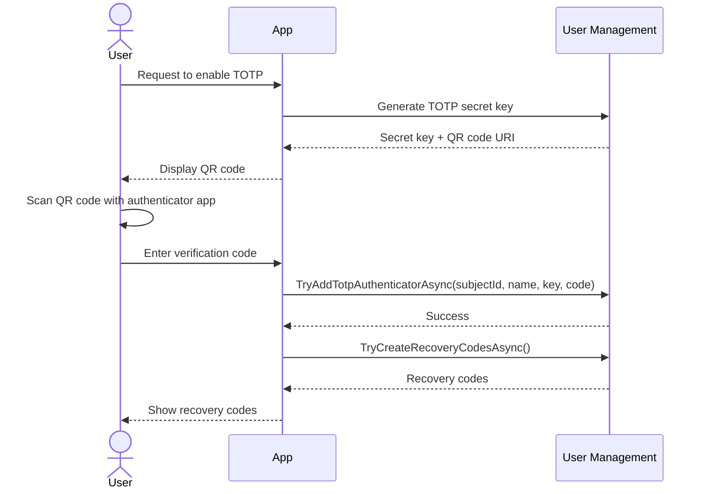

import { Steps } from "@astrojs/starlight/components";

TOTP (Time-Based One-Time Password) adds a second factor using time-synchronized codes from an authenticator app. It strengthens security by requiring both something the user knows (password or OTP) and something the user has (an authenticator device).

## When to Use TOTP

**Strongly recommended for:**

* Financial applications, banking, and payments
* Healthcare systems handling protected health information
* Administrative and privileged access
* Regulated industries with compliance requirements (PCI-DSS, HIPAA, etc.)

**Good for:**

* Enterprise applications with corporate security policies
* Developer tools and cloud platforms
* Any application offering optional enhanced security

**Consider alternatives for:**

* Low-risk applications with non-sensitive data
* High-frequency access scenarios where the additional step creates significant friction

For a comparison of all authentication methods, see [Choosing an Authentication Method](/usermanagement/authentication/overview#choosing-an-authentication-method).

## How It Works

TOTP authentication operates as a two-phase flow.

### Phase 1: Setup (One-Time)

<Steps>
1. **User initiates Two-Factor Authentication (2FA)** - After signing in, the user chooses to enable two-factor authentication

2. **Secret generation** - The system generates a cryptographic secret key (160-bit random value)

3. **Secret sharing** - The secret is shared with the user via QR code or manual entry

4. **App configuration** - The user scans the QR code or enters the secret in an authenticator app

5. **Verification** - The user enters the current TOTP code from the app to confirm setup

6. **Activation** - If the code is valid, 2FA is enabled for the account

7. **Recovery codes** - The system generates single-use recovery codes as a backup
</Steps>

### Phase 2: Authentication (Every Login)

<Steps>
1. **Primary authentication** - The user signs in with their password or OTP

2. **2FA check** - The system detects that the user has TOTP enabled

3. **Code request** - The user is prompted for the current TOTP code

4. **Code verification** - The system verifies the 6-digit code using the shared secret and current time

5. **Session establishment** - If the codes match, full authentication is granted
</Steps>

## Key Interfaces

### ITotpAuth

`ITotpAuth` is the primary interface for verifying TOTP codes during login:

```csharp
public interface ITotpAuth
{
    Task<bool> TryAuthenticateAsync(
        UserSubjectId subjectId,
        TotpAuthenticatorName authenticatorName,
        PlainTextTotp totp,
        Ct ct);
}
```

### IUserAuthenticatorsSelfService TOTP Methods

`IUserAuthenticatorsSelfService` manages TOTP authenticator registration and recovery codes:

```csharp
// Add a TOTP authenticator (enables 2FA)
Task<bool> TryAddTotpAuthenticatorAsync(
    UserSubjectId subjectId,
    TotpAuthenticatorName authenticatorName,
    PlainBytesTotpKey key,
    PlainTextTotp totp,
    Ct ct);

// Remove a TOTP authenticator (disables 2FA)
Task<bool> TryRemoveTotpAuthenticatorAsync(
    UserSubjectId subjectId,
    TotpAuthenticatorName authenticatorName,
    Ct ct);

// Generate recovery codes (invalidates any existing codes)
Task<IReadOnlyCollection<PlainTextRecoveryCode>?> TryCreateRecoveryCodesAsync(
    UserSubjectId subjectId,
    Ct ct);
```

## TOTP Types

### PlainBytesTotpKey

Represents the shared secret key (160-bit):

```csharp
public readonly record struct PlainBytesTotpKey
{
    // Generate a new cryptographically secure random key
    public static PlainBytesTotpKey New();

    // Encode to Base32 for display or QR code generation
    public string EncodeToBase32();

    // Encode to Base32 as grouped strings (e.g. for manual entry display)
    public IReadOnlyCollection<string> EncodeToBase32Groups();

    // Decode from a Base32 string
    public static PlainBytesTotpKey DecodeFromBase32(string input);

    // Try to decode from a Base32 string without throwing
    public static bool TryDecodeFromBase32(string input, out PlainBytesTotpKey? result);
}
```

### PlainTextTotp

Represents the 6-digit verification code entered by the user:

```csharp
public readonly record struct PlainTextTotp
{
    // Parse a TOTP code, throwing on invalid input
    public static PlainTextTotp Parse(string input);

    // Try to parse a TOTP code without throwing
    public static bool TryParse(string input, out PlainTextTotp? result);
}
```

### TotpAuthenticatorName

Identifies a specific TOTP authenticator registered to a user. Multiple authenticators per user are supported:

```csharp
public readonly record struct TotpAuthenticatorName
{
    // The default authenticator name ("Default")
    public static TotpAuthenticatorName Default { get; }

    // Parse an authenticator name, throwing on invalid input
    public static TotpAuthenticatorName Parse(string input);

    // Try to parse an authenticator name without throwing
    public static bool TryParse(string input, out TotpAuthenticatorName? result);
}
```

### TotpAuthenticatorUri

Generates `otpauth://` URIs for use with authenticator apps and QR code libraries:

```csharp
public static class TotpAuthenticatorUri
{
    // Generate an otpauth:// URI for QR code generation
    // Format: otpauth://totp/{issuer}:{account}?secret={secret}&issuer={issuer}&digits=6
    public static string Generate(string issuer, string accountIdentifier, PlainBytesTotpKey key);
}
```

## The TOTP Algorithm

TOTP is defined in [RFC 6238](https://tools.ietf.org/html/rfc6238). Codes are generated using:

* A shared secret key (160-bit)
* The current Unix time divided by a 30-second step
* HMAC-SHA1 to produce a 6-digit code

To account for clock drift, the system accepts codes from the current time step and one step in each direction (±30 seconds), giving a 90-second acceptance window.

### QR Code URI Format

TOTP secrets are shared via the `otpauth://` URI scheme:

```
otpauth://totp/MyApp:user@example.com?secret=JBSWY3DPEHPK3PXP&issuer=MyApp&digits=6
```

## Implementation Patterns

### Enabling TOTP (Setup Flow)

The setup flow has two steps: generating and displaying the secret, then verifying the user has configured their authenticator app correctly.

Here's the full setup flow, from the user requesting to enable TOTP to having a verified authenticator:



```csharp
// Step 1: Generate and display the secret
public async Task<IActionResult> OnGetSetup(CancellationToken ct)
{
    var userId = GetCurrentUserId();
    var authenticators = await userAuthenticatorsSelfService.TryGetAsync(userId, ct);

    // Redirect if TOTP is already enabled
    if (authenticators?.TotpAuthenticatorNames.Count > 0)
    {
        return RedirectToPage("/Manage2FA");
    }

    // Generate a new secret key
    var key = PlainBytesTotpKey.New();

    // Store the key temporarily (e.g., in TempData or session) for the verification step
    TempData["PendingTotpKey"] = key.EncodeToBase32();

    // Generate the otpauth:// URI for QR code display
    var email = GetCurrentUserEmail();
    var qrUri = TotpAuthenticatorUri.Generate("MyApp", email, key);

    ViewData["QRCodeUri"] = qrUri;
    ViewData["ManualKey"] = key.EncodeToBase32Groups(); // Grouped for manual entry

    return Page();
}

// Step 2: Verify the user has configured their authenticator app
public async Task<IActionResult> OnPostVerify(string code, CancellationToken ct)
{
    var userId = GetCurrentUserId();

    // Retrieve the temporarily stored key
    var keyBase32 = TempData["PendingTotpKey"] as string;
    if (keyBase32 == null)
    {
        return RedirectToPage("/Setup2FA");
    }

    if (!PlainBytesTotpKey.TryDecodeFromBase32(keyBase32, out var key))
    {
        return Error("Invalid key.");
    }

    if (!PlainTextTotp.TryParse(code, out var totp))
    {
        return Error("Invalid code format.");
    }

    // Register the TOTP authenticator (this also verifies the code)
    var success = await userAuthenticatorsSelfService.TryAddTotpAuthenticatorAsync(
        userId,
        TotpAuthenticatorName.Default,
        key.Value,
        totp.Value,
        ct);

    if (!success)
    {
        return Error("Invalid code. Please try again.");
    }

    // Generate recovery codes and show them to the user
    var recoveryCodes = await userAuthenticatorsSelfService.TryCreateRecoveryCodesAsync(userId, ct);
    TempData["RecoveryCodes"] = recoveryCodes?
        .Select(c => string.Join("-", c.ToTextGroups()))
        .ToArray();

    return RedirectToPage("/ShowRecoveryCodes");
}
```

### TOTP Verification During Login

After primary authentication (password or OTP), check whether the user has TOTP enabled and redirect to a second-factor page if so:

```csharp
// After primary authentication
public async Task<IActionResult> OnPostLogin(string username, string password, CancellationToken ct)
{
    // Step 1: Verify primary credentials
    var result = await passwordAuth.TryAuthenticateAsync(
        UserName.Parse(username),
        passwordFactory.Create(password),
        ct);

    if (result is not PasswordAuthenticationResult.Success success)
    {
        return Error("Invalid credentials.");
    }

    // Step 2: Check if TOTP is enabled
    var authenticators = await userAuthenticatorsSelfService.TryGetAsync(success.UserSubjectId, ct);

    if (authenticators?.TotpAuthenticatorNames.Count > 0)
    {
        // Store intermediate authentication state
        authenticationStateService.Store(new AuthenticationState
        {
            UserId = success.UserSubjectId,
            RememberMe = rememberMe,
            ReturnUrl = returnUrl
        });

        return RedirectToPage("/LoginWith2FA");
    }

    // No 2FA required. Complete sign-in
    await CompleteSignIn(authenticators, rememberMe);
    return Redirect(returnUrl ?? "/");
}

// TOTP verification page handler
public async Task<IActionResult> OnPostVerifyTotp(string code, CancellationToken ct)
{
    // Retrieve intermediate authentication state
    if (!authenticationStateService.TryRetrieve(out var authState))
    {
        return RedirectToPage("/Login");
    }

    if (!PlainTextTotp.TryParse(code, out var totp))
    {
        return Error("Invalid code format.");
    }

    var success = await totpAuth.TryAuthenticateAsync(
        authState.UserId,
        TotpAuthenticatorName.Default,
        totp.Value,
        ct);

    if (!success)
    {
        return Error("Invalid code.");
    }

    // Clear intermediate state and complete sign-in with MFA claim
    authenticationStateService.Clear();
    var authenticators = await userAuthenticatorsSelfService.TryGetAsync(authState.UserId, ct);
    await CompleteSignIn(authenticators, authState.RememberMe, isMfa: true);

    return Redirect(authState.ReturnUrl ?? "/");
}
```

### Disabling TOTP

```csharp
public async Task<IActionResult> OnPostDisable2FA(CancellationToken ct)
{
    var userId = GetCurrentUserId();
    var authenticators = await userAuthenticatorsSelfService.TryGetAsync(userId, ct);

    if (authenticators == null)
    {
        return Error("User not found.");
    }

    // Remove all registered TOTP authenticators
    foreach (var authenticatorName in authenticators.TotpAuthenticatorNames)
    {
        await userAuthenticatorsSelfService.TryRemoveTotpAuthenticatorAsync(
            userId,
            authenticatorName,
            ct);
    }

    return Success("Two-factor authentication has been disabled.");
}
```

### Regenerating Recovery Codes

```csharp
public async Task<IActionResult> OnPostRegenerateRecoveryCodes(CancellationToken ct)
{
    var userId = GetCurrentUserId();

    // Generate new recovery codes (this invalidates any existing codes)
    var recoveryCodes = await userAuthenticatorsSelfService.TryCreateRecoveryCodesAsync(userId, ct);

    if (recoveryCodes == null)
    {
        return Error("Failed to generate recovery codes.");
    }

    TempData["RecoveryCodes"] = recoveryCodes
        .Select(c => string.Join("-", c.ToTextGroups()))
        .ToArray();

    return RedirectToPage("/ShowRecoveryCodes");
}
```

### Checking TOTP Status

Use `IUserAuthenticatorsSelfService.TryGetAsync` to inspect a user's TOTP configuration:

```csharp
var authenticators = await userAuthenticatorsSelfService.TryGetAsync(userId, ct);

// Check if TOTP is enabled
bool has2FA = authenticators?.TotpAuthenticatorNames.Count > 0;

// List registered authenticator names
foreach (var name in authenticators?.TotpAuthenticatorNames ?? [])
{
    Console.WriteLine($"Authenticator: {name}");
}

// Check how many recovery codes remain
int codesRemaining = authenticators?.RecoveryCodeCount ?? 0;
```

## Recommended Practices

### QR Code Display

Generate QR codes from the `otpauth://` URI to make setup easy for users. Any standard QR code library can encode the URI:

```csharp
var qrUri = TotpAuthenticatorUri.Generate("MyApp", userEmail, key);
// Pass qrUri to your preferred QR code rendering library
```

### Manual Entry Formatting

Display the Base32 key in groups for users who cannot scan a QR code:

```csharp
// EncodeToBase32Groups() returns the key split into 4-character groups
// e.g. ["JBSW", "Y3DP", "EHPK", "3PXP"]
var groups = key.EncodeToBase32Groups();
var formatted = string.Join(" ", groups).ToLowerInvariant();
// Result: "jbsw y3dp ehpk 3pxp"
```

### Recovery Code Guidance

Advise users to store their recovery codes securely:

* Save codes in a password manager
* Print and store in a secure location
* Store in an encrypted note-taking app
* Do not store in email or unencrypted cloud storage

### Authenticator App Recommendations

Any RFC 6238-compliant authenticator app works with TOTP. Common options include:

* **Microsoft Authenticator** - Cross-platform, supports cloud backup
* **Google Authenticator** - Simple and widely used
* **Authy** - Multi-device sync
* **1Password** - Integrated with password management
* **Bitwarden** - Open source

## Security

TOTP is the right choice when you want a second factor that works offline and does not depend on a delivery channel. The authenticator app generates codes locally from a shared secret, so there is no email or SMS to intercept. The catch is that the shared secret lives on both the server and the device. If either is compromised, an attacker can generate valid codes.

### What User Management Does for You

TOTP secrets are generated with a cryptographically secure random number generator and encrypted at rest using [ASP.NET Core Data Protection](/general/data-protection.md) before being stored. The verification window accepts codes from ±30 seconds around the current window to handle minor clock drift without meaningfully widening the attack surface. Failed attempts are subject to the same throttling policy as other flows, which makes brute-forcing the 1,000,000 possible 6-digit codes per window impractical.

### What You Need to Think About

The single most common production mistake with TOTP is not configuring Data Protection key persistence. Without it, TOTP secrets become unreadable after an application restart, and every user with TOTP enrolled is locked out. Configure key persistence before you go to production. This is not optional.

TOTP does not protect against real-time phishing. A phishing proxy can sit between the user and your site, relay the TOTP code in real time, and complete the login before the 30-second window expires. If phishing resistance is a hard requirement, passkeys are the answer.

Always generate recovery codes when a user enrolls TOTP. A user who loses their authenticator device with no recovery codes has no way back in.

For cross-cutting security topics (data protection key persistence, throttling configuration, and password hashing) see [Security Considerations](/usermanagement/fundamentals/security.md).
