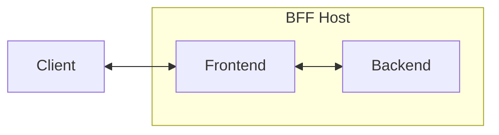

Microsoft's Blazor framework aids developers in creating rich, interactive web applications using C# and .NET. Taking
inspiration from the popular JavaScript library React, Blazor helps deliver experiences through a component-based model,
with multiple rendering modes, as you will see below. While Blazor is a suitable framework for building rich,
interactive web applications, it also has some challenges when it comes to secure authentication and authorization.

With the Duende BFF Security Framework, we aim to address these challenges or at the very least give guidance on how to
deal with them given your Blazor's solution choices. You will notice that the BFF security pattern is not applicable to
all Blazor implementations but rather to specific rendering modes. The goal of the BFF is to keep tokens out of the client and only use them in the secure context of the server.

## Architecture

Blazor has many architectural options, and it is essential to understand how they work to implement security in your
Blazor applications. Like most web applications, the model has three elements, the backend, the frontend, and the
client. The chosen model determines the execution context's location. The BFF's role is to manage the security context
between all elements within the chosen execution context when appropriate.

From a high level, let's define what the hosting elements are:

- **Backend**: The server-side application with logic for handling operations. i.e. APIs.
- **Frontend**: The client-side Blazor application.
- **Client**: The browser that is used to interact with the frontend.



For Blazor applications, we recommend the BFF be the host for the frontend and the backend of a solution. As you will
see in later sections, this allows for a more straightforward integration and provides a unified approach to managing
authentication and authorization.

Here's a diagram of what a typical Blazor solution might look like when implemented with the BFF pattern:


Note that both the frontend and backend are within a single project within the BFF host, similar to the simplified diagram we previously showed. While it's possible to separate the frontend and backend into separate projects, this comes with additional complexity and is not recommended.

Let's get into Blazor rending modes and whether the modes are suitable with the BFF pattern.

## Blazor Rendering Modes

Blazor
supports [several rendering](https://learn.microsoft.com/en-us/aspnet/core/blazor/components/render-modes?view=aspnetcore-9.0#render-modes)
modes:

* **Static Server** - Static server-side rendering (static SSR)
* **Interactive Server** - Interactive server-side rendering (interactive SSR) using Blazor Server and WebSockets.
* **Interactive WebAssembly** - Client-side rendering (CSR) using Blazor WebAssembly.
* **Interactive Auto** - Interactive SSR using Blazor Server initially and then CSR on subsequent visits after the
  Blazor bundle is downloaded.

For developers considering BFF security with these Blazor modes, here is a table with our recommendation of whether to
use the BFF pattern or not:

| Name                    | Description                                                                                                            | Render Location     | Interactive | BFF? |
|-------------------------|------------------------------------------------------------------------------------------------------------------------|---------------------|-------------|------|
| Static Server           | Static server-side rendering (static SSR)                                                                              | Server              | ❌           | ❌    |
| Interactive Server      | Interactive server-side rendering (interactive SSR) using Blazor Server.                                               | Server              | ✅           | ❌    |
| Interactive WebAssembly | Client-side rendering (CSR) using Blazor WebAssembly                                                                   | Client              | ✅           | ✅    |
| Interactive Auto        | Interactive SSR using Blazor Server initially and then CSR on subsequent visits after the Blazor bundle is downloaded. | Server, then client | ✅           | ✅    |

See the following sections for a more detailed explanation of each mode and how it works with the BFF, if at all.

### Static Server

:::caution
We advise not using the BFF pattern with this rendering mode as interactivity is limited, though you may want to consider BFF if you have other interactive JavaScript elements.
:::

The Static server mode allows developers to render pages built with Blazor components, but that doesn’t require any interactivity beyond basic HTML elements. These applications are typically used for static content, such as marketing pages, landing pages, and so on.

If your application is static, then you don't need to use the BFF pattern, as you can utilize the same security patterns that you would use in a typical ASP.NET Core application. You may still need to use the `AuthenticationStateProvider` to manage authentication state, see the section below for more information.

While you could certainly use the BFF pattern with a static server implementation for future extensibility plans, it would not add value to an application that is static with no client-side interactivity.

### Interactive Server

:::caution
We advise not using the BFF pattern with this rendering mode is managed on the server. Though you may want to consider BFF if you have other interactive JavaScript elements, but it is typically unlikely.
:::

The Interactive Server mode allows developers to render pages built with Blazor components, and that also allows for interactivity. This mode is ideal for applications that require a rich user experience, such as a web application that allows users to create, edit, and delete data. The interactivity for this mode is handled by the Blazor Server framework powered by WebSockets and more specifically [SignalR](https://dotnet.microsoft.com/en-us/apps/aspnet/signalr).

The BFF pattern is not typically applicable to this mode, as most interactivity is handled on the server by the Blazor Server framework with state changes being pushed to the client via WebSockets.

You may still want to explore `AuthenticationStateProvider` for managing authentication state, see the section below for more information. You may also want to explore the [Session Management](/bff/fundamentals/session/index.md) section for more information on how to configure the BFF to use sessions.

### Interactive WebAssembly

:::note
**We recommend using the BFF pattern with this rendering mode, as your frontend will be operating with the context of the client, and not the server.**
:::

The Interactive WebAssembly mode allows developers to render pages built with Blazor components, and that also allows for interactivity. This mode is ideal for applications that require a rich user experience, such as a web application that allows users to create, edit, and delete data. **The interactivity for this mode is handled by the Blazor WebAssembly framework and operates within the context of the client.**

In a typical Blazor WebAssembly application, you will have three projects: `Client`, `Server`, and `Shared`. The `Client` project is the Blazor application that is rendered by the browser. The `Server` project is the ASP.NET Core web application that hosts the Blazor application. The `Shared` project is a project that contains C# classes that are shared between the `Client` and `Server` projects.

Let's take a look at how to install and configure the BFF pattern given the above project structure.

In the `Server` project, you will need to add the following NuGet packages, assuming you will want to use the OpenID Connect handler:

```bash
dotnet add package Duende.Bff
dotnet add package Duende.Bff.Blazor
dotnet add package Microsoft.AspNetCore.Authentication.OpenIdConnect
```

You will also need to modify the `Program.cs` file in the `Server` project to configure the BFF in the services collection:

```csharp
// Server/Program.cs
builder.Services.AddBff()
    // Add in-memory implementation
    .AddServerSideSessions() 
    .AddBlazorServer();
```

The `AddBlazorServer` method will configure the BFF to use services on the host that allow the client to interact with the server securely.

You will also need to modify the ASP.NET Core pipeline to use the BFF:

```csharp {25-26, 31-32}
// Server/Program.cs
var app = builder.Build();

// Configure the HTTP request pipeline.
if (app.Environment.IsDevelopment())
{
    app.UseWebAssemblyDebugging();
}
else
{
    app.UseExceptionHandler("/Error");
    // The default HSTS value is 30 days. You may want to change this for production scenarios, see https://aka.ms/aspnetcore-hsts.
    app.UseHsts();
}

app.UseHttpsRedirection();

app.UseBlazorFrameworkFiles();
app.UseStaticFiles();

app.UseRouting();

app.UseAuthentication();

// 👋 Add BFF Middleware
app.UseBff();
 
app.UseAuthorization();
app.UseAntiforgery();

// 👋 Add BFF User Session Management endpoints 
app.MapBffManagementEndpoints();

app.MapRazorPages();

app.MapControllers()
    .RequireAuthorization()
    .AsBffApiEndpoint();

app.MapFallbackToFile("index.html");
app.Run();
```

Now, on the client, you will need to add the following NuGet packages:

```bash
dotnet add package Duende.BFF.Blazor.Client
```

You will also need to modify the `Program.cs` file in the `Client` project to configure the BFF in the services collection:

```csharp {11-14}
// Client/Program.cs
using BlazorWasm.Client;
using Duende.Bff.Blazor.Client;
using Microsoft.AspNetCore.Components.Web;
using Microsoft.AspNetCore.Components.WebAssembly.Hosting;

var builder = WebAssemblyHostBuilder.CreateDefault(args);
builder.RootComponents.Add<App>("#app");
builder.RootComponents.Add<HeadOutlet>("head::after");

builder.Services
    // 👋 Provides auth state provider that polls the /bff/user endpoint
    .AddBffBlazorClient() 
    .AddCascadingAuthenticationState();

await builder.Build().RunAsync();
```

See our [Session Management section](/bff/fundamentals/session/index.md) for more information on how to configure the BFF to use sessions.

### Interactive Auto

:::note
**We recommend using the BFF pattern with this rendering mode, as your frontend may be executing code within the client context, or the server.**
:::

Blazor Interactive Auto is a combination of Interactive Server and Interactive WebAssembly, where rendering is initially done on the server, but then the client is updated with the latest WebAssembly version of the application on subsequent visits.

As you may have guessed, this creates a security state that is unpredictable and can add complexity to your application. Since your Blazor application may be running within the context of the client, you will need to use a BFF and the Duende library to manage authentication state between these two modalities.

## Authentication State

The `AuthenticationState` contains information about the currently logged-in user. This is partly populated from
information from the user, but is also enriched with several management claims, such as the Logout URL.

Blazor uses AuthenticationStateProviders to make authentication state available to components. On the server, the
authentication state is already mostly managed by the authentication framework. However, the BFF will add the Logout url
to the claims using the **AddServerManagementClaimsTransform**. On the client, there are some other claims that might be
useful. The **BffClientAuthenticationStateProvider** will poll the server to update the client on the latest
authentication state, such as the user's claims. This also notifies the front-end if the session is terminated on the
server.

## Server Side Token Store

Blazor Server applications have the same token management requirements as a regular ASP.NET Core web application.
Because Blazor Server streams content to the application over a websocket, there often is no HTTP request or response to
interact with during the execution of a Blazor Server application. You therefore cannot use *HttpContext* in a Blazor
Server application as you would in a traditional ASP.NET Core web application.

This means:

* you cannot use *HttpContext* extension methods
* you can’t use the ASP.NET authentication session to store tokens
* the normal mechanism used to automatically attach tokens to Http Clients making API calls won't work

The **ServerSideTokenStore**, together with the Blazor Server functionality in Duende.AccessTokenManagement is
automatically registered when you register Blazor Server.

For more information on this, see [Blazor Server](/accesstokenmanagement/blazor-server.md)

## Data Access Techniques

Depending on the type of Blazor application you are building, you may need to use different techniques to access data from within your components and pages. The following sections will cover some of the common scenarios.

If your BFF application can directly access data (for example, a database or an unsecured HTTP API), then you have to decide where this information is rendered.

For server side rendering, you'll typically abstract your data access logic into a separate class (such as a repository or a query object) and inject this into your component for rendering.

For web assembly rendering, you'll need to make the data available via a web service on the server. Then on the client, you'll need a configured HTTP client that accesses this information securely.

When using auto-rendering mode, you'll need to make sure that the component gets a different 'data access' component for server rendering vs client rendering. Consider the following diagram:


In this diagram, you'll see the example `IDataAccessor` that has two implementations. One that accesses the data via an HTTP client (for use in WASM) and one that directly accesses the data.

### Embedded APIs

Embedded APIs are a way to access data from within a Blazor application without the need to authenticate outside the current security boundary of the client or the backend. 

Below is an example of registering an `IDataAccessor` abstraction. First let's create the `IDataAccessor` interface:

```csharp
// Shared/IDataAccessor.cs
public interface IDataAccessor
{
    Task<Data[]> GetData();
}
public record Data(string Value);
```

We can implement a Server implementation of the `IDataAccessor` interface.

```csharp
// Server/ServerWeatherClient.cs
// Create a class that would actually get the data from the database
internal class ServerWeatherClient() : IDataAccessor
{
    public Task<Data[]> GetData()
    {
        // get the actual data from the database
    }
}
```
and register it in the `Program.cs` file:

```csharp
// Server/Program.cs
// Register the server implementation for accessing some data
builder.Services.AddSingleton<IDataAccessor, ServerDataAccessor>();
```

Then we can use the `IDataAccessor` in our endpoints:

```
// Server/Program.cs
// Register an api that will access the data
app.MapGet("/some_data", async (IDataAccessor dataAccessor) => await dataAccessor.GetData())
    .RequireAuthorization()
    .AsBffApiEndpoint();
```

We can also register a `HttpClientDataAccessor` that will be used by the Blazor client to access the data.

```csharp
// Client/Program.cs
// Setup on the client
// Register an HTTP client that can access the data via an Embedded API. 
builder.Services.AddLocalApiHttpClient<DataAccessHttpClient>();

// Register an adapter that would abstract between the data accessor and the http client. 
builder.Services.AddSingleton<IDataAccessor>(sp => sp.GetRequiredService<HttpClientDataAccessor>());

internal class HttpClientDataAccessor(HttpClient client) : IDataAccessor
{
    public async Task<Data[]> GetSomeData() => await client.GetFromJsonAsync<Data[]>("/some_data")
                                                                  ?? throw new JsonException("Failed to deserialize");
}
```

Note that data access is contained within the security boundary of the host, so we never need to pass a token to any client to access data. This is what we mean by 'embedded' APIs.

### Secured Remote APIs

If your BFF needs to secure access to remote APIs, then your components can both directly use a (typed) `HttpClient`. How this `HttpClient` is configured is quite different on the client vs the server though.

* On the **Client**, the HTTP client needs to be secured with the authentication cookie and CORS protection headers. This
  then calls the http endpoint on the server.

* On the **Server**, you'd need to expose the proxied http endpoint. This then uses a http client that's configured to send access tokens. These may or may not contain a user token.

This diagram shows this in more detail:


```csharp
// Server/Program.cs
app.MapRemoteBffApiEndpoint("/remote-apis/user-token", new Uri("https://localhost:5010"))

builder.Services.AddUserAccessTokenHttpClient("backend",
    configureClient: client => client.BaseAddress = new Uri("https://localhost:5010/"));
```

Then in the client application, we can use the `HttpClient` to access the remote API.

```csharp
// Copyright (c) Duende Software. All rights reserved.
// Licensed under the MIT License. See LICENSE in the project root for license information.

using BlazorWasm.Client;
using Duende.Bff.Blazor.Client;
using Microsoft.AspNetCore.Components.Web;
using Microsoft.AspNetCore.Components.WebAssembly.Hosting;

var builder = WebAssemblyHostBuilder.CreateDefault(args);
builder.RootComponents.Add<App>("#app");
builder.RootComponents.Add<HeadOutlet>("head::after");

builder.Services
    .AddBffBlazorClient() // Provides auth state provider that polls the /bff/user endpoint
    .AddCascadingAuthenticationState();

builder.Services.AddRemoteApiHttpClient("backend");
builder.Services.AddTransient(sp => sp.GetRequiredService<IHttpClientFactory>().CreateClient("backend"));

await builder.Build().RunAsync();
```

## Other Resources

Here are some other resources that may be useful as you implement security in your Blazor applications:

* [Access Token Management](/accesstokenmanagement/index.mdx)
* [Blazor Server](/accesstokenmanagement/blazor-server.md)
* [IdentityServer Quickstarts](/identityserver/quickstarts/0-overview.md)
* [Big Picture](/identityserver/overview/big-picture.md)