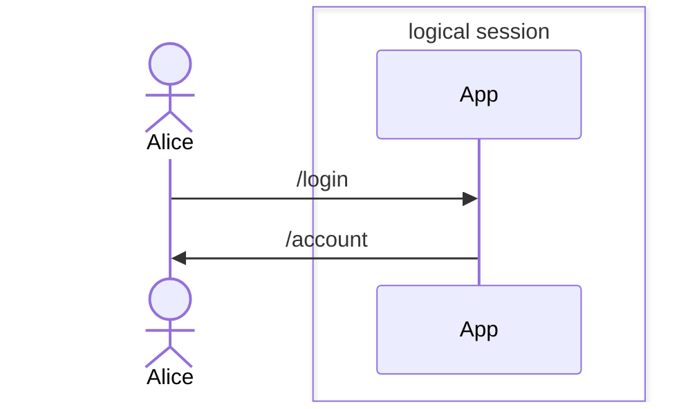
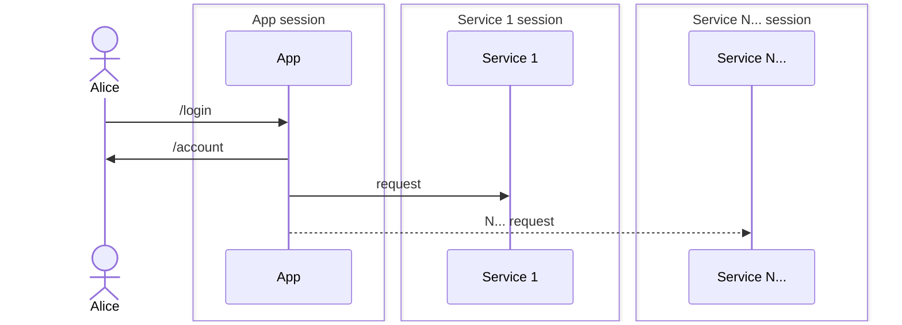
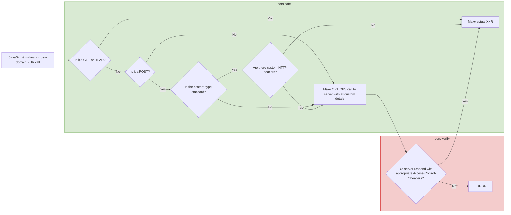

The Duende.BFF (Backend for Frontend) security framework packages the necessary components to secure browser-based frontends (e.g. SPAs or Blazor applications) with ASP.NET Core backends.

Duende.BFF is free for development, testing and personal projects, but production use requires a license. Special offers may apply.

The source code for the BFF framework can be found on GitHub. Builds are distributed through NuGet. Also check out the samples.

## Background

Single-Page Applications (SPAs) are increasingly common, offering rich functionality within the browser. Front-end development has rapidly evolved with new frameworks and changing browser security requirements. Consequently, best practices for securing these applications have also shifted dramatically. 

While implementing OAuth logic directly in the browser was once considered acceptable, this is no longer recommended. Storing any authentication state in the browser (such as access tokens) has proven to be inherently risky (see Threats against browser based applications). Because of this, the IETF is currently recommending delegating all authentication logic to a server-based host via a Backend-For-Frontend pattern as the preferred approach to securing modern web applications.

## The Backend For Frontend Pattern

The BFF pattern (Backend-For-Frontend) pattern states that every browser based application should also have a server side application that handles all authentication requirements, including performing authentication flows and securing access to APIs. 

The server will now expose http endpoints that the browser can use to login, logout or interrogate the active session. With this, the browser based application can trigger an authentication flow by redirecting to a URL, such as /bff/login. Once the authentication process is completed, the server places a secure authentication cookie in the browser. This cookie is then used to authenticate all subsequent requests, until the user is logged out again. 

The BFF should expose all APIs that the front-end wants to access securely. So it can either host APIs locally, or act as a reverse proxy towards external APIs. 

With this approach, the browser based application will not have direct access to the access token. So if the browser based application is compromised, for example with XSS attacks, there is no risk of the attacker stealing the access tokens. 

As the name of this pattern already implies, the BFF backend is the (only) Backend for the Frontend. They should be considered part of the same application. It should only expose the APIs that the front-end needs to function. 

## 3rd party cookies

In recent years, several browsers (notably Safari and Firefox) have started to block 3rd party cookies. Chrome is planning to do the same in the future. While this is done for valid privacy reasons, it also limits some of the functionality a browser based application can provide. A couple of particularly notable OIDC flows that don’t work for SPAs when third party cookies are blocked are OIDC Session Management and OIDC Silent Login via the prompt=none parameter.

## CSRF protection

There is one thing to keep an eye out for with this pattern, and that’s Cross Site Request Forgery (CSRF). The browser automatically sends the authentication cookie for safe-listed cross-origin requests, which exposes the application to CORS Attacks. Fortunately, this threat can easily be mitigated by a BFF solution by requiring a custom header to be passed along. See more on CORS protection.

# The Duende BFF framework

Duende.BFF is a library for building services that comply with the BFF pattern and solve security and identity problems in browser based applications such as SPAs and Blazor based applications. It is used to create a backend host that is paired with a frontend application. This backend is called the Backend For Frontend (BFF) host, and is responsible for all the OAuth and OIDC protocol interactions. It completely implements the latest recommendations from the IETF regarding security for browser based applications. 

It offers the following functionality:
* Protection from Token Extraction attacks
* Built-in CSRF Attack protection
* Server Side OAuth2 Authentication
* User Management APIs
* Back-channel logout
* Securing access to both local and external APIs by serving as a reverse proxy. 
* Server side Session State Management
* Blazor Authentication State Management

## The BFF Framework in an application architecture

The following diagram illustrates how the Duende BFF Security Framework fits into a typical application architecture. 

The browser based application runs inside the browser’s secure sandbox. It can be built using any type of front-end technology, such as via Vanilla-JS, React, Vue, WebComponents, Blazor, etc. 

When the user wants to log in, the app can redirect the browser to the authentication endpoints. This will trigger an OpenID Connect authentication flow, at the end of which, it will place an authentication cookie in the browser. This cookie has to be an HTTP Only Same Site and Secure cookie. This makes sure that the browser application cannot get the contents of the cookie, which makes stealing the session much more difficult. 

The browser will now automatically add the authentication cookie to all calls to the BFF, so all calls to the APIs are secured. This means that local api’s are already automatically secured. 

The app cannot access external Api’s directly, because the authentication cookie won’t be sent to 3rd party applications. To overcome this, the BFF can proxy requests through the BFF host, while exchanging the authentication cookie for a bearer token that’s issued from the identity provider. This can be configured to include or exclude the user’s credentials. 

As mentioned earlier, the BFF needs protection against CSRF attacks, because of the nature of using authentication cookies. While .net has various built-in methods for protecting against CSRF attacks, they often require a bit of work to implement. The easiest way to protect (just as effective as the .Net provided security mechanisms) is just to require the use of a custom header. The BFF Security framework by default requires the app to add a custom header called x-csrf=1 to the application. Just the fact that this header must be present is enough to protect the BFF from CSRF attacks. 

## Logical and Physical Sessions

When implemented correctly, a user will think of their time interacting with a solution as _"one session"_ also known as the **"logical session"**. The user should not be concerned with the steps developers take to provide a seamless experience. Users want to use the app, get their tasks completed, and log out happy. 

So while the user will only see (and care about) a single session, it's entirely possible that there will be multiple physical sessions active. For most distributed applications, including those implemented with BFF, **sessions are managed independently by each component of an application architecture.** This means that there are **N+1** physical sessions possible, where **N** is the number of sessions for each service in your solution, and the **+1** being the session managed on the BFF host. Since we are focusing on ASP.NET Core, those sessions typically are stored using the Cookie Authentication handler features of .NET.

The separation allows each service to manage its session to its specific needs. While it can depend on your requirements, we find most developers want to coordinate the physical session lifetimes, creating a more predictable logical session. If that is your case, we recommend you first start by turning each physical session into a more powerful [server-side session](/bff/fundamentals/session/server-side-sessions/). 

Server-side sessions are instances that are persisted to data storage and allow for visibility into currently active sessions and better management techniques. Let's take a look at the advantages of server-side sessions. Server-side sessions at each component allows for:

- Receiving back channel logout notifications
- Forcibly end a user's session of that node
- Store and view information about a session lifetime
- Coordinate sessions across an application's components 
- Different claims data 

Server-side sessions at IdentityServer allow for more powerful features:

- Receive back channel logout notifications from upstream identity providers in a federation
- Forcibly end a user's session at IdentityServer
- Global inactivity timeout across SSO apps and session coordination
- Coordinate sessions to registered clients

Keep in mind the distinctions between logical and physical sessions, and you will better understand the interplay between elements in your solution.

## Threats Against Browser-based Applications

Let’s look at some of the common ways browser-based apps are typically attacked and what their consequences would be.

### Token theft

Often, malicious actors are trying to steal access tokens. In this paragraph, we’ll look into several techniques how this is often done and what the consequences are. But it’s important to note that all these techniques rely on the browser-based application having access to the access token. Therefore, these attacks can be prevented by implementing the BFF pattern.

#### Script injection attacks

The most common way malicious actors steal access tokens is by injecting malicious JavaScript code into the browser. This can happen in many different ways. Script injection attacks or supply chain attacks (via compromised NPM packages or cloud-hosted scripts) are just some examples.

Since the malicious code runs in the same security sandbox as the application’s code, it has exactly the same privileges as the application code. This means there is no way to securely store and handle access tokens in the browser.

There have been attempts to place the code that accesses and uses web tokens in more highly isolated storage areas, such as Web Workers, but these attempts have also been proven to be vulnerable to token exfiltration attacks, so they are not suitable as an alternative.

If the browser-based application has access to your access token, so can malicious actors.

#### Other ways of compromising browser security

Injecting code is not the only way that browser security can be broken. Sometimes the browser sandbox itself is under attack. Browsers attempt to provide a secure environment in which web pages and their scripts can safely be loaded and executed in isolation. On many occasions, this browser sandbox has been breached by exploits. A recent example is the POC from Google on Browser-Based Spectre Attacks.

By bypassing the security sandbox, the attackers are able to read the memory from your application and steal the access tokens. The best way to protect yourself from this is not having any access tokens stored in the application’s memory at all by following the BFF pattern.

#### Consequences of token theft

Once an attacker is able to inject malicious code, there are a number of things the attacker can do. At a minimum, the attacker can take over the current user’s session and in the background perform malicious actions under the credentials of the user. This would only be possible as long as the user has the application open, which limits how long the attacker can misuse the session.

It’s worse if the attacker is able to extract the authentication token. The attacker can now access the application directly from his own computer, as long as the access token is valid. For this reason, it’s recommended to keep access token lifetimes short.

If the attacker is also able to acquire the refresh token or worse, is able to request new tokens, then the attacker can use the credentials indefinitely.

#### Attacks at OAuth Implicit Grant

Sometimes there are vulnerabilities discovered even in the protocols that are underlying most of the web’s security. As a result, these protocols are constantly evolving and updated to reflect the latest knowledge and known vulnerabilities.

One example of this is OAuth Implicit grant. This was once a recommended pattern and many applications have implemented this since. However, in recent years it’s become clear that this protocol is no longer deemed secure and in the words of the IETF:

> Browser-based clients MUST use the Authorization Code grant type and MUST NOT use the Implicit grant type to obtain access tokens

### CSRF Attacks

Cookie-based authentication (when using Secure and HTTP Only cookies) effectively prevents browser-based token stealing attacks. But this approach is vulnerable to a different type of attack, namely CSRF attacks. This is similar but different from CORS attacks which lies in the definition of what the browser considers a Site vs an Origin and what kind of request a browser considers 'safe' for Cross Origin requests.

#### Origins and Sites

To a browser, a [site](https://developer.mozilla.org/en-US/docs/Glossary/Site) is defined as TLD (top-level domain - 1). So, a single segment under a top-level domain, such as example in `example.co.uk`, where `co.uk` is the top-level domain. Any subdomain under that (so `site1.example.co.uk` and `www.example.co.uk`) are considered to be from the same site. Contrast this to an origin, which is the scheme + hostname + port. In the previous example, the origins would be `https://example.co.uk` and `https://www.example.co.uk`. The site is the same, but the origin is different.

Browsers have built-in control when cookies should be sent. For example, by setting [SameSite=strict](https://owasp.org/www-community/SameSite), the browser will only send along cookies if you are navigating within the same **site** (not origins).

Browsers also have built-in **Cross Origin** protection. Most requests that go across different origins (not sites) will by default be subjected to CORS protection. This means that the server needs to say if the requests are safe to use cross-origin. The exclusion to this are requests that the browser considers safe. The following diagram (created based on this article [Wikipedia](https://en.wikipedia.org/wiki/Cross-origin_resource_sharing)) shows this quite clearly:

So some requests, like regular GET or POSTs with a standard content type are NOT subject to CORS validation, but others (IE: deletes or requests with a custom HTTP header) are.

#### CSRF Attack inner workings

CSRF attacks exploit the fact that browsers automatically send authentication cookies with requests to the same [site](https://developer.mozilla.org/en-US/docs/Glossary/Site). Should an attacker trick a user that’s logged in to an application into visiting a malicious website, that browser can make malicious requests to the application under the credentials of the user.

Same Site cookies already drastically reduce the attack surface because they ensure the browser only sends the cookies when the user is on the same site. So a user logged in to an application at app.company.com will not be vulnerable when visiting malicious-site.com.

However, the application can still be at risk. Should other applications running under different subdomains of the same site be compromised, then you are still vulnerable to CSRF attacks. Luring a user to a compromised site under a subdomain will bypass this Same Site protection and leave the application still vulnerable to CSRF attacks. Unfortunately, compromised applications running under different subdomains is a common attack vector, not to be underestimated.

#### Protection against CSRF Attacks

Many frameworks, including [dotnet](https://learn.microsoft.com/en-us/aspnet/core/security/anti-request-forgery?view=aspnetcore-9.0), have built-in protection against CSRF attacks. These mitigations require you to make certain changes to your application, such as embedding specific form fields in your application which needs to be re-submitted or reading a specific cookie value. While these protections are effective, there is a simpler and more straight forward solution to preventing any CSRF attack.

The trick is to require a custom header on the APIs that you wish to protect. It doesn’t matter what that custom header is or what the value is, for example, some-header=1. The browser-based application now MUST send this header along with every request. However, if a page on the malicious subdomain wants to call this API, it also has to add this custom header. This custom header now triggers a CORS Preflight check. This pre-flight check will fail because it detects that the request is cross-origin. Now the API developer has to develop a CORS policy that will protect against CORS attacks.

So, effective CSRF attack protection relies on these pillars:
1. Using **Same-Site=strict** Cookies
2. Requiring a specific header to be sent on every API request (IE: x-csrf=1)
3. having a cors policy that restricts the cookies only to a list of white-listed **origins**.

#### Session Hijacking

In session hijacking, a malicious actor somehow gets access to the user's session cookie and is then able to exploit it by effectively cloning the session.

Before HTTPS was widespread, session hijacking was a common occurrence, especially when using public Wi-Fi networks. However, since SSL connections are pretty much widespread, this has become more difficult. Not impossible, because there have been cases where trusted certificate authorities have been compromised.

Even if SSL is not compromised, there are other ways for malicious actors to hijack the session. For example, if the user’s computer is compromised then browser security can still be bypassed. There have also been occurrences of session hijacking where (malicious) helpdesk employees asked for ‘har’ files (which are effectively complete request traces, including the authentication cookies), which were then used to hijack sessions.

Right now, it’s very difficult to completely protect against this type of attack. However, there are interesting new standards being discussed, such as Device Bound Session Credentials. This standard aims to make sure that a session is cryptographically bound to a single device. Even if stolen, it can’t be used by a different device.
