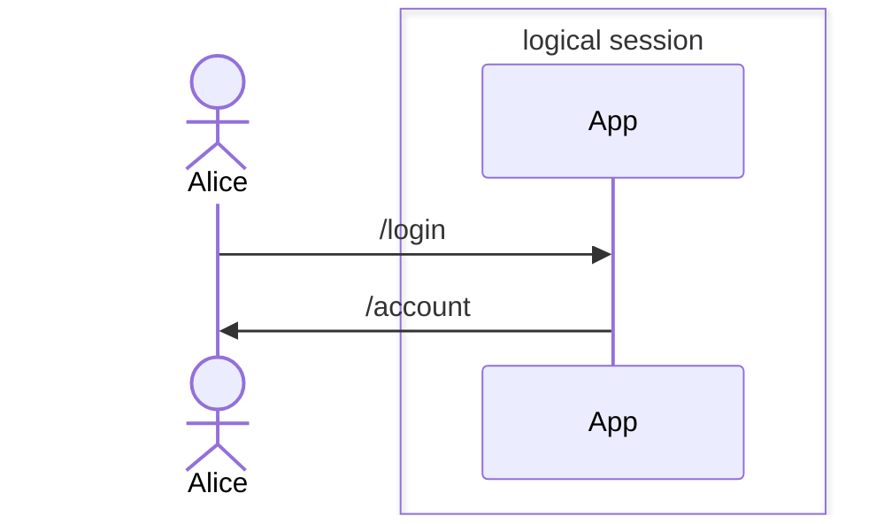
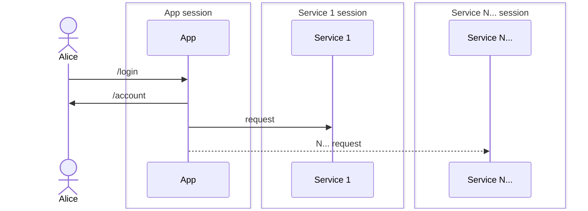

Duende.BFF is a library for building services that solve security and identity problems in browser based applications such as SPAs and Blazor WASM applications. It is used to create a backend host that is paired with a frontend application. This backend is called the Backend For Frontend (BFF) host, and is responsible for all of the OAuth and OIDC protocol interactions. Moving the protocol handling out of JavaScript provides important security benefits and works around changes in browser privacy rules that increasingly disrupt OAuth and OIDC protocol flows in browser based applications. The Duende.BFF library makes it easy to build and secure BFF hosts by providing [session and token management](/bff/v2/session), [API endpoint protection](/bff/v2/apis), and [logout notifications](/bff/v2/session/management/back-channel-logout).

## Threats against browser based applications

Browser based applications have a relatively large attack surface. Security risks come not only from the application's own code, which must be protected against cross site scripting, cross site request forgery, and other vulnerabilities, but also from the frameworks, libraries, and other NPM packages it uses, as well as all of their transitive dependencies. Additionally, other applications running on the same site must also be secured. The recent [Spectre](https://www.securityweek.com/google-releases-poc-exploit-browser-based-spectre-attack) attacks against browsers serve as a reminder that new threats are constantly emerging. Given all of these risks, we do not recommend storing high-value access tokens or refresh tokens in JavaScript-accessible locations.

In Duende.BFF, tokens are only accessible server-side and sessions are managed using encrypted and signed HTTP-only cookies. This greatly simplifies the threat model and reduces risk. While  content injection attacks are still possible, the BFF limits the attacker's ability to abuse APIs by constraining access through a well-defined interface to the backend which eliminates the possibility of arbitrary API calls.

## Changes in browser privacy rules
Browsers are increasingly restricting the use of cookies across site boundaries to protect user privacy. This can be a [problem](https://leastprivilege.com/2020/03/31/spas-are-dead/) for legitimate OAuth and OpenID Connect interactions, as some interactions in these protocols are indistinguishable from common tracking mechanisms from a browser's perspective. When the identity provider and client application are hosted on 3rd party sites, this affects several flows, including:

- Front-channel logout notifications
- [OpenID Connect Session Management](https://openid.net/specs/openid-connect-session-1_0.html)
- The "silent renew" technique for session-bound token refreshing

Using a BFF removes or mitigates all of these problems in the design. The backend component makes backchannel logout notifications possible, while still allowing the option of front-channel notifications for 1st party clients. Robust server-side session and token management with optional server-side sessions and refresh tokens take the place of OIDC Session Management and older token refresh mechanisms. As an ASP.NET Core server-side application, the BFF has access to a full featured and stable OpenID Connect client library that supports all the necessary protocol mechanisms and provides an excellent extensibility model for advanced features like [Mutual TLS](/bff/v2/identityserver/v7/tokens/pop/mtls), [DPoP](/bff/v2/identityserver/v7/tokens/pop/dpop), [JWT secured authorization requests](/bff/v2/identityserver/v7/tokens/jar), and [JWT-based client authentication](/bff/v2/identityserver/v7/tokens/authentication/jwt).

## Logical and Physical Sessions

When implemented correctly, a user will think of their time interacting with a solution as _"one session"_ also known as the **"logical session"**. The user should be unaware of the steps taken by developers to provide the experience and rightfully so. Users want to use the app, get their tasks completed, and log out happy. 

So while the user will only see only (and care about) a single session, it's entirely possible that there will be multiple physical sessions active. For most distributed applications, including those implemented with BFF, **sessions are managed independently by each component of an application architecture.** This means that there are **N+1** physical sessions possible, where **N** is the number of sessions for each service in your solution, and the **+1** being the session managed on the BFF host. Since we are focusing on ASP.NET Core, those sessions typically are stored using the Cookie Authentication handler features of .NET.

The separation allows each service to manage its session to its specific needs. While it can depend on your requirements, we find most developers want to coordinate the physical session lifetimes, creating a more predictable logical session. If that is your case, we recommend you first start by turning each physical session into a more powerful [server-side session](/bff/v2/session/server_side_sessions). 

Server-side sessions are instances that are persisted to data storage and allow for visibility into currently active sessions and better management techniques. Let's take a look at the advantages of server-side sessions. Server-side sessions at each component allows for:

- Receiving back channel logout notifications
- Forcibly end a user's session of that node
- Store and view information about a session lifetime
- Coordinate sessions across an application's components 
- Different claims data 

Server-side sessions at IdentityServer allow for more powerful features:

- Receive back channel logout notifications from upstream identity providers in a federation
- Forcibly end a user's session at IdentityServer
- Global inactivity timeout across SSO apps and session coordination
- Coordinate sessions to registered clients

Keep in mind the distinctions between logical and physical sessions and you will better understand the interplay between elements in your solution.