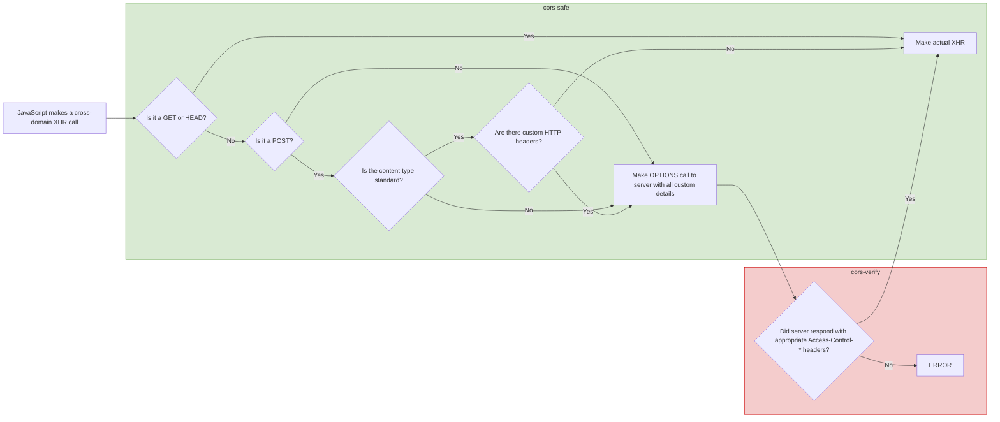

In this paragraph, let’s look at some of the common ways browser-based apps are typically attacked and what their consequences would be.

## Token theft

Often, malicious actors are trying to steal access tokens. In this paragraph, we’ll look into several techniques how this is often done and what the consequences are. But it’s important to note that all of these techniques rely on the browser-based application having access to the access token. Therefore, these attacks can be prevented by implementing the BFF pattern.

### Script injection attacks

The most common way malicious actors steal access tokens is by injecting malicious JavaScript code into the browser. This can happen in many different ways. Script injection attacks or supply chain attacks (via compromised NPM packages or cloud-hosted scripts) are just some examples.

Since the malicious code runs in the same security sandbox as the application’s code, it has exactly the same privileges as the application code. This means there is no way to securely store and handle access tokens in the browser.

There have been attempts to place the code that accesses and uses web tokens in more highly isolated storage areas, such as Web Workers, but these attempts have also been proven to be vulnerable to token exfiltration attacks, so they are not suitable as an alternative.

If the browser-based application has access to your access token, so can malicious actors.

### Other ways of compromising browser security

Injecting code is not the only way that browser security can be broken. Sometimes the browser sandbox itself is under attack. Browsers attempt to provide a secure environment in which web pages and their scripts can safely be loaded and executed in isolation. On many occasions, this browser sandbox has been breached by exploits. A recent example is the POC from Google on Browser-Based Spectre Attacks.

By bypassing the security sandbox, the attackers are able to read the memory from your application and steal the access tokens. The best way to protect yourself from this is not having any access tokens stored in the application’s memory at all by following the BFF pattern.

### Consequences of token theft

Once an attacker is able to inject malicious code, there are a number of things the attacker can do. At a minimum, the attacker can take over the current user’s session and in the background perform malicious actions under the credentials of the user. This would only be possible as long as the user has the application open, which limits how long the attacker can misuse the session.

It’s worse if the attacker is able to extract the authentication token. The attacker can now access the application directly from his own computer, as long as the access token is valid. For this reason, it’s recommended to keep access token lifetimes short.

If the attacker is also able to acquire the refresh token or worse, is able to request new tokens, then the attacker can use the credentials indefinitely.

### Attacks at OAuth Implicit Grant

Sometimes there are vulnerabilities discovered even in the protocols that are underlying most of the web’s security. As a result, these protocols are constantly evolving and updated to reflect the latest knowledge and known vulnerabilities.

One example of this is OAuth Implicit grant. This was once a recommended pattern and many applications have implemented this since. However, in recent years it’s become clear that this protocol is no longer deemed secure and in the words of the IETF:

> Browser-based clients MUST use the Authorization Code grant type and MUST NOT use the Implicit grant type to obtain access tokens

## CSRF Attacks

Cookie-based authentication (when using Secure and HTTP Only cookies) effectively prevents browser-based token stealing attacks. But this approach is vulnerable to a different type of attack, namely CSRF attacks. This is similar but different from CORS attacks which lies in the definition of what the browser considers a Site vs an Origin and what kind of request a browser considers 'safe' for Cross Origin requests. 

### Origins and Sites

To a browser, a [site](https://developer.mozilla.org/en-US/docs/Glossary/Site) is defined as TLD (top-level domain - 1). So, a single segment under a top-level domain, such as example in example.co.uk, where co.uk is the top-level domain. Any subdomain under that (so site1.example.co.uk and www.example.co.uk) are considered to be from the same site. Contrast this to an origin, which is the scheme + hostname + port. In the previous example, the origins would be https://example.co.uk and https://www.example.co.uk. The site is the same, but the origin is different.

Browsers have built-in control when cookies should be sent. For example, by setting [SameSite=strict](https://owasp.org/www-community/SameSite), the browser will only send along cookies if you are navigating within the same **site** (not origins). 

Browsers also have built-in **Cross Origin** protection. Most requests that go across different origins (not sites) will by default be subjected to CORS protection. This means that the server needs to say if the requests are safe to use cross origin. The exclusion to this are requests that the browser considers safe. The following diagram (created based on this article [wikipedia](https://en.wikipedia.org/wiki/Cross-origin_resource_sharing)) shows this quite clearly:

So some requests, like regular GET or POSTs with a standard content type are NOT subject to CORS validation, but others (IE: deletes or requests with a custom HTTP header) are. 

### CSRF Attack inner workings

CSRF attacks exploit the fact that browsers automatically send authentication cookies with requests to the same [site](https://developer.mozilla.org/en-US/docs/Glossary/Site). Should an attacker trick a user that’s logged in to an application into visiting a malicious website, that browser can make malicious requests to the application under the credentials of the user.

Same Site cookies already drastically reduce the attack surface because they ensure the browser only sends the cookies when the user is on the same site. So a user logged in to an application at app.company.com will not be vulnerable when visiting malicious-site.com.

However, the application can still be at risk. Should other applications running under different subdomains of the same site be compromised, then you are still vulnerable to CSRF attacks. Luring a user to a compromised site under a subdomain will bypass this Same Site protection and leave the application still vulnerable to CSRF attacks. Unfortunately, compromised applications running under different subdomains is a common attack vector, not to be underestimated.

### Protection against CSRF Attacks

Many frameworks, including [dotnet](https://learn.microsoft.com/en-us/aspnet/core/security/anti-request-forgery?view=aspnetcore-9.0), have built in protection against CSRF attacks. These mitigations require you to make certain changes to your application, such as embedding specific form fields in your application which needs to be re-submitted or reading a specific cookie value. While these protections are effective, there is a simpler and more straight forward solution to preventing to preventing any CSRF attack. 

The trick is to require a custom header on the API's that you wish to protect. It doesn’t matter what that custom header is or what the value is, for example, some-header=1. The browser-based application now MUST send this header along with every request. However, if a page on the malicious subdomain wants to call this API, it also has to add this custom header. This custom header now triggers a CORS Preflight check. This pre-flight check will fail because it detects that the request is cross-origin. Now the API developer has to develop a CORS policy that will protect against CORS attacks. 

So, effective CSRF attack protection relies on these pillars:
1. Using **Same-Site=strict** Cookies
2. Requiring a specific header to be sent on every API request (IE: x-csrf=1)
3. having a cors policy that restricts the cookies only to a list of white-listed **origins**. 

## Session Hijacking

In session hijacking, a malicious actor somehow gets access to the user's session cookie and is then able to exploit it by effectively cloning the session.

Before HTTPS was widespread, session hijacking was a common occurrence, especially when using public Wi-Fi networks. However, since SSL connections are pretty much widespread, this has become more difficult. Not impossible, because there have been cases where trusted certificate authorities have been compromised.

Even if SSL is not compromised, there are other ways for malicious actors to hijack the session. For example, if the user’s computer is compromised then browser security can still be bypassed. There have also been occurrences of session hijacking where (malicious) helpdesk employees asked for ‘har’ files (which are effectively complete request traces, including the authentication cookies), which were then used to hijack sessions.

Right now, it’s very difficult to completely protect against this type of attack. However, there are interesting new standards being discussed, such as Device Bound Session Credentials. This standard aims to make sure that a session is cryptographically bound to a single device. Even if stolen, it can’t be used by a different device.
