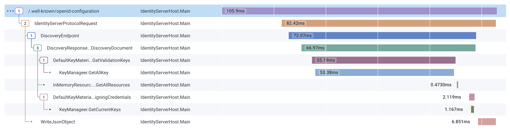

:::tip
Added in Duende IdentityServer v6.1 and expanded in v7.0
:::

[OpenTelemetry](https://opentelemetry.io) is a collection of tools, APIs, and SDKs for generating and collecting
telemetry data (metrics, logs, and traces). This is very useful for analyzing software performance and behavior,
especially in highly distributed systems.

.NET 8 comes with first class support for Open Telemetry. IdentityServer emits traces, metrics and logs.

### Metrics

Metrics are high level statistic counters. They provide an aggregated overview and can be used to set monitoring rules.

### Logs

OpenTelemetry in .NET 8 exports the logs written to the standard ILogger system. The logs are augmented with
trace ids to be able to correlate log entries with traces.

### Traces

Traces shows individual requests and dependencies. The output is very useful for visualizing the control
flow and finding performance bottlenecks.

This is an example of distributed traces from a web application calling an API (displayed using our
[Aspire sample](/identityserver/samples/diagnostics)). The web application uses a refresh token to call
IdentityServer to get a new access token and then calls the API. The API reads the discovery endpoint, finds the jwks
url and then gets the keys from jwks endpoint.


## Setup

To start emitting Otel tracing and metrics information you need

* add the Otel libraries to your IdentityServer and client applications
* start collecting traces and Metrics from the various IdentityServer sources (and other sources e.g. ASP.NET Core)

For development a simple option is to export the tracing information to the console and use the Prometheus
exporter to create a human-readable `/metrics` endpoint for the metrics.

Add the Open Telemetry configuration to your service setup.

```cs
// Program.cs
var openTelemetry = builder.Services.AddOpenTelemetry();

openTelemetry.ConfigureResource(r => r
    .AddService(builder.Environment.ApplicationName));

openTelemetry.WithMetrics(m => m
    .AddMeter(Telemetry.ServiceName)
    .AddMeter(Pages.Telemetry.ServiceName)
    .AddPrometheusExporter());

openTelemetry.WithTracing(t => t
    .AddSource(IdentityServerConstants.Tracing.Basic)
    .AddSource(IdentityServerConstants.Tracing.Cache)
    .AddSource(IdentityServerConstants.Tracing.Services)
    .AddSource(IdentityServerConstants.Tracing.Stores)
    .AddSource(IdentityServerConstants.Tracing.Validation)
    .AddAspNetCoreInstrumentation()
    .AddConsoleExporter());
```

Add the Prometheus exporter to the pipeline

```cs
// Program.cs
// Map /metrics that displays Otel data in human-readable form.
app.UseOpenTelemetryPrometheusScrapingEndpoint();
```

This setup will write the tracing information to the console and provide metrics on the /metrics endpoint.

## Metrics

:::tip
Added in Duende IdentityServer v7.0
:::

OpenTelemetry metrics are run-time measurements that are intended to provide an indication
of overall health and are typically used to show graphs on a dashboard or to set up monitoring rules.
When that monitoring reveals issues, traces and logs are used to investigate further. Open Telemetry monitoring
tools often provide features to find the traces and logs corresponding to certain metrics.

IdentityServer emits metrics from the IdentityServer middleware and services. Our quick start for the UI also
[contains metrics](#metrics-in-the-ui) that can be used as a starting point for monitoring UI events.
The metric counters that IdentityServer emits are designed to not contain any sensitive
information. They are often tagged to indicate the source of the events.

### High level Metrics

These metrics are instrumented by the IdentityServer middleware and services and are
intended to describe the overall usage and health of the system. They could provide the
starting point for building a metrics dashboard. The high level metrics are created by the
meter named "Duende.IdentityServer", which is the value of the
`Duende.IdentityServer.Telemetry.ServiceName` constant.

#### Telemetry.Metrics.Counters.Operation

Counter name: `tokenservice.operation`

Aggregated counter of failed and successful operations. The result tag indicates if an
operation succeeded, failed, or caused an internal error. It is expected to have some
failures during normal operations. In contrast, operations tagged with a result of
internal_error are abnormal and indicate an unhandled exception. The error/success ratio
can be used as a very high level health metric.

| Tag    | Description                                          | 
|--------|------------------------------------------------------| 
| error  | Error label on errors                                | 
| result | Success, error or internal_error                     | 
| client | Id of client requesting the operation. May be empty. |

#### Telemetry.Metrics.Counters.ActiveRequests

Counter name: `active_requests`

Gauge/up-down counter that shows current active requests that are processed by any IdentityServer endpoint.
Note that the pages in the user interface are not IdentityServer endpoints and are not included in this count.

| Tag      | Description                              |
|----------|------------------------------------------|
| endpoint | The type name for the endpoint processor |
| path     | The path of the request                  |

### Detailed Metrics - Experimental

These detailed metrics are instrumented by the IdentityServer middleware and services and track usage of specific
flows and features. These metrics are created by the meter named "Duende.IdentityServer.Experimental", which is
the value of the `Duende.IdentityServer.Telemetry.ServiceName.Experimental` constant.
The definition and tags of these counters may be changed between releases. Once the counters and tags
are considered stable they will be moved to the `Duende.IdentityServer.Telemetry.ServiceName` meter.

#### Telemetry.Metrics.Counters.ApiSecretValidation

Counter name: `tokenservice.api.secret_validation`

Number of successful/failed validations of API Secrets.

| Tag         | Description                |
|-------------|----------------------------|
| api         | The Api Id                 |
| auth_method | Authentication method used |
| error       | Error label on errors      |

#### Telemetry.Metrics.Counters.BackchannelAuthentication

Counter name: `tokenservice.backchannel_authentication`

Number of successful/failed back channel authentications (CIBA).

| Tag    | Description           |
|--------|-----------------------|
| client | The client Id         |
| error  | Error label on errors |

#### Telemetry.Metrics.Counters.ClientConfigValidation

Counter name: `tokenservice.client.config_validation`

Number of successful/failed client validations.

| Tag    | Description           |
|--------|-----------------------|
| client | The client Id         |
| error  | Error label on errors |

#### Telemetry.Metrics.Counters.ClientSecretValidation

Counter name: `tokenservice.client.secret_validation`

Number of successful/failed client secret validations.

| Tag         | Description                          |
|-------------|--------------------------------------|
| client      | The client Id                        |
| auth_method | The authentication method on success |
| error       | Error label on errors                |

#### Telemetry.Metrics.Counters.DeviceAuthentication

Counter name: `tokenservice.device_authentication`

Number of successful/failed device authentications.

| Tag    | Description           |
|--------|-----------------------|
| client | The client Id         |
| error  | Error label on errors |

#### Telemetry.Metrics.Counters.DynamicIdentityProviderValidation

Counter name: `tokenservice.dynamic_identityprovider.validation`

Number of successful/failed validations of dynamic identity providers.
|Tag|Description|
|---|---|
|scheme | The scheme name of the provider |
|error | Error label on errors |

#### Telemetry.Metrics.Counters.Introspection

Counter name: `tokenservice.introspection`

Number of successful/failed token introspections.

| Tag    | Description                                        |
|--------|----------------------------------------------------|
| caller | The caller of the endpoint, a client id or api id. |
| active | Was the token active? Only sent on success         |
| error  | Error label on errors                              |

#### Telemetry.Metrics.Counters.PushedAuthorizationRequest

Counter name: `tokenservice.pushed_authorization_request`

Number of successful/failed pushed authorization requests.

| Tag    | Description           |
|--------|-----------------------|
| client | The client Id         |
| error  | Error label on errors |

#### Telemetry.Metrics.Counters.ResourceOwnerAuthentication

Counter name: `tokenservice.resourceowner_authentication`

Number of successful/failed resource owner authentications.

| Tag    | Description           |
|--------|-----------------------|
| client | The client Id         |
| error  | Error label on errors |

#### Telemetry.Metrics.Counters.Revocation

Counter name: `tokenservice.revocation`

Number of successful/failed token revocations.

| Tag    | Description           |
|--------|-----------------------|
| client | The client Id         |
| error  | Error label on errors |

#### Telemetry.Metrics.Counters.TokenIssued

Counter name: `tokenservice.token_issued`

Number of successful/failed token issuance attempts. Note that a token issuance might include
multiple actual tokens (id_token, access token, refresh token).

| Tag                    | Description                                                      |
|------------------------|------------------------------------------------------------------|
| client                 | The client Id                                                    |
| grant_type             | The grant type used                                              |
| authorize_request_type | The authorize request type, if information about it is available |
| error                  | Error label on errors                                            |

### Metrics In The UI

The [UI in your IdentityServer host](/identityserver/ui/) can instrument these events to
measure activities that occur during interactive flows, such as user login and logout.
These events are not instrumented by the IdentityServer middleware or services because
they are the responsibility of the UI. Our templated UI does instrument these events, and
you can alter and add metrics as needed to the UI in your context.

#### Telemetry.Metrics.Counters.Consent

Counter name: `tokenservice.consent`

Consent requests granted or denied. The counters are per scope, so if a user consents
to multiple scopes, the counter is increased multiple times, one for each scope. This allows
the scope name to be included as a tag without causing an explosion of combination of tags.

| Tag     | Description       |
|---------|-------------------|
| client  | The client Id     |
| scope   | The scope names   |
| consent | granted or denied |

#### Telemetry.Metrics.Counters.GrantsRevoked

Counter name: `tokenservice.grants_revoked`

Revocation of grants.

| Tag    | Description                                                                                               |
|--------|-----------------------------------------------------------------------------------------------------------|
| client | The client Id, if grants are revoked only for one client. If not set, the revocation was for all clients. |

#### Telemetry.Metrics.Counters.UserLogin

Counter names: `tokenservice.user_login`

Successful and failed user logins.

| Tag    | Description                                                       |
|--------|-------------------------------------------------------------------|
| client | The client Id, if the login was caused by a request from a client |
| idp    | The idp (ASP.NET Core Scheme name) used to log in                 |
| error  | Error label on errors                                             |

#### Telemetry.Metrics.Counters.UserLogout

Counter name: `user_logout`

User logout. Note that this is only raised on explicit user logout, not if the session times out. The number of logouts
will typically be lower than the number of logins.

| Tag | Description                                    |
|-----|------------------------------------------------|
| idp | The idp (ASP.NET scheme name) logging out from |

## Traces

:::tip
Added in Duende IdentityServer v6.1
:::

Here's e.g. the output for a request to the discovery endpoint:



When multiple applications send their traces to the same OTel server, this becomes super useful for following e.g.
authentication flows over service boundaries.

The following screenshot shows the ASP.NET Core OpenID Connect authentication handler redeeming the authorization code:


...and then contacting the userinfo endpoint:


*The above screenshots are from https://www.honeycomb.io.*

### Tracing Sources

IdentityServer can emit very fine-grained traces which is useful for performance troubleshooting and general exploration
of the
control flow.

This might be too detailed in production.

You can select which information you are interested in by selectively listening to various traces:

* *`IdentityServerConstants.Tracing.Basic`*

  High level request processing like request validators and response generators

* *`IdentityServerConstants.Tracing.Cache`*

  Caching related tracing

* *`IdentityServerConstants.Tracing.Services`*

  Services related tracing

* *`IdentityServerConstants.Tracing.Stores`*

  Store related tracing

* *`IdentityServerConstants.Tracing.Validation`*

  More detailed tracing related to validation
