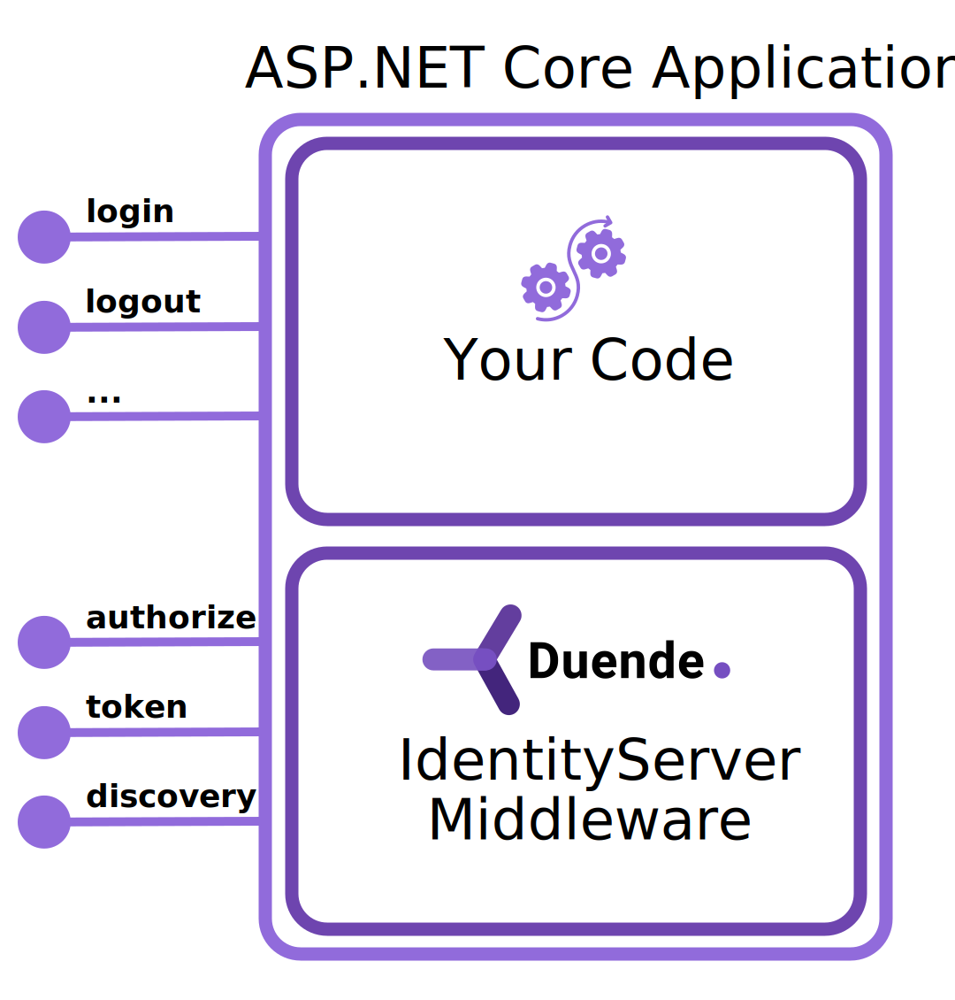
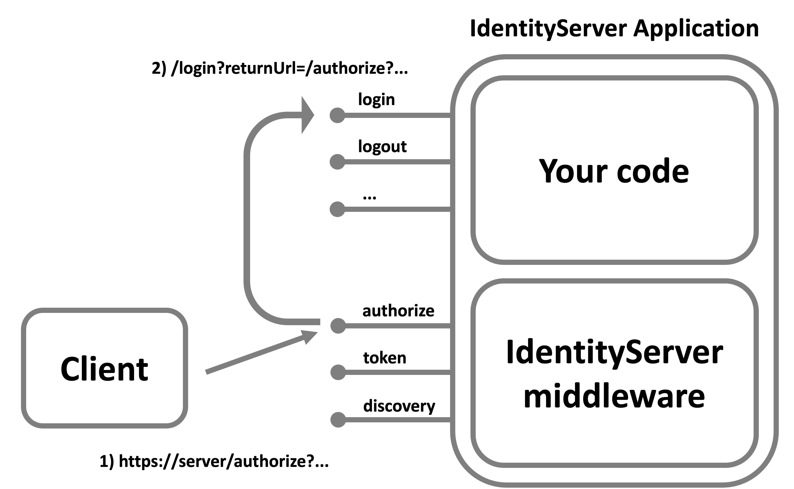

## Users And User Interface

The design of Duende IdentityServer allows you to use any user database and build any user interface (UI) workflow
needed to satisfy your requirements.
This means you have the ability to customize any UI page (registration, login, password reset, etc.), support any
credential type (password, MFA, etc.), use any user database (greenfield or legacy), and/or use federated logins from
any provider (social or enterprise).
You have the ability to control the entire user experience while Duende IdentityServer provides the implementation of
the security protocol (OpenID Connect and OAuth).

:::note
While you can use any custom user database or identity management library for your users, we
provide [integration support](/identityserver/aspnet-identity/) for ASP.NET Identity.
:::

## Authorization Endpoint And Login Page Workflow

The standard mechanism to allow users to login is for the client application to use a web browser.
This is obvious if the client application is a web application, but it's also the recommended practice for native and
mobile applications.

When a user must log in, the client application will redirect the user to the protocol endpoint called
the [authorization endpoint](/identityserver/reference/endpoints/authorize) in your IdentityServer server to request
authentication.
As part of the authorize request, your IdentityServer will typically display a login page for the user to enter their
credentials.
Once the user has authenticated, your IdentityServer will redirect the user back to the application with the protocol
response.

:::note
A user's authentication session is managed using Microsoft's
ASP.NET [cookie authentication framework](https://learn.microsoft.com/en-us/aspnet/core/security/authentication/cookie).
It is very important that you understand how it works when building the login pages in IdentityServer.
:::

Recall the diagram showing the relationship of your custom UI pages and the IdentityServer middleware in your
IdentityServer host application:

When your IdentityServer receives an authorize request, it will inspect it for a current authentication session for a
user. This authentication session is based on ASP.NET Core's authentication system and is ultimately determined by a
cookie issued from your login page.

If the user has never logged in there will be no cookie, and then the request to the authorize endpoint will result in a
redirect to your login page. This is the entry point into your custom workflow that can take over to get the user logged
in.

Once the login page has finished logging in the user with the ASP.NET Core authentication system, it will redirect the
user back to the authorize endpoint.
This time the request to the authorize endpoint will have an authenticated session for the user, and it can then create
the protocol response and redirect to the client application.

## Additional Pages

In addition to the login page, there are other pages that Duende IdentityServer expects (e.g. logout, error, consent),
and you could implement custom pages as well (e.g. register, forgot password, etc.).
Details about building these pages, and coverage of additional topics are in the
[User Interaction](/identityserver/ui)
section of this documentation.
