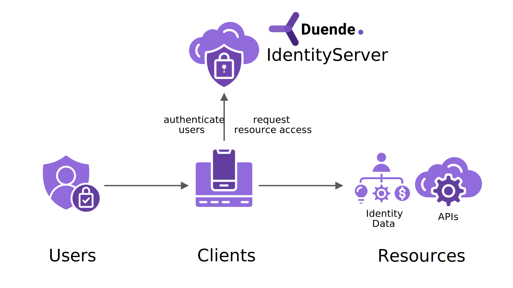

The specs, documentation and object model use a certain terminology that you should be aware of.

## Duende IdentityServer

Duende IdentityServer is an OpenID Connect & OAuth engine - it implements the OpenID Connect and OAuth 2.0 family
of [protocols](/identityserver/overview/specs/).

Different literature uses different terms for the same role - you probably also find the terms security token service,
identity provider, authorization server, IP-STS and more.

But they are in a nutshell all the same: a piece of software that issues security tokens to clients.

A typical implementation of Duende IdentityServer has a number of jobs and features - including:

* manage access to resources
* authenticate users using a local account store or via an external identity provider
* provide session management and single sign-on
* manage and authenticate clients
* issue identity and access tokens to clients

## User

A user is a human that is using a registered client to access resources.

## Client

A [client](/identityserver/fundamentals/clients) is a piece of software that requests tokens from your
IdentityServer - either for authenticating a user (requesting an identity token) or for accessing a resource (requesting
an access token). A client must be first registered with your IdentityServer before it can request tokens.

While there are many different client types, e.g. web applications, native mobile or desktop applications, SPAs, server
processes etc., they can all be put into two high-level categories.

### Machine to Machine Communication

In this scenario two machines talk to each other (e.g. background processes, batch jobs, server daemons), and there is
no interactive user present. To authorize this communication, your IdentityServer issues a token to the caller.

In protocol terms, this scenario is called *Client Credentials Flow* and you can learn more about it in the issuing
tokens [section](/identityserver/tokens/requesting#machine-to-machine-communication) and in
our [Quickstart](/identityserver/quickstarts/1-client-credentials/).

### Interactive Applications

This is the most common type of client scenario: web applications, SPAs or native/mobile apps with interactive users.
This scenario typically involves a browser for user interaction (e.g. for authentication or consent).

In protocol terms, this scenario is called *Authorization Code Flow* and you can learn more about it in the issuing
tokens [section](/identityserver/tokens/requesting#interactive-applications) and in
our [Quickstart](/identityserver/quickstarts/2-interactive/).

:::note
A client application can potentially have many instances - e.g. your web application might be physically deployed on
multiple servers for load-balancing purposes, or your mobile application might be deployed to thousands of different
phones. Logically these instances are still a single client.
:::

## Resources

[Resources](/identityserver/fundamentals/resources) are something you want to protect with your IdentityServer -
either identity data of your users, or APIs.

Every resource has a unique name - and clients use this name to specify to which resources they want to get access to.

**Identity data** Identity information (aka claims) about a user, e.g. name or email address.

*`APIs`* APIs resources represent functionality a client wants to invoke - typically modelled as Web APIs, but not
necessarily.

## Identity Token

An identity token represents the outcome of an authentication process. It contains at a bare minimum an identifier for
the user
(called the `sub` aka subject claim) and information about how and when the user authenticated. It can contain
additional identity data.

## Access Token

An access token allows access to an API resource. Clients request access tokens and forward them to the API.
Access tokens contain information about the client and the user (if present).
APIs use that information to authorize access to their data and functionality.
