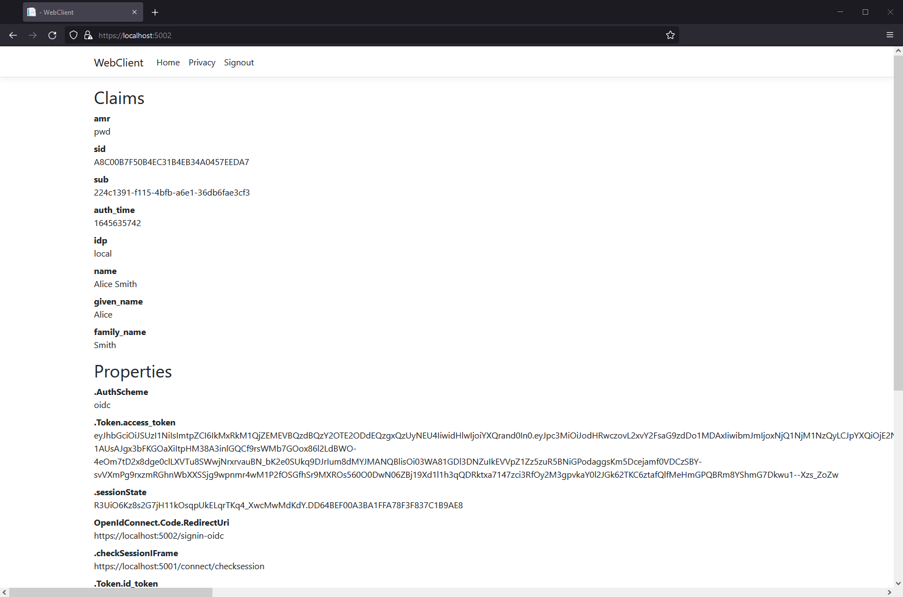
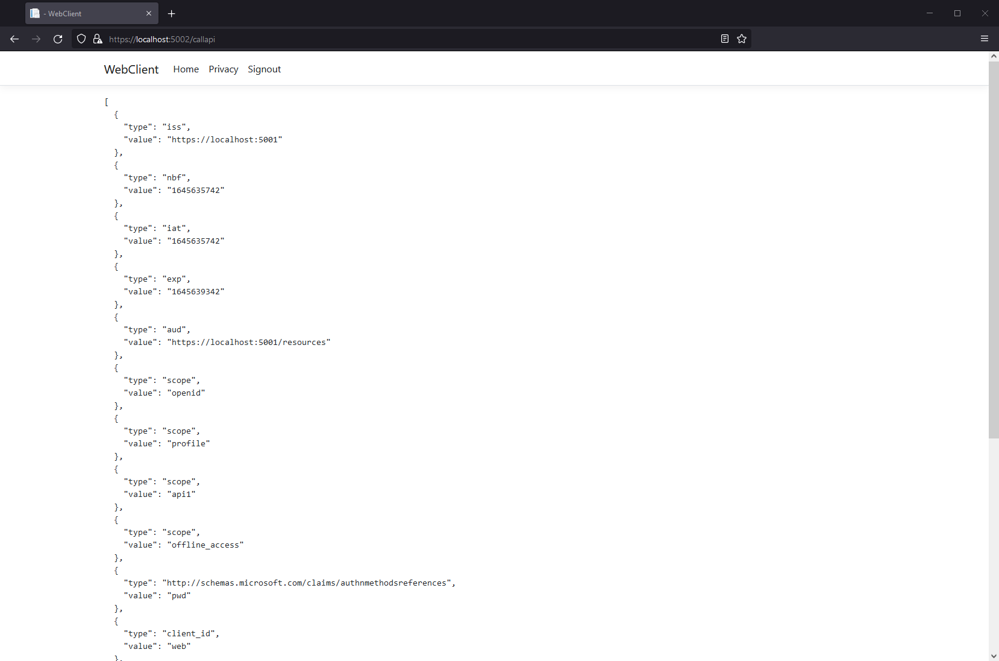

Welcome to Quickstart 5 for Duende IdentityServer! In this quickstart you will
integrate IdentityServer with ASP.NET Core Identity.

:::note
We recommend you do the quickstarts in order. If you'd like to start here, begin
from a copy of
the [reference implementation of Quickstart 4](https://github.com/DuendeSoftware/Samples/tree/main/IdentityServer/v7/Quickstarts/4_EntityFramework).
Throughout this quickstart, paths are written relative to the base `quickstart`
directory created in part 1, which is the root directory of the reference
implementation. You will also need to [install the IdentityServer templates](/identityserver/quickstarts/0-overview/#preparation).
:::

IdentityServer's flexible design allows you to use any database you want to
store users and their data, including password hashes, multi-factor
authentication details, roles, claims, profile data, etc. If you are starting
with a new user database, then ASP.NET Core Identity is one option you could
choose. This quickstart shows how to use ASP.NET Core Identity with
IdentityServer.

The approach this quickstart takes to using ASP.NET Core Identity is to create a
new project for the IdentityServer host. This new project will replace the
IdentityServer project you built up in the previous quickstarts. You will create
a new project because it is a convenient way to get the UI assets that are
needed to login and logout with ASP.NET Core Identity. All the other projects in
this solution (for the clients and the API) will remain the same.

:::note
This quickstart assumes you are familiar with how ASP.NET Core Identity works.
If you are not, it is recommended that you first [learn about
it](https://docs.microsoft.com/en-us/aspnet/core/security/authentication/identity?view=aspnetcore-8.0).
:::

In addition to the written steps below a YouTube video is available:

<iframe width="853" height="505" src="https://www.youtube.com/embed/blvZzYsr8uI" title="YouTube video player" frameborder="0" allow="accelerometer; autoplay; clipboard-write; encrypted-media; gyroscope; picture-in-picture; web-share" referrerpolicy="strict-origin-when-cross-origin" allowfullscreen></iframe>

## New Project For ASP.NET Core Identity

The first step is to add a new project for ASP.NET Core Identity to your
solution. We provide a template that contains the minimal UI assets needed to
use ASP.NET Core Identity with IdentityServer. You will eventually delete the
old project for IdentityServer, but there are some items that you will need to
migrate over.

Start by creating a new IdentityServer project that will use ASP.NET Core
Identity. Run the following commands from the `src` directory:

```console
dotnet new isaspid -n IdentityServerAspNetIdentity
cd ..
dotnet sln add ./src/IdentityServerAspNetIdentity
```

When prompted to "seed" the user database, choose "Y" for "yes". This populates
the user database with our "alice" and "bob" users. Their passwords are
"Pass123$".

:::note
The template uses Sqlite as the database for the users, and EF migrations are
pre-created in the template. If you wish to use a different database provider,
you will need to change the provider used in the code and re-create the EF
migrations.
:::

## Inspect The New Project

Open the new project in the editor of your choice, and inspect the generated
code. Much of it is the same from the prior quickstarts and templates. The
following sections will describe some key differences and guide you through
migrating configuration from the old IdentityServer Project, including:

- The project file (`IdentityServerAspNetIdentity.csproj`)
- Pipeline and service configuration (`HostingExtensions.cs`)
- Resource and client configuration (Config.cs)
- Entry point and seed data (`Program.cs` and `SeedData.cs`)
- Login and logout pages (Pages in `Pages/Account`)

#### IdentityServerAspNetIdentity.csproj

Notice the reference to `Duende.IdentityServer.AspNetIdentity`. This NuGet
package contains the ASP.NET Core Identity integration components for
IdentityServer.

#### HostingExtensions.cs

In `ConfigureServices` notice the necessary
`AddDbContext<ApplicationDbContext>()` and *AddIdentity<ApplicationUser,
IdentityRole>()* calls are done to configure ASP.NET Core Identity.

Also notice that much of the same IdentityServer configuration you did in the
previous quickstarts is already done. The template uses the in-memory style for
clients and resources, which are defined in `Config.cs`.

Finally, notice the addition of the new call to
`AddAspNetIdentity<ApplicationUser>()`. `AddAspNetIdentity()` adds the
integration layer to allow IdentityServer to access the user data for the
ASP.NET Core Identity user database. This is needed when IdentityServer must add
claims for the users into tokens.

Note that *AddIdentity<ApplicationUser, IdentityRole>()* must be invoked before
`AddIdentityServer()`.

#### Config.cs

`Config.cs` contains the hard-coded in-memory clients and resource definitions.
To keep the same clients and API working as the prior quickstarts, we need to
copy over the configuration data from the old IdentityServer project into this
one. Do that now, and afterwards `Config.cs` should look like this:

```cs
public static class Config
{
    public static IEnumerable<IdentityResource> IdentityResources =>
        new IdentityResource[]
        {
            new IdentityResources.OpenId(),
            new IdentityResources.Profile(),
            new IdentityResource()
            {
                Name = "verification",
                UserClaims = new List<string> 
                { 
                    JwtClaimTypes.Email,
                    JwtClaimTypes.EmailVerified
                }
            }
        };

    public static IEnumerable<ApiScope> ApiScopes =>
        new ApiScope[]
        { 
            new ApiScope(name: "api1", displayName: "My API")
        };

    public static IEnumerable<Client> Clients =>
        new Client[] 
        {
            new Client
            {
                ClientId = "client",

                // no interactive user, use the clientid/secret for authentication
                AllowedGrantTypes = GrantTypes.ClientCredentials,

                // secret for authentication
                ClientSecrets =
                {
                    new Secret("secret".Sha256())
                },

                // scopes that client has access to
                AllowedScopes = { "api1" }
            },
            // interactive ASP.NET Core Web App
            new Client
            {
                ClientId = "web",
                ClientSecrets = { new Secret("secret".Sha256()) },

                AllowedGrantTypes = GrantTypes.Code,
                
                // where to redirect to after login
                RedirectUris = { "https://localhost:5002/signin-oidc" },

                // where to redirect to after logout
                PostLogoutRedirectUris = { "https://localhost:5002/signout-callback-oidc" },

                AllowOfflineAccess = true,

                AllowedScopes =
                {
                    IdentityServerConstants.StandardScopes.OpenId,
                    IdentityServerConstants.StandardScopes.Profile,
                    "verification",
                    "api1"
                }
            }
        };
}
```

At this point, you no longer need the old IdentityServer project and can remove
it from the solution. From the quickstart directory, run the
following commands:

```console
dotnet sln remove ./src/IdentityServer
rm -r ./src/IdentityServer
```

#### Program.cs and SeedData.cs

The application entry point in `Program.cs` is a little different than most
ASP.NET Core projects. Notice that it looks for a command line argument called
`/seed` which is used as a flag to seed the users in the ASP.NET Core Identity
database. This seed process is invoked during template creation and already ran
when you were prompted to seed the database.

Look at the `SeedData` class' code to see how the database is created and the
first users are created.

#### Account Pages

Finally, take a look at the pages in the
`src/IdentityServerAspNetIdentity/Pages/Account` directory. These pages contain
slightly different login and logout code than the prior quickstart and templates
because the login and logout processes now rely on ASP.NET Core Identity. Notice
the use of the `SignInManager<ApplicationUser>` and
`UserManager<ApplicationUser>` types from ASP.NET Core Identity to validate
credentials and manage the authentication session.

Much of the rest of the code is the same from the prior quickstarts and
templates.

## Logging In With The Web client

At this point, you should be able to run all the existing clients and
samples. Launch the Web client application, and you should be redirected to
IdentityServer to log in. Login with one of the users created by the seed
process (e.g., alice/Pass123$), and after that you will be redirected back to
the Web client application where your user's claims should be listed.



You should also be able to go to the call api page at `https://localhost:5002/callapi` to invoke the API on behalf of the user:



Congratulations, you're using users from ASP.NET Core Identity in IdentityServer!

## Adding Custom Profile Data

Next you will add a custom property to your user model and include it as a
claim when the appropriate Identity Resource is requested.

First, add a `FavoriteColor` property in
`src/IdentityServerAspNetIdentity/ApplicationUser.cs`.

```csharp
public class ApplicationUser : IdentityUser
{
    public string FavoriteColor { get; set; }
}
```

Then, set the FavoriteColor of one of your test users in `SeedData.cs`

```csharp
alice = new ApplicationUser
{
    UserName = "alice",
    Email = "AliceSmith@email.com",
    EmailConfirmed = true,
    FavoriteColor = "red",
};
```

In the same file, add code to recreate the database when you re-seed the data,
by calling `EnsureDeleted` just before `Migrate`:

```csharp
var context = scope.ServiceProvider.GetService<ApplicationDbContext>();
context.Database.EnsureDeleted();
context.Database.Migrate();
```

:::note
Caution: this will destroy
your test users when you make changes to them. While that is convenient for this
quickstart, it is not recommended in production!
:::

Next, create an ef migration for the CustomProfileData and reseed your user
database. Run the following commands from the `src/IdentityServerAspNetIdentity`
directory:

```sh
dotnet ef migrations add CustomProfileData
dotnet run /seed
```

Now that you have more data in the database, you can use it to set claims.
IdentityServer contains an extensibility point called the `IProfileService` that
is responsible for retrieval of user claims. The ASP.NET Identity Integration
includes an implementation of `IProfileService` that retrieves claims from
ASP.NET Identity. You can extend that implementation to use the custom profile
data as a source of claims data. [See here](/identityserver/reference/services/profile-service/) for more details on
the profile
service.

Create a new file called `src/IdentityServerAspNetIdentity/CustomProfileService.cs` and add the
following code to it:

```csharp
using Duende.IdentityServer.AspNetIdentity;
using Duende.IdentityServer.Models;
using IdentityServerAspNetIdentity.Models;
using Microsoft.AspNetCore.Identity;
using System.Security.Claims;

namespace IdentityServerAspNetIdentity
{
    public class CustomProfileService : ProfileService<ApplicationUser>
    {
        public CustomProfileService(UserManager<ApplicationUser> userManager, IUserClaimsPrincipalFactory<ApplicationUser> claimsFactory) : base(userManager, claimsFactory)
        {
        }

        protected override async Task GetProfileDataAsync(ProfileDataRequestContext context, ApplicationUser user)
        {
            var principal = await GetUserClaimsAsync(user);
            var id = (ClaimsIdentity)principal.Identity;
            if (!string.IsNullOrEmpty(user.FavoriteColor))
            {
                id.AddClaim(new Claim("favorite_color", user.FavoriteColor));
            }

            context.AddRequestedClaims(principal.Claims);
        }
    }
}
```

Register the `CustomProfileService` in `HostingExtensions.cs`:

```csharp
// HostingExtensions.cs
builder.Services
    .AddIdentityServer(options =>
    {
        // ...
    })
    .AddInMemoryIdentityResources(Config.IdentityResources)
    .AddInMemoryApiScopes(Config.ApiScopes)
    .AddInMemoryClients(Config.Clients)
    .AddAspNetIdentity<ApplicationUser>()
    .AddProfileService<CustomProfileService>();
```

Finally, you need to configure your application to make a request for the
favorite_color, and include that claim in your client's configuration.

Add a new `IdentityResource` in `src/IdentityServerAspNetIdentity/Config.cs`
that will map the color scope onto the favorite_color claim type:

```csharp
public static IEnumerable<IdentityResource> IdentityResources =>
    new IdentityResource[]
    {
        // ...
        new IdentityResource("color", new [] { "favorite_color" })
    };
```

Allow the web client to request the color scope (also in `Config.cs`):

```csharp
new Client
{
    ClientId = "web",
    // ...
    
    AllowedScopes = new List<string>
    {
        IdentityServerConstants.StandardScopes.OpenId,
        IdentityServerConstants.StandardScopes.Profile,
        "api1",
        "color"
    }
}
```

Finally, update the `WebClient` project so that it will request the color scope.
In its `src/WebClient/Program.cs` file, add the color scope to the requested
scopes, and add a claim action to map the favorite_color into the principal:

```csharp
// Program.cs
.AddOpenIdConnect("oidc", options =>
{
    // ...

    options.Scope.Clear();
    options.Scope.Add("openid");
    options.Scope.Add("profile");
    options.Scope.Add("offline_access");
    options.Scope.Add("api1");
    options.Scope.Add("color");

    options.GetClaimsFromUserInfoEndpoint = true;
    options.ClaimActions.MapUniqueJsonKey("favorite_color", "favorite_color");
});
```

Now restart the `IdentityServerAspNetIdentity` and `WebClient` projects, sign
out and sign back in as alice, and you should see the favorite color claim.

## What's Missing?

The rest of the code in this template is similar to the other quickstarts and
templates we provide. You will notice that this template does not include UI
code for user registration, password reset, and other things you might expect
from Microsoft's templates that include ASP.NET Core Identity.

Given the variety of requirements and different approaches to using ASP.NET Core
Identity, our template deliberately does not provide those features. The intent
of this template is to be a starting point to which you can add the features you
need from ASP.NET Core Identity, customized according to your requirements.
Alternatively, you can [create a new project based on the ASP.NET Core Identity
template](https://docs.microsoft.com/en-us/aspnet/core/security/authentication/identity?view=aspnetcore-8.0&tabs=netcore-cli#create-a-web-app-with-authentication)
and add the IdentityServer features you have learned about in these quickstarts
to that project. With that approach, you may need to configure IdentityServer so
that it knows the paths to pages for user interactions. Set the LoginUrl,
LogoutUrl, ConsentUrl, ErrorUrl, and DeviceVerificationUrl as needed in your
`IdentityServerOptions`.
