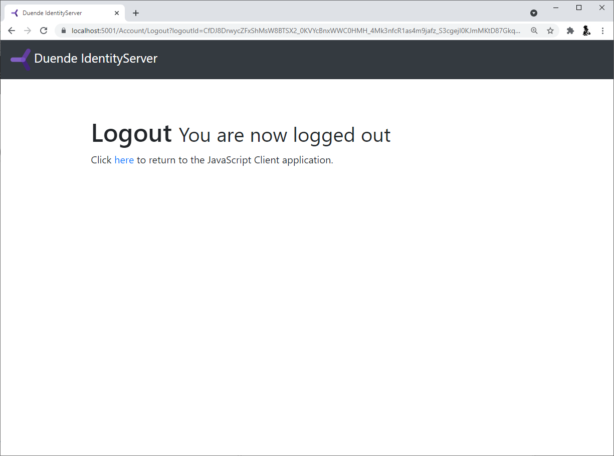

:::note
We recommend you do the quickstarts in order. If you'd like to start here, begin
from a copy of
the [reference implementation of Quickstart 3](https://github.com/DuendeSoftware/Samples/tree/main/IdentityServer/v7/Quickstarts/3_AspNetCoreAndApis).
Throughout this quickstart, paths are written relative to the base `quickstart`
directory created in part 1, which is the root directory of the reference
implementation. You will also need to [install the IdentityServer templates](/identityserver/quickstarts/0-overview/#preparation).
:::

This quickstart will show how to build a browser-based JavaScript client
application without a backend. This means your application has no server-side
code that can support the frontend application code, and thus all OpenID
Connect/OAuth protocol interactions occur from the JavaScript code running in
the browser. Also, invoking the API will be performed directly from the
JavaScript in the browser.

This design adds complexity (and thus security concerns) to your application, so
consider if the ["BFF" pattern](/identityserver/quickstarts/javascript-clients/js-with-backend/) might be a better
choice.

In this quickstart the user will log in to IdentityServer, invoke an API with an
access token issued by IdentityServer, and logout of IdentityServer. All of this
will be driven from the JavaScript running in the browser.

## New Project For The JavaScript Client

Create a new project for the JavaScript application. Beyond being able to serve
your application's html and javascript, there are no requirements on the
backend. You could use anything from an empty ASP.NET Core application to a
Node.js application. This quickstart will use an ASP.NET Core application.

Create a new ASP.NET Core web application and add it to the solution by running
the following commands from the `src` directory:

```console
dotnet new web -n JavaScriptClient
cd ..
dotnet sln add ./src/JavaScriptClient
```

### Modify Hosting

Modify the `JavaScriptClient` project to run on `https://localhost:5003`. Its
`Properties/launchSettings.json` should look like this:

```json
{
  "$schema": "https://json.schemastore.org/launchsettings.json",
  "profiles": {
    "JavaScriptClient": {
      "commandName": "Project",
      "dotnetRunMessages": true,
      "launchBrowser": true,
      "applicationUrl": "https://localhost:5003",
      "environmentVariables": {
        "ASPNETCORE_ENVIRONMENT": "Development"
      }
    }
  }
}
```

### Add Static File Middleware

Given that this project is designed to run client-side, all we need ASP.NET Core
to do is to serve up the static HTML and JavaScript files that will make up our
application. The static file middleware is designed to do this.

Register the static file middleware in `src/JavaScriptClient/Program.cs`. The
entire file should look like this:

```cs
var builder = WebApplication.CreateBuilder(args);
var app = builder.Build();

app.UseDefaultFiles();
app.UseStaticFiles();
app.Run();
```

This middleware will now serve up static files from the application's
`src/JavaScriptClient/wwwroot` directory. This is where we will put our HTML and
JavaScript files. If that directory does not exist in your project, create it
now.

### Reference oidc-client

In the prior [web application quickstart](/identityserver/quickstarts/3-api-access/), we used
a .NET library to handle the OpenID Connect protocol. In this quickstart, we
need a similar library in the `JavaScriptClient` project, except one that works
in JavaScript and is designed to run in the browser. The [oidc-client library](https://github.com/IdentityModel/oidc-client-js)
is one such library. It is available via [NPM](https://github.com/IdentityModel/oidc-client-js), or as a [direct download](https://github.com/IdentityModel/oidc-client-js/tree/release/dist)
from GitHub.

*`NPM`*

If you want to use NPM to download `oidc-client`, then run these commands from
the `src/JavaScriptClient` directory:

```console
npm i oidc-client
copy node_modules/oidc-client/dist/* wwwroot
```

This downloads the latest `oidc-client` package locally, and then copies the
relevant JavaScript files into `src/JavaScriptClient/wwwroot` so they can be
served by your application.

**Manual download**

If you want to download the `oidc-client` JavaScript files manually, browse to
[the GitHub
repository](https://github.com/IdentityModel/oidc-client-js/tree/release/dist)
and download the JavaScript files. Once downloaded, copy them into
`src/JavaScriptClient/wwwroot` so they can be served by your application.

### Add HTML And JavaScript Files

Next, add HTML and JavaScript files to the `src/JavaScriptClient/wwwroot`
directory. You will need two HTML files and one JavaScript file (in addition to
the `oidc-client.js` library). Add `index.html`, `callback.html`, and `app.js`
to `wwwroot`.

*`index.html`*

This will be the main page in your application.
It contains

- buttons for the user to login, logout, and call the API
- a `<pre>` container used to show messages to the user
- `<script>` tags to include your two JavaScript files

It should look like this:

```html
<!DOCTYPE html>
<html>
<head>
    <meta charset="utf-8"/>
    <title></title>
</head>
<body>
<button id="login">Login</button>
<button id="api">Call API</button>
<button id="logout">Logout</button>

<pre id="results"></pre>

<script src="oidc-client.js"></script>
<script src="app.js"></script>
</body>
</html>
```

*`app.js`*

This will contain the main code for your application.
First, add a helper function to display messages in the `<pre>`:

```js
function log() {
    document.getElementById("results").innerText = "";

    Array.prototype.forEach.call(arguments, function (msg) {
        if (typeof msg !== "undefined") {
            if (msg instanceof Error) {
                msg = "Error: " + msg.message;
            } else if (typeof msg !== "string") {
                msg = JSON.stringify(msg, null, 2);
            }
            document.getElementById("results").innerText += msg + "\r\n";
        }
    });
}
```

Next, add code to register `click` event handlers to the three buttons:

```js
document.getElementById("login").addEventListener("click", login, false);
document.getElementById("api").addEventListener("click", api, false);
document.getElementById("logout").addEventListener("click", logout, false);
```

Next, you will set up the `UserManager` class from the `oidc-client` library to
manage the OpenID Connect protocol. It requires similar configuration that was
necessary in the `WebClient` (albeit with different values). Add this code to
configure and instantiate the `UserManager`:

```js
var config = {
    authority: "https://localhost:5001",
    client_id: "js",
    redirect_uri: "https://localhost:5003/callback.html",
    response_type: "code",
    scope: "openid profile api1",
    post_logout_redirect_uri: "https://localhost:5003/index.html",
};
var mgr = new Oidc.UserManager(config);
```

Next, use the `UserManager.getUser` function to determine if the user is logged
into the JavaScript application. It uses a JavaScript `Promise` to return the
results asynchronously. The returned `User` object has a `profile` property
which contains the claims for the user. There's also an event called
`UserSignedOut` that can be handled to detect if the user signs out of the token
server while the SPA application is being used (presumably in a different tab).
Add this code to detect the user's session status in the JavaScript application:

```js
mgr.events.addUserSignedOut(function () {
    log("User signed out of IdentityServer");
});

mgr.getUser().then(function (user) {
    if (user) {
        log("User logged in", user.profile);
    } else {
        log("User not logged in");
    }
});
```

Next, implement the `login`, `api`, and `logout` functions. The `UserManager`
provides a `signinRedirect` to log the user in, and a `signoutRedirect` to log
the user out. The `User` object that we obtained above also has an
`access_token` property which can be used to authenticate to a web API. The
`access_token` will be passed to the web API via the `Authorization` header with
the `Bearer` scheme. Add this code to implement those three functions in your
application:

```js
function login() {
    mgr.signinRedirect();
}

function api() {
    mgr.getUser().then(function (user) {
        var url = "https://localhost:6001/identity";

        var xhr = new XMLHttpRequest();
        xhr.open("GET", url);
        xhr.onload = function () {
            log(xhr.status, JSON.parse(xhr.responseText));
        };
        xhr.setRequestHeader("Authorization", "Bearer " + user.access_token);
        xhr.send();
    });
}

function logout() {
    mgr.signoutRedirect();
}
```

:::note
See the [client credentials quickstart](/identityserver/quickstarts/1-client-credentials/) for information on how to
create the
remote API used in the code above.
:::

*`callback.html`*

This HTML file is the designated `redirect_uri` page once the user has logged
into IdentityServer. It will complete the OpenID Connect protocol sign-in
handshake with IdentityServer. The code for this is all provided by the
`UserManager` class we used earlier. Once the sign-in is complete, we can then
redirect the user back to the main `index.html` page. Add this code to complete
the signin process:

```html
<!DOCTYPE html>
<html>
<head>
    <meta charset="utf-8"/>
    <title></title>
</head>
<body>
<script src="oidc-client.js"></script>
<script>
    new Oidc.UserManager({response_mode: "query"}).signinRedirectCallback().then(function () {
        window.location = "index.html";
    }).catch(function (e) {
        console.error(e);
    });
</script>
</body>
</html>
```

## Add JavaScript Client Registration To IdentityServer

Now that the client application is ready to go, you need to define a
configuration entry in IdentityServer for the new JavaScript client.

In the IdentityServer project locate the client configuration in
`src/IdentityServer/Config.cs`. Add a new `Client` to the list for your new
JavaScript application. It should have the configuration listed below:

```cs
// JavaScript Client
new Client
{
    ClientId = "js",
    ClientName = "JavaScript Client",
    AllowedGrantTypes = GrantTypes.Code,
    RequireClientSecret = false,
    
    RedirectUris =           { "https://localhost:5003/callback.html" },
    PostLogoutRedirectUris = { "https://localhost:5003/index.html" },
    AllowedCorsOrigins =     { "https://localhost:5003" },

    AllowedScopes = 
    {
        IdentityServerConstants.StandardScopes.OpenId,
        IdentityServerConstants.StandardScopes.Profile,
        "api1"
    }
}
```

## Allowing Ajax Calls To The Web API With CORS

One last bit of configuration that is necessary is to configure CORS in the
`Api` project. This will allow Ajax calls to be made from
`https://localhost:5003` to `https://localhost:6001`.

**Configure CORS**

Add the CORS service to the dependency injection system in `src/Api/Program.cs`:

```cs
// Program.cs
builder.Services.AddCors(options =>
{
    // this defines a CORS policy called "default"
    options.AddPolicy("default", policy =>
    {
        policy.WithOrigins("https://localhost:5003")
            .AllowAnyHeader()
            .AllowAnyMethod();
    });
});
```

Then add the CORS middleware to the pipeline in `src/Api/Program.cs`.

```cs
// Program.cs
app.UseHttpsRedirection();
app.UseCors("default");
```

## Run The JavaScript Application

Now you should be able to run the JavaScript client application:


Click the "Login" button to sign the user in. Once the user is returned back to
the JavaScript application, you should see their profile information:


And click the "API" button to invoke the web API:


And finally click "Logout" to sign the user out.



You now have the start of a JavaScript client application that uses
IdentityServer for sign-in, sign-out, and authenticating calls to web APIs.

:::note
Some browsers limit cross-site interactions (especially in iframes). In Safari,
Firefox, or Brave you will notice that some important features will not work
such as silent token renewal and check session monitoring.
:::
