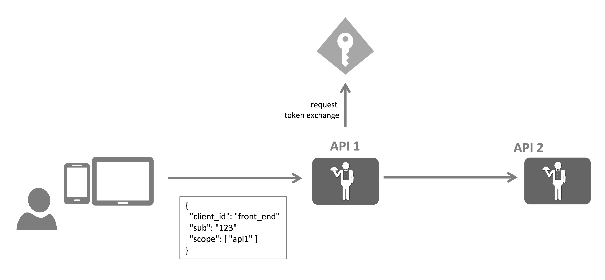

OAuth defines an extensibility point called extension grants.

Extension grants allow adding support for non-standard token issuance scenarios, e.g.

* token transformation
    * SAML to JWT, or Windows to JWT
    * delegation or impersonation
* federation
* encapsulating custom input parameters

You can add support for additional grant types by implementing the [IExtensionGrantValidator](/identityserver/reference/validators/extension-grant-validator/) interface.

## Token Exchange

The OAuth Token Exchange specification ([RFC 8693](https://tools.ietf.org/html/rfc8693)) describes a general purpose
mechanism for translating between token types. Common use cases are creating tokens for impersonation and delegation
purposes - but it is not limited to that.

You can leverage the extension grant feature to implement your preferred token exchange logic.

Some of the logic is boilerplate:

* read and validate incoming protocol parameters
* validate incoming token
  * using the built-in token validator if the token was issued by the same token service
  * using a token type specific library if the token is coming from a trusted (but different) token service
* read contents of token to apply custom logic/authorization if needed
* create response

Here's a simple implementation of the above steps:

```cs
public class TokenExchangeGrantValidator : IExtensionGrantValidator
{
    private readonly ITokenValidator _validator;

    public TokenExchangeGrantValidator(ITokenValidator validator)
    {
        _validator = validator;
    }

    // register for urn:ietf:params:oauth:grant-type:token-exchange
    public string GrantType => OidcConstants.GrantTypes.TokenExchange;

    public async Task ValidateAsync(ExtensionGrantValidationContext context)
    {
        // default response is error
        context.Result = new GrantValidationResult(TokenRequestErrors.InvalidRequest);

        // the spec allows for various token types, most commonly you return an access token
        var customResponse = new Dictionary<string, object>
        {
            { OidcConstants.TokenResponse.IssuedTokenType, OidcConstants.TokenTypeIdentifiers.AccessToken }
        };

        // read the incoming token
        var subjectToken = context.Request.Raw.Get(OidcConstants.TokenRequest.SubjectToken);

        // and the token type
        var subjectTokenType = context.Request.Raw.Get(OidcConstants.TokenRequest.SubjectTokenType);

        // mandatory parameters
        if (string.IsNullOrWhiteSpace(subjectToken))
        {
            return;
        }

        // for our impersonation/delegation scenario we require an access token
        if (!string.Equals(subjectTokenType, OidcConstants.TokenTypeIdentifiers.AccessToken))
        {
            return;
        }

        // validate the incoming access token with the built-in token validator
        var validationResult = await _validator.ValidateAccessTokenAsync(subjectToken);
        if (validationResult.IsError)
        {
            return;
        }

        // these are two values you typically care about
        var sub = validationResult.Claims.First(c => c.Type == JwtClaimTypes.Subject).Value;
        var clientId = validationResult.Claims.First(c => c.Type == JwtClaimTypes.ClientId).Value;

        // add any custom logic here (if needed)

        // create response
    }
}
```

You then register your grant validator with DI:

```cs
// Program.cs
idsvrBuilder.AddExtensionGrantValidator<TokenExchangeGrantValidator>();
```

And configure your client to be able to use it:

```cs
client.AllowedGrantTypes = { OidcConstants.GrantTypes.TokenExchange };
```

:::note
Values sent to the token endpoint are logged, except well-known sensitive values that IdentityServer processes by
default.
Any sensitive values you use as input to your extension grant validator that you do not want included in the logs should
be filtered.
This can be done by adding those parameter names on the `Logging.TokenRequestSensitiveValuesFilter` collection on
the [IdentityServerOptions](/identityserver/reference/options#logging).
:::

## Token Exchange For Impersonation And Delegation

One of the primary use cases of the token exchange specification is creating tokens for identity delegation and
impersonation scenarios. In these scenarios you want to forward certain token and identity information over multiple
hops in a call chain.



## Impersonation

In the impersonation use case, API 1 doing the token exchange becomes "invisible". For API 2 it looks like as if the
front end is doing a direct call. The token would look like this (simplified):

```json
{
  "client_id": "front_end",
  "sub": "123",
  "scope": [
    "api2"
  ]
}
```

Add the following code to the above validator to create an impersonation response:

```cs
// set token client_id to original id
context.Request.ClientId = clientId;

// create impersonation response
context.Result = new GrantValidationResult(
    subject: sub, 
    authenticationMethod: GrantType, 
    customResponse: customResponse);
```

## Delegation

In the delegation use case, the call chain is preserved using the `act` claim, e.g.:

```json
{
  "client_id": "front-end",
  "act": {
    "client_id": "api1"
  },
  "sub": "123",
  "scope": [
    "api2"
  ]
}
```

For API 2 it still looks like that the front-end is making the call, but by inspecting the `act` claim, the API can
learn about the traversed call chain.

The following code adds the `act` claim to the response:

```cs
// set token client_id to original id
context.Request.ClientId = clientId;

// create actor data structure
var actor = new
{
    client_id = context.Request.Client.ClientId
};

// create act claim
var actClaim = new Claim(JwtClaimTypes.Actor, JsonSerializer.Serialize(actor), IdentityServerConstants.ClaimValueTypes.Json);

context.Result = new GrantValidationResult(
    subject: sub, 
    authenticationMethod: GrantType, 
    claims: new[] { actClaim },
    customResponse: customResponse);
```

To emit the `act` claim into outgoing tokens,
your [profile service](/identityserver/reference/services/profile-service/) must know about it. The following simple
profile service emits the `act` claim if the token request is in the context of a token exchange operation:

```cs
public class ProfileService : IProfileService
{
    public override async Task GetProfileDataAsync(ProfileDataRequestContext context)
    {
        // add actor claim if needed
        if (context.Subject.GetAuthenticationMethod() == OidcConstants.GrantTypes.TokenExchange)
        {
            var act = context.Subject.FindFirst(JwtClaimTypes.Actor);
            if (act != null)
            {
                context.IssuedClaims.Add(act);
            }
        }

        // rest omitted
    }

    // rest omitted
}
```

See [here](/identityserver/samples/tokens) for the full source code.
