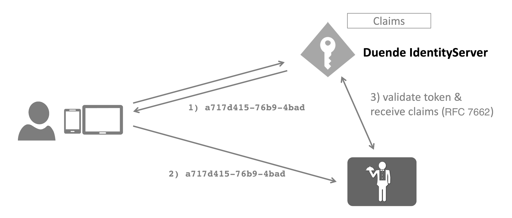

When using reference tokens, Duende IdentityServer stores the contents of the token in
the [persisted grant](/identityserver/data/operational#grants) store and issues a unique identifier for this token
back to the client.

The consumer of the token must use the [introspection](/identityserver/reference/endpoints/introspection) endpoint to
validate the token.



You can set the client's token type using the following client setting:

```cs
client.AccessTokenType = AccessTokenType.Reference;
```

## Enabling An API To Consume Reference Tokens

The introspection endpoint requires authentication - since the client of an introspection endpoint is typically an API,
you configure the secret on the `ApiResource`:

```cs
    var api = new ApiResource("api1")
    {
        ApiSecrets = { new Secret("secret".Sha256()) }
        Scopes = { "read", "write" }
    }
```

## Store Keys And Handles

Reference tokens have a key, which is an internal identifier used in the data store, and a handle, which is an external
value that is given to the client and never stored. The handle is 32 bytes of cryptographically strong random data
encoded as a hex string with a suffix to indicate the encoding ("-1"). This is the value that clients use as the access
token. The handle, plus additional metadata indicating the type of grant, is hashed with the SHA-256 algorithm to
produce the key. When IdentityServer is presented with a handle, it recomputes the key in order to retrieve the
persisted grant record for the reference token. The intention of this separation of key and handle is that read access
to the store will not reveal sensitive data. An attacker could read the keys in the data store, but those keys were
produced using a one-way hash, so the attacker would not be able to use the keys to recover the handles (the actual
access tokens). 
