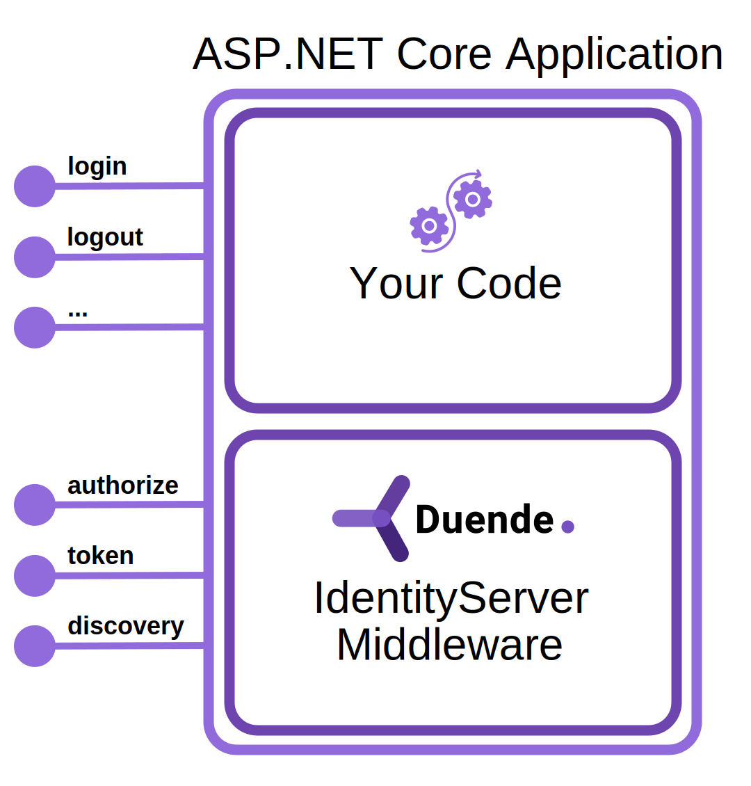

The design goal of Duende IdentityServer is to provide a full implementation of the OpenID Connect and OAuth protocols that is extremely flexible and easily customizable. One facet of IdentityServer that implementations typically customize is the user interface that users see when they need to log in, log out, etc. This UI is almost always branded to have the same look and feel as other applications of the organization that is implementing IdentityServer. But the customization that is possible within the UI goes much deeper than a logo or stylesheet. The entire user experience in your IdentityServer implementation is code that you control. This allows you to build customizations such as
- Multi-factor authentication
- Knowledge-based authentication
- Passwordless authentication 
- Requiring the user to accept terms of service or other legal agreements
- Home-realm discovery to determine which user store or external authentication provider should be used
- Reconciliation of accounts across multiple user stores
- Gathering additional user information and provisioning resources when new users arrive from external providers

To allow full flexibility of the UI, including business rules and user flow, the UI is separated from the core IdentityServer engine. The engine implements the endpoints specified in the protocols and hands off control to your code in the UI as necessary.

Our templates include a [quick start UI](/identityserver/quickstarts/2-interactive.md#add-the-ui) and a [quick start UI adapted to ASP.NET Identity](/identityserver/quickstarts/5-aspnetid.md) which provide a starting point for all the necessary pages, ready to be customized.

## Required Pages

As browser requests are made to the protocol endpoints in your IdentityServer implementation, they will be redirected to the interactive pages for the user to see. Depending on the features required, the pages expected in your IdentityServer implementation are:
* [Login](/identityserver/ui/login/index.md): allows the user to login. This could be achieved with a local credential, or could utilize an external login provider (e.g. social or enterprise federation system).
* [Logout](/identityserver/ui/logout/index.md): allows the user to logout (including providing single sign-out).
* [Error](/identityserver/ui/error.md): display error information to the end user, typically when there are workflow errors.
* [Consent](/identityserver/ui/consent.md): allows the user to grant resource access to clients (typically only used if the client is third-party).

[Additional custom pages](/identityserver/ui/custom.md) that you might want are then also possible (e.g. password reset, registration), and those are typically available to the user as links from one of the above pages.
