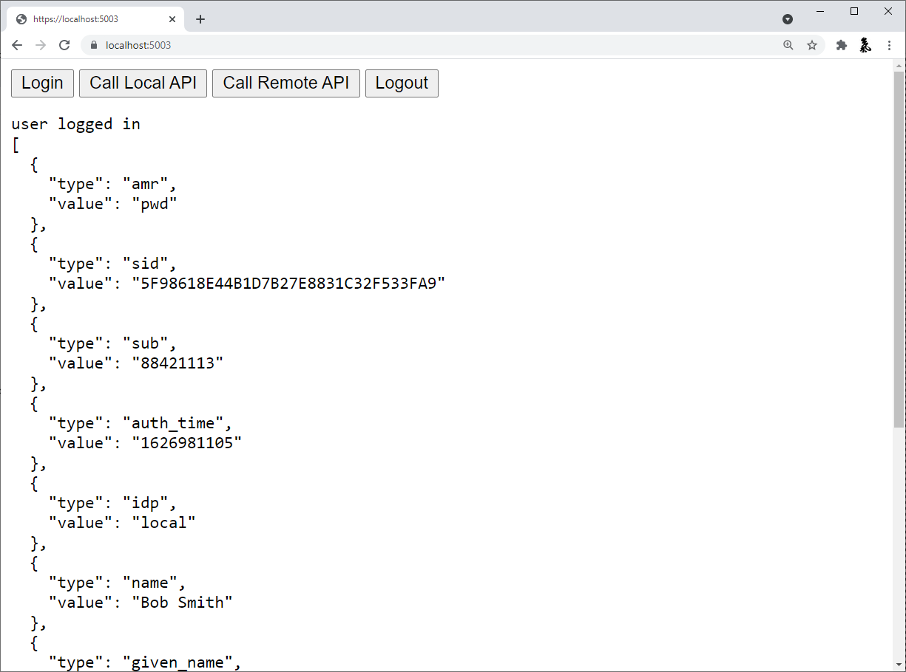
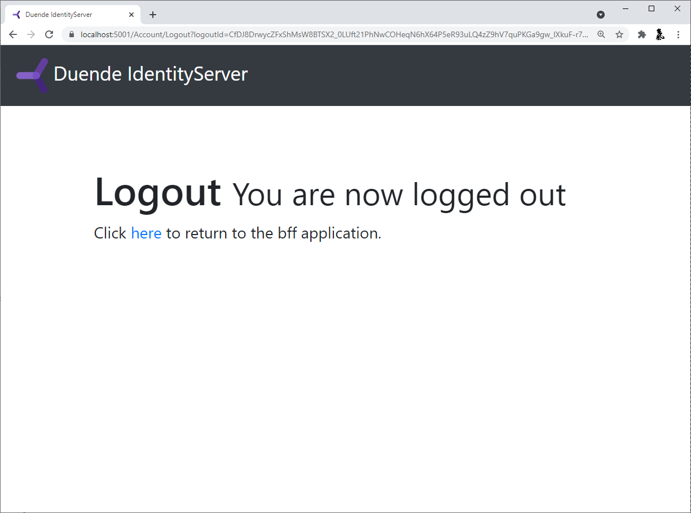
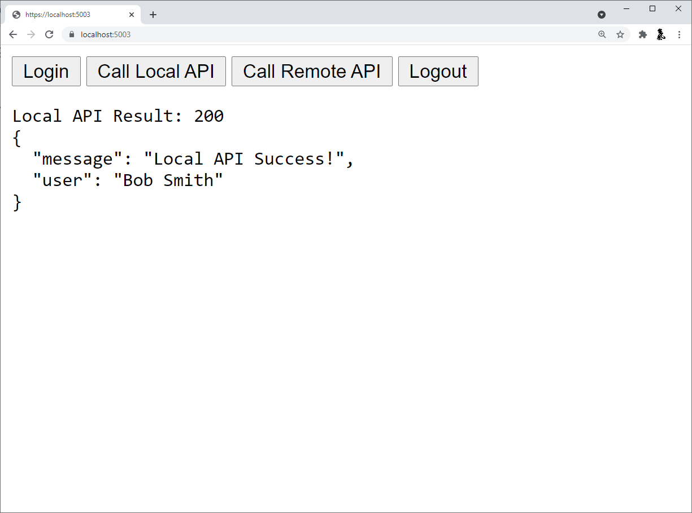
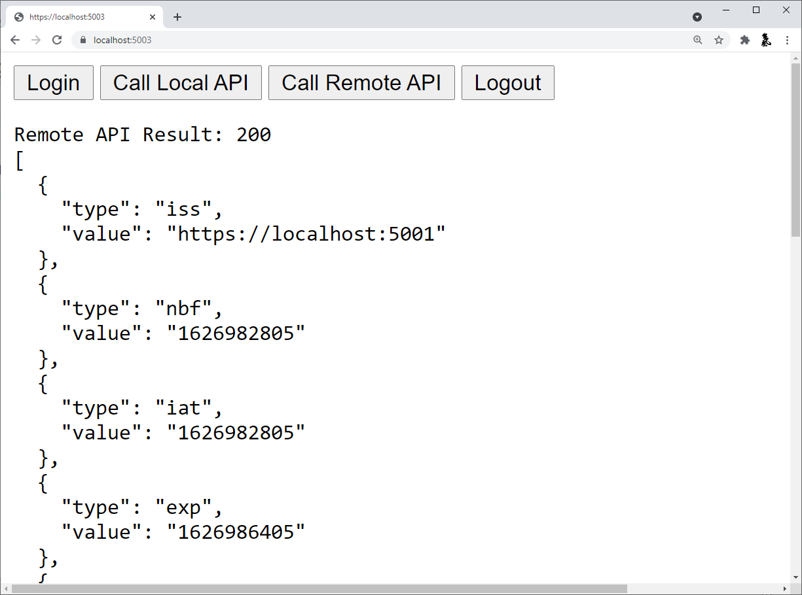

:::note
For any pre-requisites (like e.g. templates) have a look at the [Quickstarts Overview](/identityserver/v5/quickstarts/0_overview) first.
:::

This quickstart will show how to build a browser-based JavaScript client application with a backend. 
This means your application will have server-side code that can support the frontend application code.

In this quickstart we will be implementing the BFF pattern (with the help of the *Duende.BFF* library), which means the backend implements all the security protocol interactions with the token server.
This simplifies the JavaScript in the client-side, and reduces the attack surface of the application.

The features that will be shown in this quickstart will allow the user will log in with IdentityServer, invoke a local API hosted in the backend (secured with cookie authentication), invoke a remote API running in a different host (secured with an access token), and logout of IdentityServer (again, all with the help of the backend).

## New Project for the JavaScript client

Create a new project for the JavaScript application.
Since we expect the backend host to handle much of the protocol we will use an ASP.NET Core application.

Create a new "Empty" ASP.NET Core web application in the *~/src* directory.
You can use Visual Studio or do this from the command line:

```
md JavaScriptClient
cd JavaScriptClient
dotnet new web
```

As we have done before, with other client projects, add this project also to your solution. Run this from the root folder which has the sln file:

```
dotnet sln add .\src\JavaScriptClient\JavaScriptClient.csproj
```

### Add additional NuGet packages

To add BFF and OIDC support to the *JavaScriptClient* project, you’ll need the following NuGet packages:

```
dotnet add package Microsoft.AspNetCore.Authentication.OpenIdConnect
dotnet add package Duende.BFF --prerelease
```

### Modify hosting

Modify the *JavaScriptClient* project to run on *https://localhost:5003*.

### Add services

With the BFF pattern, the server-side code is responsible for triggering and receiving the OpenID Connect requests and responses.
This means that for our JavaScript application the configuration for session management and OpenID Connect is really no different from our prior [MVC application quickstart](/identityserver/v5/quickstarts/3_api_access).
We will be using API controllers later, so we need a call to *AddControllers()*.
Additionally, the BFF services need to be added with *AddBff()*.

```cs
public void ConfigureServices(IServiceCollection services)
{
    services.AddControllers();
    services.AddAuthorization();
    
    services.AddBff();

    JwtSecurityTokenHandler.DefaultMapInboundClaims = false;

    services.AddAuthentication(options =>
    {
        options.DefaultScheme = "Cookies";
        options.DefaultChallengeScheme = "oidc";
        options.DefaultSignOutScheme = "oidc";
    })
    .AddCookie("Cookies")
    .AddOpenIdConnect("oidc", options =>
    {
        options.Authority = "https://localhost:5001";

        options.ClientId = "bff";
        options.ClientSecret = "secret";
        options.ResponseType = "code";

        options.Scope.Add("api1");

        options.SaveTokens = true;
        options.GetClaimsFromUserInfoEndpoint = true;
    });
}
```

### Add middleware

Similarly, the middleware pipeline for this application will be fairly standard with the addition of the BFF middleware, and the BFF endpoints:

```cs
public void Configure(IApplicationBuilder app, IWebHostEnvironment env)
{
    if (env.IsDevelopment())
    {
        app.UseDeveloperExceptionPage();
    }

    app.UseDefaultFiles();
    app.UseStaticFiles();

    app.UseRouting();
    app.UseAuthentication();
    
    app.UseBff();

    app.UseAuthorization();

    app.UseEndpoints(endpoints =>
    {
        endpoints.MapBffManagementEndpoints();
    });
}
```

### Add your HTML and JavaScript files

Next is to add your HTML and JavaScript files to *~/wwwroot*.
We will have an HTML file and an application-specific JavaScript file.
In *~/wwwroot*, add an HTML file named *index.html* and add a JavaScript file called *app.js*.

**index.html**

This will be the main page in our application. 
It will simply contain the HTML for the buttons for the user to login, logout, and call the web APIs.
It will also contain the *\<script>* tags to include our JavaScript file.
It will also contain a *\<pre>* used for showing messages to the user.

It should look like this:

```html
<!DOCTYPE html>
<html>
<head>
    <meta charset="utf-8" />
    <title></title>
</head>
<body>
    <button id="login">Login</button>
    <button id="local">Call Local API</button>
    <button id="remote">Call Remote API</button>
    <button id="logout">Logout</button>

    <pre id="results"></pre>

    <script src="app.js"></script>
</body>
</html>
```

**app.js**

This will contain the main code for our application.
The first thing is to add a helper function to log messages to the *\<pre>*:

```js
function log() {
    document.getElementById('results').innerText = '';

    Array.prototype.forEach.call(arguments, function (msg) {
        if (typeof msg !== 'undefined') {
            if (msg instanceof Error) {
                msg = "Error: " + msg.message;
            }
            else if (typeof msg !== 'string') {
                msg = JSON.stringify(msg, null, 2);
            }
            document.getElementById('results').innerText += msg + '\r\n';
        }
    });
}
```

Next, we can use the BFF *user* management endpoint to query if the user is logged in or not.
Notice the *userClaims* variable is global; it will be needed elsewhere.

```js
let userClaims = null;

(async function () {
    var req = new Request("/bff/user", {
        headers: new Headers({
            'X-CSRF': '1'
        })
    })

    try {
        var resp = await fetch(req);
        if (resp.ok) {
            userClaims = await resp.json();

            log("user logged in", userClaims);
        }
        else if (resp.status === 401) {
            log("user not logged in");
        }
    }
    catch (e) {
        log("error checking user status");
    }
})();
```

Next, add code to register *click* event handlers to the buttons:

```js
document.getElementById("login").addEventListener("click", login, false);
document.getElementById("local").addEventListener("click", localApi, false);
document.getElementById("remote").addEventListener("click", remoteApi, false);
document.getElementById("logout").addEventListener("click", logout, false);
```

Next, we want to implement the *login* and *logout* functions.
Login is simple, as we redirect the user to the BFF *login* endpoint.
Logout is more involved, as we need to redirect the user to the BFF *logout* endpoint, but it's required that we pass an anti-forgery token to prevent cross site request forgery attacks.
The *userClaims* that we populated earlier contains this token and the full URL in one of its claims, so we will use that:

```js
function login() {
    window.location = "/bff/login";
}

function logout() {
    if (userClaims) {
        var logoutUrl = userClaims.find(claim => claim.type === 'bff:logout_url').value;
        window.location = logoutUrl;
    }
    else {
        window.location = "/bff/logout";
    }
}
```

Finally, add empty stubs for the other button event handler functions. 
We will fully implement those after we get login and logout working.

```js
async function localApi() {
}

async function remoteApi() {
}
```

## Add a client registration to IdentityServer for the JavaScript client

Now that the client application is ready to go, we need to define a configuration entry in IdentityServer for this new JavaScript client.
In the IdentityServer project locate the client configuration (in *Config.cs*).
Add a new *Client* to the list for our new JavaScript application.
Given that this client uses the BFF pattern, the configuration will be very smiliar to the MVC client.
It should have the configuration listed below:

```cs
// JavaScript BFF client
new Client
{
    ClientId = "bff",
    ClientSecrets = { new Secret("secret".Sha256()) },

    AllowedGrantTypes = GrantTypes.Code,
    
    // where to redirect to after login
    RedirectUris = { "https://localhost:5003/signin-oidc" },

    // where to redirect to after logout
    PostLogoutRedirectUris = { "https://localhost:5003/signout-callback-oidc" },

    AllowedScopes = new List<string>
    {
        IdentityServerConstants.StandardScopes.OpenId,
        IdentityServerConstants.StandardScopes.Profile,
        "api1"
    }
}
```

## Run and test login and logout

At this point, you should be able to run the *JavaScriptClient* application.
You should see that the user is not logged in initially.


Once you click the login button, the user should be redirected to log in at IdentityServer.
Once the *JavaScriptClient* application receives the response from IdentityServer then the user should appear logged in and their claims should be displayed.
 


Finally, the logout button should successfully get the user logged out.




## Add API support

Now that we have login and logout working, we will add support to invoke both local and remote APIs.

A local API is an endpoint that is hosted in the same backend as the *JavaScriptClient* application.
This would be perfect for APIs that only exist to support the JavaScript frontend (typically to provide UI specific data or aggregate data from other sources).
The authentication for the local API will be based on the user's session cookie in the *JavaScriptClient* application.

A remote API is an API running in some other host other than the *JavaScriptClient* application.
This would be typical for APIs that are shared by many different applications (e.g. mobile app, other web apps, etc.).
The authentication for remote APIs will use an access token. 
Fortunately the *JavaScriptClient* application has an access token stored in the user's session.
We will use the BFF proxy feature to accept a call from the JavaScript running in the browser authenticated with the user's session cookie, locate the access token for the user based on the user's session, and then proxy the call to the remote API sending the access token for authentication.

### Define a local API

Add a new class to the *JavaScriptClient* project that will contain the local API:

```cs
public class LocalApiController : ControllerBase
{
    [Route("local/identity")]
    [Authorize]
    public IActionResult Get()
    {
        var name = User.FindFirst("name")?.Value ?? User.FindFirst("sub")?.Value;
        return new JsonResult(new { message = "Local API Success!", user=name });
    }
}
```

:::note
If while in the local API controller code you want to call out manually to a remote API and need the user's access token, there
is an extension method *GetUserAccessTokenAsync* on the *HttpContext* you can use. For example:
*var token = await HttpContext.GetUserAccessTokenAsync();*
:::

### Update routing to accept local and remote API calls

We need to register both the local API and the BFF proxy for the remote API in the ASP.NET Core routing system. 
Add the code below to the *UseEndpoints* section in *Configure* in *Startup.cs*.

```cs
app.UseEndpoints(endpoints =>
{
    endpoints.MapControllers()
        .AsBffApiEndpoint();

    endpoints.MapBffManagementEndpoints();

    endpoints.MapRemoteBffApiEndpoint("/remote", "https://localhost:6001")
        .RequireAccessToken(Duende.Bff.TokenType.User);

});
```
The call to the *AsBffApiEndpoint()* fluent helper method adds BFF support to the local APIs.
This includes anti-forgery protection and suppressing login redirects on authentication failures and instead returning 401 and 403 status codes under the appropriate circumstances.

*MapRemoteBffApiEndpoint()* registers the BFF proxy for the remote API and configures it to pass the user's access token.

### Call the APIs from JavaScript

Back in *site.js*, implement the two API button event handlers as such:

```js
async function localApi() {

    var req = new Request("/local/identity", {
        headers: new Headers({
            'X-CSRF': '1'
        })
    })

    try {
        var resp = await fetch(req);

        let data;
        if (resp.ok) {
            data = await resp.json();
        }
        log("Local API Result: " + resp.status, data);
    }
    catch (e) {
        log("error calling local API");
    }
}

async function remoteApi() {

    var req = new Request("/remote/identity", {
        headers: new Headers({
            'X-CSRF': '1'
        })
    })

    try {
        var resp = await fetch(req);

        let data;
        if (resp.ok) {
            data = await resp.json();
        }
        log("Remote API Result: " + resp.status, data);
    }
    catch (e) {
        log("error calling remote API");
    }
}
```

The local API path uses the path as configured in the *Route* attribute applied to the *LocalApiController*.
The remote API path uses a "/remote" prefix to indicate that the BFF proxy should be used, and the remaining path is what's then passed when invoking the remote API ("/identity" in this case).
Notice both API calls require an *'X-CSRF': '1'* header, which acts as the anti-forgery token.

:::note
See the [client credentials quickstart](/identityserver/v5/quickstarts/1_client_credentials) for information on how to create the remote API used in the code above.
:::

## Run and test the API calls

At this point, you should be able to run the *JavaScriptClient* application and invoke the APIs.
The local API should return something like this:



And the remote API should return something like this:


