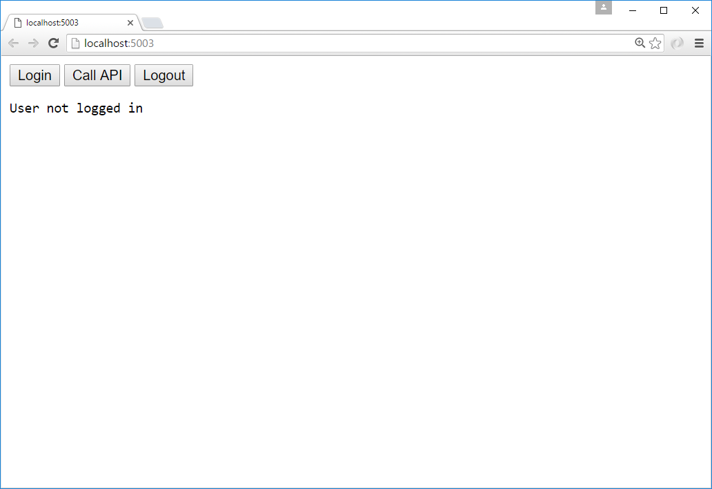
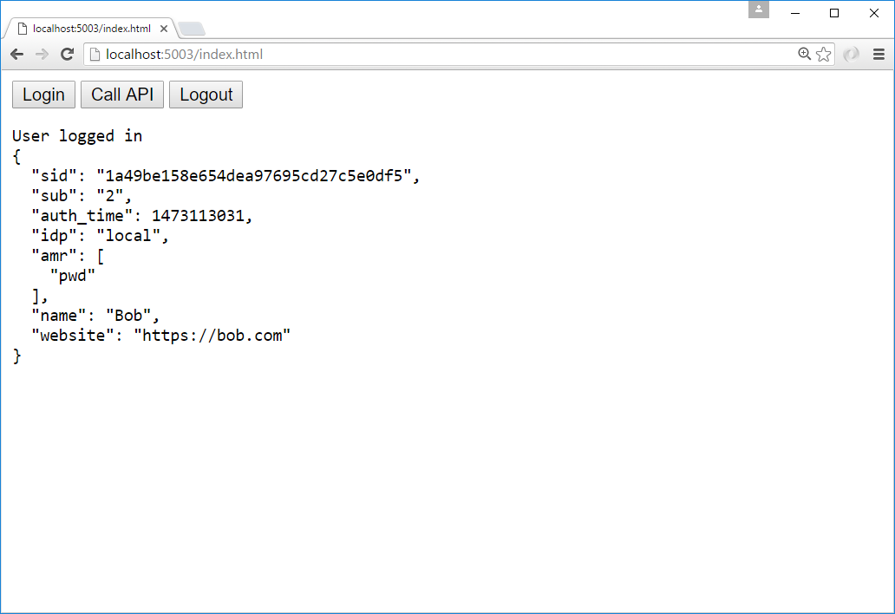
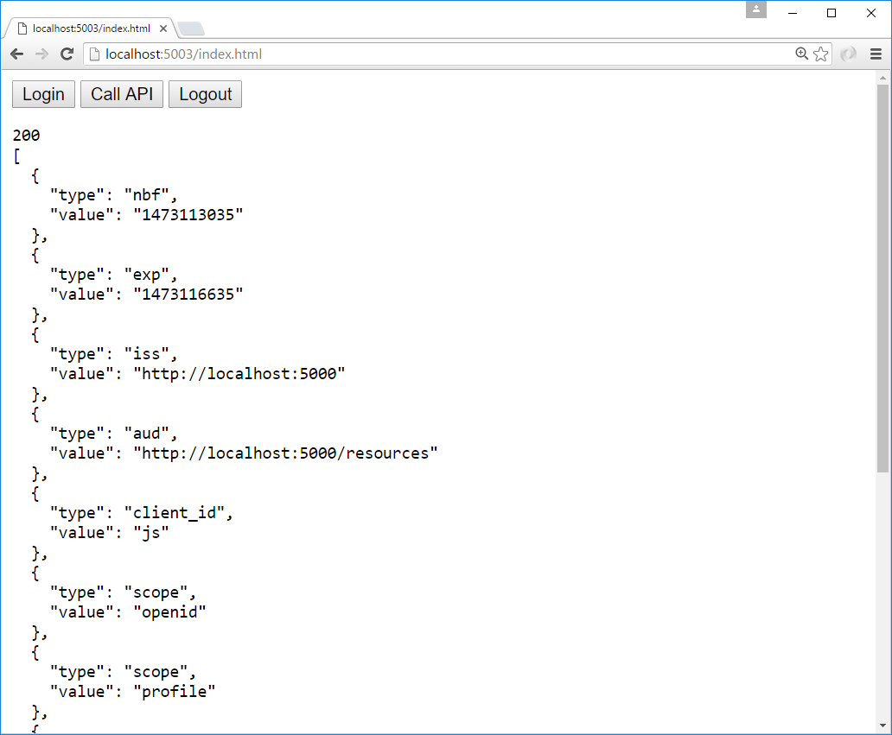
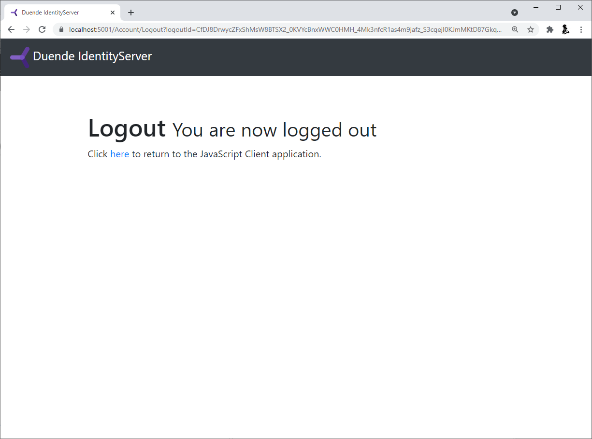

:::note
For any pre-requisites (like e.g. templates) have a look at the [Quickstarts Overview](../0_overview) first.
:::


This quickstart will show how to build a browser-based JavaScript client application without a backend. 
This means your application has no server-side code that can support the frontend application code, and thus all OpenID Connect/OAuth protocol interactions occur from the JavaScript code running in the browser. Also, invoking the API will be performed directly from the JavaScript in the browser.

This design adds complexity (and thus security concerns) to your application, so consider if the ["BFF" pattern](js_with_backend) might be a better choice.

In this quickstart the user will login to IdentityServer, invoke the web API with an access token issued by IdentityServer, and logout of IdentityServer. 
All of this will be driven from the JavaScript running in the browser.

## New Project for the JavaScript client

Create a new project for the JavaScript application.
It can simply be an empty web project, an empty ASP.NET Core application, or something else like a Node.js application.
This quickstart will use an ASP.NET Core application.

Create a new "Empty" ASP.NET Core web application in the *~/src* directory.
You can use Visual Studio or do this from the command line:

```
md JavaScriptClient
cd JavaScriptClient
dotnet new web
```

As we have done before, with other client projects, add this project also to your solution. Run this from the root folder which has the sln file:

```
dotnet sln add .\src\JavaScriptClient\JavaScriptClient.csproj
```

### Modify hosting

Modify the *JavaScriptClient* project to run on *https://localhost:5003*.

### Add the static file middleware

Given that this project is designed to run client-side, all we need ASP.NET Core to do is to serve up the static HTML and JavaScript files that will make up our application.
The static file middleware is designed to do this.

Register the static file middleware in *Startup.cs* in the *Configure* method (and at the same time remove everything else):

```cs
public void Configure(IApplicationBuilder app)
{
    app.UseDefaultFiles();
    app.UseStaticFiles();
}
```

This middleware will now serve up static files from the application's *~/wwwroot* folder.
This is where we will put our HTML and JavaScript files.
If that folder does not exist in your project, create it now.

### Reference oidc-client

In one of the previous quickstarts in the ASP.NET Core MVC-based client project we used a library to handle the OpenID Connect protocol. 
In this quickstart in the *JavaScriptClient* project we need a similar library, except one that works in JavaScript and is designed to run in the browser.
The [oidc-client library](https://github.com/IdentityModel/oidc-client-js) is one such library. 
It is available via [NPM](https://github.com/IdentityModel/oidc-client-js), or as a [direct download](https://github.com/IdentityModel/oidc-client-js/tree/release/dist) from github.

**NPM**

If you want to use NPM to download *oidc-client*, then run these commands from your *JavaScriptClient* project directory:

```
npm i oidc-client
copy node_modules\oidc-client\dist\* wwwroot
```

This downloads the latest *oidc-client* package locally, and then copies the relevant JavaScript files into *~/wwwroot* so they can be served up by your application.

**Manual download**

If you want to simply download the *oidc-client* JavaScript files manually, browse to [the GitHub repository](https://github.com/IdentityModel/oidc-client-js/tree/release/dist) and download the JavaScript files. Once downloaded, copy them into *~/wwwroot* so they can be served up by your application.

### Add your HTML and JavaScript files

Next is to add your HTML and JavaScript files to *~/wwwroot*.
We will have two HTML files and one application-specific JavaScript file (in addition to the *oidc-client.js* library).
In *~/wwwroot*, add a HTML file named *index.html* and *callback.html*, and add a JavaScript file called *app.js*.

**index.html**

This will be the main page in our application. 
It will simply contain the HTML for the buttons for the user to login, logout, and call the web API.
It will also contain the *\<script>* tags to include our two JavaScript files.
It will also contain a *\<pre>* used for showing messages to the user.

It should look like this:

```html
<!DOCTYPE html>
<html>
<head>
    <meta charset="utf-8" />
    <title></title>
</head>
<body>
    <button id="login">Login</button>
    <button id="api">Call API</button>
    <button id="logout">Logout</button>

    <pre id="results"></pre>

    <script src="oidc-client.js"></script>
    <script src="app.js"></script>
</body>
</html>
```

**app.js**

This will contain the main code for our application.
The first thing is to add a helper function to log messages to the *\<pre>*:

```js
function log() {
    document.getElementById('results').innerText = '';

    Array.prototype.forEach.call(arguments, function (msg) {
        if (msg instanceof Error) {
            msg = "Error: " + msg.message;
        }
        else if (typeof msg !== 'string') {
            msg = JSON.stringify(msg, null, 2);
        }
        document.getElementById('results').innerHTML += msg + '\r\n';
    });
}
```

Next, add code to register *click* event handlers to the three buttons:

```js
document.getElementById("login").addEventListener("click", login, false);
document.getElementById("api").addEventListener("click", api, false);
document.getElementById("logout").addEventListener("click", logout, false);
```

Next, we can use the *UserManager* class from the *oidc-client* library to manage the OpenID Connect protocol. 
It requires similar configuration that was necessary in the MVC Client (albeit with different values). 
Add this code to configure and instantiate the *UserManager*:

```js
var config = {
    authority: "https://localhost:5001",
    client_id: "js",
    redirect_uri: "https://localhost:5003/callback.html",
    response_type: "code",
    scope:"openid profile api1",
    post_logout_redirect_uri : "https://localhost:5003/index.html",
};
var mgr = new Oidc.UserManager(config);
```

Next, the *UserManager* provides a *getUser* API to know if the user is logged into the JavaScript application.
It uses a JavaScript *Promise* to return the results asynchronously. 
The returned *User* object has a *profile* property which contains the claims for the user.
There's also an event called *UserSignedOut* that can be handled to detect if the user signs out of the token server while the SPA application is being used (presumably in a different tab).
Add this code to detect the user's session status in JavaScript application:

```js
mgr.getUser().then(function (user) {
    if (user) {
        log("User logged in", user.profile);
    }
    else {
        log("User not logged in");
    }
});

mgr.events.addUserSignedOut(function () {
    log("User signed out of IdentityServer");
});
```

Next, we want to implement the *login*, *api*, and *logout* functions. 
The *UserManager* provides a *signinRedirect* to log the user in, and a *signoutRedirect* to log the user out.
The *User* object that we obtained in the above code also has an *access_token* property which can be used to authenticate to a web API.
The *access_token* will be passed to the web API via the *Authorization* header with the *Bearer* scheme.
Add this code to implement those three functions in our application:

```js
function login() {
    mgr.signinRedirect();
}

function api() {
    mgr.getUser().then(function (user) {
        var url = "https://localhost:6001/identity";

        var xhr = new XMLHttpRequest();
        xhr.open("GET", url);
        xhr.onload = function () {
            log(xhr.status, JSON.parse(xhr.responseText));
        }
        xhr.setRequestHeader("Authorization", "Bearer " + user.access_token);
        xhr.send();
    });
}

function logout() {
    mgr.signoutRedirect();
}
```

:::note
See the [client credentials quickstart](../quickstarts/1_client_credentials) for information on how to create the api used in the code above.
:::

**callback.html**

This HTML file is the designated *redirect_uri* page once the user has logged into IdentityServer.
It will complete the OpenID Connect protocol sign-in handshake with IdentityServer. 
The code for this is all provided by the *UserManager* class we used earlier. 
Once the sign-in is complete, we can then redirect the user back to the main *index.html* page. 
Add this code to complete the signin process:

```html
<!DOCTYPE html>
<html>
<head>
    <meta charset="utf-8" />
    <title></title>
</head>
<body>
    <script src="oidc-client.js"></script>
    <script>
        new Oidc.UserManager({response_mode:"query"}).signinRedirectCallback().then(function() {
            window.location = "index.html";
        }).catch(function(e) {
            console.error(e);
        });
    </script>
</body>
</html>
```

## Add a client registration to IdentityServer for the JavaScript client

Now that the client application is ready to go, we need to define a configuration entry in IdentityServer for this new JavaScript client.
In the IdentityServer project locate the client configuration (in *Config.cs*).
Add a new *Client* to the list for our new JavaScript application.
It should have the configuration listed below:

```cs
// JavaScript Client
new Client
{
    ClientId = "js",
    ClientName = "JavaScript Client",
    AllowedGrantTypes = GrantTypes.Code,
    RequireClientSecret = false,
    
    RedirectUris =           { "https://localhost:5003/callback.html" },
    PostLogoutRedirectUris = { "https://localhost:5003/index.html" },
    AllowedCorsOrigins =     { "https://localhost:5003" },

    AllowedScopes = 
    {
        IdentityServerConstants.StandardScopes.OpenId,
        IdentityServerConstants.StandardScopes.Profile,
        "api1"
    }
}
```

## Allowing Ajax calls to the Web API with CORS

One last bit of configuration that is necessary is to configure CORS in the web API project. 
This will allow Ajax calls to be made from *https://localhost:5003* to *https://localhost:6001*.

**Configure CORS**

Add the CORS services to the dependency injection system in *ConfigureServices* in *Startup.cs*:

```cs
public void ConfigureServices(IServiceCollection services)
{
    // ...

    services.AddCors(options =>
    {
        // this defines a CORS policy called "default"
        options.AddPolicy("default", policy =>
        {
            policy.WithOrigins("https://localhost:5003")
                .AllowAnyHeader()
                .AllowAnyMethod();
        });
    });
}
```

Add the CORS middleware to the pipeline in *Configure* (just after routing):

```cs
public void Configure(IApplicationBuilder app)
{
    app.UseRouting();

    app.UseCors("default");

    // ...
}
```

## Run the JavaScript application

Now you should be able to run the JavaScript client application:



Click the "Login" button to sign the user in.
Once the user is returned back to the JavaScript application, you should see their profile information:
 


And click the "API" button to invoke the web API:



And finally click "Logout" to sign the user out.



You now have the start of a JavaScript client application that uses IdentityServer for sign-in, sign-out, and authenticating calls to web APIs.

:::note
Some browsers limit cross-site interactions (especially in iframes).
If you were to test this sample in Safari, Chrome, or Brave you will notice that some important features will not work such as silent token renewal and check session monitoring.
:::
