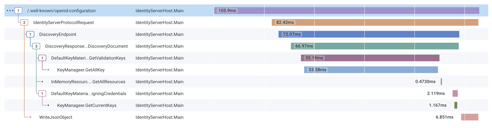
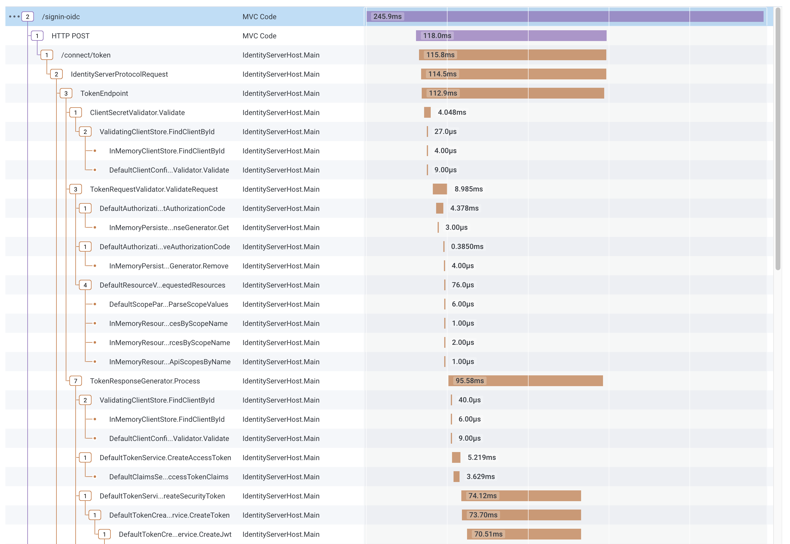
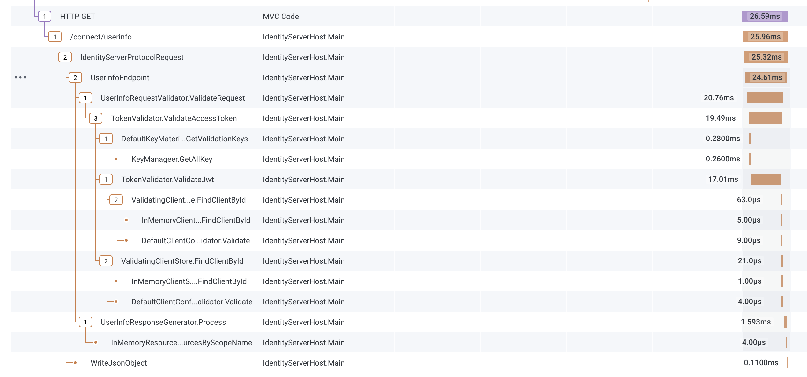

(added in v6.1)

[OpenTelemetry](https://opentelemetry.io) is a collection of tools, APIs, and SDKs for generating and collecting telemetry data (metrics, logs, and traces). This is very useful for analyzing software performance and behavior - especially in highly distributed systems.

Now that the tracing part of OTel is finalized, we started adding instrumentation to all relevant parts of IdentityServer - especially around input validators, response generators and stores.

The output is very useful for visualizing the control flow and finding performance bottlenecks.

Here's e.g. the output for a request to the discovery endpoint:



When multiple applications send their traces to the same OTel server, this becomes super useful for following e.g. authentication flows over service boundaries.

The following screenshot shows the ASP.NET Core OpenID Connect authentication handler redeeming the authorization code:



...and then contacting the userinfo endpoint:



*The above screenshots are from https://www.honeycomb.io.*

### Setup
To start emitting Otel tracing information you need 

* add the Otel libraries to your IdentityServer and client applications
* start collecting traces from the various IdentityServer sources (and other sources e.g. ASP.NET Core)

```cs
builder.Services.AddOpenTelemetryTracing(builder =>
{
    builder
        .AddSource(IdentityServerConstants.Tracing.Basic)
        .AddSource(IdentityServerConstants.Tracing.Cache)
        .AddSource(IdentityServerConstants.Tracing.Services)
        .AddSource(IdentityServerConstants.Tracing.Stores)
        .AddSource(IdentityServerConstants.Tracing.Validation)
        
        .SetResourceBuilder(
            ResourceBuilder.CreateDefault()
                .AddService("MyIdentityServerHost"))
        .AddHttpClientInstrumentation()
        .AddAspNetCoreInstrumentation()
        .AddSqlClientInstrumentation()
        .AddOtlpExporter(option =>
        {
            // wire up OTel server
        });
});
```

This [sample](/identityserver/v6/samples/diagnostics#opentelemetry-support) uses the console exporter and can be used as a starting point.

### Tracing sources
IdentityServer can emit very fine grained traces which is useful for performance troubleshooting and general exploration of the control flow.

This might be too detailed in production. 

You can select which information you are interested in by selectively listening to various traces:

* **IdentityServerConstants.Tracing.Basic**
   
   High level request processing like request validators and response generators

* **IdentityServerConstants.Tracing.Cache**
   
   Caching related tracing

* **IdentityServerConstants.Tracing.Services**
   
   Services related tracing

* **IdentityServerConstants.Tracing.Stores**
   
   Store related tracing

* **IdentityServerConstants.Tracing.Validation**
   
   More detailed tracing related to validation