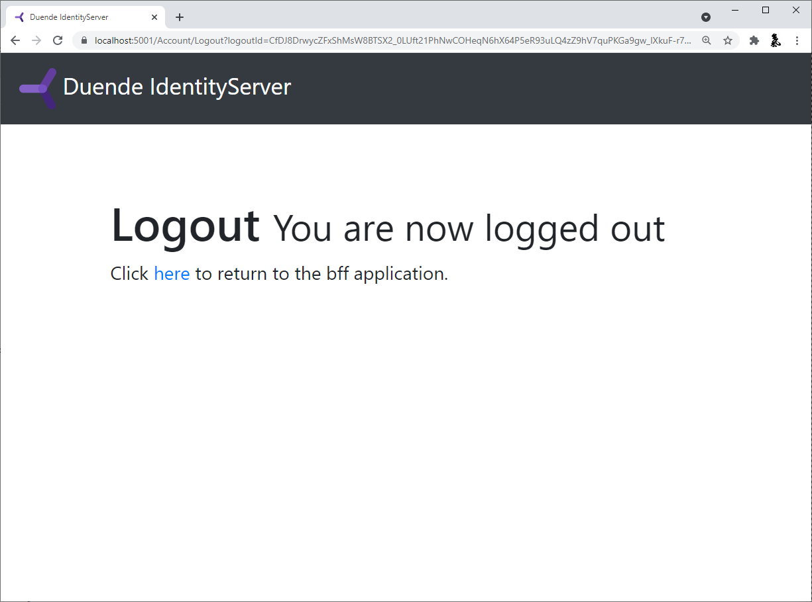

:::note

We recommend you do the quickstarts in order. If you'd like to start here, begin
from a copy of the [reference implementation of Quickstart 3](https://github.com/DuendeSoftware/Samples/tree/main/IdentityServer/v6/Quickstarts/3_AspNetCoreAndApis).
Throughout this quickstart, paths are written relative to the base *quickstart*
directory created in part 1, which is the root directory of the reference
implementation. You will also need to [install the IdentityServer templates](/identityserver/v6/quickstarts/0_overview#preparation).

:::

In this quickstart, you will build a browser-based JavaScript client application
with a backend. This means your application will have server-side code that
supports the frontend application code. This is known as the Backend For
Frontend (BFF) pattern. 

You will implement the BFF pattern with the help of the *Duende.BFF* library.
The backend will implement all of the security protocol interactions with the
token server and will be responsible for management of the tokens. The
client-side JavaScript authenticates with the BFF using traditional cookie
authentication. This simplifies the JavaScript in the client-side, and reduces
the attack surface of the application.

The features that will be shown in this quickstart will allow the user to login
with IdentityServer, invoke a local API hosted in the backend (secured with
cookie authentication), invoke a remote API running in a different host (secured
with an access token), and logout of IdentityServer.


## New Project for the JavaScript client and BFF

Begin by creating a new project to host the JavaScript application and its BFF.
A single project containing the front-end and its BFF facilitates cookie
authentication - the front end and BFF need to be on the same host so that
cookies will be sent from the front end to the BFF.

Create a new ASP.NET Core web application and add it to the solution by running
the following commands from the *src* directory:

```console
dotnet new web -n JavaScriptClient
cd ..
dotnet sln add ./src/JavaScriptClient/JavaScriptClient.csproj
```

### Add additional NuGet packages

Install NuGet packages to add BFF and OIDC support to the new project by running
the following commands from the *src/JavaScriptClient* directory:

```console
dotnet add package Microsoft.AspNetCore.Authentication.OpenIdConnect
dotnet add package Duende.BFF
dotnet add package Duende.BFF.Yarp
```

### Modify hosting

Modify the *JavaScriptClient* project to run on *https://localhost:5003*. Its
*Properties/launchSettings.json* should look like this:

```json
{
  "profiles": {
    "JavaScriptClient": {
      "commandName": "Project",
      "dotnetRunMessages": true,
      "launchBrowser": true,
      "applicationUrl": "https://localhost:5003",
      "environmentVariables": {
        "ASPNETCORE_ENVIRONMENT": "Development"
      }
    }
  }
}
```

### Add services

In the BFF pattern, the server-side code triggers and receives OpenID Connect
requests and responses. To do that, it needs the same services configured as the
WebClient did in the prior [web application quickstart](/identityserver/v6/quickstarts/3_api_access). Additionally, the BFF services need to be added with
*AddBff()*. 

Add the following to *src/JavaScriptClient/Program.cs*:

```cs
using System.IdentityModel.Tokens.Jwt;
using System.Security.Claims;
using Duende.Bff.Yarp;
using Microsoft.AspNetCore.Authorization;

var builder = WebApplication.CreateBuilder(args);

builder.Services.AddAuthorization();

builder.Services
    .AddBff()
    .AddRemoteApis();

JwtSecurityTokenHandler.DefaultMapInboundClaims = false;
builder.Services
    .AddAuthentication(options =>
    {
        options.DefaultScheme = "Cookies";
        options.DefaultChallengeScheme = "oidc";
        options.DefaultSignOutScheme = "oidc";
    })
    .AddCookie("Cookies")
    .AddOpenIdConnect("oidc", options =>
    {
        options.Authority = "https://localhost:5001";
        options.ClientId = "bff";
        options.ClientSecret = "secret";
        options.ResponseType = "code";
        options.Scope.Add("api1");
        options.SaveTokens = true;
        options.GetClaimsFromUserInfoEndpoint = true;
    });

var app = builder.Build();
```

### Add middleware

Similarly, the middleware pipeline for this application will resemble the
WebClient, with the addition of the BFF middleware and the BFF endpoints.
Continuing by adding the following to *src/JavaScriptClient/Program.cs*:

```cs
var app = builder.Build();

if (app.Environment.IsDevelopment())
{
    app.UseDeveloperExceptionPage();
}

app.UseDefaultFiles();
app.UseStaticFiles();

app.UseRouting();
app.UseAuthentication();

app.UseBff();

app.UseAuthorization();

app.UseEndpoints(endpoints =>
{
    endpoints.MapBffManagementEndpoints();
});

app.Run();
```

### Add your HTML and JavaScript files

Next, add HTML and JavaScript files for your client-side application to the
*wwwroot* directory in the *JavaScriptClient* project. Create that directory
(*src/JavaScriptClient/wwwroot*) and add an *index.html* and an *app.js* file to
it.

**index.html**

The index.html file will be the main page in your application. It contains
- buttons for the user to login, logout, and call the APIs
- a `<pre>` container used to show messages to the user
- a `<script>` tag to include our JavaScript file

It should look like this:

```html
<!DOCTYPE html>
<html>
<head>
    <meta charset="utf-8" />
    <title></title>
</head>
<body>
    <button id="login">Login</button>
    <button id="local">Call Local API</button>
    <button id="remote">Call Remote API</button>
    <button id="logout">Logout</button>

    <pre id="results"></pre>

    <script src="app.js"></script>
</body>
</html>
```

**app.js**

The app.js file will contain the client-side code for your application.

First, add a helper function to display messages in the `<pre>`:

```js
function log() {
  document.getElementById("results").innerText = "";

  Array.prototype.forEach.call(arguments, function (msg) {
    if (typeof msg !== "undefined") {
      if (msg instanceof Error) {
        msg = "Error: " + msg.message;
      } else if (typeof msg !== "string") {
        msg = JSON.stringify(msg, null, 2);
      }
      document.getElementById("results").innerText += msg + "\r\n";
    }
  });
}

```

Next, you can use the BFF *user* management endpoint to query if the user is
logged in or not. Notice the *userClaims* variable is global; it will be needed
elsewhere.

```js
let userClaims = null;

(async function () {
  var req = new Request("/bff/user", {
    headers: new Headers({
      "X-CSRF": "1",
    }),
  });

  try {
    var resp = await fetch(req);
    if (resp.ok) {
      userClaims = await resp.json();

      log("user logged in", userClaims);
    } else if (resp.status === 401) {
      log("user not logged in");
    }
  } catch (e) {
    log("error checking user status");
  }
})();
```

Next, register *click* event handlers on the buttons:

```js
document.getElementById("login").addEventListener("click", login, false);
document.getElementById("local").addEventListener("click", localApi, false);
document.getElementById("remote").addEventListener("click", remoteApi, false);
document.getElementById("logout").addEventListener("click", logout, false);
```

Next, implement the *login* and *logout* functions.

Login is simple - just redirect the user to the BFF *login* endpoint.

```js
function login() {
  window.location = "/bff/login";
}
```

Logout is more involved, as you need to redirect the user to the BFF *logout*
endpoint, which requires an anti-forgery token to prevent cross site request
forgery attacks. The *userClaims* that you populated earlier contain that token
and the full logout URL in its *bff:logout_url* claim, so redirect to that url:

```
function logout() {
  if (userClaims) {
    var logoutUrl = userClaims.find(
      (claim) => claim.type === "bff:logout_url"
    ).value;
    window.location = logoutUrl;
  } else {
    window.location = "/bff/logout";
  }
}
```

Finally, add empty stubs for the other button event handler functions. 
You will implement those after you get login and logout working.

```js
async function localApi() {
}

async function remoteApi() {
}
```

## Add a client registration to IdentityServer for the JavaScript client

Now that the client application is ready to go, you need to define a
configuration entry in IdentityServer for the new JavaScript client.

In the IdentityServer project locate the client configuration in
*src/IdentityServer/Config.cs*. Add a new *Client* to the list for your new
JavaScript application. Because this client uses the BFF pattern, the
configuration will be very similar to the Web client. It should have the
configuration listed below:

```cs
// JavaScript BFF client
new Client
{
    ClientId = "bff",
    ClientSecrets = { new Secret("secret".Sha256()) },

    AllowedGrantTypes = GrantTypes.Code,
    
    // where to redirect to after login
    RedirectUris = { "https://localhost:5003/signin-oidc" },

    // where to redirect to after logout
    PostLogoutRedirectUris = { "https://localhost:5003/signout-callback-oidc" },

    AllowedScopes = new List<string>
    {
        IdentityServerConstants.StandardScopes.OpenId,
        IdentityServerConstants.StandardScopes.Profile,
        "api1"
    }
}
```

## Run and test login and logout

At this point, you should be able to run the *JavaScriptClient* application.
You should see that the user is not logged in initially.


When you click the login button, you'll be redirected to IdentityServer to
login. After you login, you'll be redirected back to the *JavaScriptClient*
application, where you'll be signed into the Cookies authentication scheme with
your tokens saved in the session.

The app loads again, but this time it has a session cookie. So,
when it makes the HTTP request to get userClaims, that cookie is included in the
request. This allows the BFF middleware to authenticate the user and return user
info. Once the *JavaScriptClient* application receives the response, the user
should appear logged in and their claims should be displayed.
 


Finally, the logout button should successfully get the user logged out.




## Add API support

Now that you have login and logout working, you will add support to invoke both
local and remote APIs.

A local API is an endpoint that is hosted in the same backend as the
*JavaScriptClient* application. Local APIs are intended to be APIs that only
exist to support the JavaScript frontend, typically by providing UI specific
data or aggregating data from other sources. Local APIs are authenticated with
the user's session cookie.

A remote API is an API running in some other host than the *JavaScriptClient*
application. This is useful for APIs that are shared by many different
applications (e.g. mobile app, other web apps, etc). Remote APIs are
authenticated with an access token. Fortunately, the *JavaScriptClient*
application has an access token stored in the user's session. You will use the
BFF proxy feature to accept a call from the JavaScript running in the browser
authenticated with the user's session cookie, retrieve the access token for the
user from the user's session, and then proxy the call to the remote API, sending
the access token for authentication.

### Define a local API

Local APIs can be defined using controllers or with [Minimal API Route
Handlers](https://docs.microsoft.com/en-us/aspnet/core/fundamentals/minimal-apis?view=aspnetcore-6.0#route-handlers).
For simplicity, this quickstart uses a minimal API with its handler defined
directly in *Program.cs*, but you can organize your Local APIs however you like.

Add a handler to *src/JavaScriptClient/Program.cs* for the the local API:
```cs
[Authorize] 
static IResult LocalIdentityHandler(ClaimsPrincipal user)
{
    var name = user.FindFirst("name")?.Value ?? user.FindFirst("sub")?.Value;
    return Results.Json(new { message = "Local API Success!", user = name });
}

```

:::note

Local APIs often make requests to remote APIs that are authorized with the
user's access token. To get the access token, call the *GetUserAccessTokenAsync*
extension method on the *HttpContext*. For example: *var token = await
HttpContext.GetUserAccessTokenAsync();*

:::

### Update routing to accept local and remote API calls

Next, you need to register both the local API and the BFF proxy for the remote
API in the ASP.NET Core routing system. Add the code below to the *UseEndpoints*
call in *src/JavaScriptClient/Program.cs*.

```cs
app.UseEndpoints(endpoints =>
{
    endpoints.MapBffManagementEndpoints();

    // Uncomment this for Controller support
    // endpoints.MapControllers()
    //     .AsBffApiEndpoint();

    endpoints.MapGet("/local/identity", LocalIdentityHandler)
        .AsBffApiEndpoint();

    endpoints.MapRemoteBffApiEndpoint("/remote", "https://localhost:6001")
        .RequireAccessToken(Duende.Bff.TokenType.User);

});
```
The call to the *AsBffApiEndpoint()* fluent helper method adds BFF support to
the local APIs. This includes anti-forgery protection as well as suppressing
login redirects on authentication failures and instead returning 401 and 403
status codes under the appropriate circumstances.

*MapRemoteBffApiEndpoint()* registers the BFF proxy for the remote API and
configures it to pass the user's access token.

### Call the APIs from JavaScript

Back in *src/JavaScriptClient/wwwroot/app.js*, implement the two API button
event handlers like this:

```js
async function localApi() {
  var req = new Request("/local/identity", {
    headers: new Headers({
      "X-CSRF": "1",
    }),
  });

  try {
    var resp = await fetch(req);

    let data;
    if (resp.ok) {
      data = await resp.json();
    }
    log("Local API Result: " + resp.status, data);
  } catch (e) {
    log("error calling local API");
  }
}

async function remoteApi() {
  var req = new Request("/remote/identity", {
    headers: new Headers({
      "X-CSRF": "1",
    }),
  });

  try {
    var resp = await fetch(req);

    let data;
    if (resp.ok) {
      data = await resp.json();
    }
    log("Remote API Result: " + resp.status, data);
  } catch (e) {
    log("error calling remote API");
  }
}
```

The path for the local API is exactly what you set in the the call to *MapGet*
in *src/JavaScriptClient/Program.cs*. 

The path for the remote API uses a "/remote" prefix to indicate that the BFF
proxy should be used, and the remaining path is what's then passed when invoking
the remote API ("/identity" in this case). 

Notice both API calls require a *'X-CSRF': '1'* header, which acts as the
anti-forgery token.

:::note

See the [client credentials quickstart](/identityserver/v6/quickstarts/1_client_credentials) for information on how to create the
remote API used in the code above. 

:::

## Run and test the API calls

At this point, you should be able to run the *JavaScriptClient* application and
invoke the APIs. The local API should return something like this:


And the remote API should return something like this:


You now have the start of a JavaScript client application that uses
IdentityServer for sign-in, sign-out, and authenticating calls to local and
remote APIs, using *Duende.BFF*.