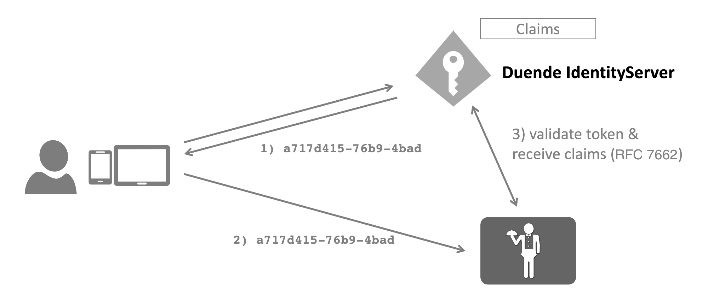

When using reference tokens, Duende IdentityServer stores the contents of the token in the [persisted grant](/identityserver/v6/data/operational/grants) store and issues a unique identifier for this token back to the client.

The consumer of the token must use the [introspection](/identityserver/v6/reference/endpoints/introspection) endpoint to validate the token.



You can set the token type of a client using the following client setting:

```cs
client.AccessTokenType = AccessTokenType.Reference;
```

## Enabling an API to consume reference tokens
The introspection endpoint requires authentication - since the client of an introspection endpoint is typically an API, you configure the secret on the *ApiResource*:

```cs
    var api = new ApiResource("api1")
    {
        ApiSecrets = { new Secret("secret".Sha256()) }
        Scopes = { "read", "write" }
    }
```