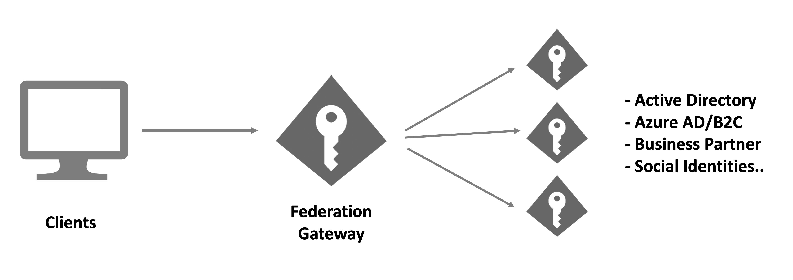

Federation means that your IdentityServer offers authentication methods that use external authentication providers.

If you offer a number of these external authentication methods, often the term *Federation Gateway* is used to describe this architectural approach.

Generally, this architecture allows shielding your client applications from the complexities of your authentication workflows and business requirements that go along with them.

Your clients only need to trust the gateway, and the gateway coordinates all the communication and trust relationships with the external providers. This might involve switching between different protocols, token types, claim types etc. Also, the gateway can make sure that all claims and identities that ultimately arrive at the client applications are trustworthy and in a format that the client expects.

There are a number of scenarios where this approach is commonly used.

#### Multiple authentication methods for users
Maybe your users should have multiple options how they can sign-in/up, e.g.

* username/password or a commercial provider like Google or Microsoft Account
* username/password or a commercial provider for customers, and Active Directory or Azure AD for employees

#### Integration of on-premise products with customer identity systems
If you are building on-premise products, you have to integrate with a multitude of customer authentication systems. Maintaining variations of your business software for each product you have to integrate with, makes your software hard to maintain.

With a federation gateway, you only need to adapt to these external systems at the gateway level, all of your business applications are shielded from the technical details.

#### Software-as-a-Service
It's very common to offer federation with your customers' authentication systems in SaaS scenarios. This way your customers get single-sign-on to your applications without having to explicitly create accounts in your identity system.

### Support for external authentication methods
IdentityServer leverages the ASP.NET Core authentication infrastructure for communicating with external providers. This means that every authentication system that is supported by ASP.NET Core, can also be used in the context of IdentityServer. This includes support for commercial providers like Google, GitHub or LinkedIn (and [many more](https://github.com/aspnet-contrib/AspNet.Security.OAuth.Providers)) and any OpenID Connect, SAML2p or WS-Federation based systems.

See the [Integrating with External Providers](/identityserver/v6/ui/login/external) section for more details.

### Home Realm Discovery
The process of selecting the "best" authentication workflow for a user (especially when you have multiple authentication methods) is called Home Realm Discovery (or HRD for short).

Since users are typically anonymous when they arrive at the gateway, you need some sort of hint to optimize the login workflow, e.g.

* you present a list of available authentication methods to the user. This might work for simpler scenarios, but probably not if you have a lot of choices or if this would reveal your customers' authentication systems
* you ask the user for an identifier (e.g. email address) and have a way to infer the right external authentication method from that id. This is a common technique for SaaS systems.
* the client application can give a hint to the gateway via a custom protocol parameter of IdentityServer's built-in support for the *idp* parameter on *acr_values*. In some case the client already knows the right authentication method, e.g. when your customers access your software via a customer-specific URL  (see [here](/identityserver/v6/reference/endpoints/authorize#optional-parameters)).
* you restrict the available authentication methods per client in the client configuration using the *IdentityProviderRestrictions* property (see [here](/identityserver/v6/reference/models/client#authentication--session-management))

Every system is slightly different. Always start with the desired user experience, and then choose from the above options (or combinations) to implement the required flow.
