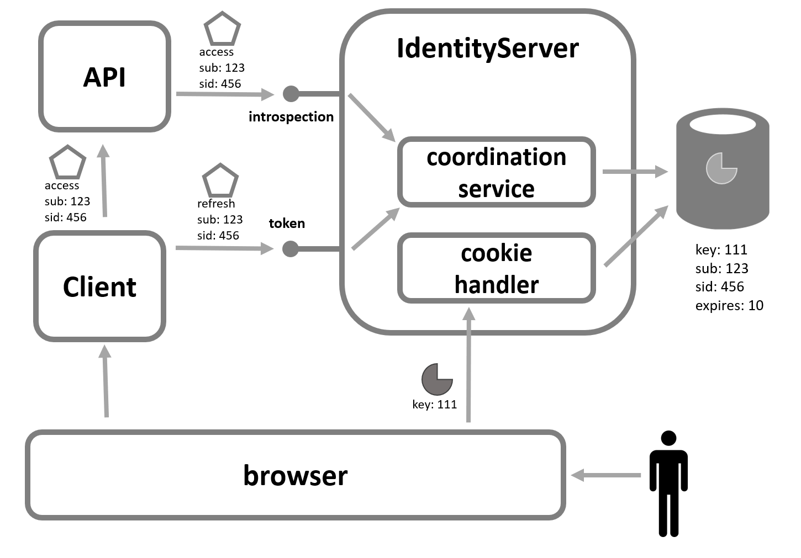
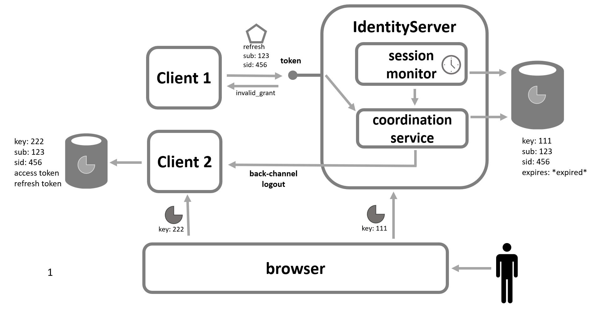

A common requirement in several industries is the concept of a system-wide "inactivity timeout".
The expectation is that if a user is active in the system, then their authentication session should continue to be active.
But if the user were to be inactive for some amount of time (e.g. after walking away from their computer), then this inactivity should cause the user to be logged out of the entire system.

Unfortunately, the OpenID Connect protocol is primarily focused with signing users into applications, not distributed session management due to user inactivity.
What makes this difficult to achieve is that there are many different artifacts from the protocol each with their own expiration (e.g. cookies, refresh tokens, and access tokens).
Also, different entities in the system have control over the lifetime and renewal of these artifacts.
Coordinating all of their expirations to become invalid at the same time is not trivial.

Despite the protocol not providing a formal solution to this requirement, it is still possible to achieve this while using features of the protocols and not resorting to the use of custom, out-of-band techniques.

## Design

To achieve the goal of distributed session management, there must be a single record tracking the user's session.
Using server-side sessions at IdentityServer provides this central location to monitor user activity and track session expiration.

### User Activity Monitoring

As a user is active interactively at IdentityServer, the session's expiration will be extended given the normal cookie authentication handler mechanics of ASP.NET Core.
Most of the time, though, a user is active at the client applications, not at IdentityServer.
This makes it difficult for the session at IdentityServer to be extended.

Fortunately as a user uses a client application, it's common for that client to make server to server protocol invocations back to IdentityServer on behalf of the user (e.g. with the refresh token).
These invocations can be used as the signal to the server-side session management at IdentityServer that the user is still active, and thus can be used to extend the session.

In addition to refresh tokens, any client activity using an access token that originated from the user's session could also be used to extend the user's server-side session at IdentityServer.
This would only work if IdentityServer were aware of this activity, but userinfo and introspection endpoint requests are examples of those types of activity.

Internally IdentityServer provides a *ISessionCoordinationService* which is invoked from the endpoints describes above. 
Its purpose is to then extend the lifetime of the server-side session. 
Below is a picture of the various types of requests to do this:

### User Inactivity Detection and Session Termination

When the user becomes inactive, the server-side session management system at IdentityServer can detect and remove the abandoned session.
When this happens, the *ISessionCoordinationService* provides another operation to perform any client related cleanup for the session.
This could invoke back-channel logout for any client the user has logged into during their session, or this could revoke any grants in the [operational store](/identityserver/v6/data/operational/grants) issued during the user's session.

Clients that receive back-channel logout would know the user's session has ended, and can cleanup appropriately.
But if back-channel is not used, then the client would need some other signal to consider the user's session has ended.
The obvious signal would be if the refresh token request failed, then that would be an appropriate signal that the user's session has also ended.

Given this understanding, client applications can participate in this convention and IdentityServer can coordinate to achieve this system-wide "inactivity timeout" requirement.

## Configuration

Configuration is needed in both IdentityServer and client applications.

### IdentityServer

To prepare IdentityServer, these features need to be enabled:

1. Server-side sessions need to be [enabled](/identityserver/v6/ui/server_side_sessions#enabling-server-side-sessions).
1. Either the global [*CoordinateClientLifetimesWithUserSession* option](/identityserver/v6/reference/options#authentication) should be enabled, or the client-specific [*CoordinateLifetimeWithUserSession* option](/identityserver/v6/reference/models/client#authentication--session-management) should be enabled.
1. Enable back-channel logout for [session expiration](/identityserver/v6/ui/server_side_sessions#session-expiration) with the [*ExpiredSessionsTriggerBackchannelLogout* option](/identityserver/v6/reference/options#server-side-sessions).

### Client Applications

Depending on what protocol features the client is using, different approaches will need to be taken.
The two main actions a client must take are to 1) notify IdentityServer of the user's activity, and 2) detect user inactivity at IdentityServer and terminate the user's session in the client.

#### Clients with Refresh Tokens

As the client uses the refresh token at IdentityServer, the user's session expiration will be extended.
Be sure to configure the access token lifetime to be less than the server-side session lifetime at IdentityServer.

To detect inactivity:
* Either handle refresh token request failure, and consider the session ended.
* Or implement back-channel logout.

#### Clients with Reference Access Tokens but without Refresh Tokens

It's possible a client is using a [reference access token](/identityserver/v6/tokens/reference) and no refresh token.
The API would then use introspection to validate the token, which would then extend the associated user's session at IdentityServer.

To detect inactivity: 
* Either handle 401 errors from the API, and then consider the session ended.
* Or implement back-channel logout.

#### Clients without Access Tokens

Clients without access tokens have no way to notify IdentityServer that the user is still active.
But they can implement back-channel logout to be notified that the user's session has ended.

