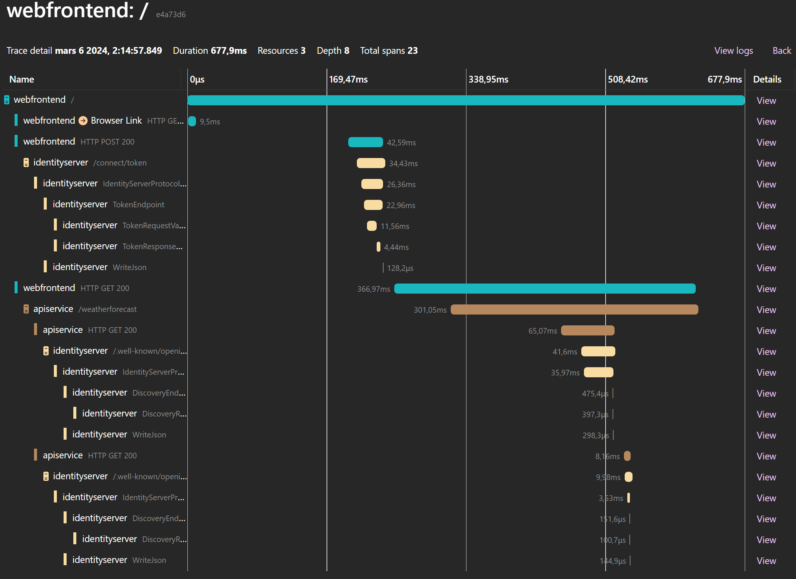

(added in v6.1, expanded in v7.0)

[OpenTelemetry](https://opentelemetry.io) is a collection of tools, APIs, and SDKs for generating and collecting
telemetry data (metrics, logs, and traces). This is very useful for analyzing software performance and behavior, 
especially in highly distributed systems.

.NET 8 comes with first class support for Open Telemetry. IdentityServer emits traces, metrics and logs.

#### [*`Metrics`*](metrics)
Metrics are high level statistic counters. They provide an aggregated overview and can be used to set monitoring rules.

#### *`Logs`*
OpenTelemetry in .NET 8 exports the logs written to the standard ILogger system. The logs are augmented with
trace ids to be able to correlate log entries with traces.

#### [*`Traces`*](traces)
Traces shows individual requests and dependencies. The output is very useful for visualizing the control 
flow and finding performance bottlenecks.

This is an example of distributed traces from a web application calling an API (displayed using our 
[Aspire sample](../../samples/diagnostics)). The web application uses a refresh token to call IdentityServer to get a new access token and then calls the API. The API reads the discovery endpoint, finds the jwks url and then gets the keys from jwks endpoint.

