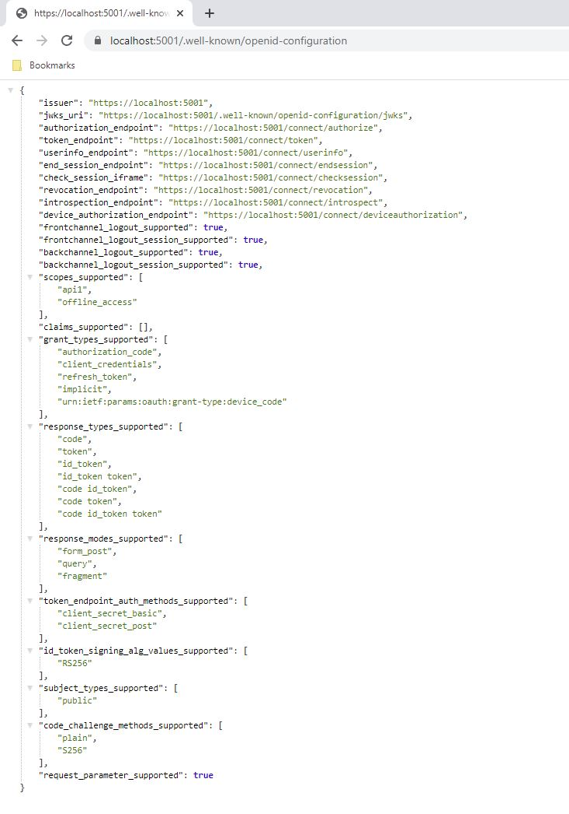
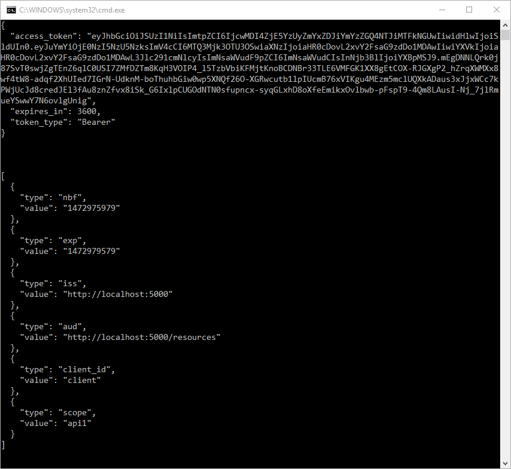

Welcome to the first quickstart for IdentityServer! To see the full list of
quickstarts, please see [Quickstarts Overview](0_overview).

This first quickstart provides step-by-step instructions to set up
IdentityServer in the most basic scenario: protecting APIs for server-to-server
communication. You will create a solution containing three projects:

- An Identity Server
- An API that requires authentication
- A client that accesses that API

The client will request an access token from IdentityServer using its
client ID and secret and then use the token to gain access to the API.

## Source Code

Finished source code for each quickstart in this series is available in the
[Samples](https://github.com/DuendeSoftware/Samples/tree/main/IdentityServer/v7/Quickstarts) repository, and a reference
implementation of
this quickstart is
available [here](https://github.com/DuendeSoftware/Samples/tree/main/IdentityServer/v7/Quickstarts/1_ClientCredentials).

## Video

In addition to the written steps below there's also a YouTube video available:

<iframe width="853" height="505" src="https://www.youtube.com/embed/3-1QY8s2C9k" title="YouTube video player" frameborder="0" allow="accelerometer; autoplay; clipboard-write; encrypted-media; gyroscope; picture-in-picture; web-share" referrerpolicy="strict-origin-when-cross-origin" allowfullscreen></iframe>

## Preparation

The IdentityServer templates for the dotnet CLI are a good starting point for
the quickstarts. To install the templates open a console window and type the
following command:

```console
dotnet new install Duende.Templates
```

:::note
You may have a previous version of Duende templates (`Duende.IdentityServer.Templates`) installed on your machine.
Please uninstall the template package and install the latest version.
:::

## Create the Solution and IdentityServer Project

In this section, you will create a directory for the solution and use the
`isempty` (IdentityServer Empty) template to create an ASP.NET Core application
that includes a basic IdentityServer setup.

Back in the console, run the following commands to create the directory
structure for the solution.

```console
mkdir quickstart
cd quickstart
mkdir src
dotnet new sln -n Quickstart
```

This will create a quickstart directory that will serve as the root of the
solution, a src subdirectory to hold your source code, and a solution file to
organize your projects. Throughout the rest of the quickstart series, paths will
be written relative to to the quickstart directory.

From the new quickstart directory, run the following commands to use the isempty
template to create a new project. The template creates a web project named
IdentityServer with the IdentityServer package installed and minimal
configuration added for it.

```console
cd src
dotnet new isempty -n IdentityServer
```

This will create the following files within a new `src/IdentityServer` directory:

- `Properties/launchSettings.json` file - launch profile
- `appsettings.json` - run time settings
- `Config.cs` - definitions for [resources](/identityserver/v7/overview/terminology#resources) and
  [clients](/identityserver/v7/overview/terminology#client) used by IdentityServer
- `HostingExtensions.cs` - configuration for ASP.NET pipeline and services
  Notably, the IdentityServer services are configured here and the
  IdentityServer middleware is added to the pipeline here.
- `IdentityServer.csproj` - project file with the IdentityServer NuGet package
  added
- `Program.cs` - main application entry point

:::note

The `src/IdentityServer/Properties/launchSettings.json` file created by the
`isempty` template sets the `applicationUrl` to `https://localhost:5001`. You
can change the port that your IdentityServer host listens on by changing the
port in this url. This url also sets the protocol (http or https) that the
IdentityServer host will use. In production scenarios you should always use
`https`.

:::

Next, add the IdentityServer project to the solution. Back in the console,
navigate up to the quickstart directory and add the IdentityServer project to
the solution.

```console
cd ..
dotnet sln add ./src/IdentityServer
```

### Defining an API Scope

Scope is a core feature of OAuth that allows you to express the extent or scope
of access. Clients request scopes when they initiate the protocol, declaring
what scope of access they want. IdentityServer then has to decide which scopes
to include in the token. Just because the client has asked for something doesn't
mean they should get it! There are built-in abstractions as well as
extensibility points that you can use to make this decision. Ultimately,
IdentityServer issues a token to the client, which then uses the token to access
APIs. APIs can check the scopes that were included in the token to make
authorization decisions.

Scopes don't have structure imposed by the protocols - they are just
space-separated strings. This allows for flexibility when designing the scopes
used by a system. In this quickstart, you will create a scope that represents
complete access to an API that will be created later in this quickstart.

Scope definitions can be loaded in many ways. This quickstart shows how to use a
"code as configuration" approach. A minimal Config.cs was created by the
template at `src/IdentityServer/Config.cs`. Open it and add an `ApiScope` to the
`ApiScopes` property:

```csharp
public static IEnumerable<ApiScope> ApiScopes =>
    new ApiScope[]
    {
        new ApiScope(name: "api1", displayName: "My API") 
    };
```

See the full
file [here](https://github.com/DuendeSoftware/Samples/tree/main/IdentityServer/v7/Quickstarts/1_ClientCredentials/src/IdentityServer/Config.cs).

:::note

In production it is important to give your API a useful name and display name.
Use these names to describe your API in simple terms to both developers and
users. Developers will use the name to connect to your API, and end users will
see the display name on consent screens, etc.

:::

### Defining the client {#define-client}

The next step is to configure a client application that you will use to access
the API. You'll create the client application project later in this quickstart.
First, you'll add configuration for it to your IdentityServer project.

In this quickstart, the client will not have an interactive user and will
authenticate with IdentityServer using a client secret.

Add this client definition to `Config.cs`:

```cs
public static IEnumerable<Client> Clients =>
    new Client[]
    
    {
        new Client
        {
            ClientId = "client",

            // no interactive user, use the clientid/secret for authentication
            AllowedGrantTypes = GrantTypes.ClientCredentials,

            // secret for authentication
            ClientSecrets =
            {
                new Secret("secret".Sha256())
            },

            // scopes that client has access to
            AllowedScopes = { "api1" }
        }
    };
```

Again, see the full file
[here](https://github.com/DuendeSoftware/Samples/tree/main/IdentityServer/v7/Quickstarts/1_ClientCredentials/src/IdentityServer/Config.cs).

Clients can be configured with many options. Your minimal machine-to-machine
client here contains:

- A ClientId, which identifies the application to IdentityServer so that it
  knows which client is trying to connect to it.
- A Secret, which you can think of as the password for the client.
- The list of scopes that the client is allowed to ask for. Notice that the
  allowed scope here matches the name of the ApiScope above.

### Configuring IdentityServer

The scope and client definitions are loaded in
[HostingExtensions.cs](https://github.com/DuendeSoftware/Samples/tree/main/IdentityServer/v7/Quickstarts/1_ClientCredentials/src/IdentityServer/HostingExtensions.cs).
The template created a ConfigureServices method there that is already loading
the scopes and clients. You can take a look to see how it is done. Note that the
template adds a few things that are not used in this quickstart. Here's the
minimal ConfigureServices method that is needed:

```csharp
public static WebApplication ConfigureServices(this WebApplicationBuilder builder)
{
    builder.Services.AddIdentityServer()
        .AddInMemoryApiScopes(Config.ApiScopes)
        .AddInMemoryClients(Config.Clients);

    return builder.Build();
}
```

That's it - your IdentityServer is now configured. If you run the project and
then navigate to `https://localhost:5001/.well-known/openid-configuration` in
your browser, you should see the [discovery document](/identityserver/v7/reference/endpoints/discovery).
The discovery document is a standard endpoint in
[OpenID Connect](https://openid.net/specs/openid-connect-discovery-1_0.html) and
[OAuth](https://datatracker.ietf.org/doc/html/rfc8414). It is
used by your clients and APIs to retrieve configuration data needed to request
and validate tokens, login and logout, etc.



:::note

On first startup, IdentityServer will use its automatic key management feature
to create a signing key and store it in the `src/IdentityServer/keys` directory.
To avoid accidentally disclosing cryptographic secrets, the entire `keys`
directory should be excluded from source control. It will be recreated if it is
not present.

:::

## Create an API Project

Next, add an API project to your solution. This API will serve protected
resources that will be secured by IdentityServer.

You can either use the ASP.NET Core Web API template from Visual Studio or use
the .NET CLI to create the API project. To use the CLI, run the
following commands:

```console
cd src
dotnet new webapi -n Api --no-openapi
```

Then navigate back up to the root quickstart directory and add it to the
solution by running the following commands:

```console
cd ..
dotnet sln add ./src/Api
```

### Add JWT Bearer Authentication

Now you will add JWT Bearer Authentication to the API's ASP.NET pipeline. The
goal is to authorize calls to your API using tokens issued by the IdentityServer
project. To that end, you will add authentication middleware to the pipeline
from the `Microsoft.AspNetCore.Authentication.JwtBearer` NuGet package. This
middleware will:

- Find and parse a JWT sent with incoming requests as an *Authorization: Bearer*
  header.
- Validate the JWT's signature to ensure that it was issued by IdentityServer.
- Validate that the JWT is not expired.

Run this command to add the middleware
package to the API:

```console
dotnet add ./src/Api package Microsoft.AspNetCore.Authentication.JwtBearer
```

Now add the authentication and authorization services to the Service Collection, and
configure the JWT Bearer authentication provider as the default
[Authentication Scheme](https://docs.microsoft.com/en-us/aspnet/core/security/authentication/?view=aspnetcore-8.0#authentication-scheme).

```csharp
builder.Services.AddAuthentication()
    .AddJwtBearer(options =>
    {
        options.Authority = "https://localhost:5001";
        options.TokenValidationParameters.ValidateAudience = false;
    });

builder.Services.AddAuthorization();
```

:::note

Audience validation is disabled here because access to the api is modeled with
`ApiScopes` only. By default, no audience will be emitted unless the api is
modeled with `ApiResources` instead. See
[here](/identityserver/v7/apis/aspnetcore/jwt#adding-audience-validation) for a
more in-depth discussion.

:::

### Add an endpoint

Replace the templated weather forecast endpoint with a new endpoint:

```csharp
app.MapGet("identity", (ClaimsPrincipal user) => user.Claims.Select(c => new { c.Type, c.Value }))
    .RequireAuthorization();
```

This endpoint will be used to test authorization and to display the claims identity
through the eyes of the API.

### Configure API to listen on Port 6001

Configure the API to run on `https://localhost:6001` only. You can do this by
editing the
[launchSettings.json](https://github.com/DuendeSoftware/Samples/tree/main/IdentityServer/v7/Quickstarts/1_ClientCredentials/src/Api/Properties/launchSettings.json)
file in the `src/Api/Properties` directory. Change these settings for the `https` profile:

```json
"launchUrl": "identity",
"applicationUrl": "https://localhost:6001",
```

### Test the identity endpoint

Run the API project using the `https` profile and then navigate to the identity controller at
`https://localhost:6001/identity` in a browser. This should return a 401 status
code, which means your API requires a credential and is now protected by
IdentityServer.

## Create the client project

The last step is to create a client that requests an access token and then uses
that token to access the API. Your client will be a console project in your
solution. Run the following commands:

```console
cd src
dotnet new console -n Client
```

Then as before, add it to your solution using:

```console
cd ..
dotnet sln add ./src/Client
```

### Add the IdentityModel NuGet package

The token endpoint at IdentityServer implements the OAuth protocol, and you
could use raw HTTP to access it. However, we have a client library called
IdentityModel that encapsulates the protocol interaction in an easy to use API.

Add the *Duende.IdentityModel * NuGet package to your client by running the following command:

```console
dotnet add ./src/Client package Duende.IdentityModel 
```

### Retrieve the discovery document

IdentityModel includes a client library to use with the discovery endpoint. This
way you only need to know the base address of IdentityServer - the actual
endpoint addresses can be read from the metadata. Add the following to the
client's Program.cs in the `src/Client/Program.cs` directory:

```cs
using IdentityModel.Client;

// discover endpoints from metadata
var client = new HttpClient();
var disco = await client.GetDiscoveryDocumentAsync("https://localhost:5001");
if (disco.IsError)
{
    Console.WriteLine(disco.Error);
    Console.WriteLine(disco.Exception);
    return 1;
}
```

:::note

If you get an error connecting, it may be that the development certificate for `localhost`
is not trusted. You can run *dotnet dev-certs https --trust* in order to trust the
development certificate. This only needs to be done once.

:::

### Request a token from IdentityServer

Next you can use the information from the discovery document to request a token
from `IdentityServer` to access `api1`:

```cs
// request token
var tokenResponse = await client.RequestClientCredentialsTokenAsync(new ClientCredentialsTokenRequest
{
    Address = disco.TokenEndpoint,
    ClientId = "client",
    ClientSecret = "secret",
    Scope = "api1"
});

if (tokenResponse.IsError)
{
    Console.WriteLine(tokenResponse.Error);
    Console.WriteLine(tokenResponse.ErrorDescription);
    return 1;
}

Console.WriteLine(tokenResponse.AccessToken);
```

:::note

Copy and paste the access token from the console to [jwt.ms](https://jwt.ms) to
inspect the raw token.

:::

### Calling the API

To send the access token to the API you typically use the HTTP Authorization
header. This is done using the `SetBearerToken` extension method:

```cs
// call api
var apiClient = new HttpClient();
apiClient.SetBearerToken(tokenResponse.AccessToken!); // AccessToken is always non-null when IsError is false

var response = await apiClient.GetAsync("https://localhost:6001/identity");
if (!response.IsSuccessStatusCode)
{
    Console.WriteLine(response.StatusCode);
    return 1;
}

var doc = JsonDocument.Parse(await response.Content.ReadAsStringAsync()).RootElement;
Console.WriteLine(JsonSerializer.Serialize(doc, new JsonSerializerOptions { WriteIndented = true }));
return 0;
```

The completed `Program.cs` file can be
found [here](https://github.com/DuendeSoftware/Samples/tree/main/IdentityServer/v7/Quickstarts/1_ClientCredentials/src/Client/Program.cs).

To test the flow, start the IdentityServer and API projects. Once they are
running, run the Client project.

The output should look like this:



If you're using Visual Studio, here's how to start everything up:

1. Right click the solution and select *Configure Startup Projects...*
2. Choose *Multiple Startup Projects* and set the action for Api and IdentityServer to Start
3. Run the solution and wait a moment for both the API and and IdentityServer to start
4. Right click the `Client` project and select Debug -> Start Without Debugging.

:::note

By default an access token will contain claims about the
scope, lifetime (nbf and exp), the client ID (client_id) and the issuer name
(iss).

:::

#### Authorization at the API

Right now, the API accepts any access token issued by your IdentityServer. In
this section, you will add an [Authorization
Policy](https://docs.microsoft.com/en-us/aspnet/core/security/authorization/policies?view=aspnetcore-8.0)
to the API that will check for the presence of the "api1" scope in the access
token. The protocol ensures that this scope will only be in the token if the
client requests it and IdentityServer allows the client to have that scope. You
configured IdentityServer to allow this access by [including it in the
allowedScopes property](#define-client).
Add the following to the `Program.cs` file of the API:

```cs
builder.Services.AddAuthorization(options =>
{
    options.AddPolicy("ApiScope", policy =>
    {
        policy.RequireAuthenticatedUser();
        policy.RequireClaim("scope", "api1");
    });
});
```

You can now enforce this policy at various levels, e.g.:

- globally
- for all endpoints
- for specific controllers, actions, or endpoints

Add the policy to the identity endpoint in `src/Api/Program.cs`:

```cs
app.MapGet("identity", (ClaimsPrincipal user) => user.Claims.Select(c => new { c.Type, c.Value }))
    .RequireAuthorization("ApiScope");
```

Now you can run the API again and it will enforce that the api1 scope is present in the
access token.

## Further experiments

This quickstart focused on the success path:

- The client was able to request a token.
- The client could use the token to access the API.

You can now try to provoke errors to learn how the system behaves, e.g.:

- Try to connect to IdentityServer when it is not running (unavailable).
- Try to use an invalid client id or secret to request the token.
- Try to ask for an invalid scope during the token request.
- Try to call the API when it is not running (unavailable).
- Don't send the token to the API.
- Configure the API to require a different scope than the one in the token.
