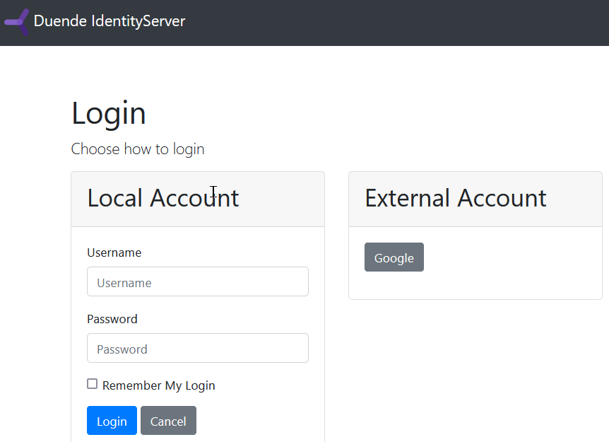

Welcome to Quickstart 2 for Duende IdentityServer!

In this quickstart, you will add support for interactive user authentication via
the OpenID Connect protocol to the IdentityServer you built in [Quickstart
1](/identityserver/v7/quickstarts/1_client_credentials). Once that is in place, you will create
an ASP.NET Razor Pages application that will use IdentityServer for
authentication.

:::note

We recommend you do the quickstarts in order. If you'd like to start here, begin
from a copy of
the [reference implementation of Quickstart 1](https://github.com/DuendeSoftware/Samples/tree/main/IdentityServer/v7/Quickstarts/1_ClientCredentials).
Throughout this quickstart, paths are written relative to the base `quickstart`
directory created in part 1, which is the root directory of the reference
implementation. You will also need to [install the IdentityServer templates](/identityserver/v7/quickstarts/0_overview#preparation).

:::

## Video

In addition to the written steps below there's also a YouTube video available:

<iframe width="853" height="505" src="https://www.youtube.com/embed/4aYj4xb7_Cg" title="YouTube video player" frameborder="0" allow="accelerometer; autoplay; clipboard-write; encrypted-media; gyroscope; picture-in-picture; web-share" referrerpolicy="strict-origin-when-cross-origin" allowfullscreen></iframe>

## Enable OIDC in IdentityServer

To enable OIDC in IdentityServer you need:

- An interactive UI
- Configuration for OIDC scopes
- Configuration for an OIDC client
- Users to log in with

### Add the UI

Support for the OpenID Connect protocol is already built into IdentityServer.
You need to provide the User Interface for login, logout, consent and error.

While the look & feel and workflows will differ in each implementation, we
provide a Razor Pages-based UI that you can use as a starting point. You can use
the .NET CLI to add the quickstart UI to a project. Run the following command
from the `src/IdentityServer` directory:

```console
dotnet new isui
```

### Enable the UI

Once you have added the UI, you will need to register its services and enable it
in the pipeline. In `src/IdentityServer/HostingExtensions.cs` you will find
commented out code in the `ConfigureServices` and `ConfigurePipeline` methods
that enable the UI. Note that there are three places to comment in - two in
`ConfigurePipeline` and one in `ConfigureServices`.

:::note

There is also a template called `isinmem` which combines the basic
IdentityServer from the `isempty` template with the quickstart UI from the
`isui` template.

:::

Comment in the service registration and pipeline configuration, run the
`IdentityServer` project, and navigate to https://localhost:5001. You should now
see a home page.

Spend some time reading the pages and models, especially those in the
`src/IdentityServer/Pages/Account` directory. These pages are the main UI entry
points for login and logout. The better you understand them, the easier it will
be to make future modifications.

### Configure OIDC Scopes

Similar to OAuth, OpenID Connect uses scopes to represent something you want to
protect and that clients want to access. In contrast to OAuth, scopes in OIDC
represent identity data like user id, name or email address rather than APIs.

Add support for the standard `openid` (subject id) and `profile` (first name,
last name, etc) scopes by declaring them in `src/IdentityServer/Config.cs`:

```cs
public static IEnumerable<IdentityResource> IdentityResources =>
    new IdentityResource[]
    {
        new IdentityResources.OpenId(),
        new IdentityResources.Profile(),
    };
```

Then register the identity resources in
`src/IdentityServer/HostingExtensions.cs`:

```cs
builder.Services.AddIdentityServer()
    .AddInMemoryIdentityResources(Config.IdentityResources)
    .AddInMemoryApiScopes(Config.ApiScopes)
    .AddInMemoryClients(Config.Clients);
```

:::note

All standard scopes and their corresponding claims can be found in the OpenID
Connect
[specification](https://openid.net/specs/openid-connect-core-1_0.html#scopeclaims).

:::

### Add Test Users

The sample UI also comes with an in-memory "user database". You can enable this
by calling `AddTestUsers` in `src/IdentityServer/HostingExtensions.cs`:

```cs
builder.Services.AddIdentityServer()
    .AddInMemoryIdentityResources(Config.IdentityResources)
    .AddInMemoryApiScopes(Config.ApiScopes)
    .AddInMemoryClients(Config.Clients)
    .AddTestUsers(TestUsers.Users);
```

In the `TestUsers` class, you can see that two users called `alice` and `bob`
are defined with some identity claims. You can use those users to login. Note
that the test users' passwords match their usernames.

### Register an OIDC client

The last step in the `IdentityServer` project is to add a new configuration
entry for a client that will use OIDC to log in. You will create the application
code for this client in the next section. For now, you will register
its configuration.

OpenID Connect-based clients are very similar to the OAuth clients we added in
[Quickstart 1](1_client_credentials). But since the flows in OIDC
are always interactive, we need to add some redirect URLs to our configuration.

The `Clients` list in `src/IdentityServer/Config.cs` should look like this:

```cs
public static IEnumerable<Client> Clients =>
    new List<Client>
    {
        // machine to machine client (from quickstart 1)
        new Client
        {
            ClientId = "client",
            ClientSecrets = { new Secret("secret".Sha256()) },

            AllowedGrantTypes = GrantTypes.ClientCredentials,
            // scopes that client has access to
            AllowedScopes = { "api1" }
        },
        // interactive ASP.NET Core Web App
        new Client
        {
            ClientId = "web",
            ClientSecrets = { new Secret("secret".Sha256()) },

            AllowedGrantTypes = GrantTypes.Code,
            
            // where to redirect to after login
            RedirectUris = { "https://localhost:5002/signin-oidc" },

            // where to redirect to after logout
            PostLogoutRedirectUris = { "https://localhost:5002/signout-callback-oidc" },

            AllowedScopes =
            {
                IdentityServerConstants.StandardScopes.OpenId,
                IdentityServerConstants.StandardScopes.Profile
            }
        }
    };
```

## Create the OIDC client

Next you will create an ASP.NET web application that will allow interactive
users to log in using OIDC. Use the webapp template to create the project. Run
the following commands from the `src` directory:

```console
dotnet new webapp -n WebClient
cd ..
dotnet sln add ./src/WebClient
```

:::note

This version of the quickstarts uses [Razor
Pages](https://docs.microsoft.com/en-us/aspnet/core/razor-pages/?view=aspnetcore-8.0&tabs=visual-studio)
for the web client. If you prefer MVC, the conversion is straightforward. See
the [quickstart for IdentityServer
5](https://docs.duendesoftware.com/identityserver/v5/quickstarts/2_interactive/)
that uses it.

:::

### Install the OIDC NuGet Package

To add support for OpenID Connect authentication to the `WebClient` project, you
need to add the NuGet package containing the OpenID Connect handler. From the
`src/WebClient` directory, run the following command:

```console
dotnet add package Microsoft.AspNetCore.Authentication.OpenIdConnect
```

### Configure Authentication Services

Then add the authentication service and register the cookie and OpenIdConnect authentication providers in
`src/WebClient/Program.cs`:

```cs
builder.Services.AddAuthentication(options =>
    {
        options.DefaultScheme = "Cookies";
        options.DefaultChallengeScheme = "oidc";
    })
    .AddCookie("Cookies")
    .AddOpenIdConnect("oidc", options =>
    {
        options.Authority = "https://localhost:5001";

        options.ClientId = "web";
        options.ClientSecret = "secret";
        options.ResponseType = "code";

        options.Scope.Clear();
        options.Scope.Add("openid");
        options.Scope.Add("profile");

        options.MapInboundClaims = false; // Don't rename claim types

        options.SaveTokens = true;
    });
```

:::note

If you are unfamiliar with the fundamentals of how the ASP.NET Core
authentication system works, then we recommend this recording of an
[Introduction to ASP.NET Core Authentication and
Authorization](https://www.youtube.com/watch?v=02Yh3sxzAYI).

:::

`AddAuthentication` registers the authentication services. Notice that in its
options, the DefaultChallengeScheme is set to "oidc", and the DefaultScheme is
set to "Cookies". The DefaultChallengeScheme is used when an unauthenticated
user must log in. This begins the OpenID Connect protocol, redirecting the user
to `IdentityServer`. After the user has logged in and been redirected back to
the client, the client creates its own local cookie. Subsequent requests to the
client will include this cookie and be authenticated with the default Cookie
scheme.

After the call to `AddAuthentication`, `AddCookie` adds the handler that can
process the local cookie.

Finally, `AddOpenIdConnect` is used to configure the handler that performs the
OpenID Connect protocol. The `Authority` indicates where the trusted token
service is located. The `ClientId` and the `ClientSecret` identify this client.
The `Scope` is the collection of scopes that the client will request. By default
it includes the openid and profile scopes, but clear the collection and add them
back for explicit clarity. `SaveTokens` is used to persist the tokens in the
cookie (as they will be needed later).

:::note

This uses the *authorization code* flow with PKCE to connect to the OpenID
Connect provider. See [here](/identityserver/v7/fundamentals/clients) for more
information on protocol flows.

:::

### Configure the Pipeline

Now add `UseAuthentication` to the ASP.NET pipeline in
`src/WebClient/Program.cs`. Also chain a call to `RequireAuthorization` onto
`MapRazorPages` to disable anonymous access for the entire application.

```cs
app.UseRouting();
app.UseAuthentication();
app.UseAuthorization();

app.MapRazorPages().RequireAuthorization();

```

:::note

See the ASP.NET Core documentation on [Razor Pages authorization
conventions](https://docs.microsoft.com/en-us/aspnet/core/security/authorization/razor-pages-authorization?view=aspnetcore-8.0)
for more options that allow you to specify authorization on a per page or
directory basis.

:::

### Display the Auth Cookie

Modify `src/WebClient/Pages/Index.cshtml` to display the claims of the user and
the cookie properties:

```cs
@page
@model IndexModel

@using Microsoft.AspNetCore.Authentication

<h2>Claims</h2>

<dl>
    @foreach (var claim in User.Claims)
    {
        <dt>@claim.Type</dt>
        <dd>@claim.Value</dd>
    }
</dl>

<h2>Properties</h2>

<dl>
    @foreach (var prop in (await HttpContext.AuthenticateAsync()).Properties!.Items)
    {
        <dt>@prop.Key</dt>
        <dd>@prop.Value</dd>
    }
</dl>
```

### Configure WebClient's Port

Update the client's applicationUrl in
`src/WebClient/Properties/launchSettings.json` to use port 5002.

```json
{
  "$schema": "https://json.schemastore.org/launchsettings.json",
  "profiles": {
    "WebClient": {
      "commandName": "Project",
      "dotnetRunMessages": true,
      "launchBrowser": true,
      "applicationUrl": "https://localhost:5002",
      "environmentVariables": {
        "ASPNETCORE_ENVIRONMENT": "Development"
      }
    }
  }
}
```

## Test the client

Now everything should be in place to log in to `WebClient` using OIDC. Run
`IdentityServer` and `WebClient` and then trigger the authentication handshake
by navigating to the protected home page. You should see a redirect to the login
page in `IdentityServer`.


After you log in, `IdentityServer` will redirect back to `WebClient`, where the
OpenID Connect authentication handler will process the response and sign-in the
user locally by setting a cookie. Finally the `WebClient`'s page will show the
contents of the cookie.


As you can see, the cookie has two parts: the claims of the user and some
metadata in the properties. This metadata also contains the original
access and id tokens issued by `IdentityServer`. Feel free to copy these tokens
to [jwt.ms](https://jwt.ms) to inspect their content.

## Adding sign-out

Next you will add sign-out to `WebClient`.

To sign out, you need to

- Clear local application cookies
- Make a roundtrip to `IdentityServer` using the OIDC protocol to clear its
  session

The cookie auth handler will clear the local cookie when you sign out from its
authentication scheme. The OpenId Connect handler will perform the protocol
steps for the roundtrip to `IdentityServer` when you sign out of its scheme.

Create a page to trigger sign-out of both schemes by running the following
command from the `src/WebClient/Pages` directory:

```console
dotnet new page -n Signout
```

Update the new page's model (`src/WebClient/Pages/Signout.cshtml.cs`) with the
following code:

```cs
public class SignoutModel : PageModel
{
    public IActionResult OnGet()
    {
        return SignOut("Cookies", "oidc");
    }
}
```

This will clear the local cookie and then redirect to the IdentityServer. The
IdentityServer will clear its cookies and then give the user a link to return
back to the web application.

Create a link to the logout page in `src/WebClient/Pages/Shared/_Layout.cshtml`
within the navbar-nav list:

```html
<!-- Existing navbar generated by template -->
<ul class="navbar-nav flex-grow-1">
    <li class="nav-item">
        <a class="nav-link text-dark" asp-area="" asp-page="/Index">Home</a>
    </li>
    <li class="nav-item">
        <a class="nav-link text-dark" asp-area="" asp-page="/Privacy">Privacy</a>
    </li>

    <!-- Add this item to the list -->
    <li class="nav-item">
        <a class="nav-link text-dark" asp-area="" asp-page="/Signout">Signout</a>
    </li>
</ul>
```

Run the application again, and try logging out. Observe that you get redirected to the end session endpoint, and that
both session cookies are cleared.

## Getting claims from the UserInfo endpoint

You might have noticed that even though you've configured the client to be
allowed to retrieve the `profile` identity scope, the claims associated with
that scope (such as `name`, `given_name`, `family_name`, etc.) don't appear in the
returned token. You need to tell the client to retrieve those claims from the
userinfo endpoint by specifying scopes that the client application needs to
access and setting the `GetClaimsFromUserInfoEndpoint` option. Add the following
to `ConfigureServices` in `src/WebClient/Program.cs`:

```cs
.AddOpenIdConnect("oidc", options =>
{
    // ...
    options.Scope.Clear();
    options.Scope.Add("openid");
    options.Scope.Add("profile");
    options.GetClaimsFromUserInfoEndpoint = true;
    // ...
});
```

After restarting the client app and logging back in, you should see additional user claims
associated with the `profile` identity scope displayed on the page.


## Further Experiments

This quickstart created a client with interactive login using OIDC. To
experiment further you can

- Add additional claims to the identity
- Add support for external authentication

### Add More Claims

To add more claims to the identity:

* Add a new identity resource to the list in `src/IdentityServer/Config.cs`.
  Name it and specify which claims should be returned when it is requested. The
  `Name` property of the resource is the scope value that clients can request to
  get the associated `UserClaims`. For example, you could add an
  `IdentityResource` named "verification" which would include the `email` and
  `email_verified` claims.
  ```csharp
    public static IEnumerable<IdentityResource> IdentityResources =>
    new List<IdentityResource>
    { 
        new IdentityResources.OpenId(),
        new IdentityResources.Profile(),
        new IdentityResource()
        {
            Name = "verification",
            UserClaims = new List<string> 
            { 
                JwtClaimTypes.Email,
                JwtClaimTypes.EmailVerified
            }
        }
    };
  ```

* Give the client access to the resource via the `AllowedScopes` property on the
  client configuration in `src/IdentityServer/Config.cs`. The string value in
  `AllowedScopes` must match the `Name` property of the resource.
  ```csharp
    new Client
    {
        ClientId = "web",
        //...
        AllowedScopes = 
        {
            IdentityServerConstants.StandardScopes.OpenId,
            IdentityServerConstants.StandardScopes.Profile,
            "verification"
        }
    }
  ```
* Request the resource by adding it to the `Scopes` collection on the OpenID
  Connect handler configuration in `src/WebClient/Program.cs`, and add a
  [ClaimAction](https://docs.microsoft.com/en-us/dotnet/api/microsoft.aspnetcore.authentication.openidconnect.openidconnectoptions.claimactions?view=aspnetcore-8.0)
  to map the new claim returned from the userinfo endpoint onto a user claim.
  ```csharp
    .AddOpenIdConnect("oidc", options =>
    {
        // ...
        options.Scope.Add("verification");
        options.ClaimActions.MapJsonKey("email_verified", "email_verified");
        // ...
    }
  ```

IdentityServer uses the `IProfileService` to retrieve claims for tokens and the
userinfo endpoint. You can provide your own implementation of `IProfileService`
to customize this process with custom logic, data access, etc. Since you are
using `AddTestUsers`, the `TestUserProfileService` is used automatically. It
will automatically include requested claims from the test users added in
`src/IdentityServer/TestUsers.cs`.

### Add Support for External Authentication

Adding support for external authentication to your IdentityServer can be done
with very little code; all that is needed is an authentication handler.

ASP.NET Core ships with handlers for Google, Facebook, Twitter, Microsoft
Account and OpenID Connect. In addition, you can find handlers for many
other authentication providers
[here](https://github.com/aspnet-contrib/AspNet.Security.OAuth.Providers).

#### Add Google support

To use Google for authentication, you need to:

- Add the `Microsoft.AspNetCore.Authentication.Google` NuGet package to
  the IdentityServer project.
- Register with Google and set up a client.
- Store the client id and secret securely with *dotnet user-secrets*.
- Add the Google authentication handler to the middleware pipeline and configure
  it.

See  [Microsoft's
guide](https://docs.microsoft.com/en-us/aspnet/core/security/authentication/social/google-logins?view=aspnetcore-8.0#create-a-google-api-console-project-and-client-id)
for details on how to register with Google, create the client, and store the
secrets in user-secrets. **Stop before adding the authentication middleware and
Google authentication handler to the pipeline.** You will need an
IdentityServer specific option.

Add the following to `ConfigureServices` in
`src/IdentityServer/HostingExtensions.cs`:

```cs
builder.Services.AddAuthentication()
    .AddGoogle("Google", options =>
    {
        options.SignInScheme = IdentityServerConstants.ExternalCookieAuthenticationScheme;

        options.ClientId = builder.Configuration["Authentication:Google:ClientId"];
        options.ClientSecret = builder.Configuration["Authentication:Google:ClientSecret"];
    });
```

When authenticating with Google, there are again two [authentication
schemes](https://docs.microsoft.com/en-us/aspnet/core/security/authentication/?view=aspnetcore-8.0#authentication-scheme).
`AddGoogle` adds the Google scheme, which handles the protocol flow back and
forth with Google. After successful login, the application needs to sign in to
an additional scheme that can authenticate future requests without needing a
roundtrip to Google - typically by issuing a local cookie. The `SignInScheme`
tells the Google handler to use the scheme named
`IdentityServerConstants.ExternalCookieAuthenticationScheme`, which is a cookie
authentication handler automatically created by IdentityServer that is intended
for external logins.

Now run `IdentityServer` and `WebClient` and try to authenticate (you may need
to log out and log back in). You will see a Google button on the login page.



Click on Google and authenticate with a Google account. You should land back on
the `WebClient` home page, showing that the user is now coming from Google with
claims sourced from Google's data.

:::note

The Google button is rendered by the login page automatically when there are
external providers registered as authentication schemes. See the
`BuildModelAsync` method in `src/IdentityServer/Pages/Account/Login/Index.cshtml.cs` and
the corresponding Razor template for more details.

:::

#### Adding an additional OpenID Connect-based external provider

A [cloud-hosted demo](https://demo.duendesoftware.com) version of Duende
IdentityServer can be added as an additional external provider.

Register and configure the services for the OpenId Connect handler in
`src/IdentityServer/HostingExtensions.cs`:

```cs
builder.Services.AddAuthentication()
    .AddGoogle("Google", options => { /* ... */ })
    .AddOpenIdConnect("oidc", "Demo IdentityServer", options =>
    {
        options.SignInScheme = IdentityServerConstants.ExternalCookieAuthenticationScheme;
        options.SignOutScheme = IdentityServerConstants.SignoutScheme;
        options.SaveTokens = true;

        options.Authority = "https://demo.duendesoftware.com";
        options.ClientId = "interactive.confidential";
        options.ClientSecret = "secret";
        options.ResponseType = "code";

        options.TokenValidationParameters = new TokenValidationParameters
        {
            NameClaimType = "name",
            RoleClaimType = "role"
        };
    });
```

Now if you try to authenticate, you should see an additional button to log in to
the cloud-hosted Demo IdentityServer. If you click that button, you will be
redirected to https://demo.duendesoftware.com/. Note that the demo site is using
the same UI as your site, so there will not be very much that changes visually
when you're redirected. Check that the page's location has changed and then log
in using the alice or bob users (their passwords are their usernames, just as
they are for the local test users). You should land back at `WebClient`,
authenticated with a demo user.

The demo users are logically distinct entities from the local test
users, even though they happen to have identical usernames. Inspect their claims
in `WebClient` and note the differences between them, such as the distinct sub
claims.

:::note

The quickstart UI auto-provisions external users. When an external user logs in
for the first time, a new local user is created with a copy of all the external
user's claims. This auto-provisioning process occurs in the `OnGet` method of
`src/IdentityServer/Pages/ExternalLogin/Callback.cshtml.cs`, and is completely
customizable. For example, you could modify `Callback` so that it will require
registration before provisioning the external user.

:::
