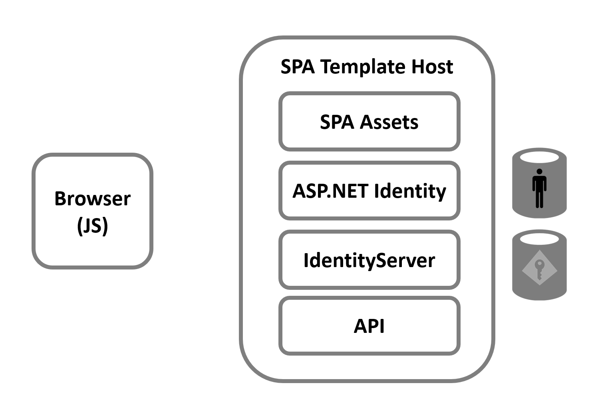
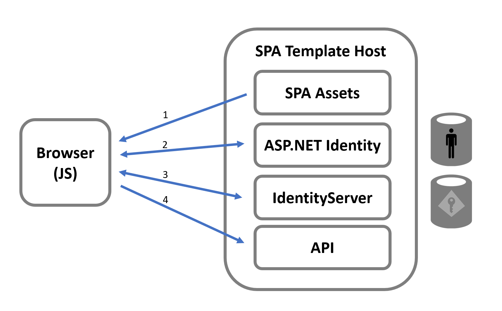
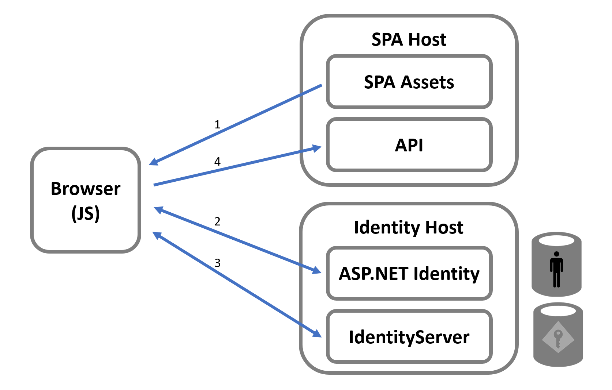
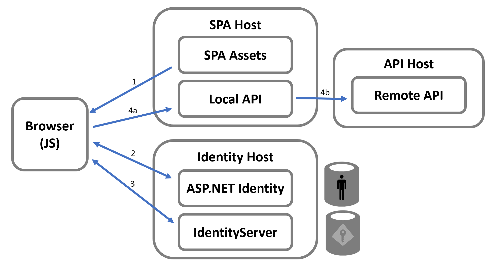

Microsoft publishes templates for securing an API with token based security backed by the ASP.NET Identity identity management library. 
There are several templates; a couple for JavaScript-based SPA applications using React and Angular, and one for Blazor style SPA applications. All of these use Duende IdentityServer as the token server to issue tokens to the client-side code in the browser for securing calls to an API.

This upgrade guide discusses the design pattern of these templates and how you would migrate them to a more recommended architecture. This guide describes the high level architecture, and doesn't go into the specifics of any code, and as such should suffice for the SPA/JavaScript templates, as well as the Blazor WASM template.

## Template Architecture with a Single Host

Below is a picture showing the important moving parts of the template. 
The most important detail is that there is a single host for many different conceptual items, and this affects the security of the overall design. The one host serves up:

* SPA Assets (HTML, CSS, and JS (React, Angular) or WASM (Blazor))
* ASP.NET Identity UI Pages (for login, logout, registration, etc)
* Duende IdentityServer (middleware for OIDC/OAuth protocol endpoints)
* The API

In terms of workflow for ultimately securing calls to the API, the logical steps taken are:

**1:** The SPA Assets are loaded from the host into the browser.

**2:** The UI logic must then navigate the user to the login page. The login session is fundamentally tracked with a cookie managed by the ASP.NET cookie authentication handler. This authentication handler is configured by ASP.NET Identity.

**3:** Once the user is logged in, the SPA must make OIDC/OAuth protocol requests to the endpoints managed by Duende IdentityServer. The authentication cookie from the prior step is what is used to identify the user. The result of this step is an access token that is maintained by the code running in the browser.

**4:** Finally, the UI logic can securely invoke the API by passing the access token as the *Authorization* HTTP header. The code on the server will validate that the access token was issued by the instance of Duende IdentityServer that is hosted from this project.

The picture below shows these logical steps.

## Architecture with Separate Hosts

While the above architecture works, there are some disadvantages to the design presented in the template.
There is an obvious complexity in using two different credential types in the single host (cookies and tokens).
There are great pains taken in the template (hidden away in various extension methods and clever configuration in the DI system) to accept the access token for the API calls, but only accept the authentication cookie to the ASP.NET Identity Pages and the Duende IdentityServer endpoints.

Related to this, co-hosting your token server (i.e. Duende IdentityServer) with the application and API is simply not the recommended pattern.
The intent of using a token server is to enable centralization of user authentication, which enables single sign-on for users.
Co-hosting the token server with the client application (and API) is counter to that goal.
Thus, the recommended approach is to host Duende IdentityServer (and then also the ASP.NET Identity Pages) in its own host separate from the app and API.
Doing so would produce an architectural picture as such:

The steps in the logical workflow would remain the same, but now the token server is independent from any one app or API.
Also, each host now only has one credential type to be concerned with, which simplifies the security model.
Once you decide to add a new app or API into your architecture, it's very little effort to integrate them with the existing token server.
And of course, your users would get single sign-on across all of those applications.
Finally, from a deployment standpoint, each of the various hosts is separate and can be updated/versioned/patched separately, as needed.

## BFF Architecture with a Remote API

There is another point about the security of the SPA invoking the API that requires discussion.

The design of the template utilizes an access token to secure calls to the API.
It makes sense to secure APIs with access tokens when those APIs need to be accessed by a variety of applications, including those not even running in a browser.
This would be an example of a shared API.
But very often, an API that is co-hosted with a SPA front end really only exists to support the UI and won't expect to be invoked by any other application.
In this case, it might be overkill to design this "local" API to require an access token.
Also, there are a [variety of factors that make is undesirable](/identityserver/v7/bff/overview) (and sometimes impossible) for code running in the browser to fully manage tokens obtained from the OIDC/OAuth protocol.

Thus, one additional improvement to the architecture presented so far would be to introduce the [BFF pattern](/identityserver/v7/bff/architecture).

The BFF pattern changes the credential used from the SPA to the backend to instead use a cookie (much like the cookie used in IdentityServer).
This would allow securing calls to a "local" API that is co-hosted in the backend. 
And then if there is a "remote" API (e.g. a shared API) hosted elsewhere that accepts access tokens, it is accessible from the code running in the application.

The picture below illustrates:

**Step 3:** This step from the prior diagrams now results in an authentication session cookie in the SPA application, and an optional access token (depending if a remote API needs to be invoked). This access token is associated with the user's session and would only ever be available on the server-side of the SPA host (i.e. the backend, or BFF).

**Step 4a:** All calls from the SPA to the backend now use the authentication cookie to authenticate the call. If a local API is the only API needed, then there is no need for an access token anywhere in the app. The benefit is that the code client-side does not have to manage anything with the OIDC/OAuth protocol or sending tokens on API calls, and thus is simpler.

**Step 4b:** If a remote API needs to be invoked, then the access token associated with the user's authentication session can be used. This access token is only available on the server. It can be used from the local API invoking a remote API, or a reverse proxy can be setup in the SPA host (e.g. using Microsoft's YARP) to allow more of a pass-through style so the SPA code can invoke the remote API without manual coding to pass along the access token.

The [Duende BFF Security Framework](/identityserver/v7/bff/overview) makes this architecture easy to implement.

## Migrating

The last aspect of the template which requires discussion is that there is configuration required when using OIDC/OAuth. 
This configuration models the client application (the SPA) as well as the API being secured.
Typically, all the players (the app, the API, and the token server) require their own store for their relevant configuration data.
Given that the template co-hosts all three of these, more great pains were taken to hide all of this configuration from the developer.
The various extension methods that are provided for the template that sets up Duende IdentityServer, that performs the automatic configuration, and the client-side code that bootstraps the security in the browser all assume this co-hosting model.
While this might be convenient when co-hosting, when you split the hosts into the recommended architecture then the configuration must be more explicit.

Unfortunately what this means is that is it non-trivial to migrate a project from the template to the recommended architecture.
Rather, it makes more sense to follow the [quickstart guides](/identityserver/v7/quickstarts) to setup a properly designed architecture.
Once that's in place, then it will be more obvious how to take any existing application created with the template and preserve the relevant application assets to use the token server you have setup in its own host.

It is recommended you start with the [first quickstart](/identityserver/v7/quickstarts) (if you haven't already), and follow through the progression.
This will allow you to understand the configuration needed when using OIDC/OAuth.
If you're already familiar with hosting and configuring IdentityServer, then you can jump right to the [JavaScript quickstart](/identityserver/v7/quickstarts/js_clients/js_with_backend) or the [Blazor quickstart](/identityserver/v7/quickstarts/7_blazor).

:::note
It is worth noting why the template is designed the way it is.
First, at the time the template was created, the templating system from Microsoft could only support a single project.
This explains why all the different logical pieces are lumped into a single host.
Second, why was a token based design chosen to secure the API co-hosted with the login page.
The assumption is that as projects grow and more and more applications are added to the architecture, the design would eventually require a token based architecture (presumably hosted separately). 
Thus, rather than require rework later on, starting with a token based design makes sense and acclimates developers to those fundamentals from the beginning.
Third, it's assumed that the automatic self-configuration done in the template would avoid 1) the hassle of explicit configuration needed for the OIDC/OAuth protocols when the template is deployed, and 2) the need to explain the mechanics of the protocols.
:::
